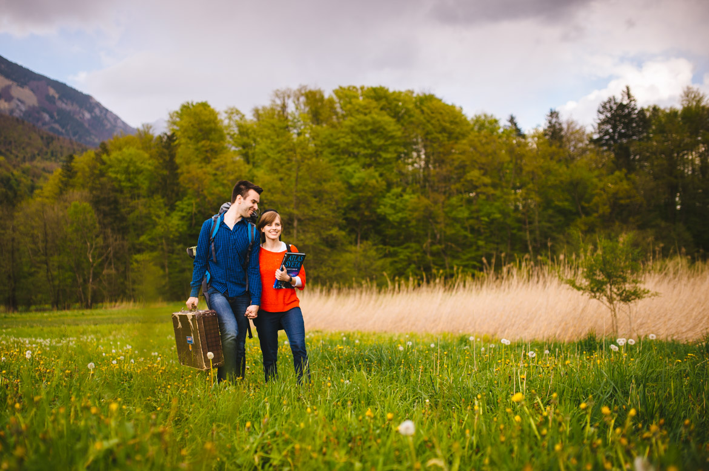
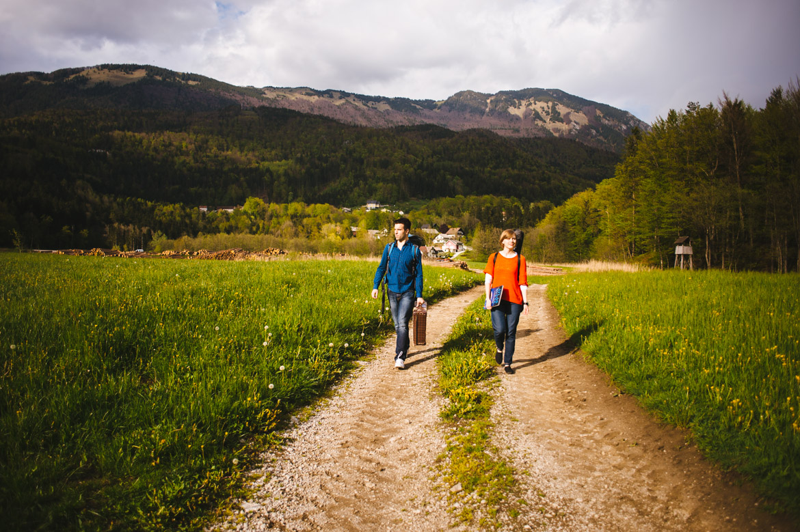
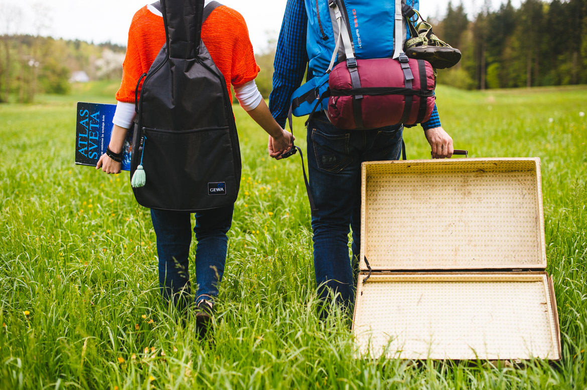
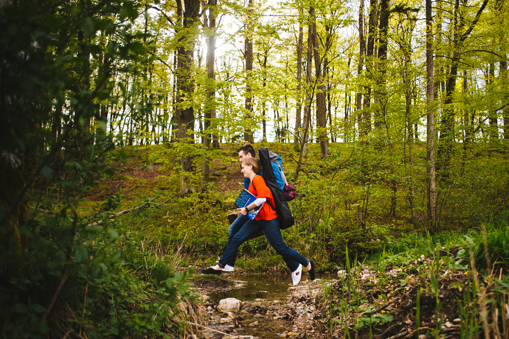

In beginning of the week (before Katja went to Switzerland to compete with her choir (UPDATE, they won both prizes, grand prix and absolute - [GO CARMEN MANET](%20https://www.facebook.com/Carmen.manet?fref=ts "Carmen Manet")) we managed to find a good hour during our tight schedules and had photoshoot for new articles going out in may. This time I asked my good colleague [Jure Pirc](http://ujeti-trenutek.com/ "Ujeti trenutek") from company [Ujeti trenutek](http://ujeti-trenutek.com/ "Ujeti trenutek"), specialised for newborn and wedding photography.

<iframe src="//player.vimeo.com/video/77241918" width="900" height="506" frameborder="0" allowfullscreen="allowfullscreen"></iframe>

Katja didn't have a clue about me setting up a couple photography for our photo-album and Jure did an amazing job, [check them out on hit blog](http://poroka.ujeti-trenutek.com/katja-matej-fotografiranje-parov-golnik/ "Jure Pirc - Ujeti trenutek").

Jure really has a feeling for humans and their emotions and intimacy. He is warm and kind. Did you know he was in police force, but he changed his profession when his daughter Nika was born, and then he perfected it. I can easily say he is the best newborn photographer in Slovenia.

We strongly recommend you to take a look around his [web page](http://ujeti-trenutek.com/ "Ujeti trenutek") and place a curson on Like button on his [facebook](https://www.facebook.com/UjetiTrenutek?fref=ts "Jure Pirc - Ujeti trenutek").

