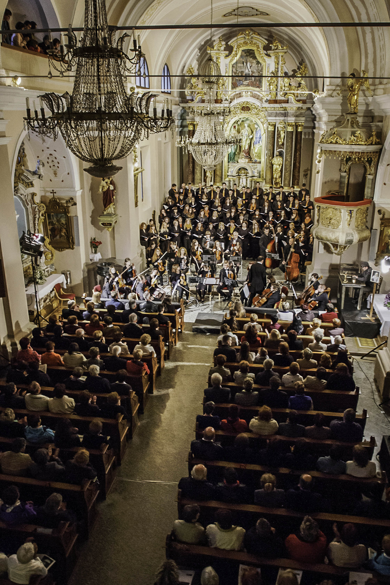

We had this idea already in december, but we skipped it. Since we are both musicians, it should be easy to find performers for the concert, but.. to come and play for free. An who would listen to then, if we exclude our families and friends. We needed a plan and we will realise it this sunday, May 25th at 19:30.

We are proudly presenting you Charity concert of good hearts. Performance will start with [Carmen manet](https://www.facebook.com/Carmen.manet?fref=ts "Carmen manet") choir, recent winner of 50.th Montreaux choir festival. Katja sings in this choir too. What will follow is  male choir [Davorina Jenka](www.kud-dj.si/ "MPZ Davorina Jenka"), a home choir to this area that also celebrates their 50th anniversary this year and are in amazing shape. They are preparing special song with bells. For grand finale, my [strings part of Symphony orchestra Cantabile](https://www.facebook.com/pages/KD-Simfoni%C4%8Dni-orkester-Cantabile/107724685976492?fref=ts "Cantabile"), that will perform Sunrise mass from our recent tour around Slovenia. It is definitely one of the greatest classical pieces I had ever performed.

 source: [http://www.kudcerkno.si/](http://www.kudcerkno.si/17-vsebina/novice/422-izjemen-uspeh-in-memoriam-v-sodelovanju-s-kud-cerkno.html)

Mark your schedule on 25th of May, this sunday at 19:30. You won't regret it.
