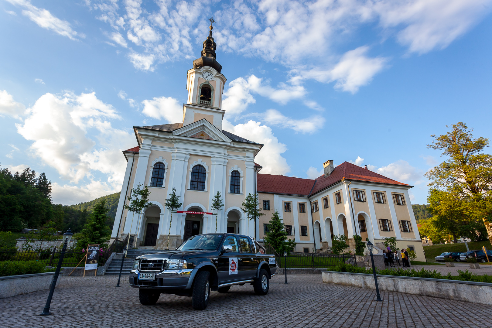

Our car codenamed Zhvau (meaning animalic) was shining in afternoon sun and was getting ready for show-off that was about to come. 4-hour waxing and cleaning was so worth it. Soon our noble guests arrived and when you walked into the church during rehersals, you could already feel positive enegry that was floating all around us. And the evening was even bigger: more than 200 guests were listening to 106 performers on stage, beautifully connected for one cause. 300 hundred hearts, beating together. Thank you for standing ovations at the end of the show, and thank you, our beloved musicians. Your will really doesn't know no limits.

If we draw the line, we raised 1105,15 EUR just in this evening. That is one wicked sum and we are so proud on it.

THANK YOU again, everyone who participated.

Special THANK YOU list:

[Symphony orchestra Cantabile](http://www.cantabile.si/ "Cantabile Symphony orchestra"), [Mixed choir Adoramus](http://www.adoramus.si/index.php/meani-zbor "MePZ Adoramus"), Male choir Davorina Jenka, [Female choir Carmen manet](https://www.facebook.com/Carmen.manet "Carmen manet"), Major of Cerklje na Gorenjskem, mr. Franc Čebulj for understanding our project and taking time for us, Municipality Cerklje na Gorenjskem and TIC Cerklje for letting us advertise this event, Martina Lah from Radio Sora putting extra effort bringing us infront, Radio Gorenjc, Radio Kranj, Radio Ognjišče for interviewing us, Gorenjski Glas and Samo Lesjak for giving us precious space in your newspaper, [Prevozi Oblak](http://www.prevozioblak.si/ "Prevozi Oblak") for driving our guests all the way from Logatec, [Gostilnica in pizzerija Pod Jenkovo Lipo](http://www.podjenkovolipo.si/ "Pod Jenkovo Lipo"), who provided pizza for our guests, KUD Visoko for providing wireless microphones, Ksaver Šinkar and Vili Vogelnik for photo-reporting, Priest Slavko Kalan and Dragica Radojevič for providing space, accomodation, drink,  hot snacks and coffee, Ciril in Vida Kern for moral support, all preparation, waxing, polishing and ironing. And smiling all the way, Julija Kern, Tjaša Kern, Emil Buh, Luka Meglič and Neža Štumberger for mail distribution of 2000 invites, sound system engeenering and ... being there all the time.

And THANK YOU to you all, who came and shown support for our cause.

And from here on, with full steam ahead.

[Would you like to know how it was? You can find gallery on this link. Photos by Ksaver Šinkar.](https://www.facebook.com/media/set/?set=a.687379607963830.1073741831.645131025522022&type=3 "Fotografije: Xsaver Šinkar")
