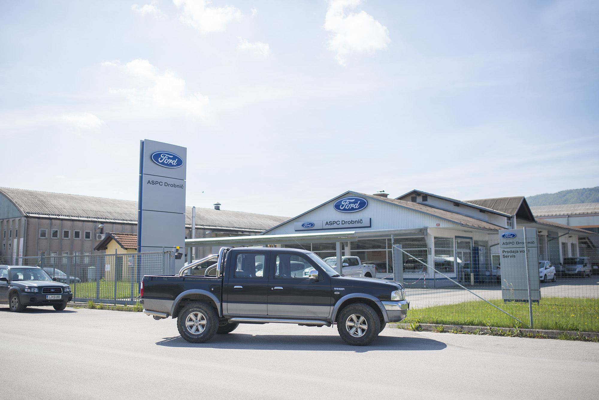
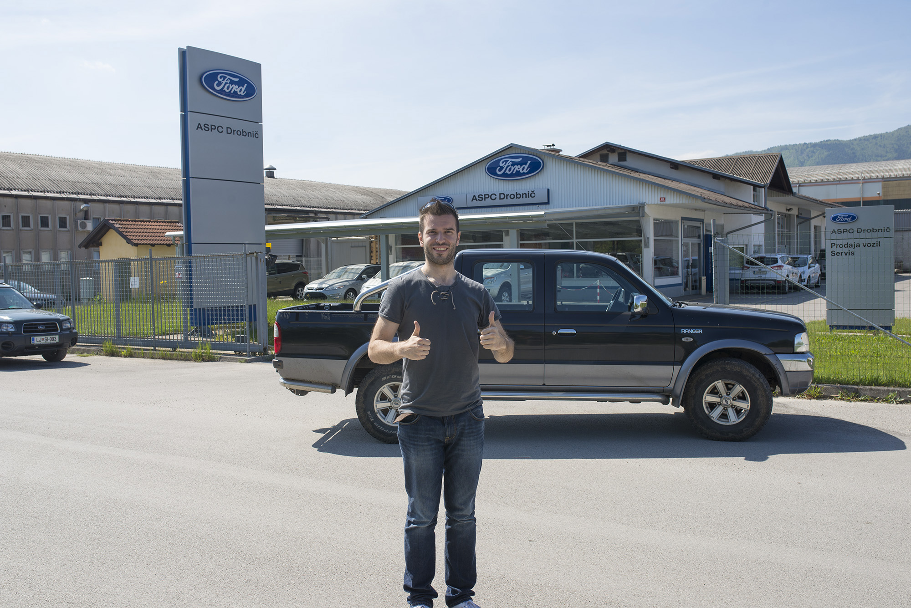

So, as you already know, we bought our Beast. It is black Ford Ranger model year 2006 that is in mint condition, beautiful and usefull and will drive us safely and then serve for many years to mongolian people. It has 118578 km, it was bought from first owner. Thanks to guidance of Summitmotors, we found this one, because it wasn't selling on the market like you usually do (avto.net web portal etc.). It was by far most convenient vehicle we spotted in Slovenia.

  Right after we received our vehicle.

In [ASPC Drobnič](http://www.aspcdrobnic.si/Predstavitev "ASPC Drobnič") took care for every step of the process, from registration, contract to insurance, process itself was quick and accourate, so thank you for saving our precious time.

<iframe src="//www.youtube.com/embed/WWhpmL3YqmE" width="900" height="506" frameborder="0" allowfullscreen="allowfullscreen"></iframe>
