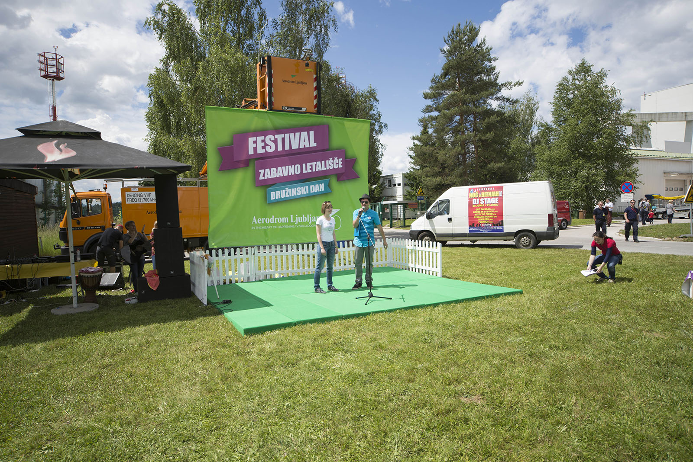
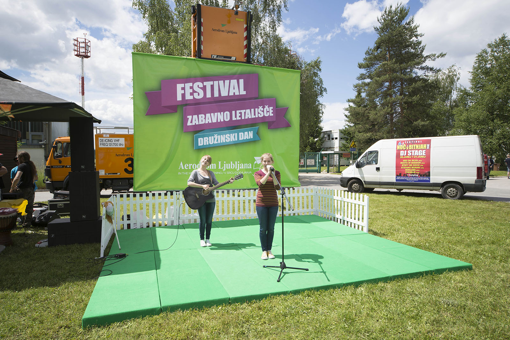
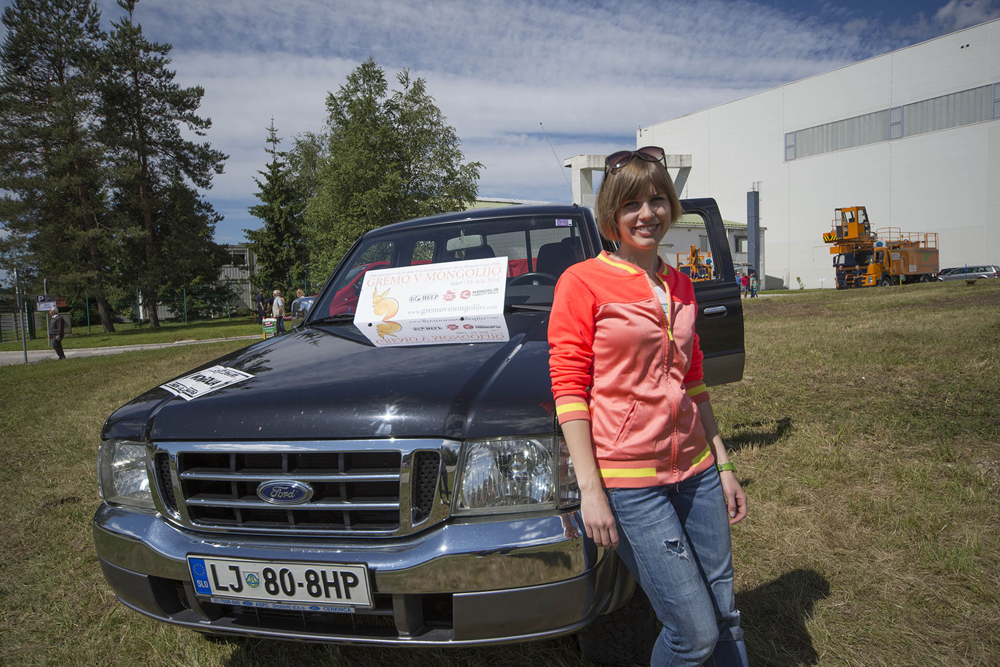

We had a working saturday...

In the morning we set apart. I went to Krvavec, where I met Tomaž and we participated in finals of Skoda Yeti 4x4 challenge. Katja went to Airport Joze Pucnik Ljubljana, where they hosted Fun Airport Festival, family day.

We came to beginning of the slope and then took cablecar, that put us atop the mountain. There we faced 9 other teams in 6 different tasks: No-instruments-drive, rock challenge, towing the car, shooting with the bow, adventure park and downhill gokarting. We finished as sixth since we blew everything up on the first stage already. We had discovered a downhill track that we tested for about an hour. Tomaž showed me some tricks and there we went. It wasn't so bad, for a first timer. Or so I suppose.

[You can find more about competition on this link.](http://www.avto-magazin.si/novice/skoda-yeti-4x4-izziv-kamni-in-zmagovalci/ "Skoda Yeti 4x4 izziv finale")

Katja on the other hand took Ford and drove to her spot, where she proudly presented our project along with other participants of the festival. It was fun, especially for the kids that tried to drive our pickup and took photos inside. Such a cool way of promoting ourselves.

In the afternoon, we went to Mamut... but more about that in our next replies.

