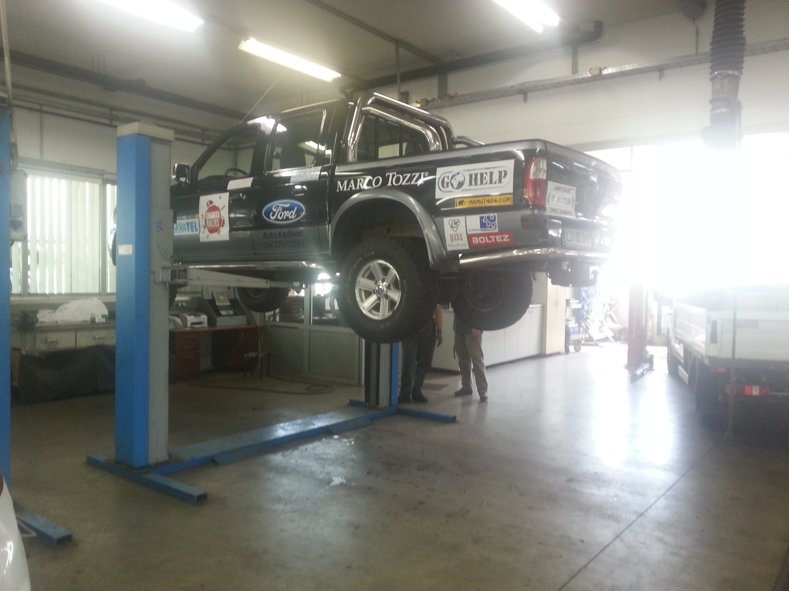
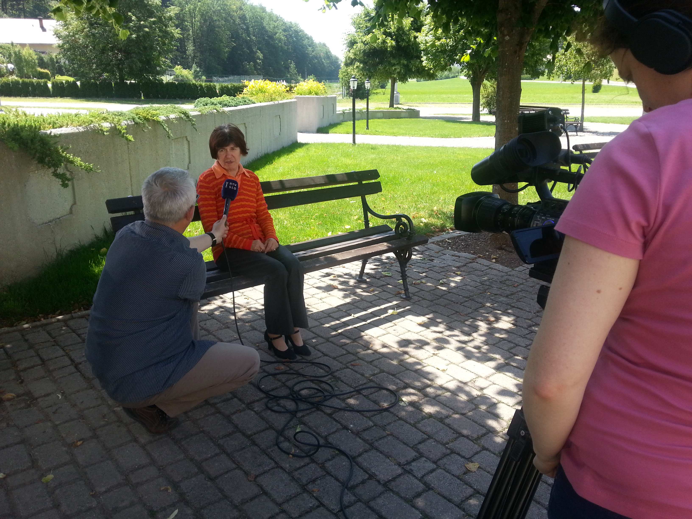
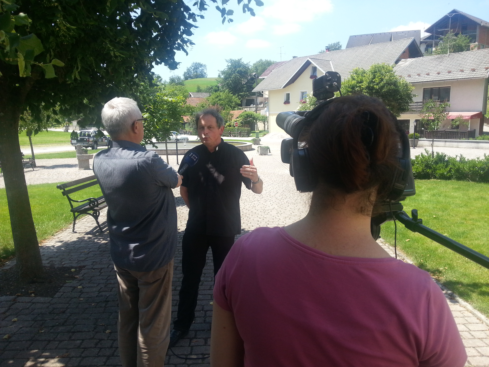

We were recording a short footage about our project for national TV station RTV SLO1, or to say it otherwise, we will be on a local news! Yay, so exciting.

Damijan and Branca came all the way from Idrija to film us and that is almost 100km away. It is unbeliveable, where our project was already heard about. First, we went to our partner [Avtohiša Kadivec in Šenčur](http://www.avtokadivec.si/ "Avtohiša Avto Kadivec"), where we had our "Žvau" inspected professionaly to discover some minor tweaking that will be needed before the epic mission, and lateron continue to search for people who already heard about us and were willing to say a few words in our favour. We finished with some minor off-roading on gravel to get some shots of vehicle in action.

] Vehicle inspection at Avto Kadivec.

We will report and provide a full footage here on our blog, for first touch we give you some photos.

