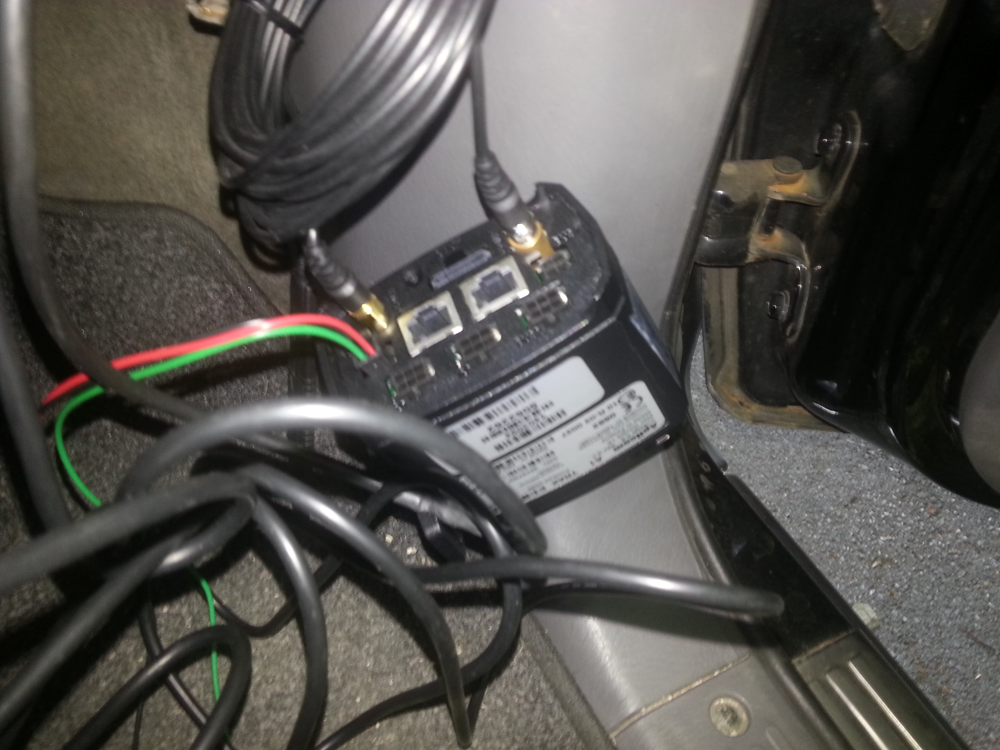
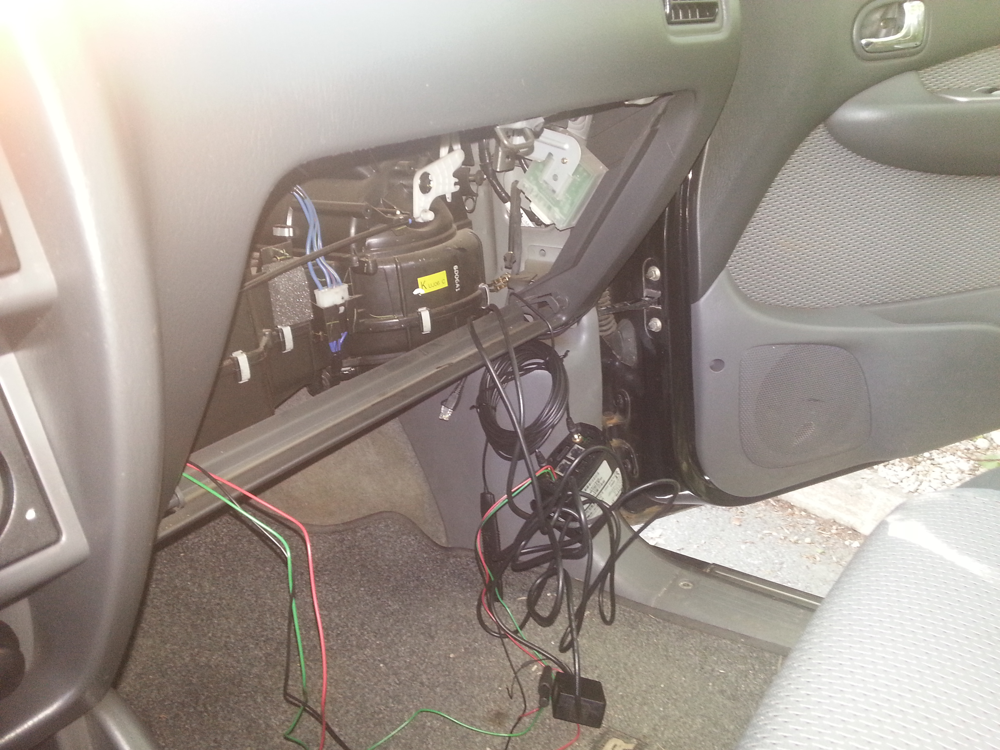
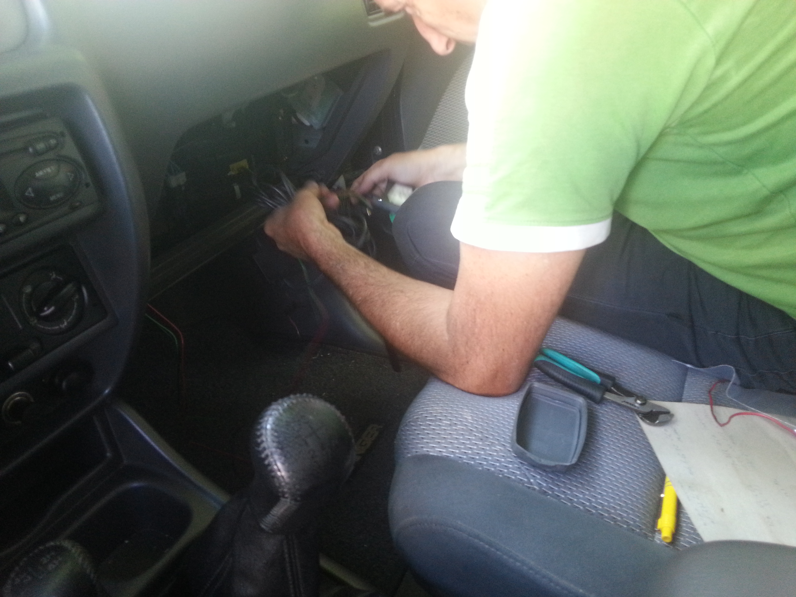

We had our GPS tracker installed at our partners [Sledenje](http://sledenje.com/ "Sledenje") and [Monolit](http://www.monolitmap.si/ "Monolit"), the biggest GPS tracking provider in Slovenia. They really kept their words and provided everything to track us on our way. They installed thier best package [Sledenje Premium](http://sledenje.com/storitve_paketi_premium.php "Sledenje Premium"), that also enables instant communication with Garmin appliances. We were introduced to all employees, also to the CEO and after that participated at installation. They also provided web link that will allow us to show you our current position and progress made due to our scheduled route.

Right now we are testing the appliance and we are parking our car on a different position every day. And to tell you the truth... it is imposible to hide. :)

Of course we will bring device back to Slovenia and returned it. It is a nonsence having that installed and not telling them because... well, they would know it right away. :)

We would like to thank miss Maja for all your work, mister Grega for programming, mister Djordano for installation and everyone else, who participated in the process.
