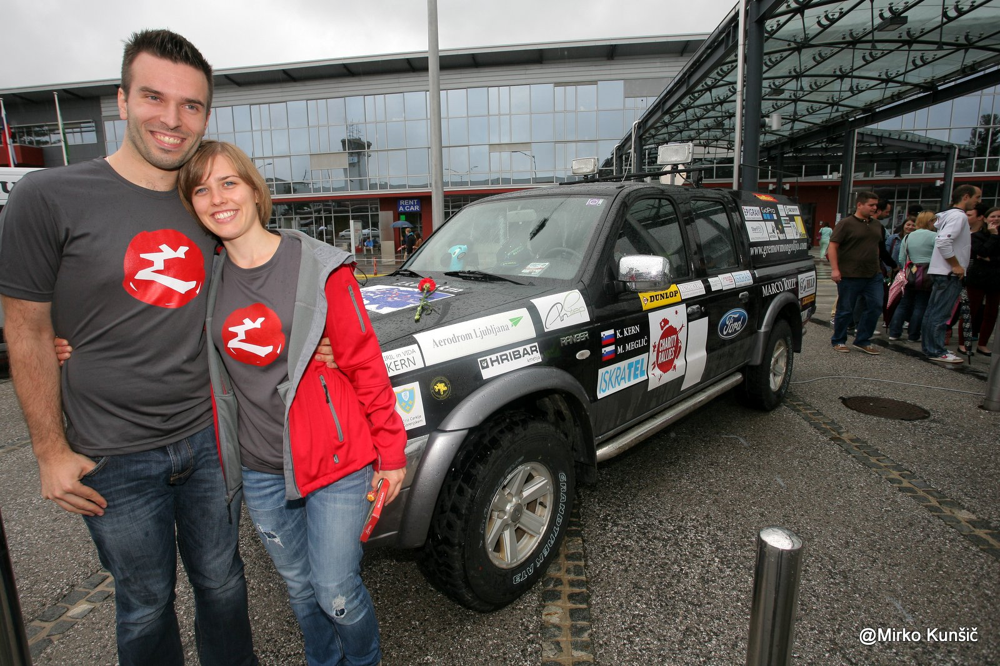
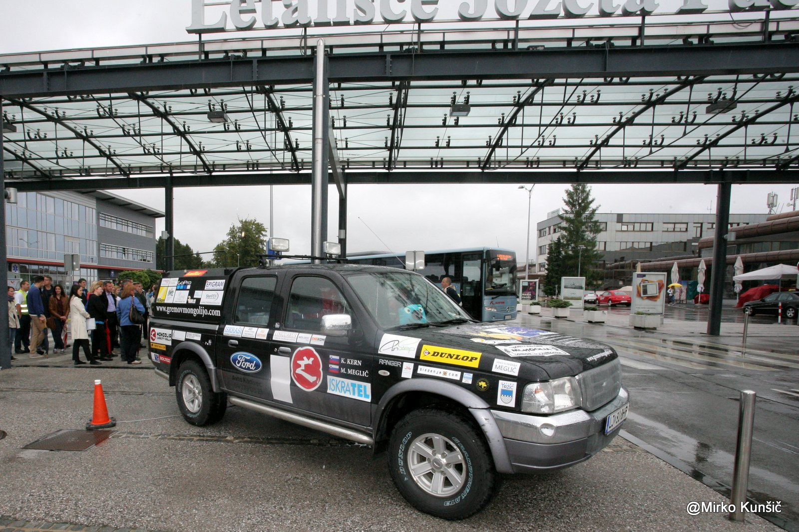
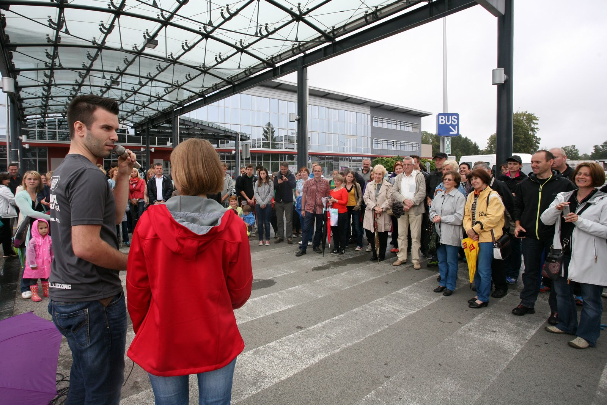
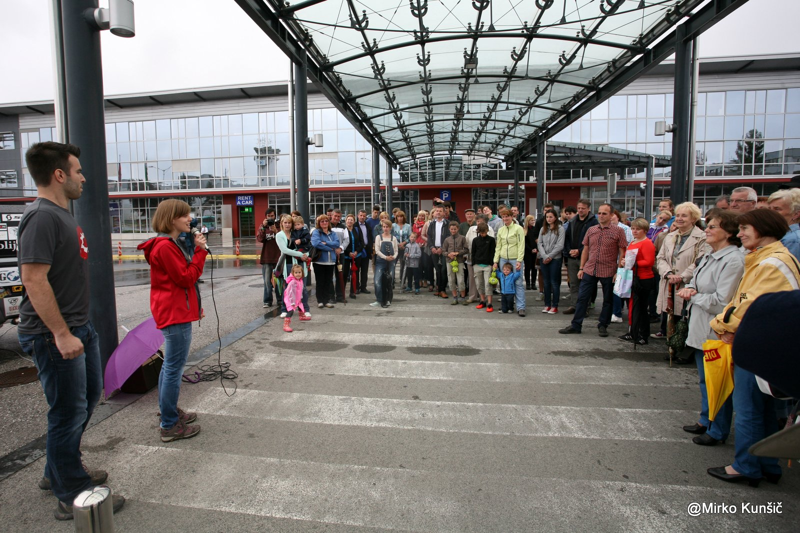
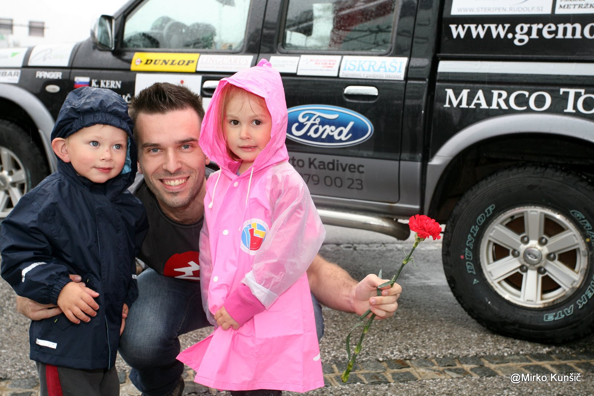
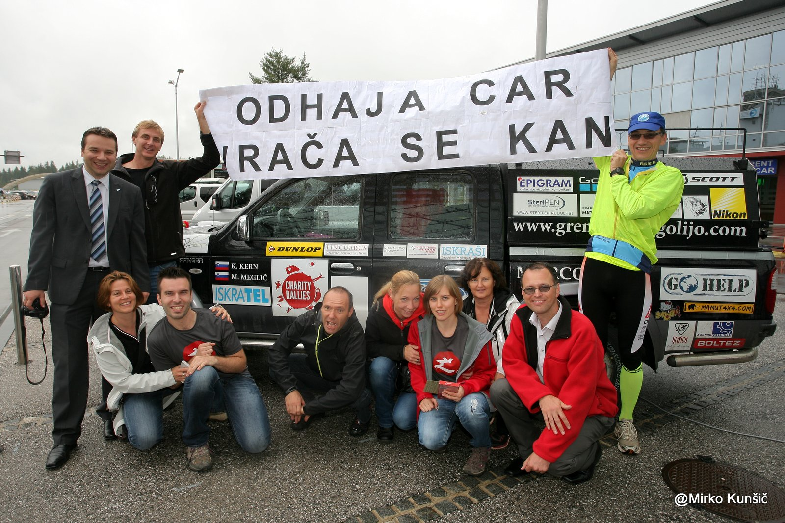

You cannot believe that. Even the sky is crying since we're leaving. This day is dedicated for packing, relocating stuff from front to back and likewise. Everything goes in and out at least six times. We cannot close the steel cover of our back, because it's so full of stuff. Well, this should say only that it was built too accurate. Jano gave up after half an hour and made bigger holes - problem solved. And then we repeat the story at Katja's place. Again. And again.

Airport, more than 50 people, great majority of those that count dearly. Counter on Ford says 122.687 kilometers. Everybody is crying as if we are never coming back. :) It saddens us that we could not convince even one of our national TV stations to cover the event. Now the fact that half the teams did not made it to the start due to various problems along their campaigns which just adds to our good plan raising more than necessary. It seems like local elections got all the attention this time. We thank to each and everyone and tell them that we will be back on August 21th at 13:40 - it seems like a different era at this point..

_(Foto: Mirko Kunšič)_

We hit the road after countdown and turn around after exactly 372 meters - we already made a wrong turn and hit a closed road. Due to an accident, main highway was closed so we take more scenic way through Tuhinj. Though we really wanted highway - we are tired of packing and have no wish for left and right turns following one after another. Once along the way we stop to check in everything is in place and then drive all across Slovenia. Katja's parents follow us and we drive together until Lendava. It's Katja's fathers birthday and we are the only guests in a local restaurant. Matej eats pizza, first since November 2013. We sleep in a cottage in Vognsfalyu village - or something similar.  All four of us in the same room, for the last time.
