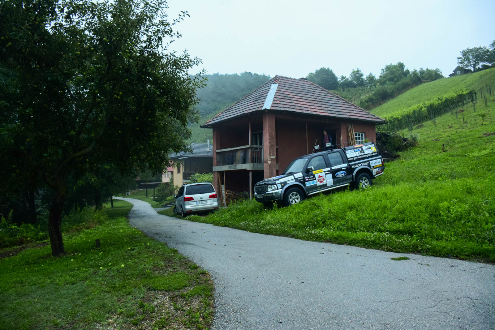
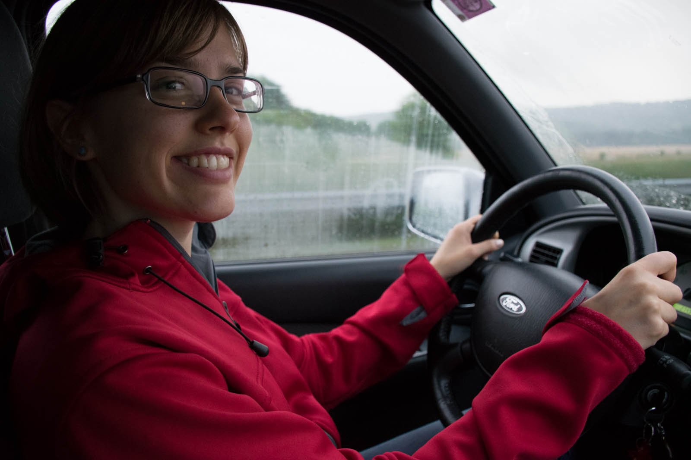
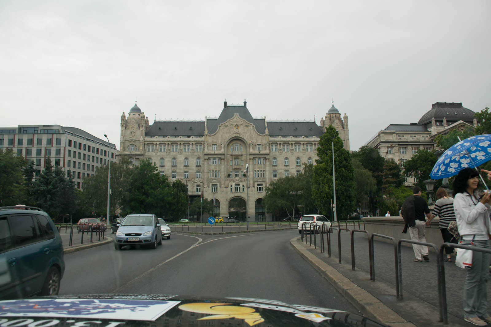
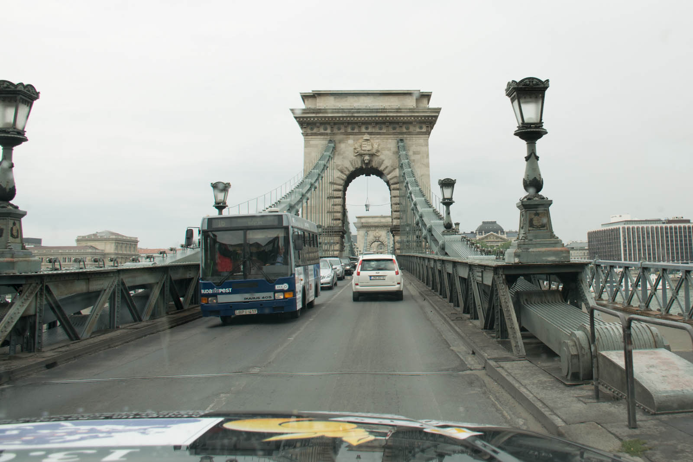
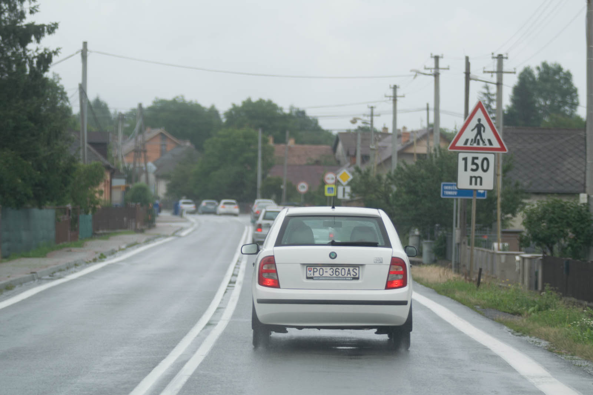
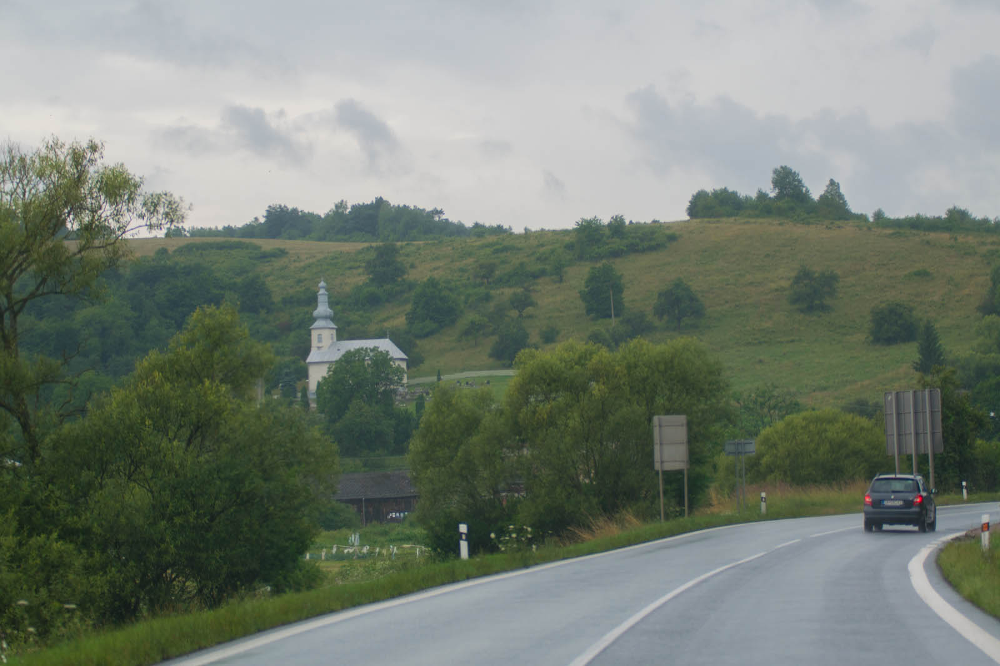

We have a long road ahead of us. Landscape surrounding is slowly changing as we proceed - it's getting more flat and we meet smaller and smaller houses along the way. And a grey road, without end. We wonder how is it possible that clouds don't run dry, we have to be extremely careful because of wet conditions. We only managed to have few dry minutes in Budapest, just right to take care of all pre-steps for quick Belarus visa approval. We quickly eat late breakfast not knowing this will be our last meal of the day.

It is probably because of all that grayness that helped us to be so steadily and constant about driving across Eastern Europe. Somewhere around lunch we realize what good roads really mean, because they are getting worse and worse. We drive in shifts, jumping because of cracks in the road, learning how to overtake trucks in dead-turns. It turns out that our Beast really is a Beast. We have few GPS-connected problems and due to that we use two GPS devices constantly. Of course a male, and a female one. They are argue all the time - sweet. We usually take the best way.

Feeling about Ford's size is slowly bleeding away for two reasons. First, we are so loaded that we need to dig up holes on our last seats to reach something and second, our company are herds of big cargo trucks. We drive in lines and are stopping from time to time because of accidents. We tried to park in a garage and couldn't fit the car inside because of it's height. Somewhere between Hungary and Slovakia we managed to find some neighbors from Slovenia , taking a short break in Poland. We maintain our travel fever well after sunset and reach Parzew, where we park in the park spot on the street and stay in the car, gathering strengths for the day after.

 Driving through Vyšny komarnik - big mosquito.