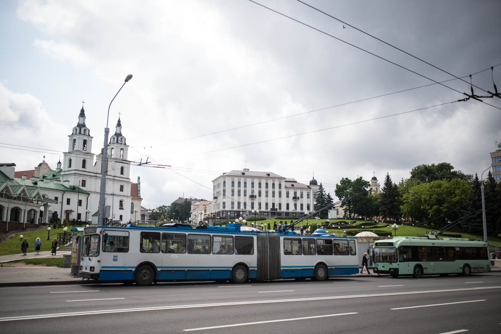
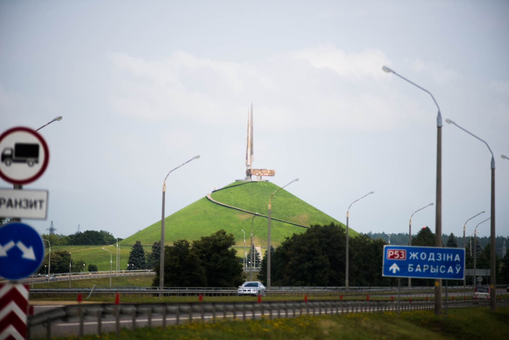

Good morning, Belarus. You said what, 19 hours?

Sleeping with your eyes open, because you have to move car from time to time, even if it is just three metres. But eventually we made it and now we are ready to continue. There is no end of surprises, mister Oleg (Alexey's connection) is already waiting for us. He was three hours ahead of us. Ah, those locals. When we finaly meet, he doesn't want to exchange our stuff at the border, but wants to go abit further. We don't want to go to the highway because we don't have a toll system. He does, so we follow - he has almost half of our stuff in his car. We got hit by a radar and that means 100 eur of fine. Shit. We eventually exchange our equipment back and he's gone but we have another problem. Now, we have half the stuff we set off in Slovenia so we need to rearrange everything. In the rain, of course.

Back to tolls. We would like to buy the vignette but they don't have it. And they don't even know on which gas station they are selling these stickers/systems and if there is 100EUR fine for every radar you drive through. We drive further - what will happen will happen, and are able to buy a toll system on 4th gas station, 40 kilometers into Belarus. Oh, it has to be green color, they say - talking about gas station. Well guess what, they are all green.

After that we visit Minsk for a breakfast (late again), and spent quite a while talking to some police officers about free parking in Belarus. Note that we already drove 360 kilometers without being pulled over. Yay for us. After that we are witnessing of a small police chase on foot because of bad talking of some drunk. We eat interesting things - cheese and sweet bread and walnut biscuits with raspberry jam. We shoot some film, take a walk around.

We are leaving town and there they are, men in blue. I was driving (Katja was sleeping) 120 km/h and had to brake a bit so they could overtook. Then I had to pay that 100 eur, but they knew exactly where we were. Their system is just superb, but I doubt they would catch us if we would not stop for Minsk.

Interesting decoration.

Policemen examined the car at first but then I received the ticket no matter for what cause. They said they cannot delete anything.

After a while we bumped into Russia. They are part of a union, so transition is really smooth. We saw one vehicle and almost missed a sign saying we crossed the border.

By that point we were only 560 kilometers away from Moscow and note that Belarus roads are the best roads in the world so we were in the mood. Today we are sleeping in a bed. In a decent bed. We had to make up for the loss made yesterday so we drove around 120km/h. That is about 30-60 km/h more than allowed.

Around 50 kilometer before Moscow there is a queue. There always is a queue. It was 23:00 by that time, Matej eventually made it to the rest spot and said That's it. I can't do it anymore. Katja went inside, drank Red Bull and drove into Moscow fearlessly. I did not tell her what kind of hell Moscow is for driving and - if you don't know, then you don't care. She drove it perfectly to the front door of Iskratel's subsidiary. There was a topless security guard (weird?) but we were welcomed properly and led into our room. Oh yes, shower and bed. We made it.
