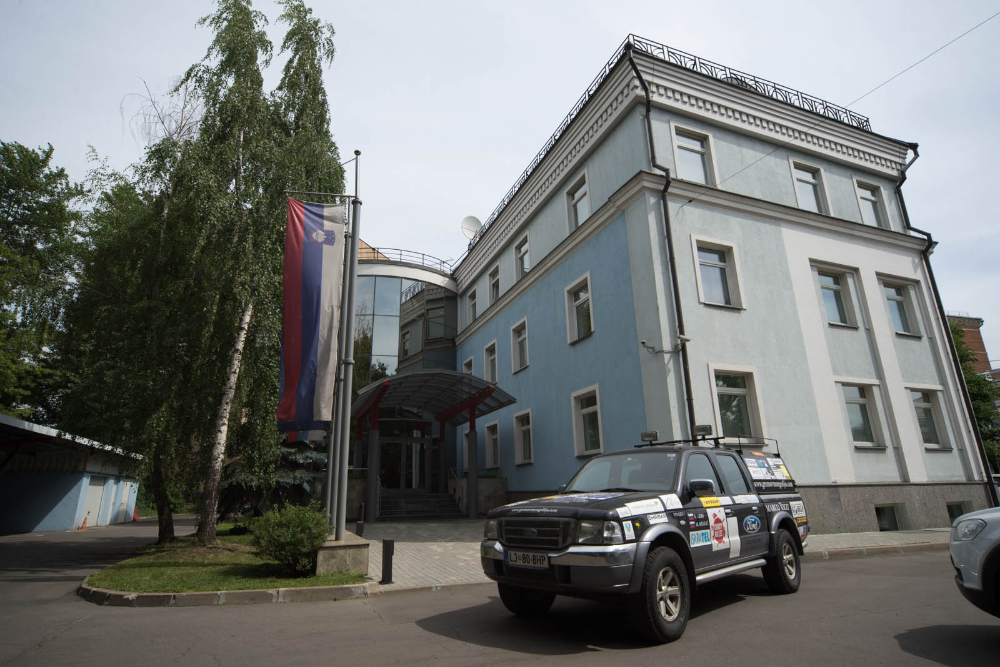
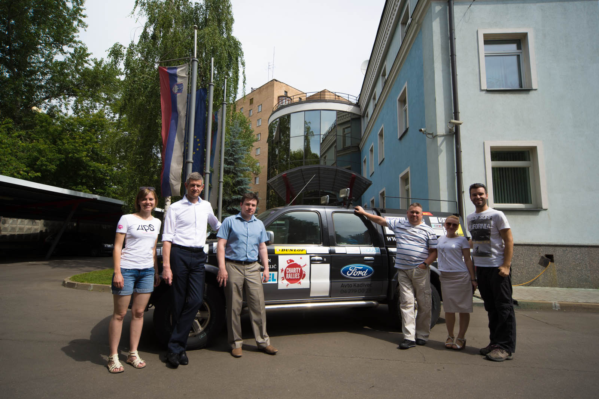
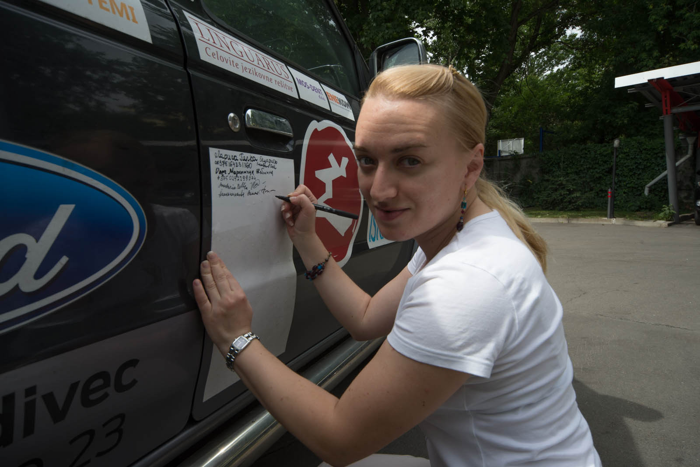
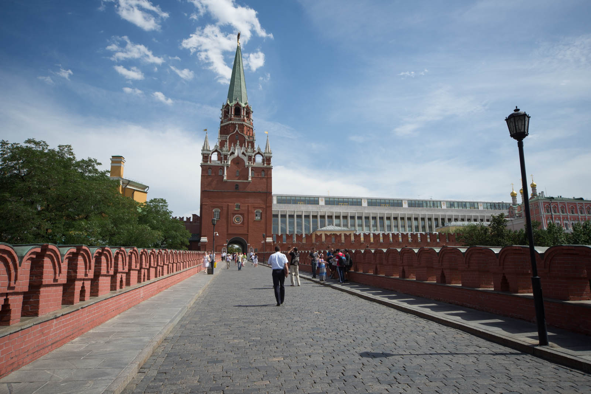
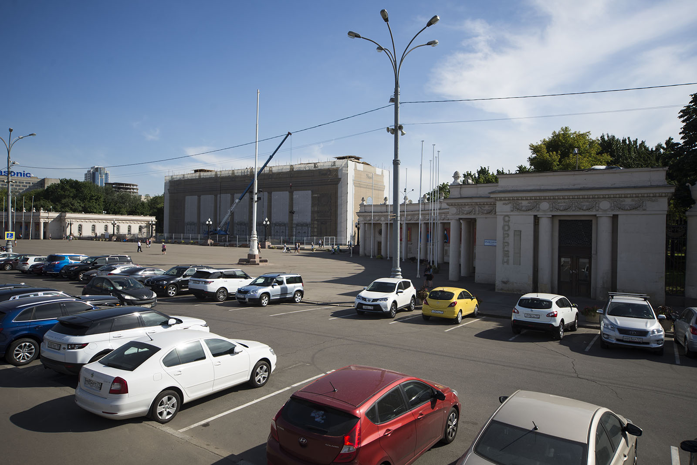
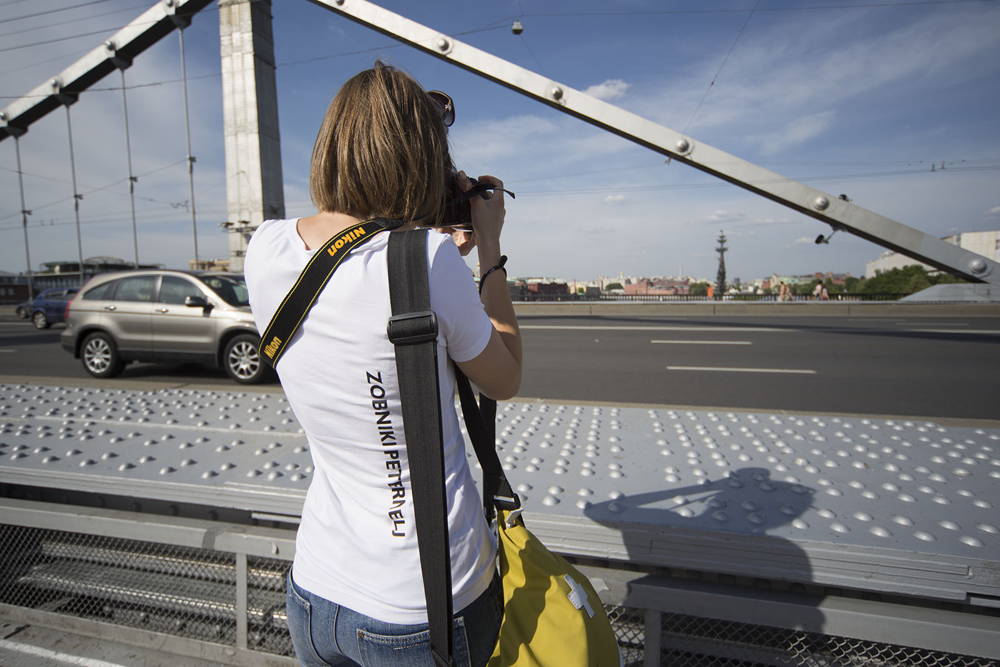
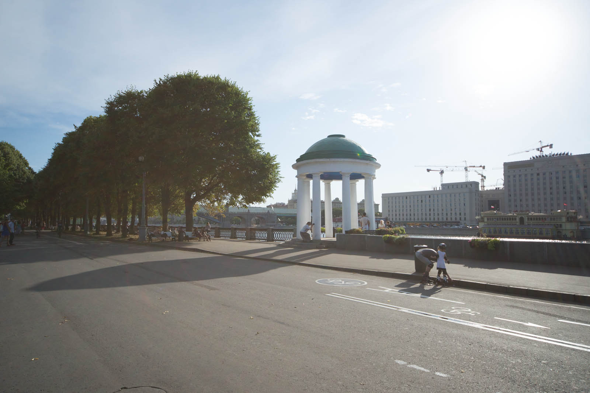
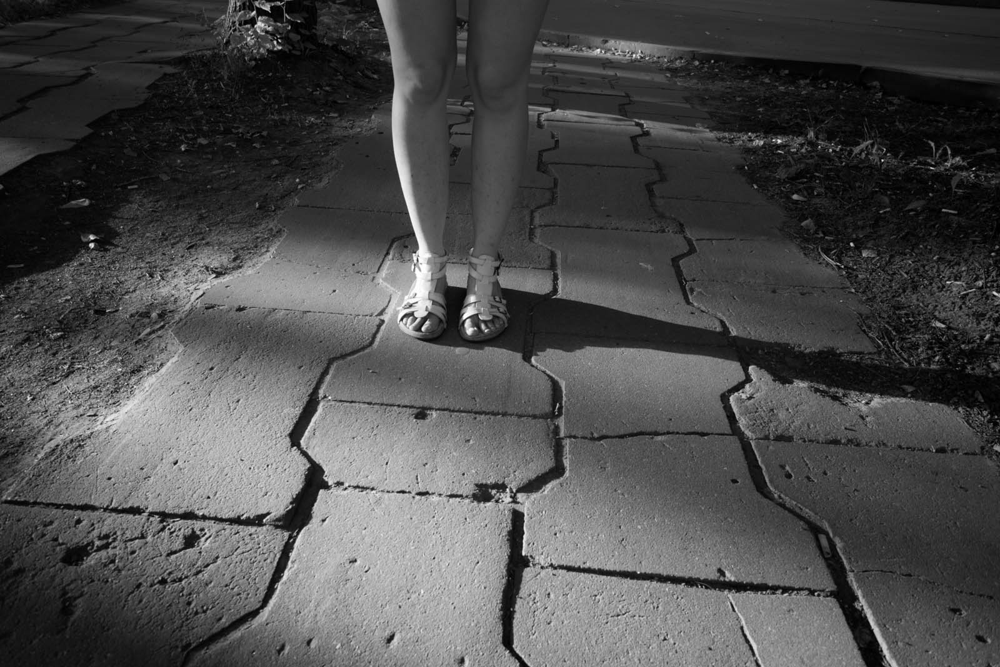
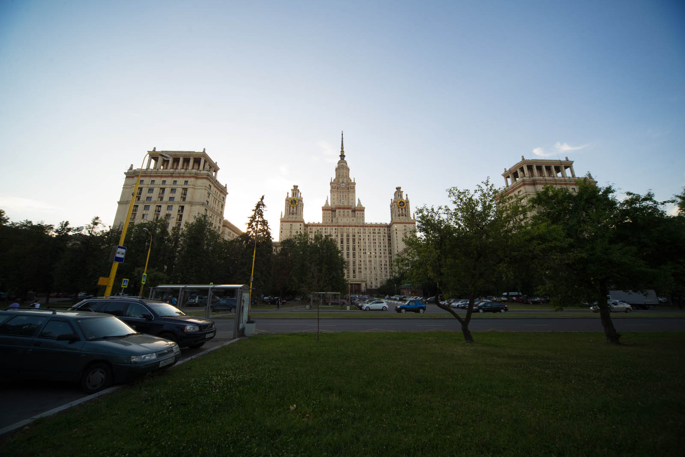
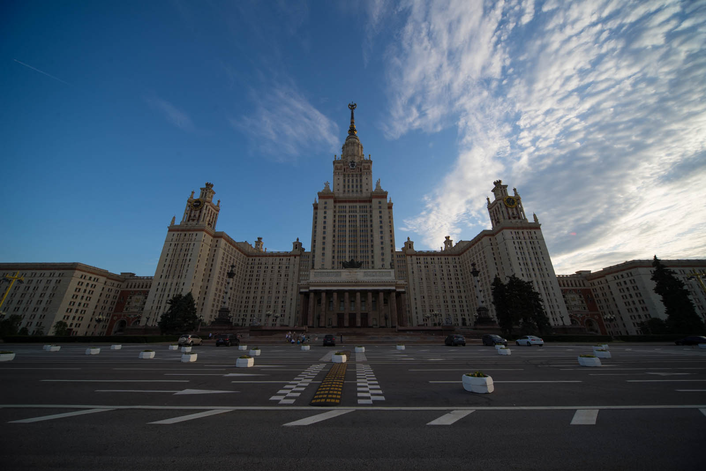

Again, we sleep late. We can feel every bone in our bodies and we are not sure anymore, is that from the car or from all that sleeping. Sweet wories, to be said. We organize a small photo session in front of our office. They are Matej's colleagues from work and they are cooperating on a daily basis so it's a special occation - they are full of questions and suggestions.

]

Right after that, we visit the city once more. We have an idea to cover all the spots from yesterday with our GoPro Hero3+ Silver and then continue with the others. We buy some bulochas in local bakery (Always ask "Kapusta?" and don't but that. It's cabbage.).

We walk past Bolshoi once more, have breakfast there, then along The Red square and into Kremlin. Katja is thrilled, and even weather loosen it a bit. It is bearable 27 degrees Celsius. We are excited, because Katja gets all student tickets instead of regular ones.

Next, we visit St. Basil Chatedral. It is that sweet chruch with colorful tops from every postcard from Russia. Red Square is the place where 18-year old Mathias Rust landed in his Cessna after flying under radar all the way from Finland. Katja asks why is so many landmarks on the square if it's closed for traffic. It's because greatest war parades are hosted there. Park Kultury (Culture park), where I kept saying how beautiful the entry was. Well, in was under severe renovation, so we did not see a thing.

 Enty to Gorky park - under construction.

We buy icecream and water and fall asleep for half an hour. Siesta time. Culture park is also called Park Gorkhovo, Gorky park. It is that very same park from Scorpions song Winds of Changes. »I followed the Moskva, and down to Gorky park, listening to the wind, of changes.« And it's much more beautiful in summer than in January at -20 degrees (Matej's last visit).

We go around Luzhniki - Olymic stadium and find out that Russia will host a football championship in couple of years. They are building and renovating the stadium.

 Fun fact of the day. Everything is bigger in Russia, but this is absurd. You can cover all the backyard with only ten of those.

We went and go to se MGU - Moskovskij Gosudarstvenij Universitet, better known as Lomonosov university. This building is so vast and big that didn't fit even in my ultrawide 12mm lens.There is more than 40.000 students studying inside. It took us around 20 minutes to get around the main building.

It is evening and Katja is hungry. We are searching for market, but everything is closed. No microwave tonight. After 10th try for a different store we gave up, today we are eating in KFC. We ate wraps, afterwards we packed half the things, caugth a hot tub and wrote reports.

PS: Katja is already reading all Cyrillic symbols and that is not asmall thing to do.

 Seen at Lomonosov.
