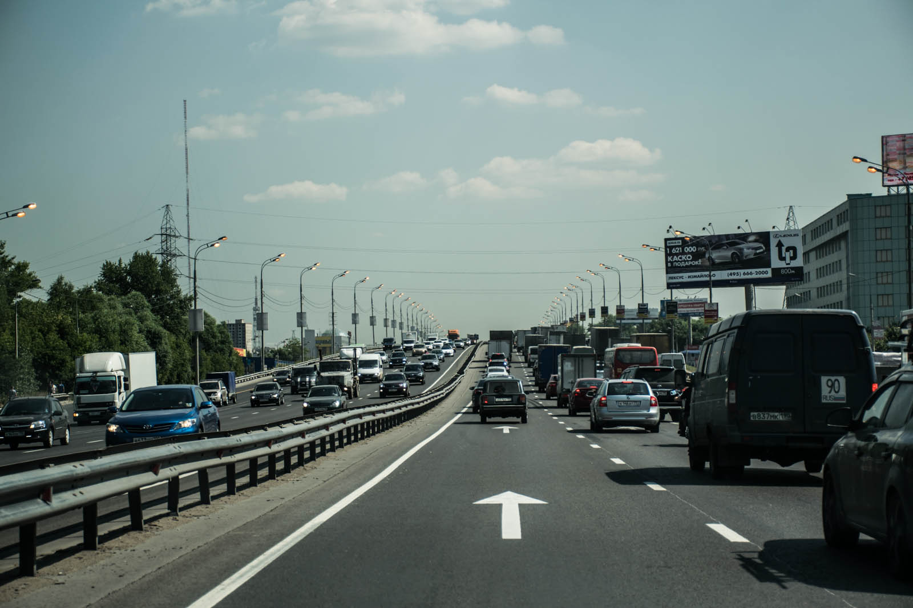
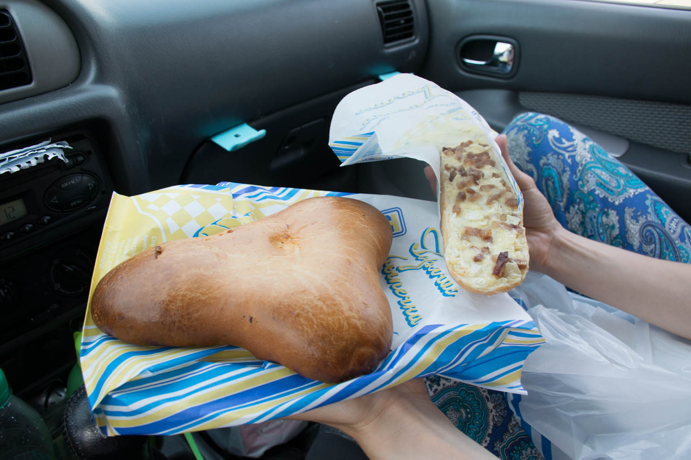
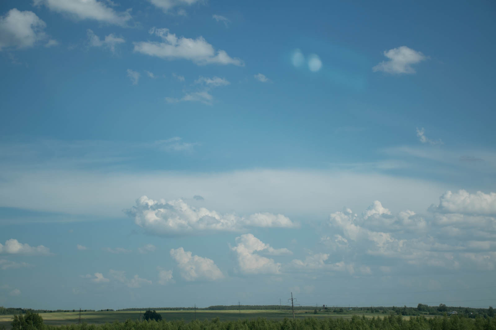
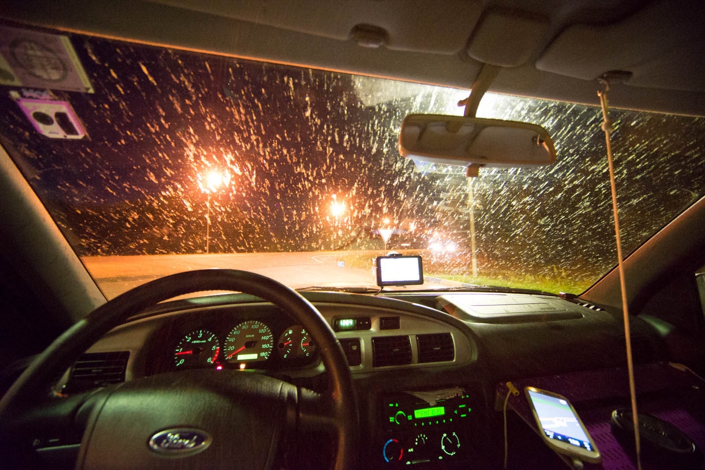

Plan for today was gone in the morning, because we were sleeping in late. We blame distance to north, because here we get constant light up 'till well after 11PM and you can't sleep in daylight. We also blame our blog, because it took so much time yesterday. But because we have couple of days full of driving ahead of us, the most important thing is to be at our best strenghts. We thank everyone in our subsidiary in Moscow for hospitality, say goodbye and hit the road.

We immediately fell into  rush hour - queues everywhere as if they would have some sort of major giveaway on the outskirts of Moscow. You have to go with the flow or you're not going anywhere so we find it quite hard to navigate out. We need good hour and a half to get out of Kolco, The Circle that surrounds Moscow. We thought that once we escape city borders things will settle down but we were wrong. Couple of 100 kilometers ahead we hit traffic jam again and we are moving really slowly. They are building second lane on a freeway and we don't complain because holes are big. We thank Dunlop for having great tires.

Katja spends entire day on copilot seat and take care for drivers needs for food and water. She is also main photographer following Matej's strict instructions how to capture different moments. We stop on couple of gas stations for refill only. They have cheap prices but on many stations they cannot deliver diesel.

Once they only accept cash, second time you have to tell specific number of liters, because they charge you in advance. Interesting, but not funny anymore after a third stop. We follow the Transsibir trakt, heading east all the way. Half way there we stop in Nizhny Novgorod. Katja forgot our laptop shelf atop the car, so we are pulled over by a car that tells us that we need to go back. We recover it with some scratches but apart from that everything still works. We stop downtown, park the car and hike atop the hill where beautiful sunset is waiting for us, with all the churches bellow us. Warm colors are calling for movie-like shots.

Time and small number of driven kilometers are rushing us to stop once more in randomly picked store (SPAR), eat dinner and slowly drive towards Kazan. When night fall it started to rain but it wasn't just ordinary rain. It was raining mosquitoes and only thing to prevent having massacre on your front window is to turn up headlamps. We sleep in the car.

