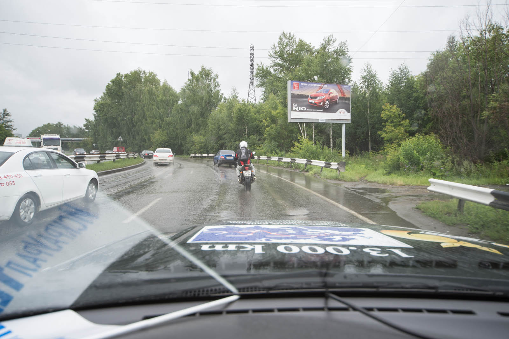
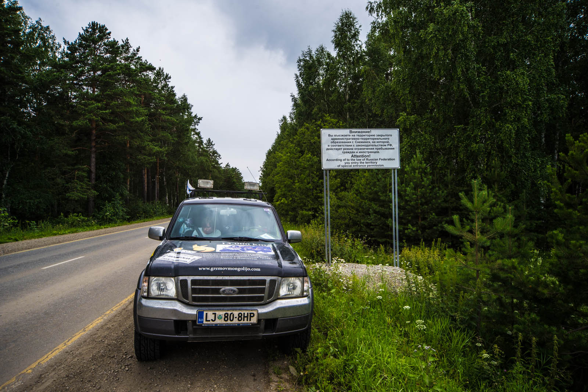
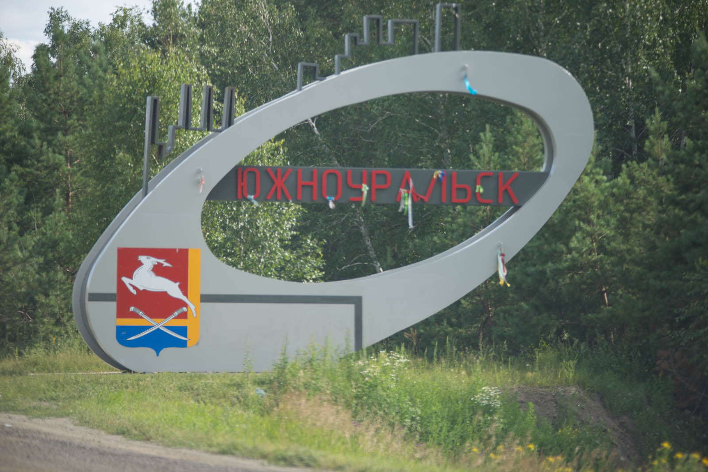
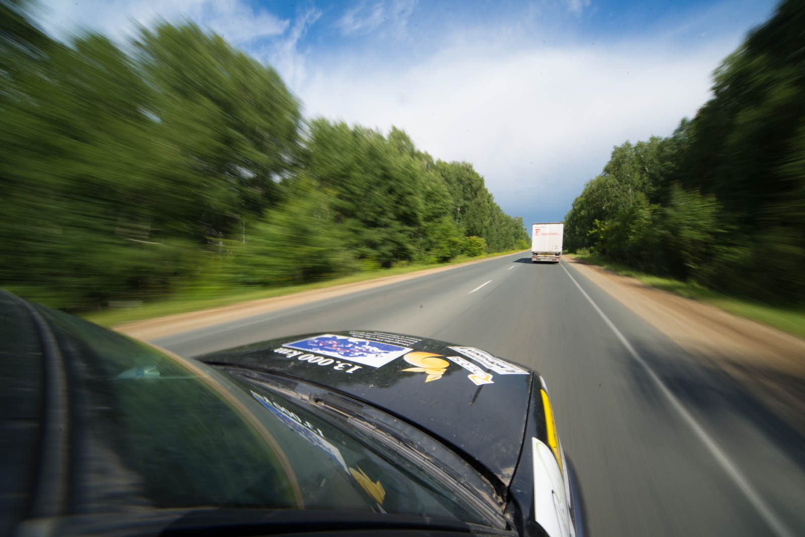
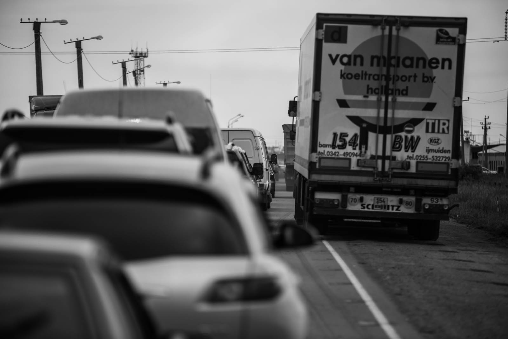
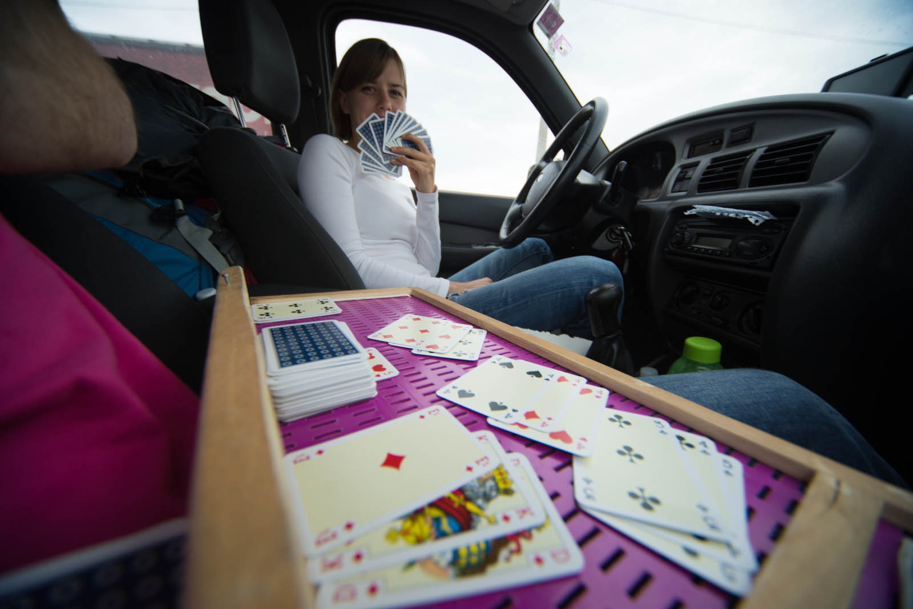

We wake up in another cold morning and for exercise walk all the way to IUT. Across the park near Oktyabrskaya hotel Matej runs that standard kilometer as in winter months at -25 degrees Celsius. In IUT we are greeted with candies and coffee to say goodbye, even on saturday. We update our blog and then Kilir comes. He rides out in front of us and drives couple 10 kilometers with us.

We drive along Chelyabinsk highway, recording and talking. He says that it is a habit in these places to have farewell like that, for meaningful project like ours. He specially came to ask for permission in perfect english. We say goodbye at highway stop and take some pictures with his Yamaha TDM 900. Great guy, come to Slovenia.

We are continuing towards Chelyabinsk, where meteorite fel in 2013. We missed that place in Estonia in 2013 as well, but we are looking for something even more special. Matej desperately wants to see a city that is not found by any GPS system or marked on any map. Forbidden city of Snezhinsk - a city built for supplying one of biggest nuclear objects in the world. We drove to mark 15 kilometers, where we were brought down with dead end - fences and armed guards.

 Before Kazakhstan border.

Well, they were expected, just not so soon. People living in the city are always strictly checked at entry, cars included. There is no-one allowed into the city except for 50.000 souls living inside. We took pictures - Matej happy. This is as close as one could get in this life. Katja took over the steering wheel.

She drove around Chelyabinsk incredibly fast and drove to Troitsk. Matej took some photos and videos. Russians are very innovative at city entries with different sculptures. We get some promotional photos, Ford is doing great. There is some noise and caugh in the morning, well - we are all the same. It must be diesel quality (it cost 0,68 EUR/liter), and they don't have arctic diesel to try that out (it goes down to -50 degrees Celsius).

Ford is burning little of oil so we are planning to do a refill, but not for another 3000 kilometers at least. To note, we expect that to be by the end of the week. We also slightly bumped drivers doors so it gets little windy now and then, when you're driving more than 1000 km/h. Beast is doing great, just keep it that way - we're doing almost 1000 kilometers per day.

Of course we regularly check oil, lights and tyre pressure every morning. And then every 3000 kilometers due to early discovery of possible problems. We are using Vitrex for cleaning the windows, but you have to stop to wash it. We barely use wipers.

 After regular check at a pit-stop.

Well, back on the road. We got boarder to go through. Waiting again. They are checking the car, asking questions about weapons. They are doing their best. In the meantime we play rummy at Jano's improvisation of what you would call table. We are driving in Kazakhstan - can you imagine that,  driving 110 km/h (that is the restriction outside cities). And no-one is speeding - we suppose there must be some big penalties involved.

 Searching for new angles while waiting at Russia-Kazakhstan border at Troitsk.

We come to first control at 30 kilometers and are immediately pulled over. We don't have Kazakhstanian green card - so called insurance. I knew about it and forgot along the way. They say that penalty is 200 EUR, but then when we tell them about our mission, they just tells us how to get insurance and let us go back. There is another problem since only one driver-owner of the car- is supposed to drive it if car is registered on him. We turn around and buy insurance. Then we drive into the night with all lights lit. Those head lamps that we got at Mamut 4x4 and were installed at Avtoelektrika Šlibar are really making the difference. But, night driving is dangerous and we decide to avoid it and today we are driving at 85% of daily speed. You have to be extra careful since every wrong turn can make a long long night, also the day after and so on.

We drive for another 100 kilometers and the roads are not bad at all. We are surprised. We sleep at guarded station for trucks inside the car. It's not super confortable, but if you put all your equipment where your legs normally are, you can sleep decent. We use what we have to avoid going outside into mosquitoes waiting.
