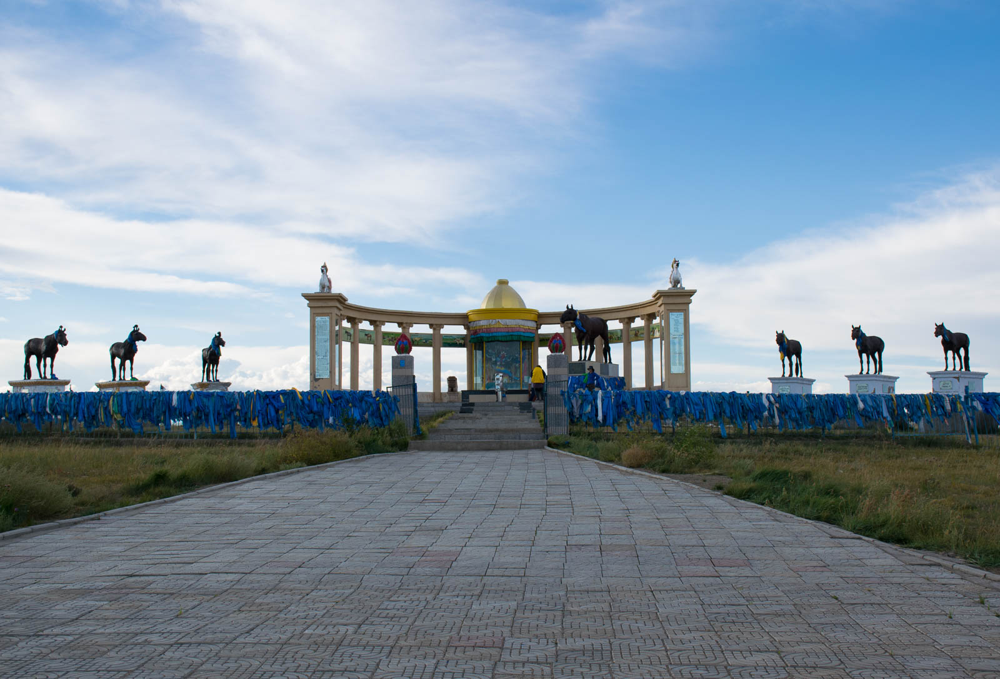

We only manege to drive 23 kilometers today, but it is enough to expirience morning rush hour in Astana. There are no lanes, not a single line written so here we go again. As many cars as possible, that many lanes on the road - organised chaos.

Let's add constant honking, no purpose really, we are thinking attention looking. Navigation is not working (we figured lately that we should write in Cyrillic writing), no stars to orientate at, so we ask locals. We eventually find city center, park and begin famous exploration. Astana became main capital in 1997, before that capital was Almaty. Before 1997, there were less than 300.000 souls living inside Astana and today here is almost 1.5 million inhabitants. They rebuilt everything until 2007, magnificent architects were invited to Astana to build different styles and because of that you have architectual masterpieces everywhere around you. Every corner, there is another surprise, biggere building, different styling. Impossible and beautiful.

We eat at the mall and continue on foot, until we find a spot where white tents are set, looking like mongol gers. When we come closer we see horses and men, dressed in war costumes. Today is Nadaam, Mongolian greatest feast. We are sorry that we are not in Mongolia already but even that will do. We sit down and watch rehersal - they are singing and dancing, and have a true Ghengis Khan battle at the end, all in preparation for evening show.

Music is not up to our liking, nor for the play-list of any sort, but is pristine, Mongolian and right for the moment. We are in Kazakhstan and we are feeling Mongolia already. We climb small hill to have a better view on a city when we are returning to our car.

We are refilling our supplies at local supermarket nad get two bags full of stuff for 7 EUR. They have at least 30 people employed in the market, everyone is covering one corner - it is really funny as if they are not yet ready for self-service. We eat what we bought at a romantic sunset on a riverside. Then we park the car.

We are sleeping in the clouds today. We would like to thank one huge donor of the project, that covered stay for one night for us. Ford is safely parked, and we have shower once more. Thank you, thank you, thank you.

 Sleeping in the clouds.
