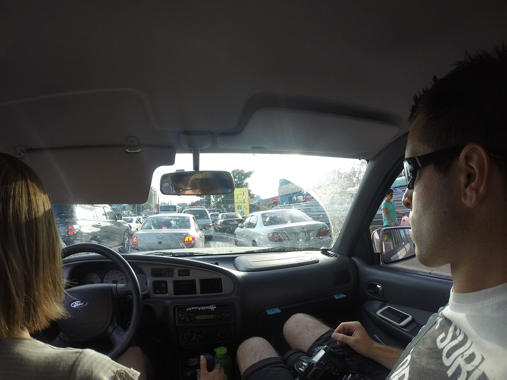
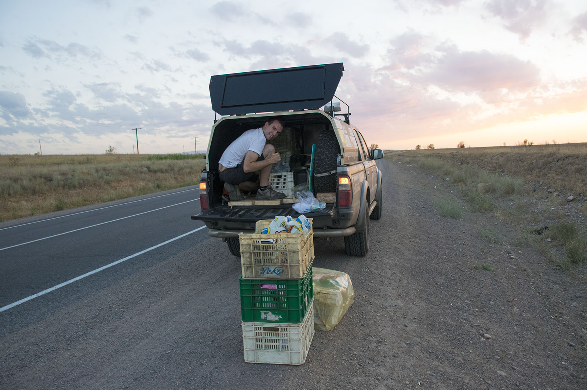
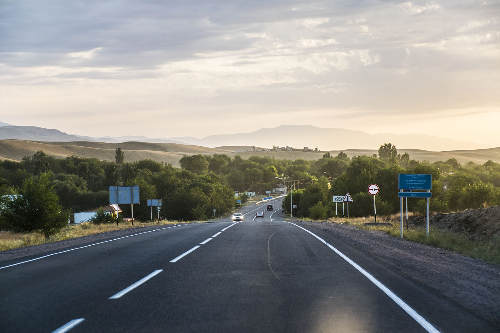
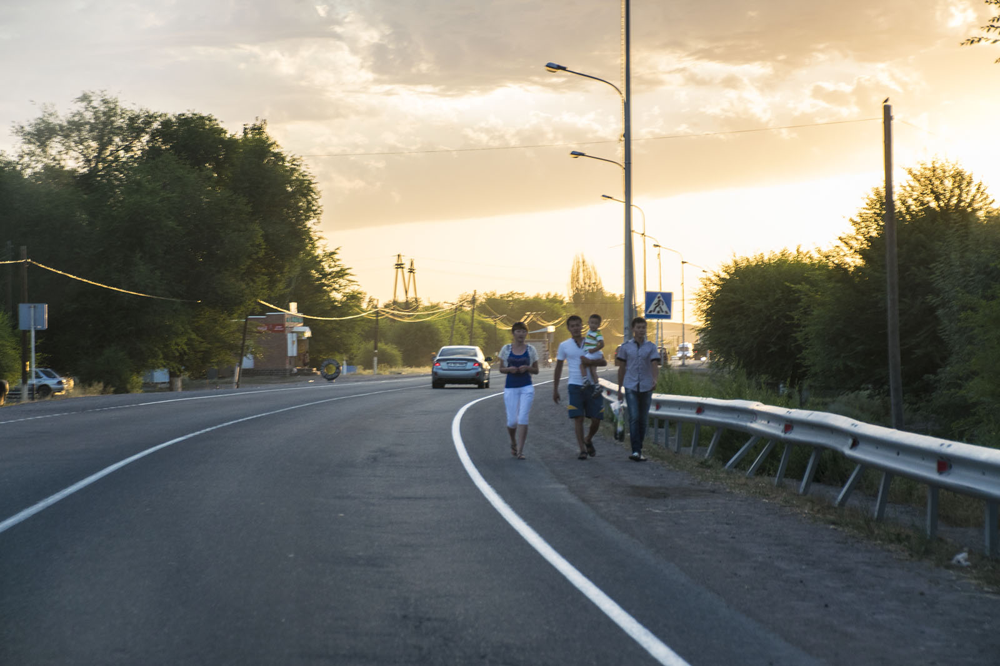
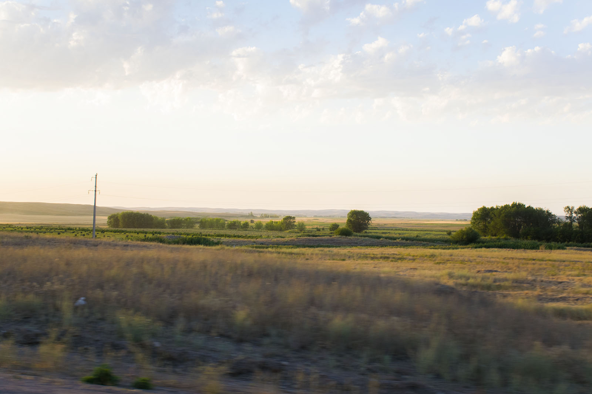
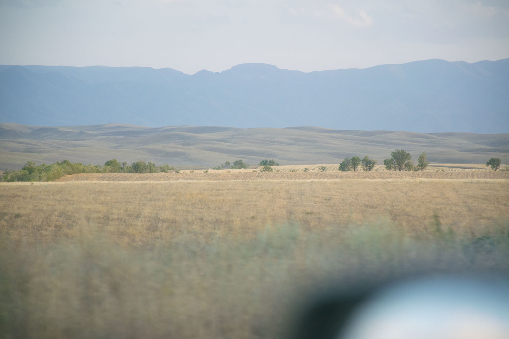
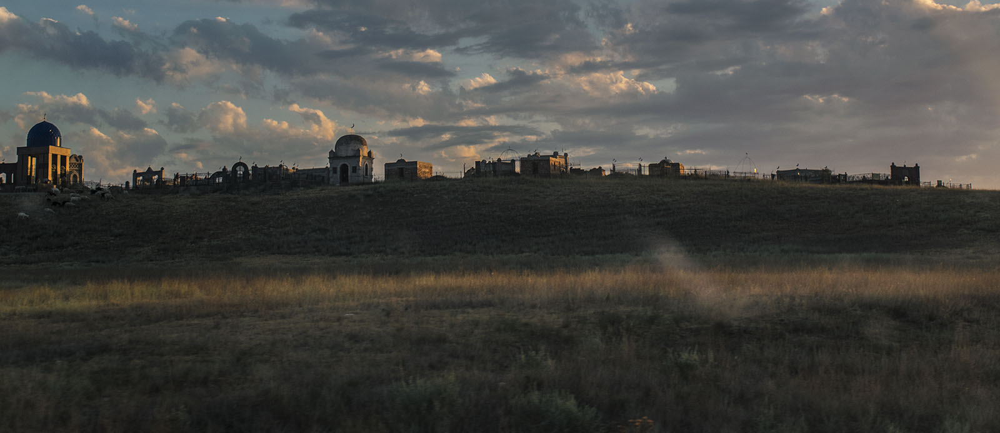
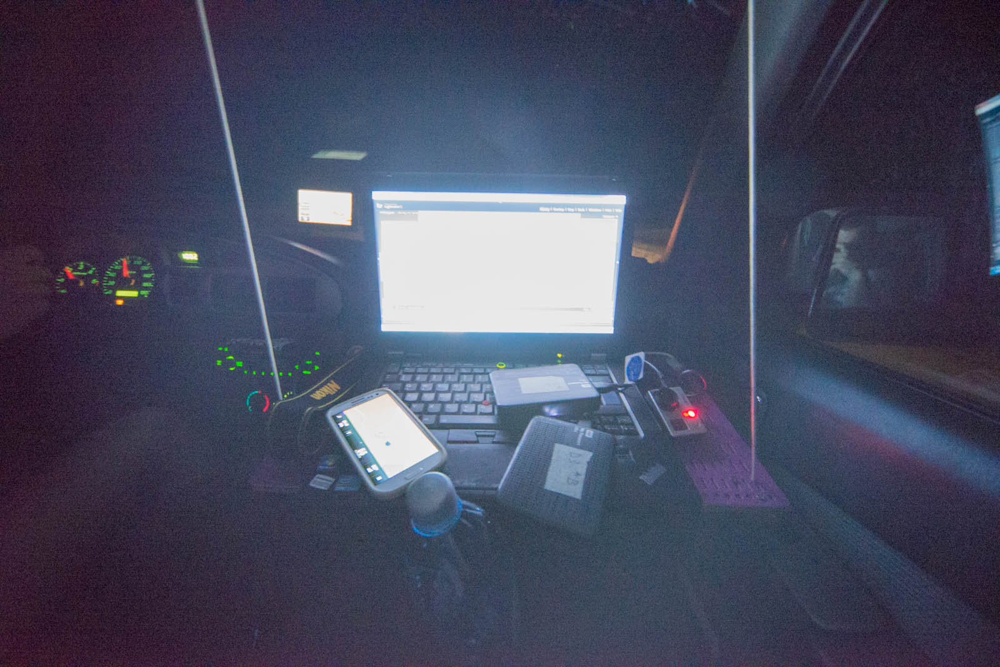

Morning and soft, cozy bed, that refills our batteries. After that we figured out that our shower is not working and they had to send maintenance crew to show to us, that you have to use sequence of buttons to get the water running down the pipes. We return to Iskracom and they are again kind indeed - they let us use use their office to update our blog. We set off to discover city on our own and find a Stolovaya, place where you can have regular traditional food. It was remarkably good. We finish in the park with icecream in our hands, sitting on the bench enjoying afternoon.

 Rush hour exiting Almaty.

This is preparation for the drive. This time Katja has luck on her side and she expirience some good roads, we're running around limits. We quickly leave the city behind and loose yourself in between the hills, and visibility is getting lower and lower. During the drive we got malfunctioning front lightning bulb and it is time for first reparation. Matej is looking everywhere for the spare, but Katja finds it in the first basket. 1:0 for woman's intuition.

And we're back on tracks. Matej turns copilots seat into a home traveling office and is doing regular backup. Last kilometers before border we drive in line. We change seats as we are used that there are problems with no-owner driving the vehicle. That is good idea, since we can see from far that border guards are drunk. We go to registration office, but are soon stopped because driver and passengers have different procedures. After that Katja is through in no time and is freezing outside while Matej is running back and forward copying files and skipping borders every ten minutes.

Procedure is hour and a half long, and Katja is smuggeling 20 liters of milk across the border. Everyone is leaving and only dogs are freely wandering across the border. After all Matej makes it and off we go. For 200 meters when we hear whistle. We stop and young soldier is approaching with AK-47 raised and pointed towards us. We drove past STOP sign, which was conveniently hidden behind a parked truck. Of course they wanted money and with gun pointed at my back I wasn't going for any kind of negotiations so I payed 10.000 tenges - abou 48 EUR. I payed and we were friends immediately.

 Kazakh cementery.

One hour after unhappy event, we were in Bishkek, where were pulled over by local policemen - we drove into one-way road (for sure, yes). They drove us to the hotel, but after that they wanted something. Gift is called Podarok in russian and we were soon lighter for two battery chargers and an umbrella. You should give less than you think you should. It was better deal than paying them money again. For them, it was an adventure. We went to bed right after.

 Matej's office in the car. Discs, GPSs, camera chargers etc.

Of course we make mistake and have to pay for parking the car just for opening gate for us. Well, we gave up. We will pay and try to forget. Luckily sums are not big at all and you should bargain for every price. Fun fact: word xerox in russian means a scanned copy.
