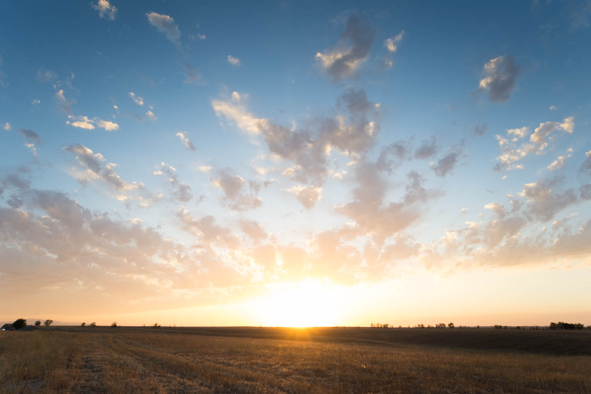
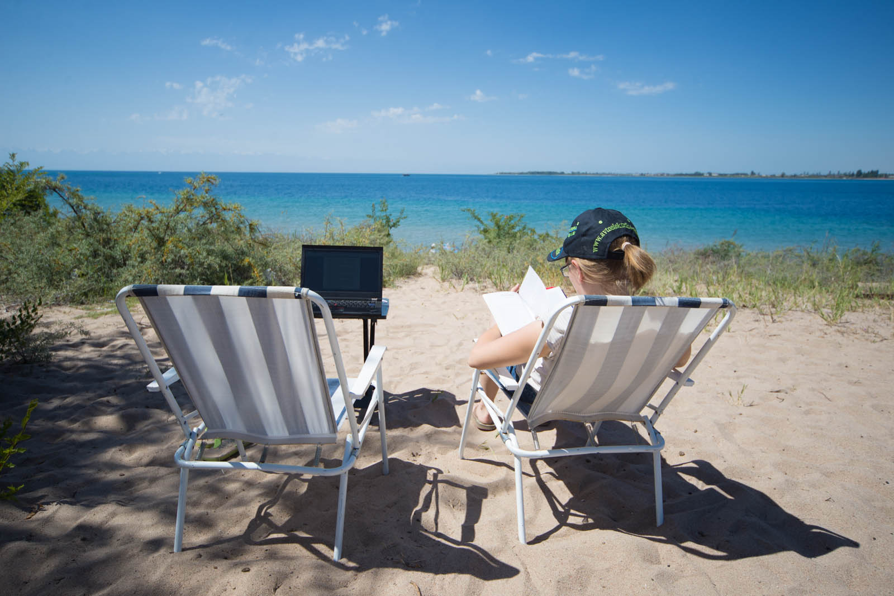
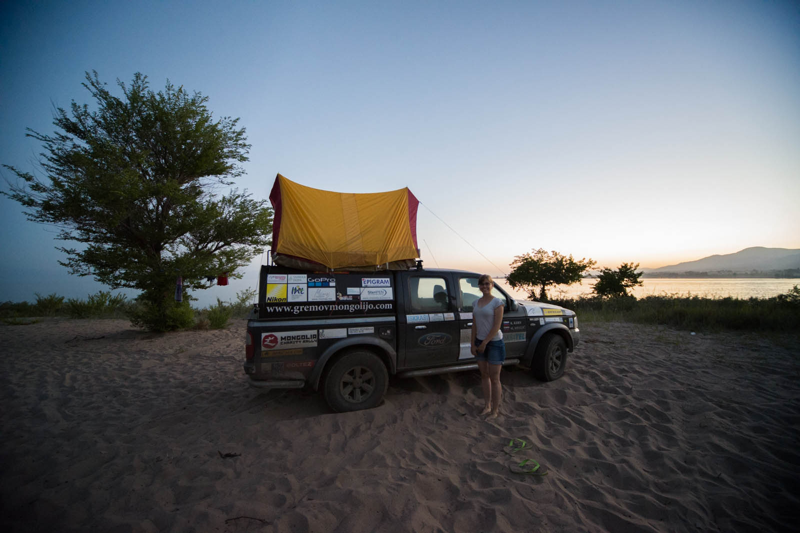

Our sleep was interrupted at 10.00 with security guy, we parked in front of trash cans. Of course he is very interested if everything is well locked down, and we slowly get up and leave hotel. We walk around Bishkek - Kyrgyzstan capital and try to exchange some money into local currency. But they won't take it - dollars are supposed to be old and they won't exchange it. We tried 10 exchange offices and after all set for a higher rate. Note that come with bigger bills (they like 100 dollars and especially new ones). That experience spoils it after for us and since is hot we are soon of towards our next destination - Issyk Kull lake. We are very high, Kyrgyzstan is aprox 2.700 metres above sea level.

Matej struggles out the city centre, we stop at a local market and then set of for 250 kilometers long road. We change seats in between. and Katja is mastering the mountain passages. We arrive in Chokpol-Ata, the biggest city on the north side of the sea.

We are looking at the magnificent view - we have mountains covered in snow  and small desert on one side and endless blue and snow on the other side. In local store we make a bit of shopping spree, we buy some food and water. And then we find sandy beach wher we decide to stay for the night. Beast, water and freedom. It seems like no one is bothered with camping around here. No turist taxes, no toilets, only Katja and I, and the eternal blue. It could be a niche having a turist-camp here. We through ourselves into the water. It is a little cold and salty.

 Our office for writing blog.

We meet a family from Bishkek, and they invite us to their home, in exchange for few SOMs, their local currency. We kindly respond and set-up Palatka, our small tent atop the car. First time, on the car. We admire sunset. And soon after, mosquitoes arrive. We jump into our tent and fell asleep at 22:00.

A good hour after that we are woken up by strong lights pointed in our direction. Katja is scared but I can hear good. They are some locals that came for a midnight swim, but our car is bothering them. They are drunk and not sure if they should report us or now. We stay quiet and after a few minutes they decide to park 100m to our right and swim there. Good decision. We stay up for half an hour, listening to the voices. And then fall asleep once more. This time, to the morning.
