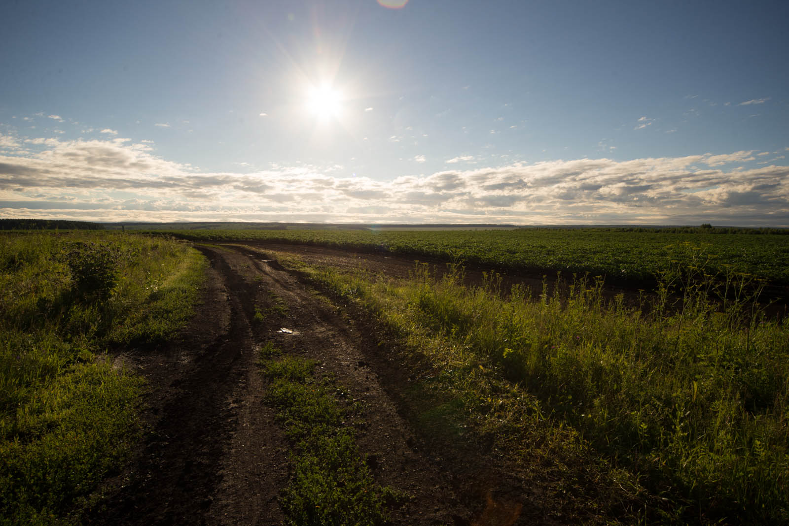
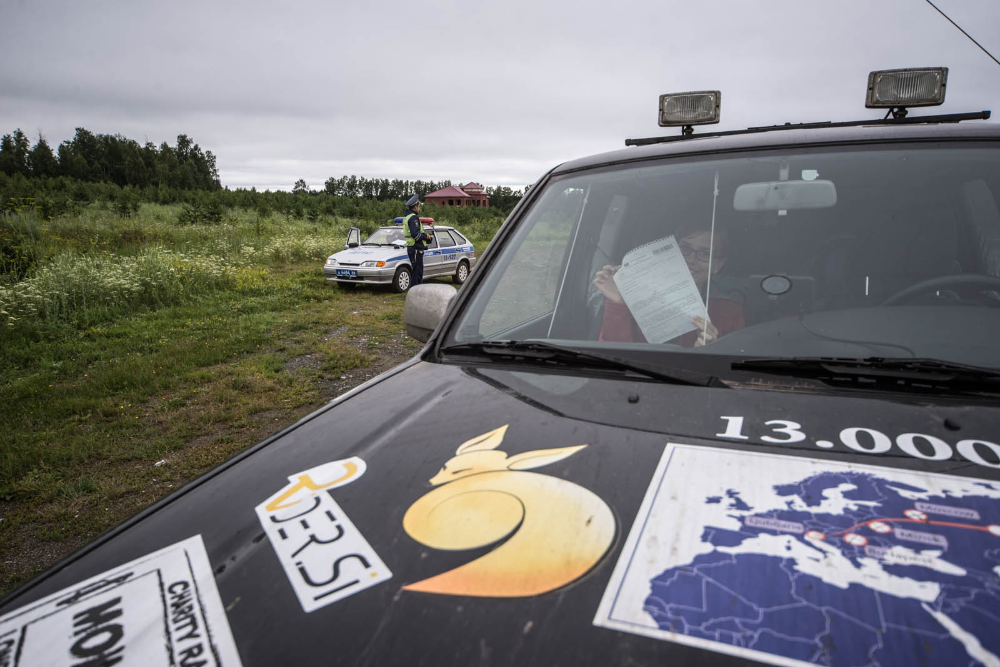
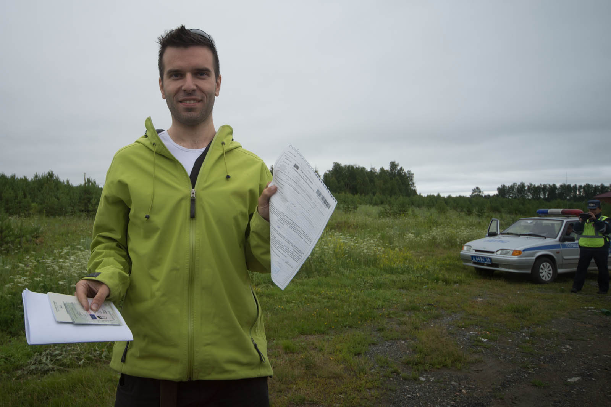
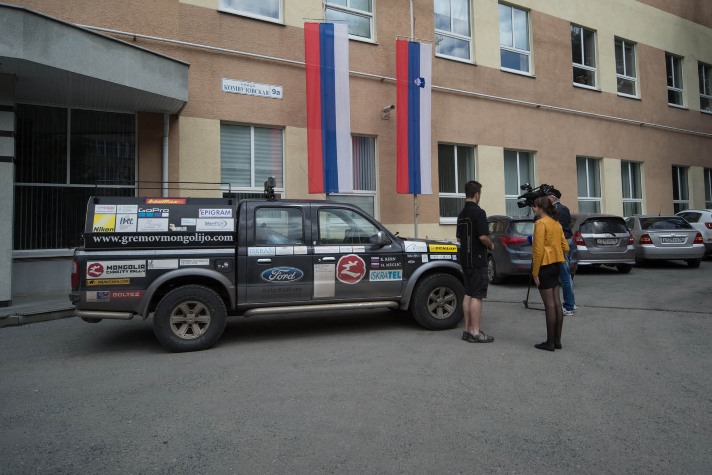
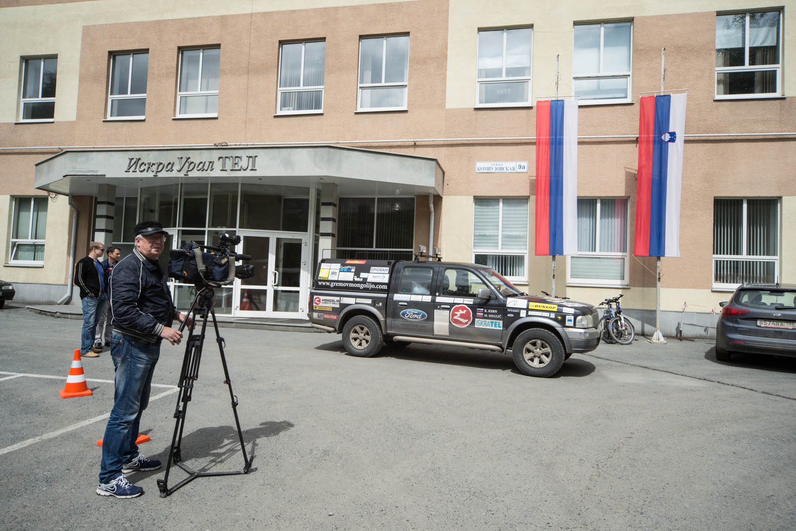

We wake up unusually early into a pretty cold morning, smells like those first days of autumn, when you are not 100% sure if you're wearing jacket or not. It's eleven degrees Celsius - typical Ural. We leave industrial Perm region and are continuing south. 20 kilometers later we stop atop the hill in front of Svedrlovskaya oblast table. We are alone, completely alone, silence all around us. Katja fell asleep along the way, I'm photographing. Seems like even bumps, ditches and uneven terrains don't bother her anymore. We are entering Svedrlovsk and I feel tranquility, that same feeling when you're coming to long lost destination once more, unexpected.

I take a walk along that path and enjoy in silence, only whispering of wind chasing me. Svedrlovsk is somehow different from everything we had seen before. Great plains, woods and hills without a single house . Not a single one. We meet only two cars, trucks are slowly waking up and start filling roads after eight. We are rushing ahead and literally fall into Yekaterinburg. Well, to be honest, we fell in too fast. I was overtaking a very old ambulance and did not see limit restriction sigh. 87kmh with limit of 50kmh. We got 500 RUB fine – 11,5 EUR. We will survive.

We wave kids in the car at gas station and we are moving along. Yekaterinburg is crowded, as usual. We break through downtown and change our clothes at our company entrance. And brush our teeth still smelling - we haven't washed for 3 days and drove over 2000 kilometers. Not looking at that, we are greeted kings-alike at Iskratel's subsidiary IskaUralTel. It feels like coming home at last.

Katja is occupied just as they occupied me and they are not bothered at all that she doesn't speak russian.  They are writing in Google Translate and are slowly progressing in exchanging information. How familiar - I used to do the same in 2013 when I lived here for 4 months. There are reporters calling on regular basis for different announcements - at local radio stations and newspapers (FYI Yekaterinburg has around 1.5 million inhabitants, just to be sure what local is). Then we got a surprise - Vesti.ru came. That is global television, main TV information channel for whole Russia and we were on the news. We got almost 2 minutes and I had never been so nervous in my life. IskraUralTel helps us with the apartment downtown (shower) and more important, we can call home for the first time. Around 5 o'clock we leave the company and take Marshrutka - it's small bus up to 20 people. We of course chose wrong one and he puts us 11 kilometers away from our home. Luckily we found ride back home soon.

We take showers in the appartment (once again I apologize to all my colleagues for smelling but, you were more important to me and we had no time). After that, we hit the city. We take two main streets and I keep telling small things about my stay and history of the city. We see Church, where last Tzar family Romanov was slaughtered, after that we get most beautiful sunset on the boardwalk. Next stop, McDonalds and internet. Katja is happy, Matej is happy. Home, showers once more, and off to bed.
