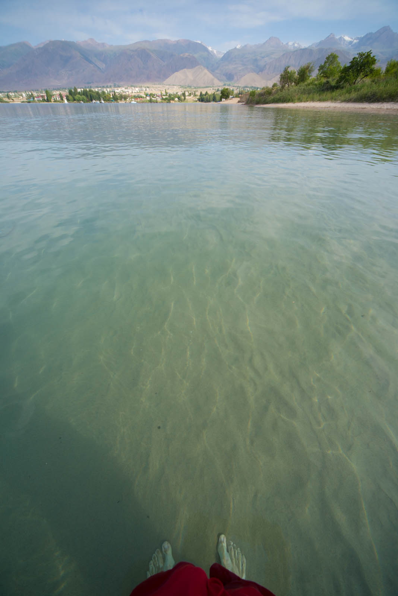
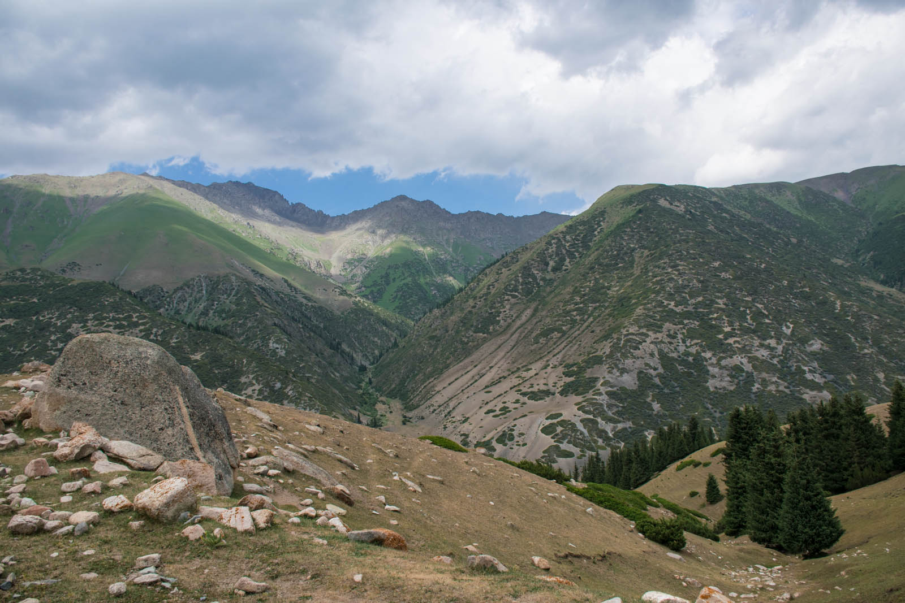
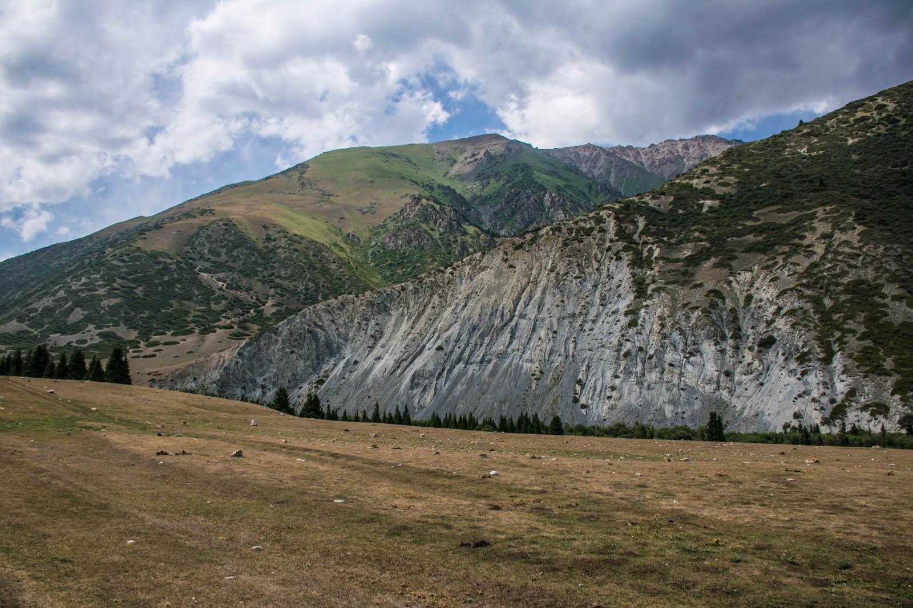
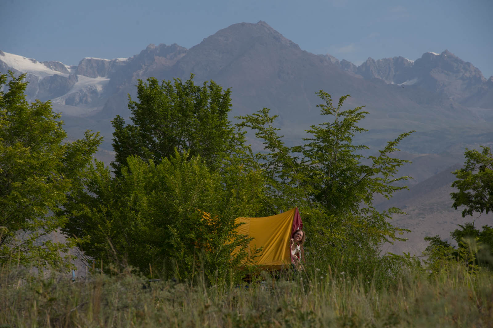
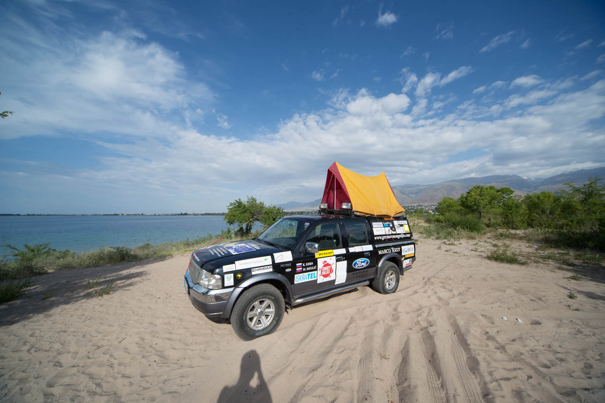

Calm night tonight and even more tranquile morning, water is calling. I'm first on the beach, of course. That is followed with two portions of pancakes with best service ever - Timur and we continue where we left yesterday. He is always accompanied by his younger cousin that is proudly showing our yesterday's present - FENNECteam badge.

Because we are so close to the Mountains of Heaven, the powerful, silent and endless ridge that follows us all the way in Kyrgyzstan, we decide to pay them a visit, to get a closer look. That trip is slightly different than you'd expect it to be. We do not walk, we drive instead - into Semjonovskoe Uscheli, that is The place to be here. It is 30 kilometers away from the city.

Road is leading us near the lake and mountains are coming closer with every mile driven. It's so interesting that they are selected in three layer - hills full of stones are first, followed by green-hills, covered with meadows and then, high peaks at last, majestic in their glory, as silent guardians blocking clear passage towards Kazakhstan. All this is Mountains of Heaven ridge, and for entry of the park we are charged 300 KGS for the car. The guard at the ramp also explains us in detail, where to go and what to see, depending of your car because terrain is really tough.

Gravel road is leading us across the valley, we pass some gers, trucks-transformed into bee hives, meadows full of stone like it was randomly thrown away and small mices, Pika-boos. These Pikas are running around freely with only one natural enemy, great eagle. Park becomes ZOO, donkey everywhere, cows are slowly crossing roads, sheeps are seen and out of nowhere, herd of semi-wild horses rushes from the left and fearless pass us as we would not be there. After a really bad road we make it to the lake where we rest for few minutes and refresh ourselves.

We stay in the park for bigger part of the day and put some pain into our cameras (and batteries). We have to mention that dust covered most of our car, outside and inside, so saturdays cleaning wasn't seen anymore. Everything is dusty - so badly that we are pulled over by a policeman on our return suggesting that we need to take Moyka - carwash. It is forbidden to drive in a car like this in most of ex-Soviet Union countries. We find car-wash, and in no time, our car is back as it was in Slovenia. All of our sponsors seen, at last.

You know that saying for empty bag... we would like to eat - again. We find our restaurant, but the prices are too high for us, so we walk further on and change restaurant couple of times before we order. They would like to charge extra for the music and up to 13% for service, which is BTW bad. Well, we are finally decide for shashliki - meat on the stick, but Katja is unpleasantly surprised when she receives duck instead of chicken after a long long wait. We eat desperately and later on find out that two guys signed the car while we were eating inside.

 First page of supporters is full.
