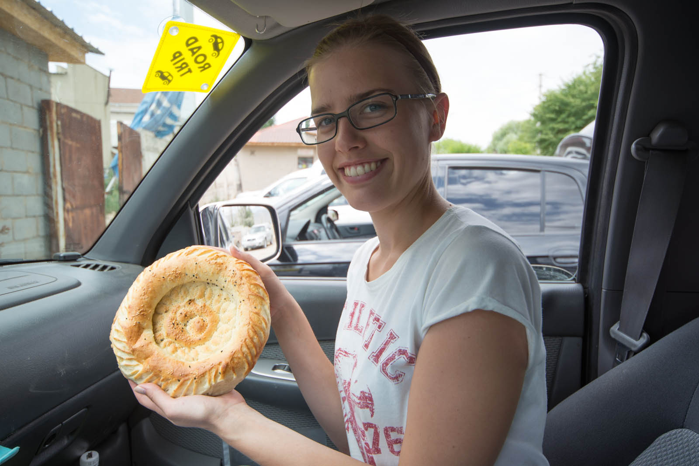

On our way to well-deserved breakfast after cleaning the campside we wonder about amount of policemen on the road. They are literally covering every corner, every hundred meters al least one, every crossroad three of them. There, where only yesterday were groups of parked cars on the streets, today is none. Roads are cleaned and empty. We find out that Cholpon-Ata became holiday destination for President of Kyrgyzstan and that they are expecting his arrival and are rerouting all traffic so that his journey would be as smooth as possible. He had to choose that destination to come to say Hello to us, he would not dare to resist.

We finished our break and are returning to Kazakhstan. We sit in the park and pay a closer look at what is happening on the road in front of us, eating breakfast. When we return to our car and want to leave, a guy knocks on our window and give us Lieposhka, local bread still hot from the oven and signs on the car. Right after that he's off, selling bread on the streets again.

And we are back on terrible roads again with our Ford. These roads are still light years from Kazakhstanian ones, but has limitations that are nerve-braking. In villages there is restriction to 40 km/h and out of the city the fastest possible speed is 80 km/h. We find smaller border crossing and we are done in couple of minutes on Kyrgyzstan side, but not on Kazakhstan side. They demanded couple of papers more and were moving slower than... well, lets leave animal comparation aside. We were through in 45 minutes and one sponsor T-shirt lighter.

Weather is typhoon-alike, wind is blowing insanely and is bending that few trees that still resist. Rain is falling almost horizontaly so we are immediately wet. And because we were learned the first time, we buy insurance this time and register as drivers and of course, we are not stopped this time. We reach Almaty once more in early evening and find a gostel. We take third shower (due to weather) today.

