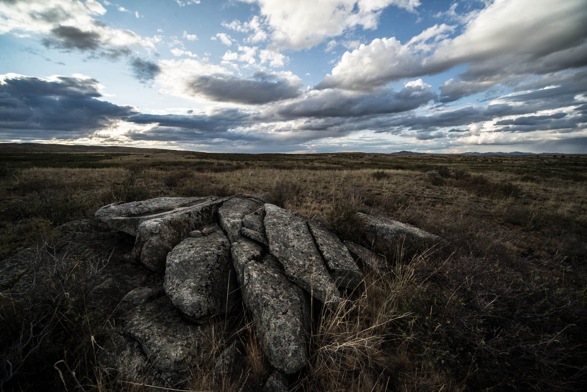
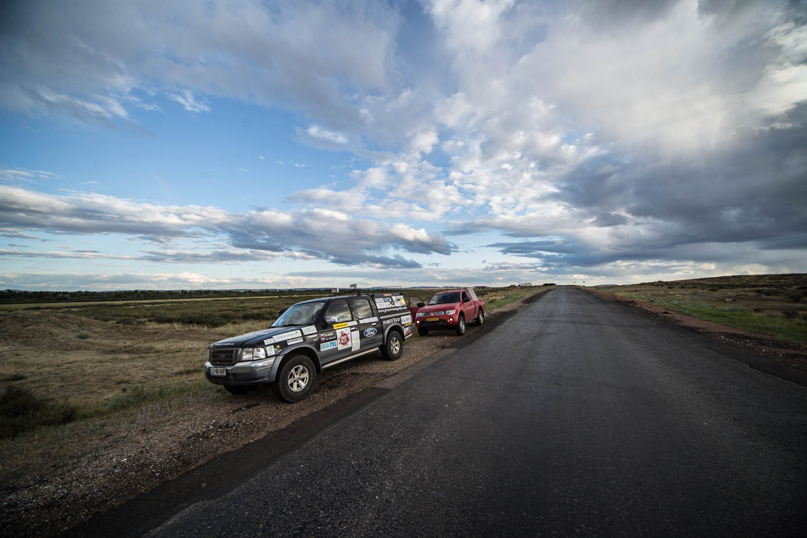
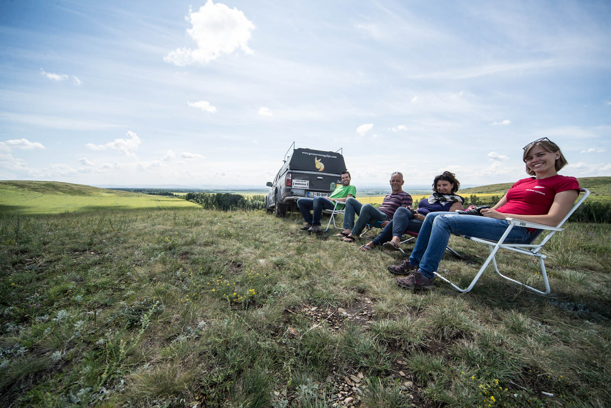
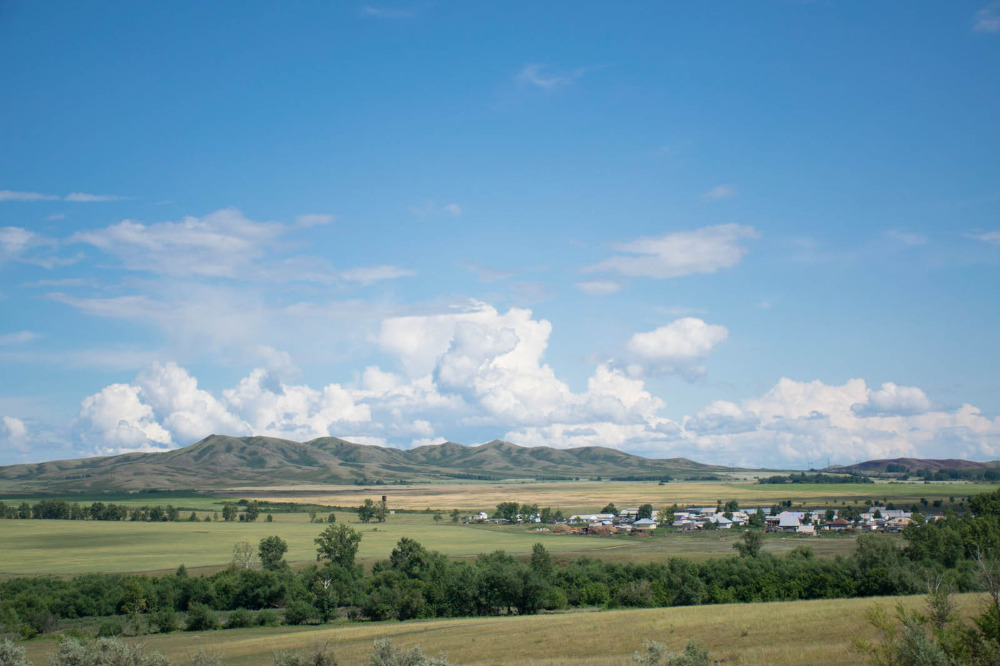
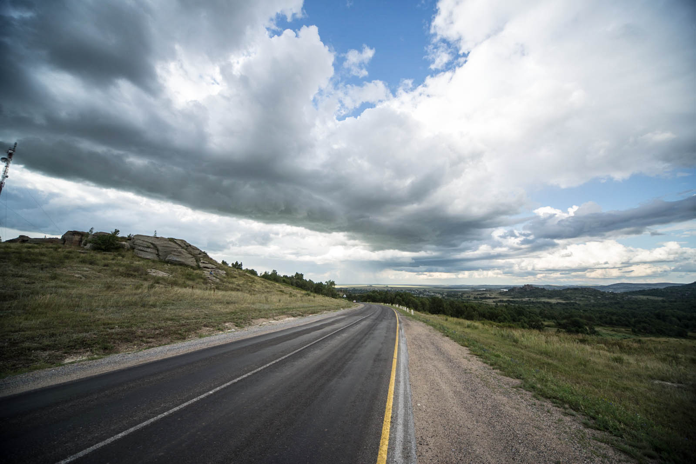
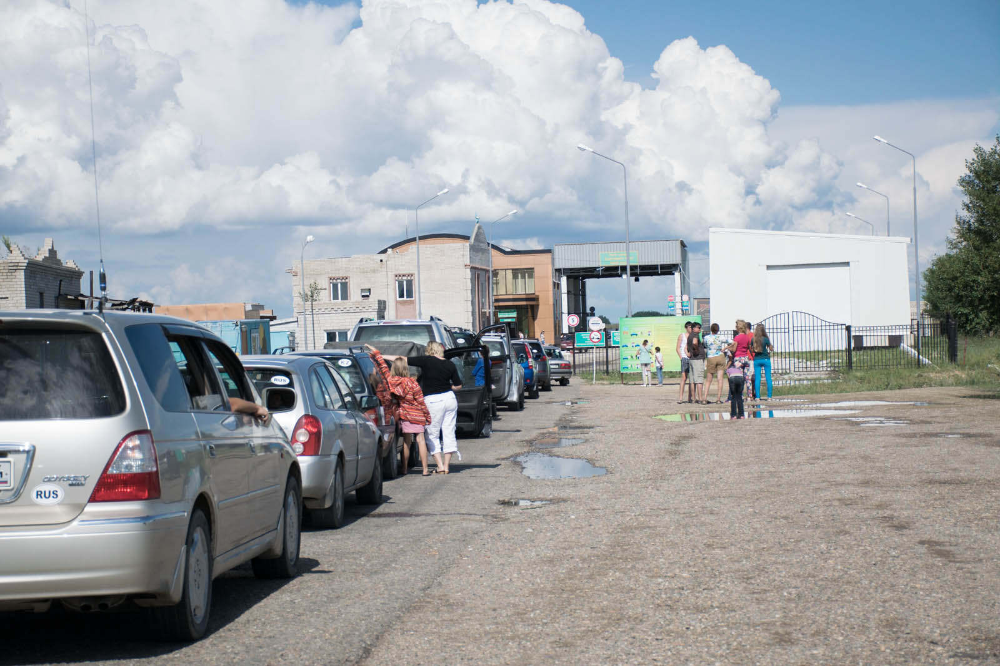
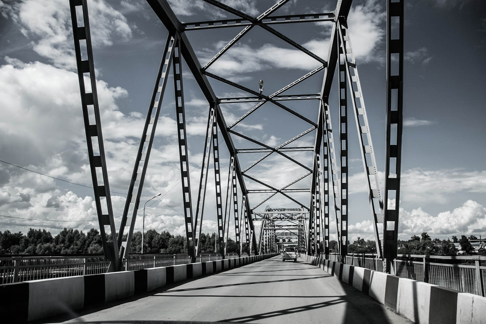
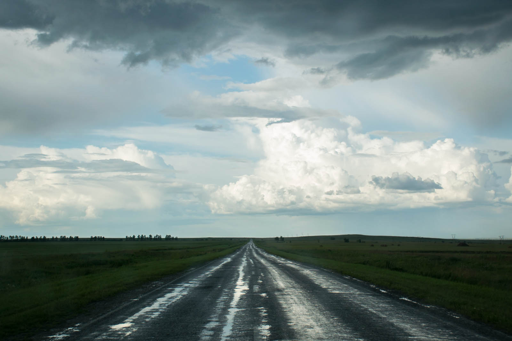
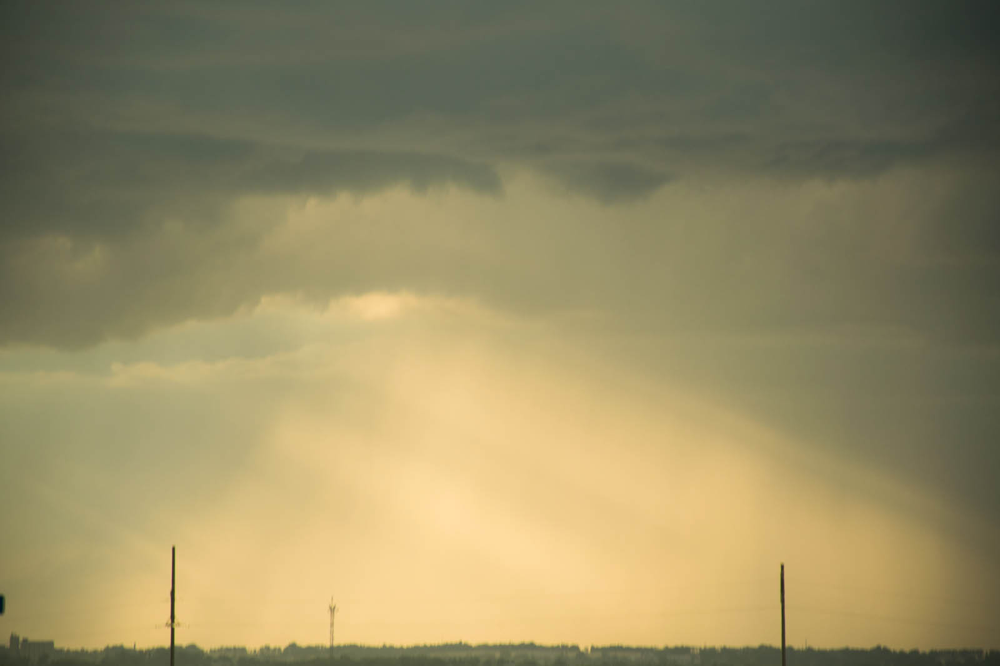

What is better than escape the town and prepare breakfast on the top of the hill, surrounded by fields of gold. We're eating pancakes with melted chocolate and coffee, what a perfect start of the day. The Dutch part of the team consists of recently retired Mr. Hugo and Ms. Yamina that explored almost every piece of the World we know. They shortened their time with various projects and shuts our mouths with their life-stories. They had done multiple charity projects as well, including a motor rally in South Africa, riding across Australia and so on. They told us that this year participants are also a team of 75-years old gentleman's from USA. It's never to late for new adventures. We are quietly eating pancakes, absorbing them. The Dutch I mean, not pancakes.

 Breakfast with a view.

We have little over 300 kilometers until Russian border and more than we progress north, more of green color we get inside our trucks. Flatland is getting replaced by more hilly cousin. I only regret that we are few days too early for all millions of sunflowers along the way that are about to bloom. Temperatures are not summer by any means, but we get loads of sun and beautiful clouds that are travelling with us. We found smaller border crossing Shamonaika and are immediately scared about queue, because no-one moves, not even for an inch. Not for long and we are deep into procedures, now fulfilling all necessary forms with eyes-closed. We leave Kazakhstan in barely half an hour. There are some guards that would desperately want to talk and we, non-Russian-speaking part of the team declares that sometimes it's better to not-knowing the language. In some cases, it is quicker indeed, but please consider this as my course, I'm learning every minute.

And Russian roads are so well maintained (we found out that there are even worse roads in Uzbekistan so be prepared if in that region, and that there is diesel for 0,14 EUR in Turkmenstan). Matej is singing and whistling, now for a good hour - we forgot to mention that our radio is not working ever since we left Slovenia, so we were driving in silence for all this time. Yomina lends us some CDs and our Ford is full of Kings of Leon. We drive high-paced, up to the recordings.

We hit Barnaul at 22:00, find a hotel and eat in the only still-open restaurant. And then we begin with recording of our footage for different radio stations in Slovenia. We're working late in the night, make 7 different recordings. Then Katja falls asleep and I continue to work on our blog that we weren't able to maintain in the last couple of days. I use everything in this last hotel before wildland - showering until water starts to run cold, I fall to bed at 05:00 AM.
