After incredible short night (due to blog maintainance and answering bunch of e-mails / sending footage) we are woken up by noisy alarm. We found this hotel late in the night and were put in themed rooms. Ours was Diana, Russian erotic dancer that is covering all the walls. Still better that Netherlands, sleeping in The Revolution room with Stalin on the walls. As you would suppose we got up late, so we are rushing with brushing our teeth and packing our backpacks back to original form. We are hurrying because we agreed to wake up and meet at 09:00 AM for a quick breakfast. We come to reception in the last minute (typical) but they are nowhere to be seen. Of course they arrive one hour later, up to minute sharp - we skipped one more timezone, and they did not reconfigure their clocks just yet. We cannot blame them, we were abusing internet once more. Our blog is up-to-date, all e-mails answered. Matej pays the first speeding ticket we received before Yekaterinburg (ha, seems like ages ago, rgiht?) and breakfast is foolowed at Stolovaya - canteen.

Last piece of road leads us on the river-shaped valley through Gorno-Altaysk region. Our speed is often reduced by villages along the road and animals crossing the road, that are not disturbed or whatsoever stressed by our presence. They are true kings of these roads. Our altitude is slowly rising and with higher altitude comes lower temperature. We use wind stoppers for the first time. Narrow walley on the road to Tashanta, last Russian fortress hosts couple of families, turists that camp and we seldom see rafters rafting down the river. Katja successfully takes down first cop-related experience, a patrol out of curiosity.

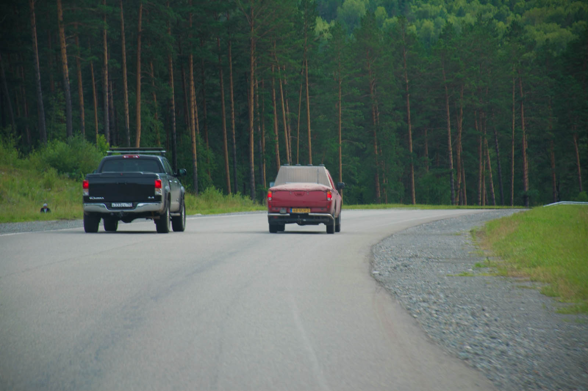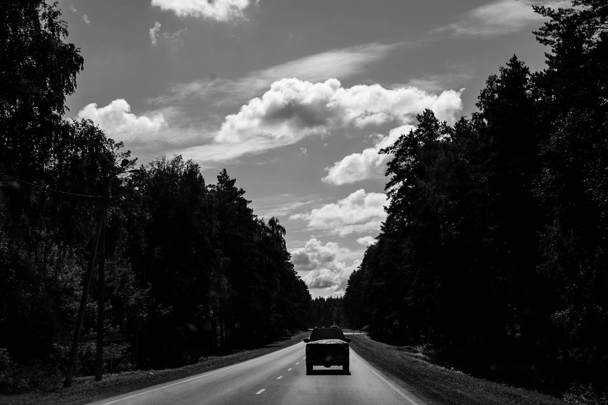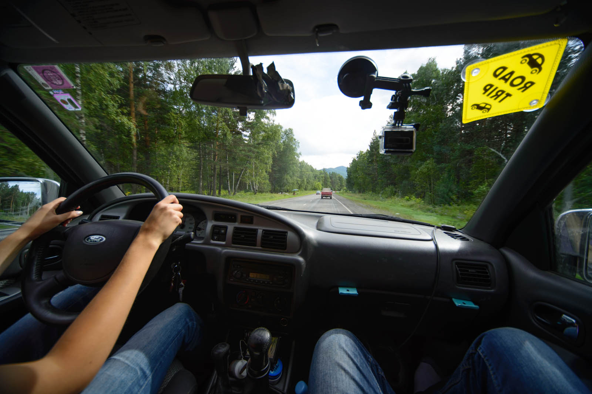

We lunch at the riverside, along with some other guests and unfortunatelly, also many trashes but, nothing over a great view. 

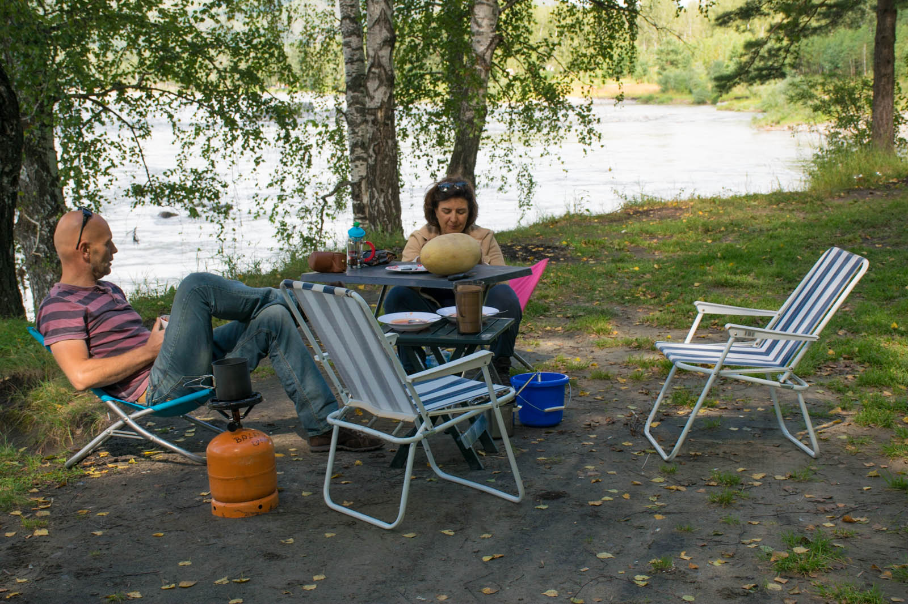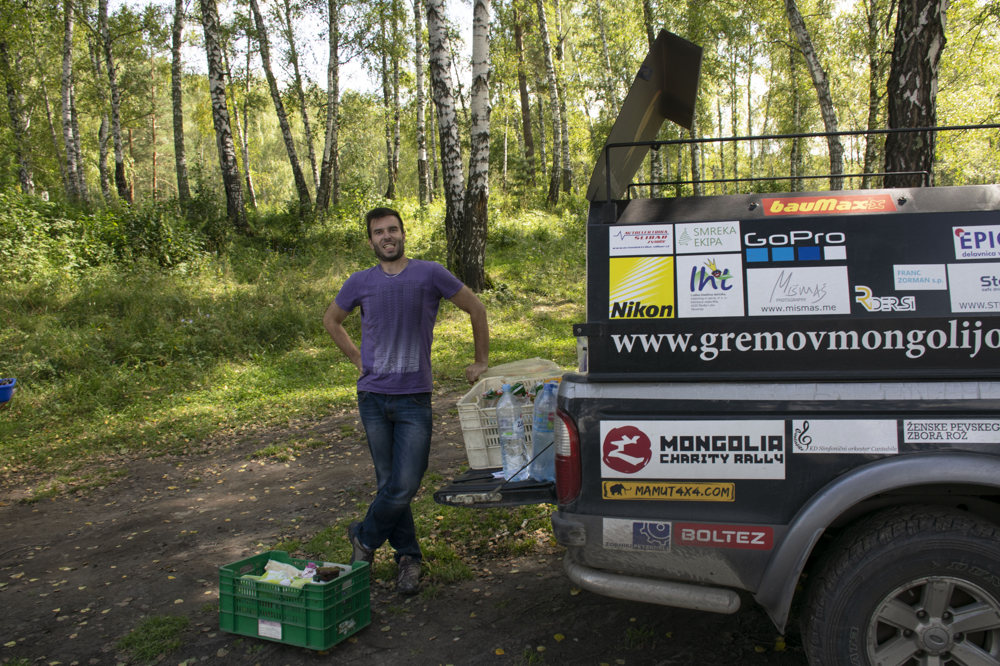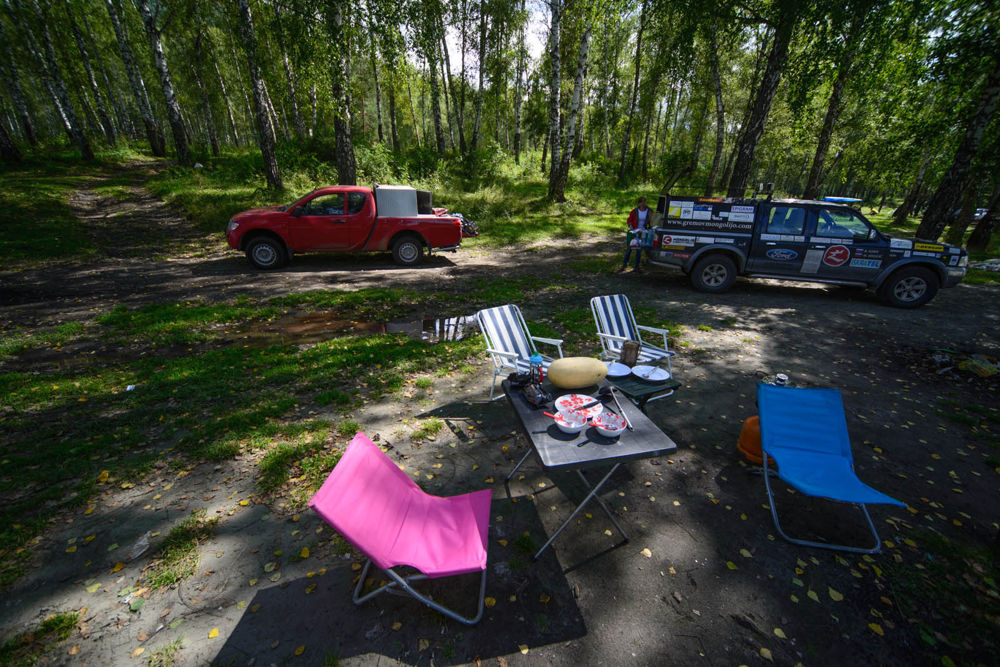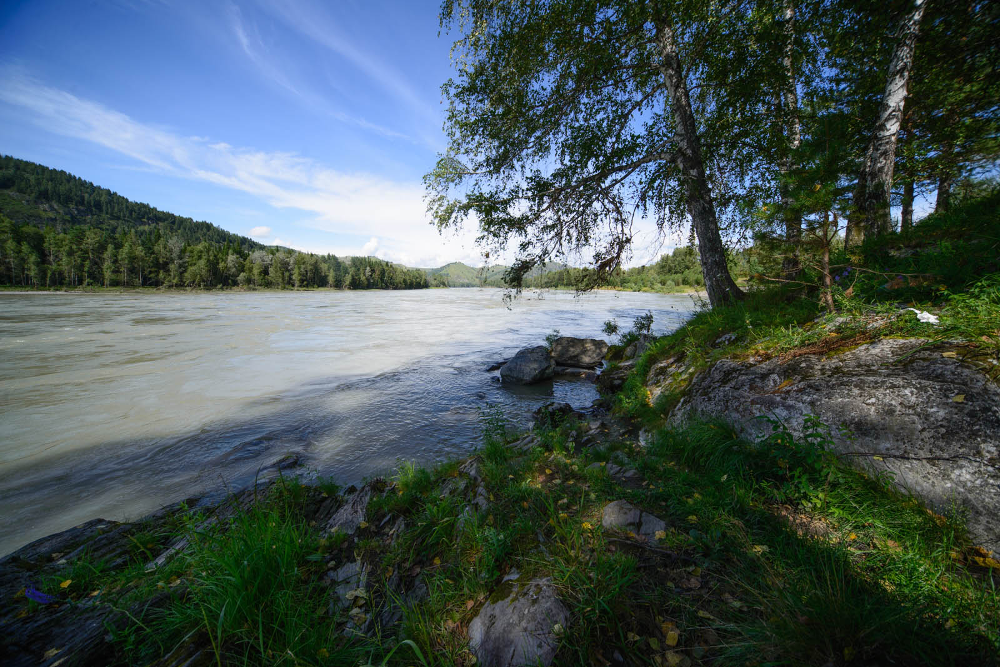

We drive quite some piece of the road when Sun once again (I know we repeat ourselves, but that is life on the road) becomes west-bound, when we find a little piece of camper paradise. We cook dinner in the middle of trees and set up tents, use water for washing the dishes and light a campfire, that is warming our body late in the night. We stay up relatively late, telling each other stories.Netherlanders are leading again, we are desperate to achieve something in life.

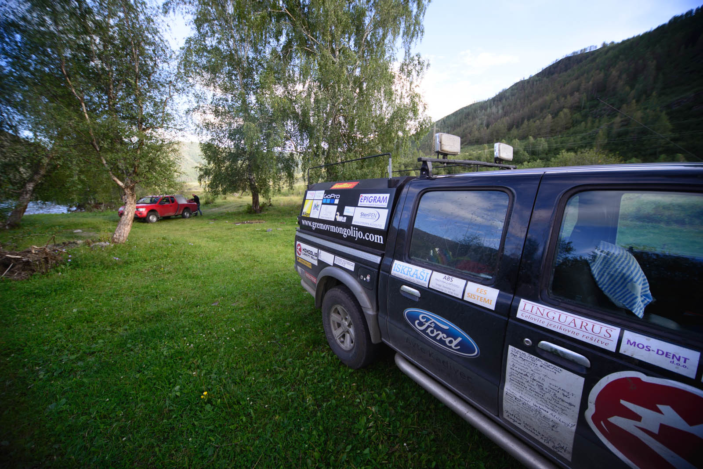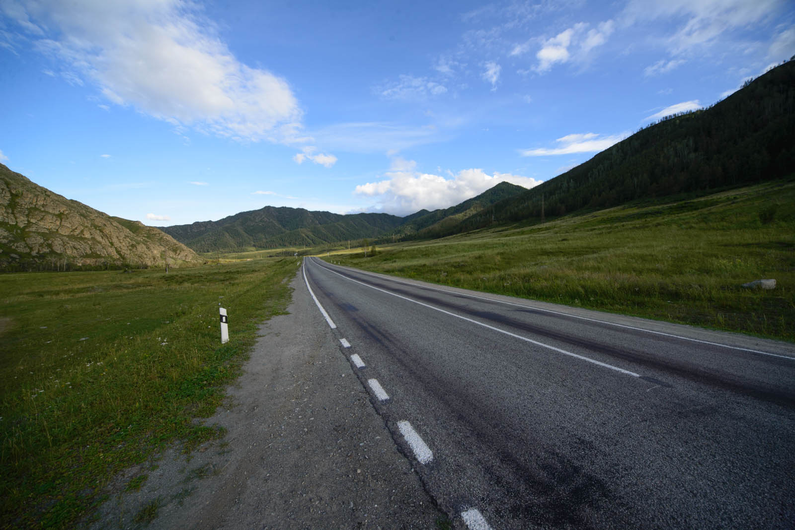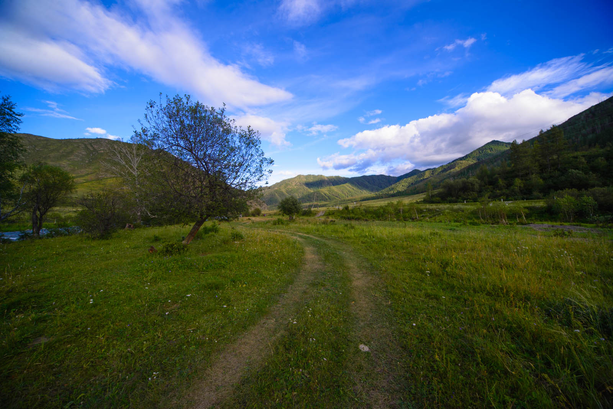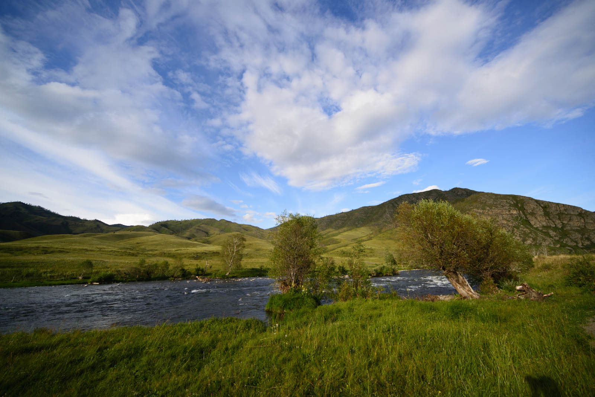
