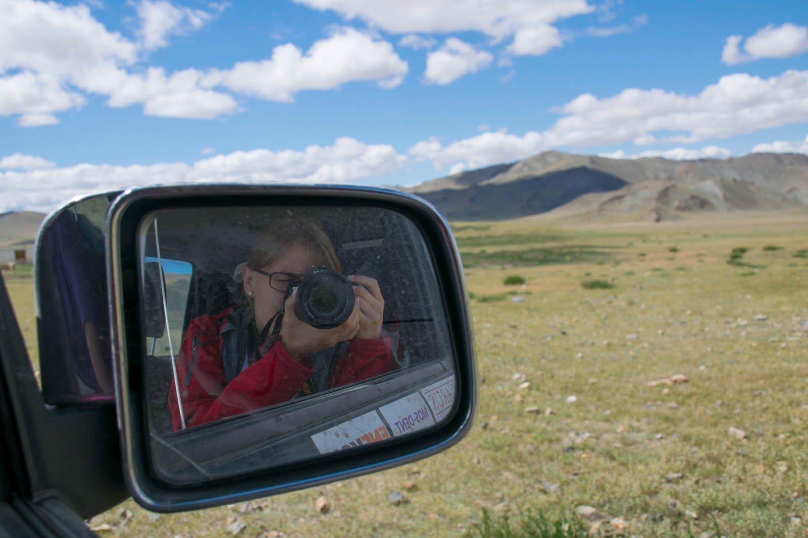
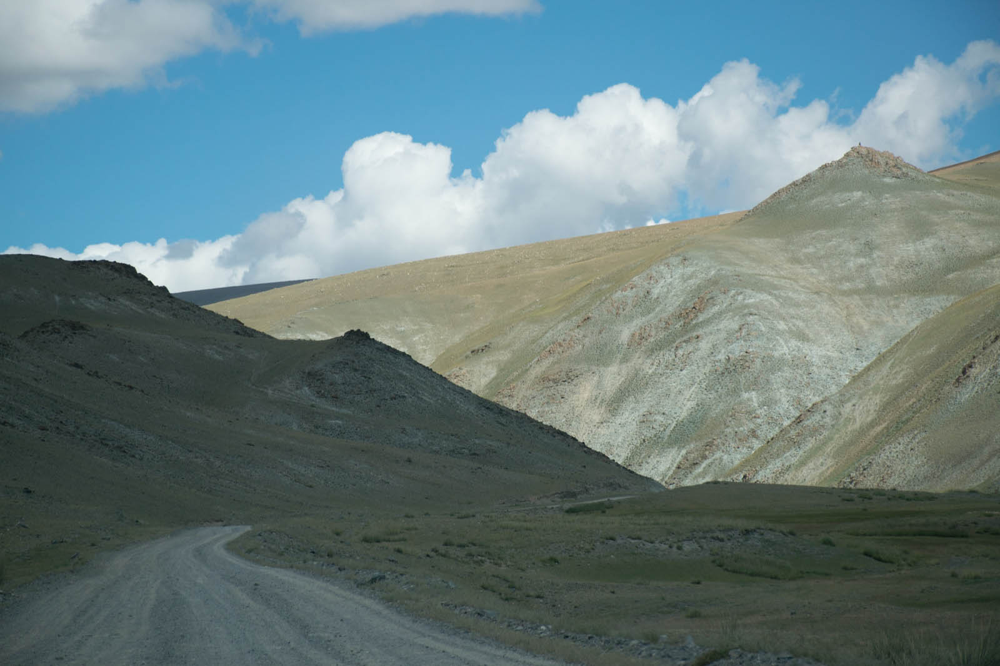
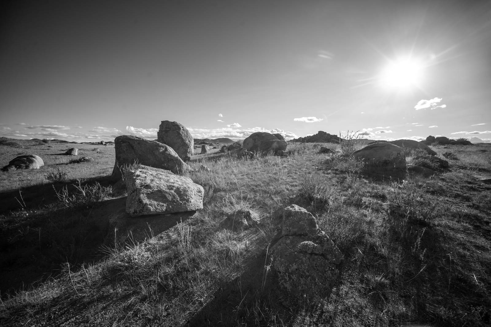
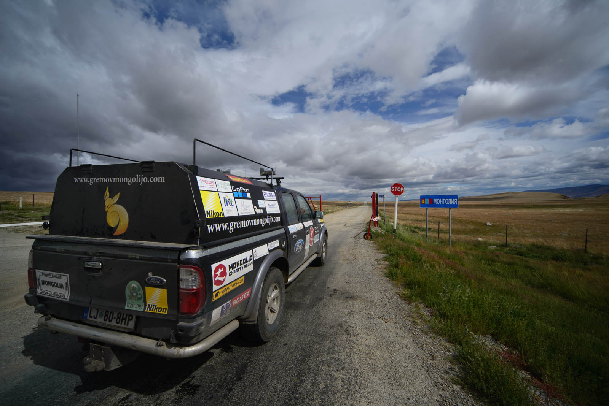
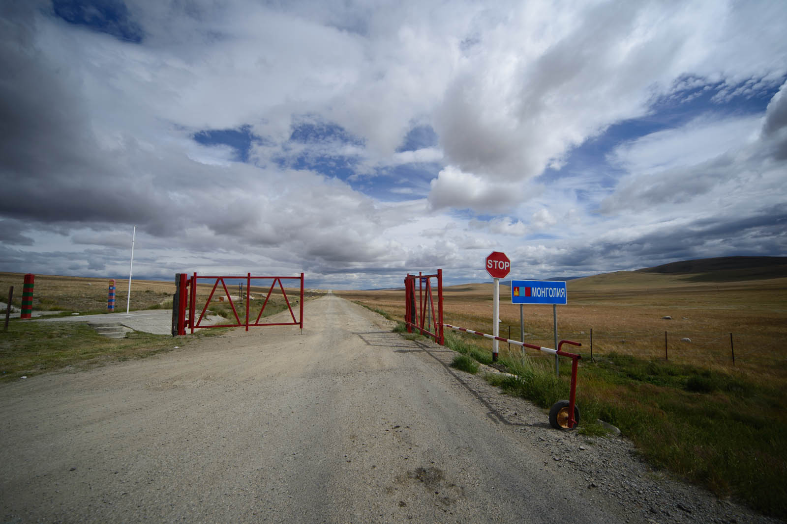
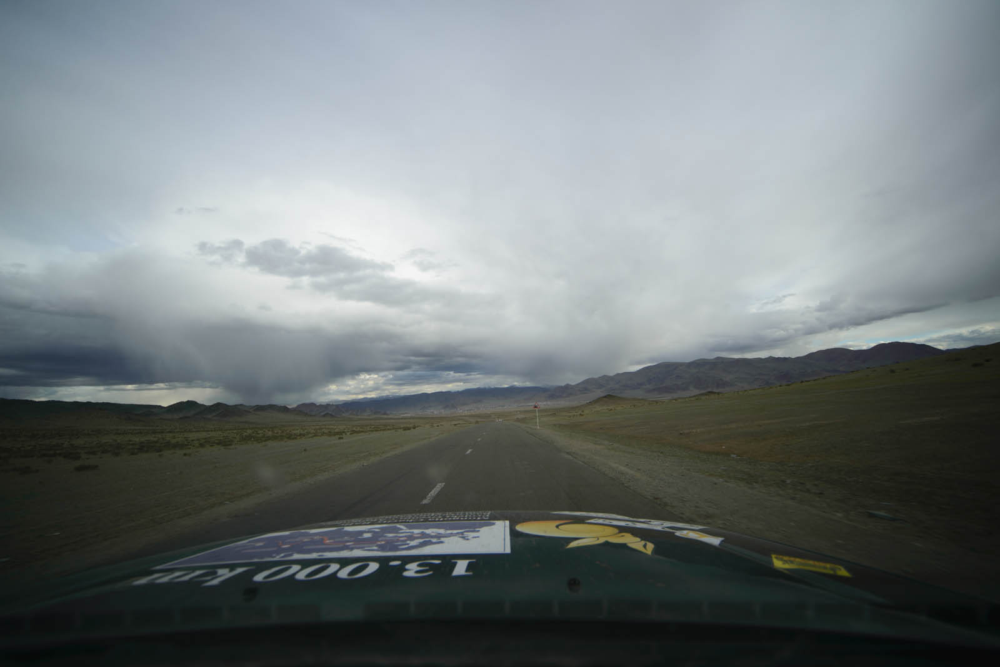
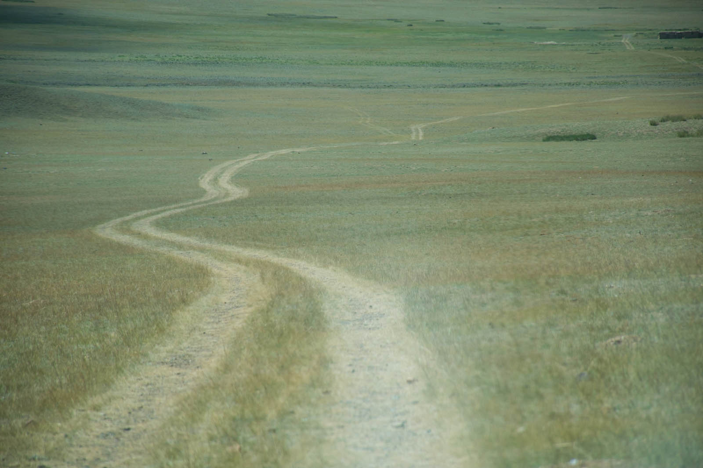
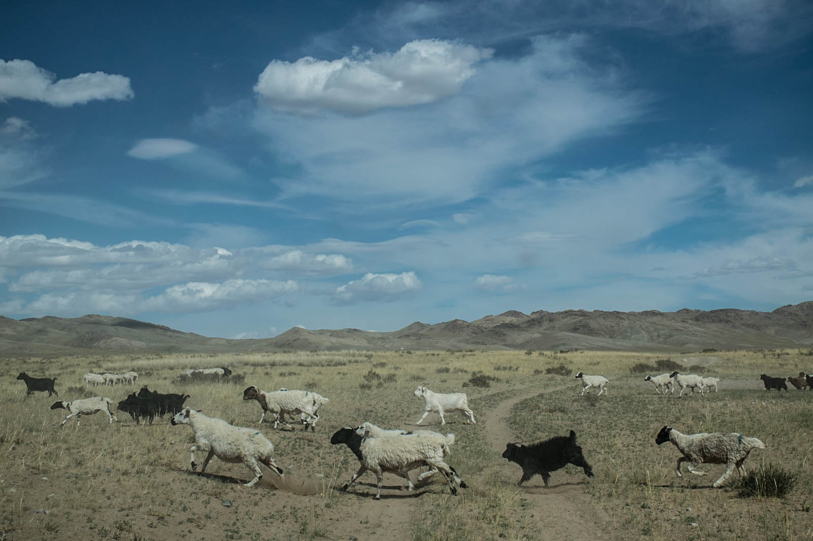
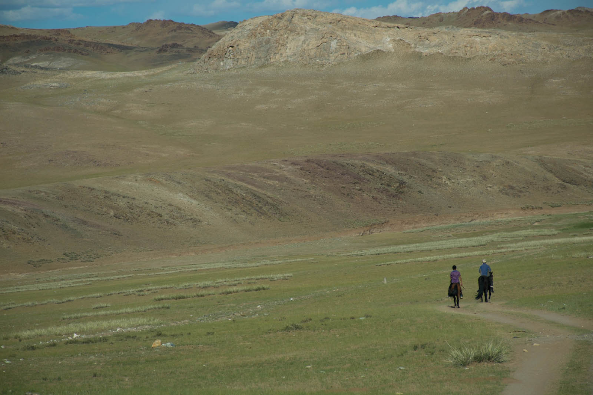
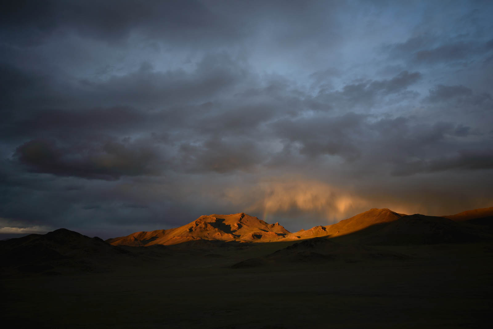

You have to wake up and leave the bed right at the moment when the sun comes up and we get ready to drive right to the border. We have less than 300 kilometers left on this beautiful Gorno-Altaysk region and because things can get complicated at the border as we know from various blogs and our own experience, we have express breakfast. And then, road unde our tyres.

Note that Russian border is opened until 18:00 and Mongolian until 17:00, there is 15 kilometers distance between them and Mongolian border is closed on sundays. That means that if you arrive on sunday at 17:05, you have to wait in that area until monday at 10:00 when they re-open the border. We are highly motivated to spend these two days any other way, but we are running out of time. It feels like in TopGear, we are flying and hovering over roads driving up to 155 km/h, fuel consumption 17 litres. Kids, do not try to do this at home.

Roads towards Tashanta, last Russian settlement are emptier with every kilometer we take and settlements that are represented as cities on the map are getting smaller and smaller. We are in our soft shell jackets, but there are kids wearing only shorts and spaghetti tops - it's summer after all, what do they know, right?

We stay in front of russian border at crossing Tsagaannuur (yes, all those letters repeat themselve) in small queue of 5 vehicles and soon we figure out that border is closed due to lunch break. After a good hour, people in dark green uniforms are beginning to return from the city, without any elan for work. Now we are going through. Oh no, we have to return to the city to stamp our passports there first, and then whole procedure can begin once more. Hopefully, for the last time this trip. We return as last into queue once more. We are constantly looking at the watch, but Russian side takes us two additional hours of standing in the wind. Katja is watching cartoon inside. Here at least everyone knows about Mongolia Charity Rally and we are not bullied as there are other trying to go in/out the country. They have huge X-ray scanners everywhere. They are kind but they have their own mentality and procedures to oblige. Customs officer opens second to last gate and wishs us luck in English. After three kilometers we come to last gate and there it is, Mongolia.

We reached it, our long-wished goal. We have smiles all around our ears and we quickly drive that last 10 kilometers hoping that we are not too late. We have luck on our side and we reach Mongolian side of the border in last couple of minutes. One lady cleans your wheels and demands 200 RUB per car. I payed 100RUB for two cars. It's a scam, but pay her. Only after payment she will open gate for you, so don't try anything stupid - just negotiate the price. Everyone is tired and would like to close the deal, so we are though in a rough hour. We expected a lot more troubles, but are pleasingly surprised. We bought car insurance but were later taught that it's a SCAM so don't buy it. It is in second house and people are stopping you, but you just drive forward, don't stop. Well, we were so happy we just payed and weren't bothered at all. We are through the last border. Now the joy begins. And we are quite soon disappointed when we find out about new, freshly paved road. We didn't sign for this?

We continue our way on the local, unpaved roads because tarmac only lasts for couple of kilometers. Olgi is near and we already meet couple of gers that appear in the distance, we also meet first herds of sheep and goats.

We believe that Mongolia will be covered with tarmac in couple of years (considered northern and southern route) which is good. We are concerned by the fact that Chinese and South Koreans are sponsoring these roads and that we later figured that they only last couple of winters and are then similar to Kazakhstan roads. If you're building, build good and something that will last. But after all, you will still be able to taste loads of local roads, that will never be paved so don't avoid Mongolia. It's good to have a decent road in case of emergency or car issues.

Olgi - whole new world. Little, low-built houses and mostly gers, messed up electrification, animals roaming freely. There are some motorcycles, old chinese 125cc engines and few cars. It is the most Kazakh city in Mongolia because Kazakhs migrated here in previous ages and stayed. And so stayed language and culture. Note that we didn't find any motorcyclist right across the border telling you that the road is closed - that was the scam too and if you followed their instructions, robbery as well. We didn't hear any other team reporting that eigher. We eat dinner and are constantly bothered by locals trying to sell us varios stuff. Funny experience is, that they tell you they have Wi-Fi, but no internet. So, they basically have routher, but then again, there was no cable to put it in.

We drive 5 kilometers outside the city and set our camping spot and prepare our somehow unusual gers. It's really cold because we are on 2000+ m altitude and because of that, we are having some tea before the night.
