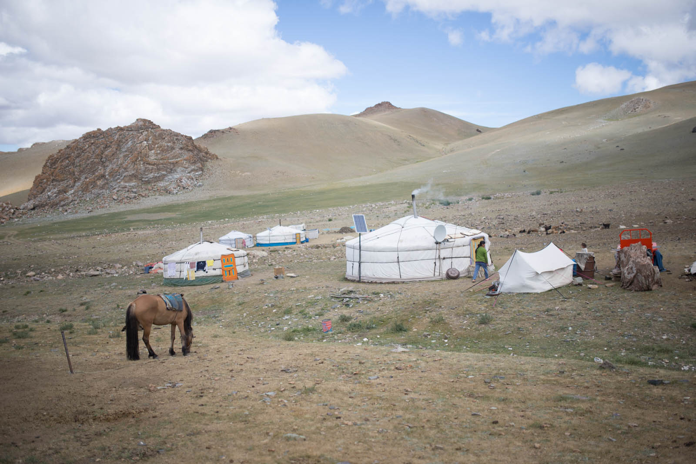

Here we go again. New day, fresh air and loads of flies, when we open our tents. We find no peace, so we skip breakfast and get ready to leave quick. We find tarmac, for couple of kilometers on our way out.

We decide that we want to taste true Mongolia and continue our way across the nearest mountains. We drive 2800m above sea level and views are great. We can see other mountains from Altay chain and see down in the valley. When we start to descent, we pay a visit to a local community.

 Barbie house - Mongol version.

We enter into their house without corners. There is smal pillar in the middle and they have chimney-like hole in their ceiling. They have a small stove and they cook there. There are two beds, one at every side, and black-and-white TV in the middle. We are served horse milk - Aerger. This milk shake litteraly gives our stomach a shake - we received diarrhoea once more. Too sour for our taste, but we gratefully empty offered gifts. We talk in pantomime.

There is 6 families on this plateau. All childer come into ger and smile at us. We are just as strange and unfamiliar to them as they are to us.Na tej planini živi 6 družin. We give them few small gifts and are taken to horses afterwards - they show us their everyday routine. Horses are their biggest pride and hard work.

They show us different animals they posess and they roam freely and little girls as well, smiling and avoiding our cameras. We set off, and are struggeling trying to read Soviet map from 1942, that is loaded on our computer and connected through GPS module. We stop at the lake we saw in the mountains. Not a single sound, tranquility. Only few birds cross this vast sky.

You can not stop for too long, otherwise you get lazy and just sit around. Road changes from mountain to more desert-alike, sandy. We found first river crossing, and we cross it multiple times, simply because of fun. There are ovoos, small stoneformed pillars along the way are only manmade structures around here. They are simple praying structures, safe travels signs. There are also small piles of stone along the way, marking danger on the road, mostly holes. You have to decide, which road will you choose though they vary, divide and combine in no order. They have terrible system - to be honest, they dont have a system at all. Collision is also a big problem, car shakes like hell and you constantly have to repair the car, fixing screws when you stop because everything is loose. Every day, every hour. We meet few vehicles during our day trip.

We camp infront of Khovd and are accompained with mosquitoes this evening, hungry ones. They are flying around us making our lives unbearable. Temperatures are just right for short sleeves, but we are safely under our softshells. And we still get bitten, even through clothes. We get ourselves inside the tents, kill those few mosquitoes that manage to come inside, and fall asleep, early.

Funfact: Truck are also there. They drive for 20hours per day, making 200-300kilometers per day.
