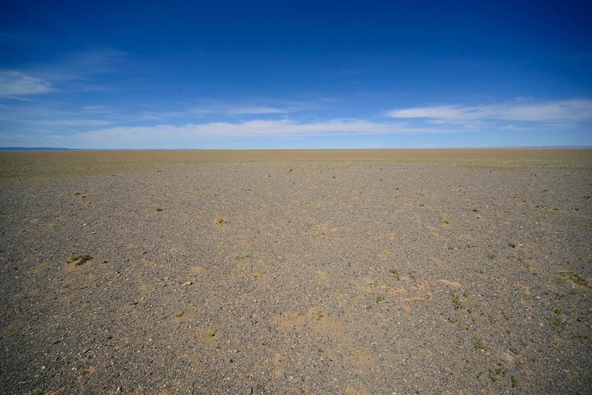
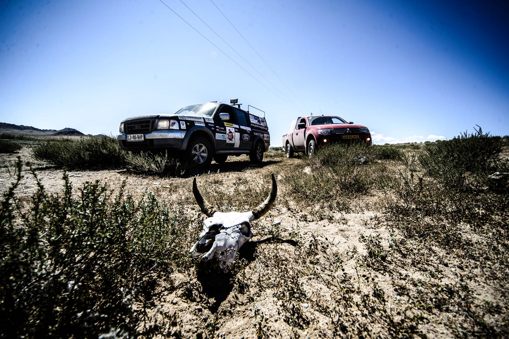
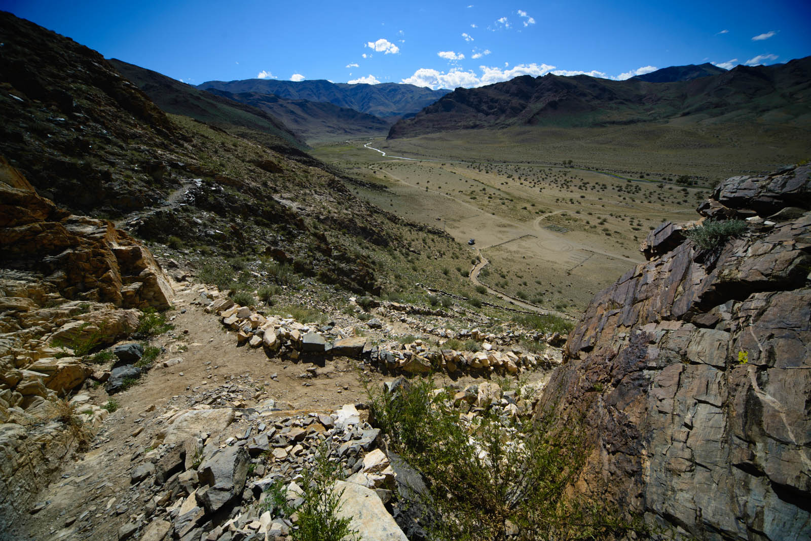
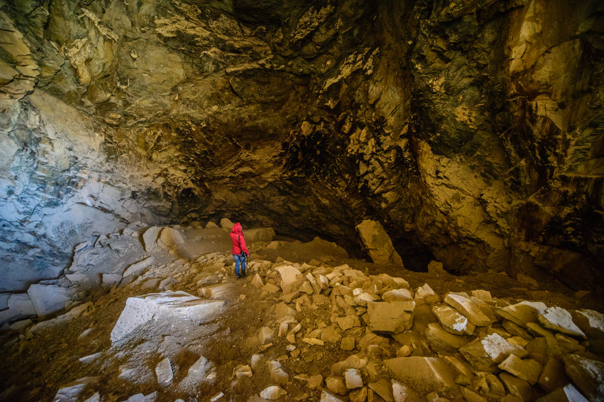
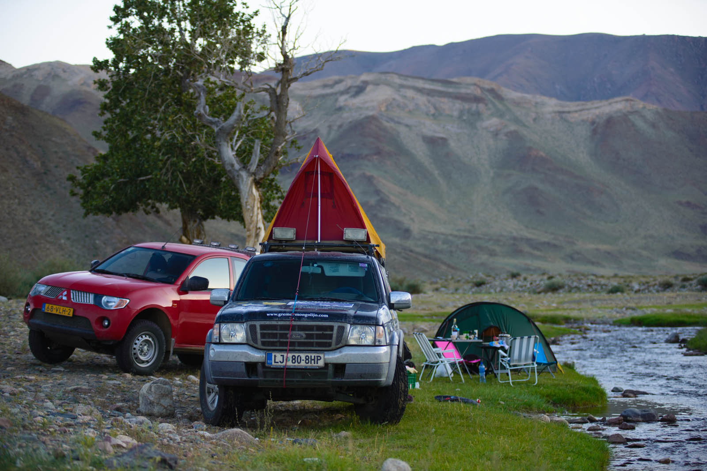

Mosquitoes are there also in the morning. You just can't believe it, so we wake up and wash our teeth, clear our camp and run away. Battle wounds are big, and everything itches you. Aaargh. Hugo has entire neck covered with bites. Breakfast is not possible, so we skip it and head for the city. First, we find bank, where we can change money. There are many ATMs in the city, but none works. And it's even worse in the banks. There are dozen of them in the city, but none will change bills that are looking old (c'mon, they didn't want even those that were straight out from the bank (they accept only dollars and they HAVE TO BE NEW).

We find the best hotel in the city and we would not give them three stars in Europe. But, they have a restaurant and very slow wi-fi, but it is enough for us. We fight with the menu (no pictures this time) and then we find something for us. Bread, jam and butter, breakfast for kings, cost 13 eur for four persons and rob local store as well. It is small but has suprisingly great amount of products available, whole side of the store meant for alcohol, mainly vodka.

Today's route it marked along bad tracks and mainly offroad, no pavement at all. Our bones are shaken and we would like to reach for caves with ancient carvings in the rock. We need one hour and a half from last decent road, riding most of the track inside dried river channel, only 20 kilometers in distance. We are driving on our limits and find out how good it is to stick together, for the sake of possible damage on the car and help seeking.

We leave cars at empty parking lot, made of stone. Information signs are not helpful, everything looks long abandoned and out of service. We climb last three hundred meters, happy to finally reach our destination and find nice benches at the entry in the cave. Matej runs down and back up couple of times carrying all equipment for entry. Then we enter the cave and find out there are no carvings, only signatures of previous visitors and some bird feathers.

We search every square feet of the cave, every wall is under observation. We at last find way in another cave even further up, but Hugo and Yamina gives in and decide to wait by the car. We have a feeling there will be a lot of rock carvings up there and that steep path will fulfill our expectations.

And, same thing happens once more, nothing inside. We return emptyhanded. We have much bigger and more beautiful caves in Slovenia, we are unimpressed.

We return to the valley and find our companions at the spring, small oasis. It's so cozy we decide to spend a night here. Small river is also our first "shower" in Mongolia, Matej finally shaves and no-one cares for those few mosquitos anymore. Let them eat. After dinner, we decide to write blog in our computer and then fall asleep, counting stars though out tent.
