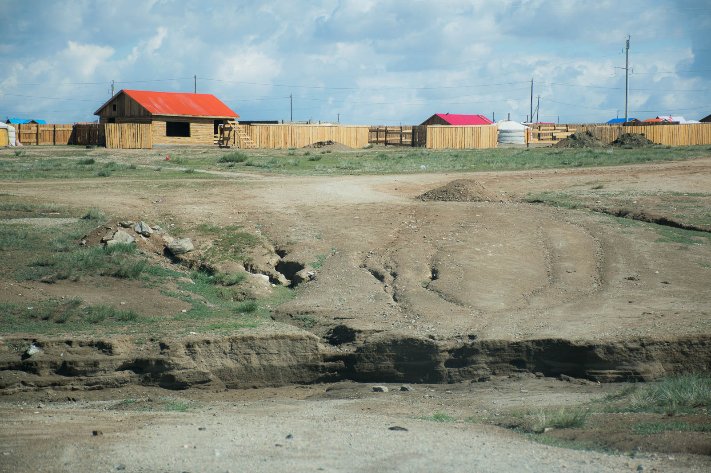
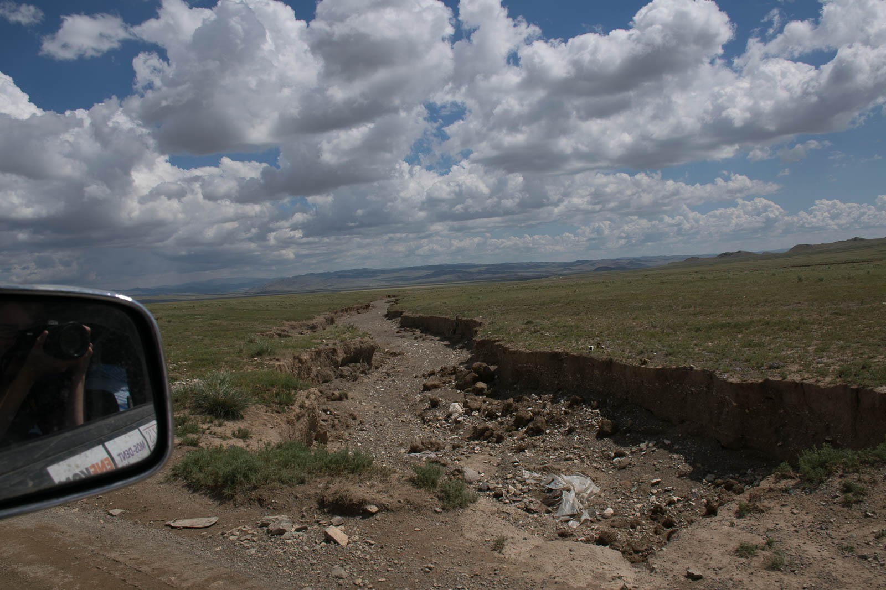
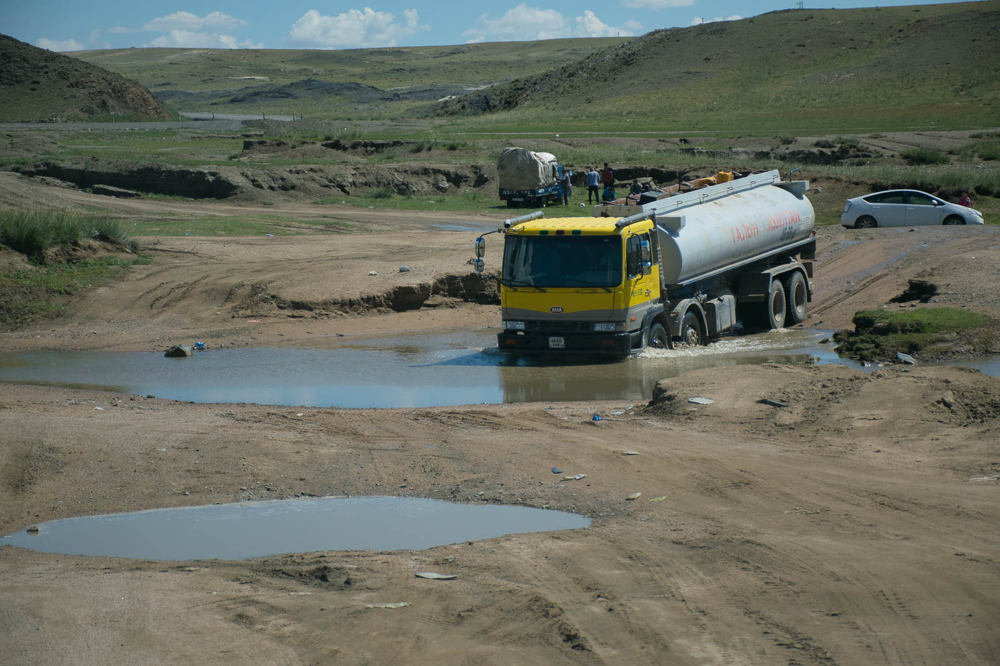
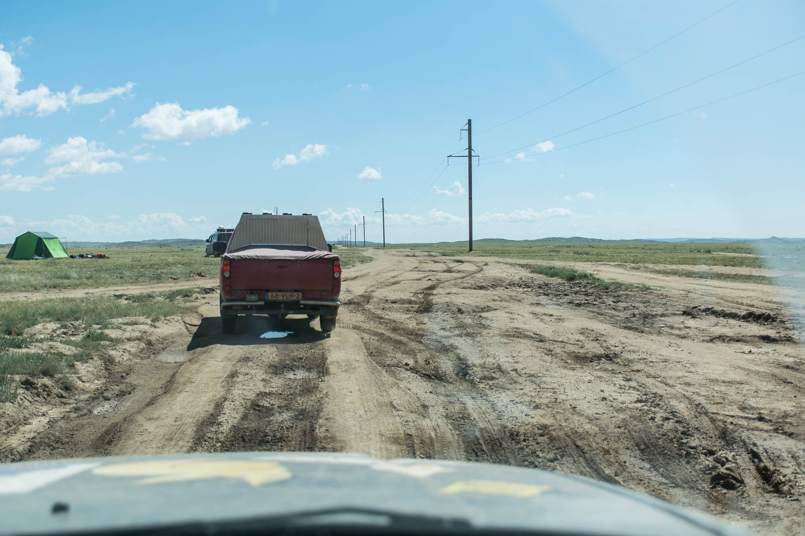
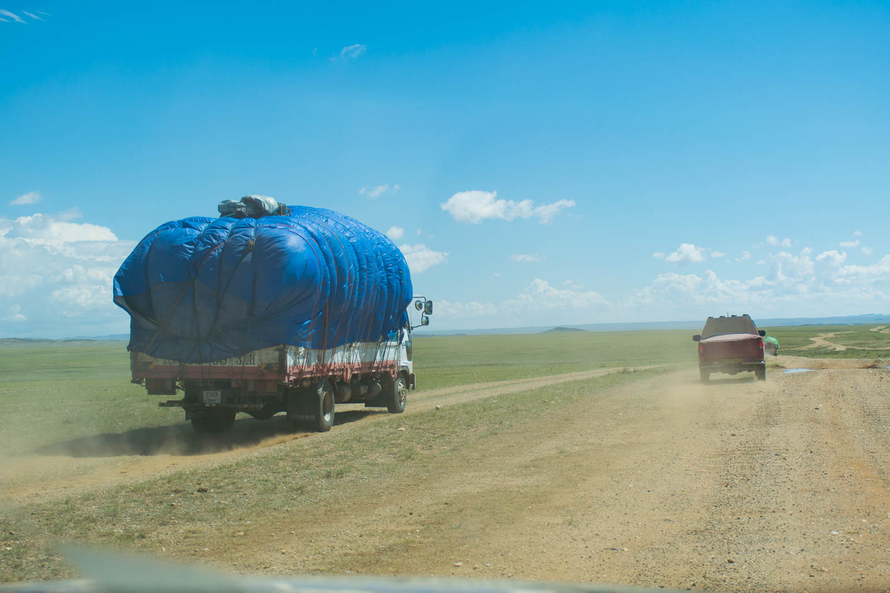
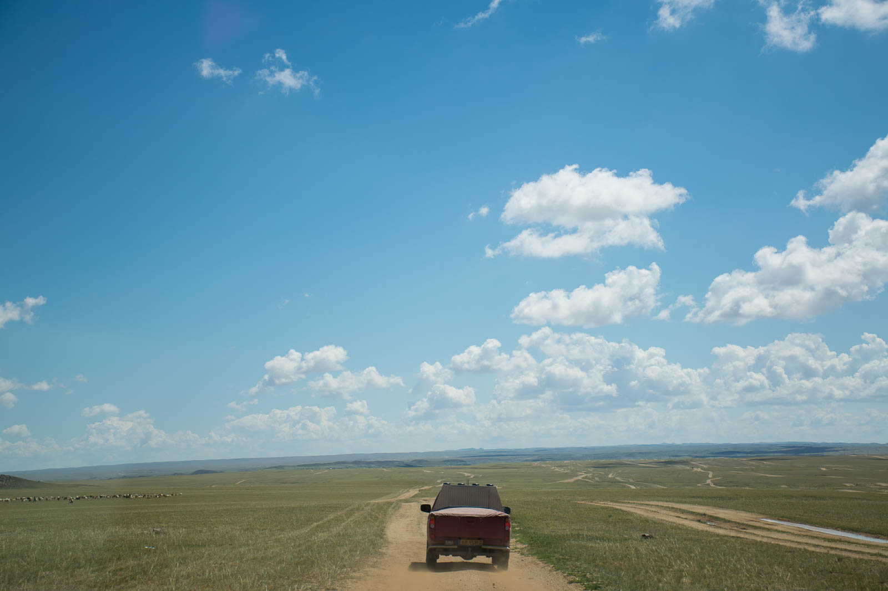
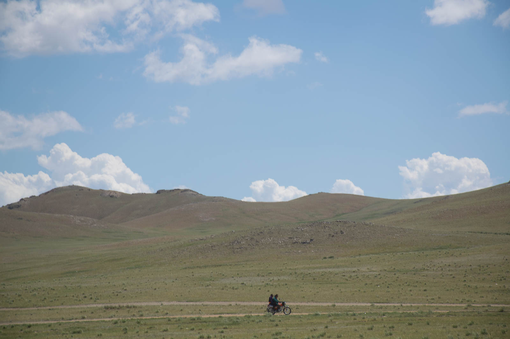
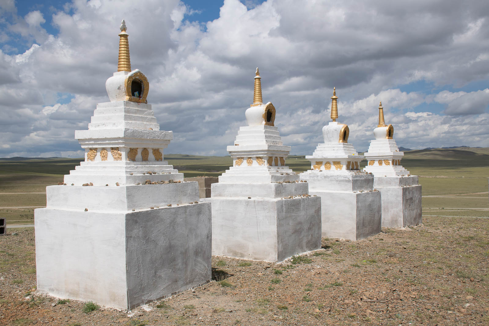

Wow, no mosquitoes, no flies. Not a single buzz around, for the first time. We are too high, we should thought of that sooner. Katja is sick, seriously - we are on painkillers, sleeping and throwing up. It is very hard to be in the car in this heat (we cover our legs not to get sunburned), shaking like Blue Tornado rollercoaster from Gardaland. The Netherlands are constantly asking about her and offering her own drugstore - we are loaded with medicines. Soon, she fell asleep once more, inside every pillow we posses and wearing every cloth she has. And we are rushing ahead, doing that unbelievable mountain stage. Incredible, me and Hugo have smiles across our faces, great road and huge altitude differences on a minute basis. We reach for Altay and hit the common practice. Diesel, drinking water, chocolate, trashes and move on.

In that order and then we continue along the main road. This time for a change, it really was the main road and we soon reach last city before Bayankhongor, our next stop. A? Just kidding, of course we missed the road somewhere along the way, because we were filming some true footage and were driving too fast. Only us, three gers in the distance and Katja with terrible pain in her stomach. To get of this plateau is of course, totally different thing. Every path leads into a dead ends or into dried, sandy river channels. We give up, once, twice, three times.

Then we decide and simply return the way we came. We see the fox (or steepe wolf) caching the prey, and some beautiful birds. We camp along the road, after we found it. And look, can you guess what's next? Mosquitoes, again. It was clear that they are looking for shelter before incoming storm, coming from the west.

We eat together (mosquitoes and us) and decide that we will sleep in the car today as well. Matej gets caught in the rain while securing and tightening the trunk and he gets his second shower, this time, a desert one. Hugo and Yamina has their camping chairs wet, but we don't. :) We watch movie inside the car and fall asleep listening the rain falling on the windscreen. In the desert. Level of romantic, 9000. Well, Katja wound not agree; her stomach still troubles her.
