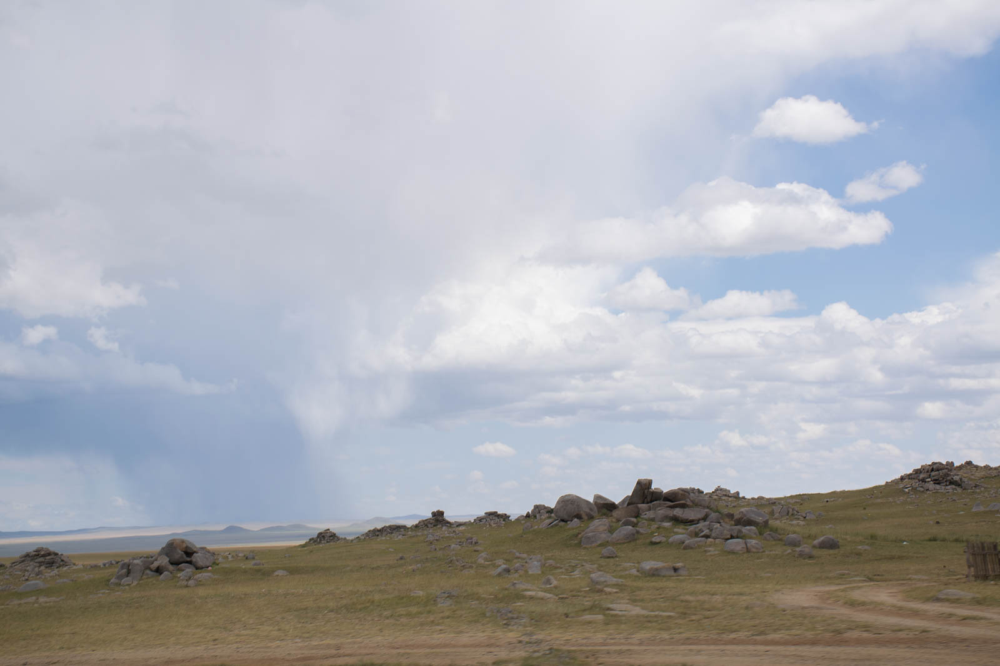
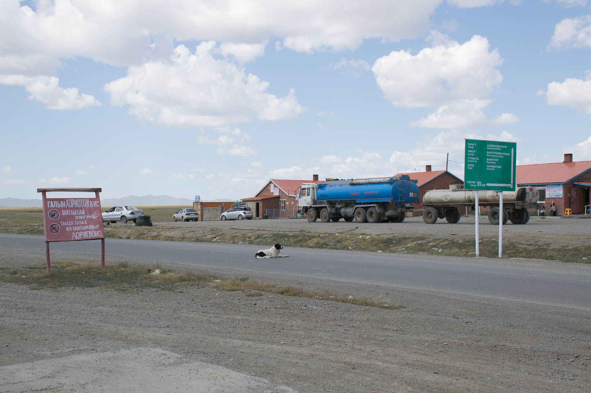
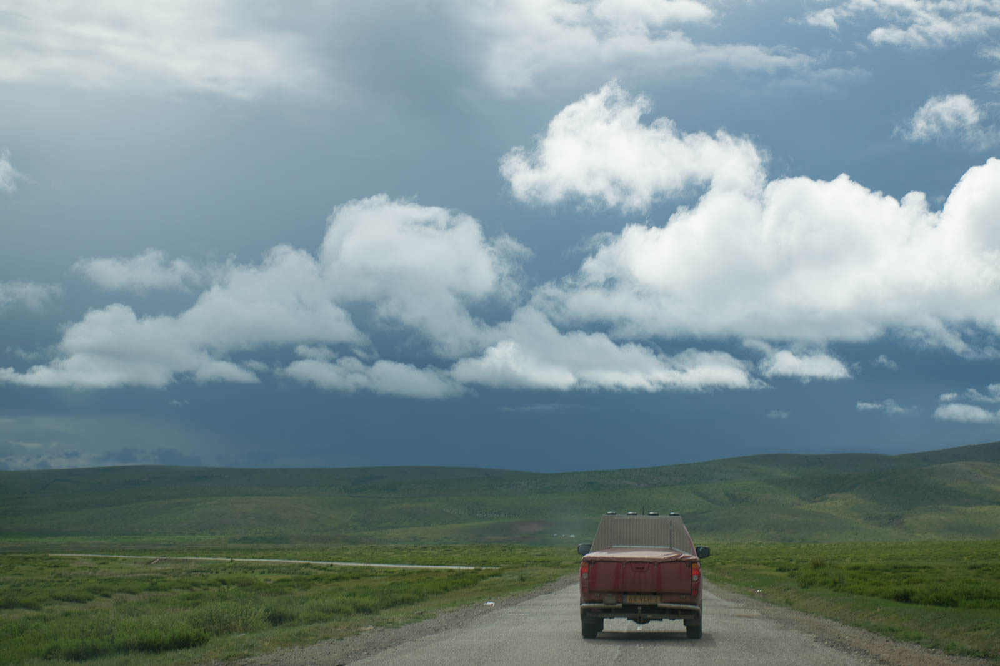
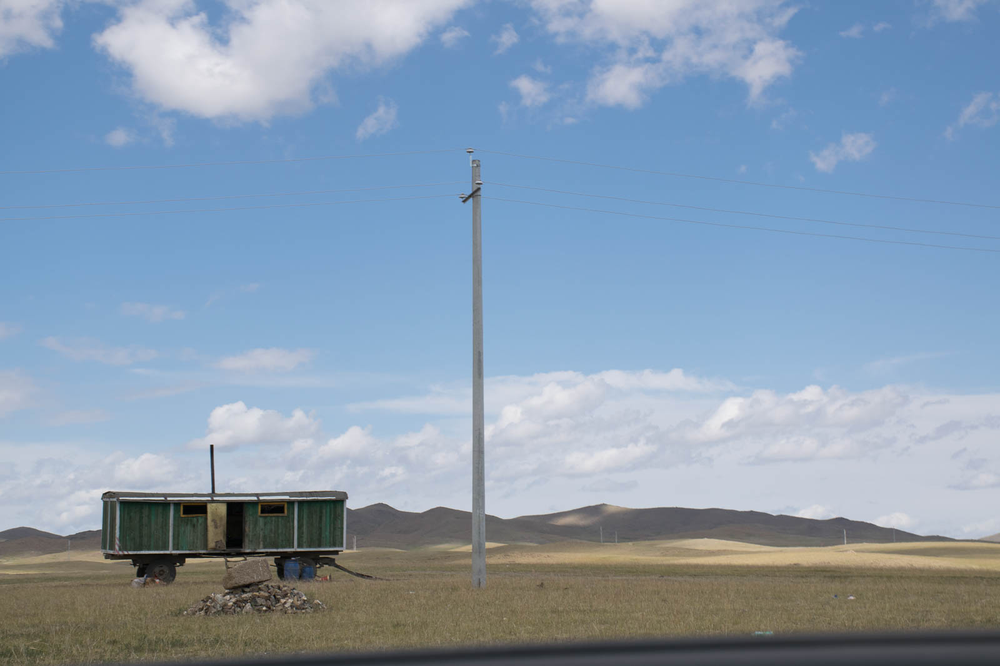

Travelling in a group (considered as multiple car convoy travelling) is a big relief when it comes to troubles, because you know you have a familiar pair of hand available and that you don't need to wait whole day for someone to stop for you or tow you to the next garage. And because of that fact, we give ourselves one more gift. More offroad.

We leave Taragta and wide-awake jumps over holes in the road. Matej is leading again and after a while, there is no Fried Tomato in the review mirror. We drive for a few minutes and then turn around. We fould Hugo laying underneath the car - that can't be a good sign. Luckily, first assumptions that Mitshubishi's transmittion is dead are not true, so we drive slowly towards Arveikheer.

We examine the car at abandoned gas station and find a broken rear suspention - one leaf is broken, but car is still driveable. It's making a lot of noise though. We pay a visit to four different garages where we are rejected because they don't have appropriate part. And because Hugo and Yamina leave Central Asia in couple of days, and we are desperate to see the south of the county, we thought that we will splitt here. But you can't leave when your friend is in trouble, so we decide that we will drive to Ulaan-Baatar with them as their wingmans, and will be southbound then.

Road is not that bad, but we can't do more than 60 km/h. The Slow makes it is famous slovene proverb, so we decide we will pay a visit to Khar Khorin, ex mongolian capital from Mongolian Empire. It's just extra 75 kilometers, that can't hurt. Well, it can actually. We are greeted with road between holes, not with holes on the road. We need almost three hours to reach that famous city.

It's getting dark, so we find a ger camp, because we would like to try it. Owner of the camp is a great sumo winner and there are photographs everywhere you lay your foot, also in the restaurant, attached to the camp. Main chef is in Ulaan Baatar, so we are served with traditional dishes by his deputy and man, it was good.

When we decide it's time to go to sleep, Katja does the biggest mistake possible - she turns on the light inside ger and spiders arrive from underneath the beds. Nooooo! We are staying in the car so we basically park outside the ger camp and sleep in the car, guarded by wild dogs.
