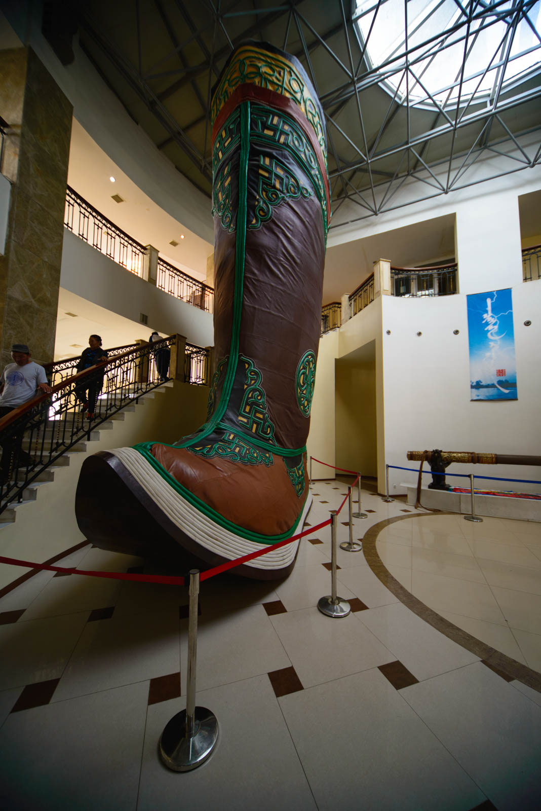

After succesfully conquering Breakfast for Champions, we get our cameras out and decide that today, we travel in one car. Mitshubishi will have a day off and we will drive in our Ford. We have to tidy our backseats for the first time since Ljubljana. Looks like ages ago we done that before launch of our expedition, already well over charted 13.000 kilometers.

Our first target for today is Chinggis Khan statue. Statue is located 40 kilometers out of Ulaan, between Nalaikh and Erdene settlements (of course we have to ask locals for the way, the road is not marked at all and we would take wrong exit at the only crossroad in the area. Well, you can't technically miss the statue, because it is 40 metres tall, silver man on horse. It's place is at the right spot where Chinggis found The Golden Whip, that means where he founded The Great Mongol Empire. There is a small museum inside, the biggest shoe on the World (it made it into the Guinness World Records book) and you can go up to the observation deck atop horses head. Panorama is nothing special and they are maintaining this only 6-years old structure that poor. Everything is bruised, dirty and broken.

 Footsize: 12000.

We drive back to Ulaan and then head south towards Mother Rock (Eej Khad). Mother Rock is basically... a rock, in humanoid form that sybolize ferility and female body shape. Well, shape from the time, when 100kg for 150cm of hieght was something normal. Everything is ok, but this rock is laying 60km south of Ulaan Baatar and we lost ourselves twice. Terrible roads. And when we finally reached our destination, we were even more shocked. We were standing there, our mouths wide open. Women were standing in line to touch The Mother, bringing gifts to this sacrifical table (everything rotted there). Males, however, are throwing vodka in the wall nearby. And there is horse milk everywhere. Bljak, fuuuuj. Whole place stinks but if you want to see it, then you need to see it. We were there, but that is where we draw the line.

Yesterday we returned to Ulaan and figured out that Mitshubishi had another accident. There was a leakage in the fuel pipes and there was quite a spillage underneath the car. Lucky enough we went with one car today and we are only two kilometers away from GO-HELP. We say farewell, because Hugo and Yamina are travelling to Beijing in two days taking the Trans-Mongolian railways. We try to find an ATM and that procedure take us another hour.

 Yamina in Hugo - Fried Tomato Team

We eat the best pizza in our lives and start our journey south. We get half across the city and fall into the traffic again. After few minutes we gave up and find a hotel. So much about a head-start.
