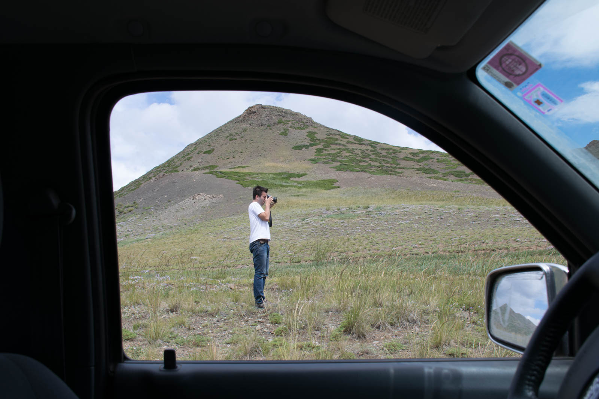
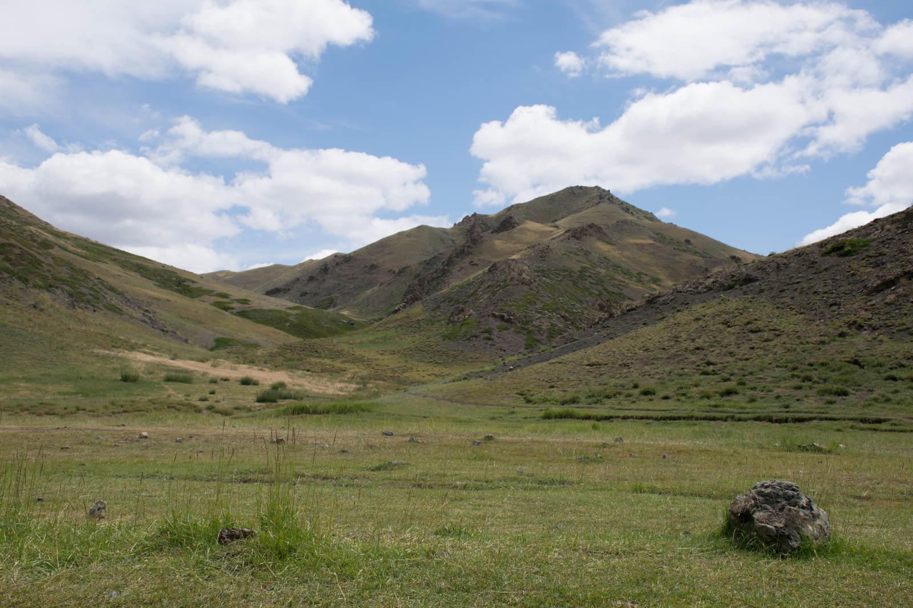
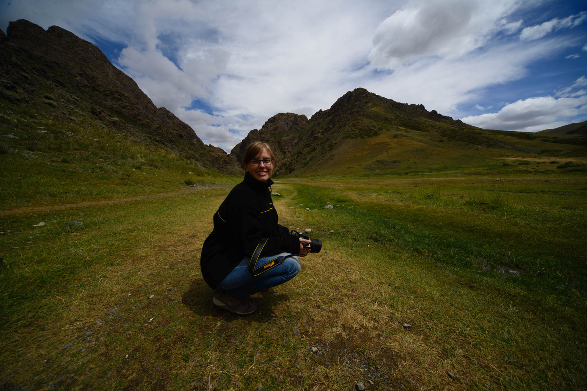

It is a promising sunny day, when we wake up and we found out that we were witnessing the heaviest rain they haven't had in ages. Dalandzadgad is half flooded, some houses are still full of water and finding decent road turns out to be quite challenging. We drive across fields and then find a sign that covers the area of 500 kilometers around Dalandzadgad. It's the only sign in the area. That event is followed by a open-air breakfast. Yes, we eat a lot.

There is a small mountain range, that divides sandy part from more gravel-one and makes living in Dalandzadgad even possible. When you go on the other side, you have to travel through Yolin Am valley. The road is windy and you drive along and inside the stream. There is a small glacier at the end, but we didn't reach it. It's supposed to be there. NOTE that this is 4x4 track only and that there is a very narrow passage at the very end of the valley, maybe 2,2metres wide so no 4x4 trucks, normal jeep can go through.

 The narrowest passage in the valley - Our recommendation.

And when you leave the valley, you are in the open again. Few hills in the distance and emptiness all around you, as you would walk into a different planet. We head west and meet a russian couple from Moscow that is travelling with their son. We exchange stories from yesterday and information about the road. We don't flat tires on purpose, so we are struggeling while driving through empty river crossings. That allows us to have a higher speed on gravel roads, but we are slower in the sand. Compromises on every second.

We notice first sand dunes ahead of us, right in the middle of the steepe. And there are more of them, they are becoming higher and higher. Desert is very interesting, because you can still see across it and take a look at the mountains behind. Their peaks are covered in snow. Green grass, sand dunes and snow at one place. Incredible.

We reach our desired camping spot, but soon decide that we will go and camp on our own. We walk to the river and find out it's almost dry. We set our camp 150 meters away from official ger-camp and stars came up. A high pregnant camel strolls pass our spot on her way to the river. We hear her crying in the night.

