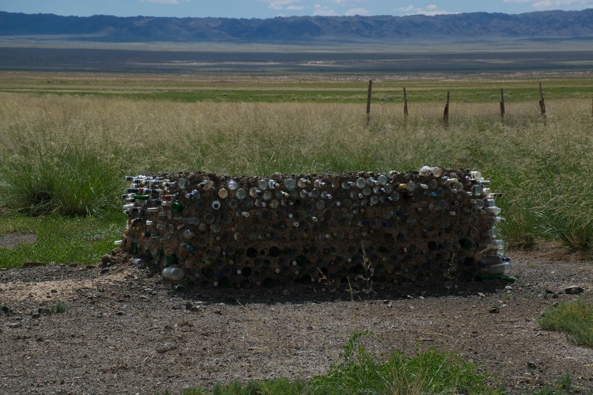
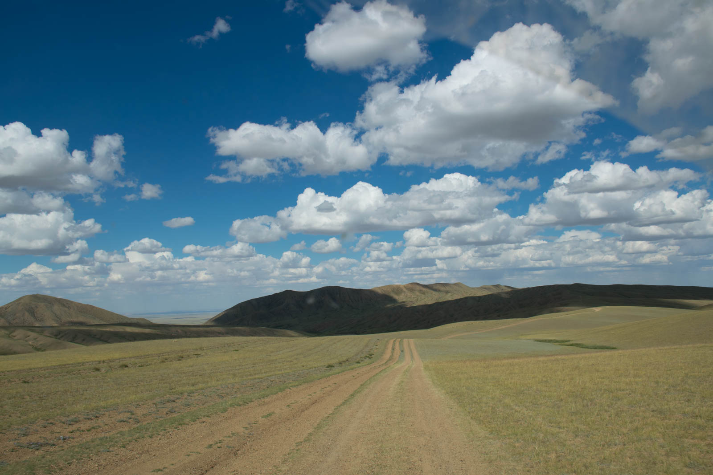
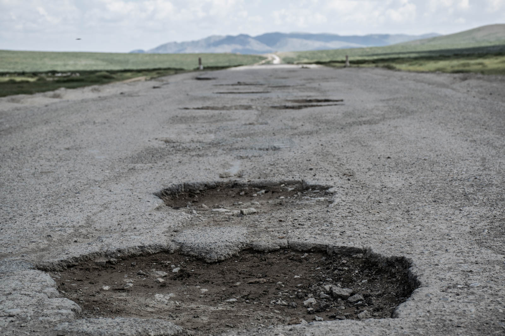

If you are in Mongolia and you're driving south - sooner or later you will have to drive back north. We decide to take the same road back, because it is the best road in the area. When we returned we noticed that Mongol road workers extended tarmac road by ten kilometers in mere two days. Drive to Mandalgovi is based on on- and off-road sections and Matej is getting better in drifting with the car. We are practicing the most valuable skill you can have - how to avoid potholes.

We stop for few times - there is The rule of the desert: Stop everyone you meet and could be in the trouble. There are couple of motorbikers, but we cannot help there, but you can at least offer them water or something. We are not much of a help, but we can see how they appreciate the gestures. We meet Russians that just changed the tire and we fill the tank with slovene gas we drove for 15000 kilometers. Our supplies in the back are running fast. Katja takes the wheel from Mandalgovi to Ulaan Baatar, and there we switch again. Note that Ulaan develops so fast they are building new airport 30km out of the city because city almost consumed currently working airport. There is a lot of construction and there is white smoke from gravel roads everywhere. 

We still have five days of our travel ahead of us, so we decide we will take a quick glance at the north of Mongolia. There is a festival we might catch near Darkhama. We drive out of Ulaan Baatar and climb the hill, light the fire and eat our midnight dinner.
