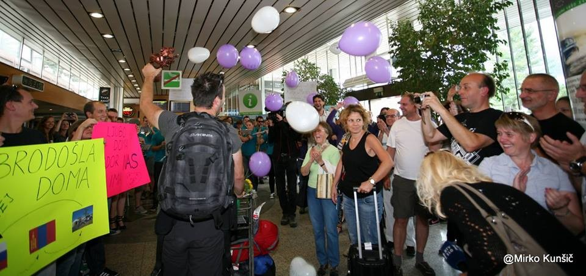
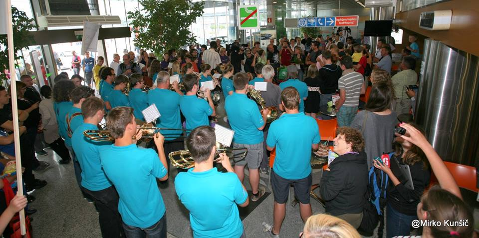
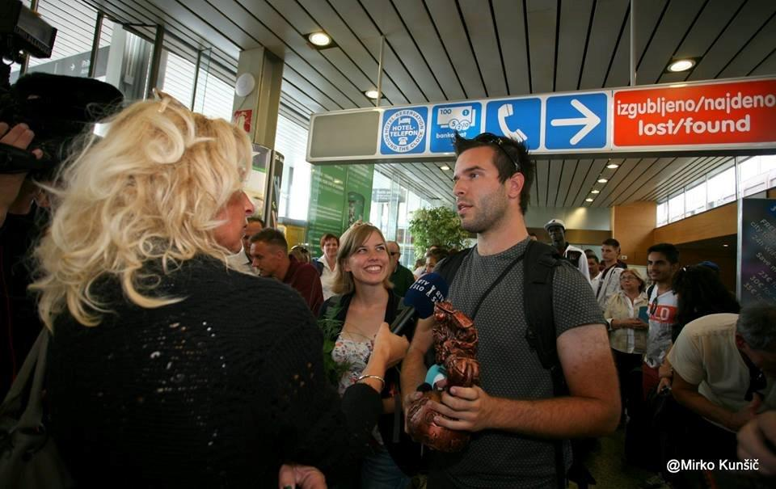

We fly to Slovenia and safely landed. It was real to expect that someone would come to greet us. We are expecting 20-30 people, because we landed in the middle of the afternoon. But, there is crowd waiting for us, our family, friends, photographers, sponsors, even national TV showed up. And wind orchestra from Tržič and Katja's choir Carmen Manet, baloons and flyers everywhere.  We are so happy that we will never forget this day. Everything came together perfectly, we came back safe and sound, we won personally and professionaly. We take few interviews and then we move to Aerodrom Ljubljana's conference room, where we report from last couple of days.  And then, to have lunch with our close family. Then, home, to take multiple showers and back in our own bed.. Mongolia is beautiful, but home is home. 

We would like to thank everyone who participated in this project in any way, to make it happen. You rock and we love you. Thank you for your hearts.

And also, thank you for bearing with us, reading us.

We are Katja and Matej, and this was our year.
