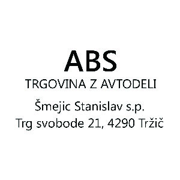
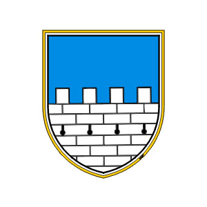

## 

## O odpravi

Ekipa FENNECteam je prva slovenska odprava, ki se udeležuje dobrodelne odprave Mongol Charity Rally.

Gre za dobrodelno odpravo, pod okriljem organizacije GO-HELP. Glavni cilj je prepeljati vozilo v Ulaanbaatar, ki je nato dodeljeno različnim organizacijam. Navadno gre za bolnice, gasilske domove, pošto ali kot poseben dar mestu oziroma vasi za prevoz otrok v šolo. Za te organizacije se zbirajo tudi finančna sredstva.

Letos, že enajstič, se na pot odpravlja okrog 150 ekip, po različno začrtanih poteh, a s skupnim ciljem – varno prispeti v glavno mesto Mogolije, Ulaanbaatar. Pred nami je 13.000 kilometrov, obisk 10 držav, prečkanje treh puščav in petih gorovij. Posledično zamenjanih kar nekaj pnevmatik.

Verjamemo v dobro v ljudeh, zato verjamemo v ta projekt, ki je eden tistih, na srčni strani.

Spremljaj priprave, pot in bodi del projekta tudi ti.

### KONTAKT
Telefon : 00386 (0)41 264 960  
Email : gremovmongolijo@gmail.com  
WWW : gremovmongolijo.com  
Twitter : FENNECteam  
Facebook : gremovmongolijo  

### PODATKI PRAVNE OSEBE
Humanitarno društvo Gremo v Mongolijo  
Kukovniška pot 5  
4290 Tržič  
Slovenija  
  
MŠ: 4063805000  
DŠ: 82689466  
  
Račun SI56 0700 0000 2094 223  

### EKIPA
Ekipo FENNECteam zaenkrat sestavljava dva člana, Katja Kern in Matej Meglič.

### PREDVIDENA POT
Iz Slovenije krenemo čez Hrvaško in Srbijo do Sofie (Bulgarija) se bomo prepeljali hitro, plan je doseči Istanbul (Turčija) v prvem ali drugem dnevu potovanja (1.500  km poti). Sledi Ankara (400 km), nato pa na sever države do Črnega morja (Samsun) in v Gruzijo (Mesto Batumi, 940 km). Naslednja postaja je glavno mesto Tbilisi (370 km). Od Tbilisija do glavnega mesta Azerbajdžana, Baku, je 550 km. Naslednja postaja, trajekt Baku – Aktau (Kazakhstan), sledi vožnja po bivšem Aralskem morju (2.200 km čez mesta Oktyabrsk, Aralsk in Kuzulorda). Naslednja postaja je Tashkent, Uzbekistan (možno potovanje čez ves Kazakhstan  ali vstop v Uzbekistan na severo-zahodu in vožnja ob Turkmenski meji (2.000 km)). Od Tashkenta nadaljujemo nazaj v Kazakhstan (multiple-viza ni problem, dogovor s podjetjem IskraCom) v mesto Almaty (900 km) nato do glavnega mesta na severu države, Astane (1.200 km). Sledi mesto Pavlodar (450 km) in nato prehod v Rusijo do Gorno-Altaysk (620 km), nato ob gorovju Altaj do končnega cilja, prestolnice Ulaanbataar (2.200 km).

### PREVOŽENA POT
Iz Slovenije sva krenila proti Madžarski, nato pa čez Slovaško do Belorusije. Na jugu nadaljujeva na vzhod in vstopiva v Rusijo, kjer sva zasledovala Trans-Sibirsko železnico preko Moskve, Nižnjega Novgoroda, preko Perma do Ekaterinburga. Od tam nadaljujeva na jug mimo Čeljabinska, preko Troitska vstopiva v Kazahstan, kjer ponovno potujeva na vzhod do Astane in nato proti Almatyju. Narediva hiter obhod severnega Kirgizijstana in se vrneva v Almato. V Rusijo se vrneva po vzhodnih cestah Kazahstana in obideva Semey, Barnaul in Gorno-Altaysko regijo, kjer na Tašanti vstopiva v Mongolijo. Od tam naprej po južni cesti vse do Ulaan-Bataarja, kamor prispeva teden dni pred rokom, zato obiščeva še južne sipine Khar-Khorina ter severne doline. Vrneva se v UB in uspešno predava avtomobil, ter se z letalom preko Kirgizije in Turčije (Istanbul) vrneva v Ljubljano.

### DAN D
Naše potovanje se bo začelo 10. julija 2014.

### ORGANIZACIJA GO-HELP
GO-HELP je britanska dobrodelna organizacija, ki se trudi izboljšati dostopnost izobrazbe in zdravstva, lokalnim skupnostim v osrčje Azije. Temeljni cilji so:

omogočiti dostop do osnovnega zdravstvenega varstva z zagotavljanjem, distribucijo in vzdrževanjem reševalnih vozil,
omogočiti izobraževanje in s štipendijami, ter novimi zaposlitvenimi možnostmi spodbujati nadarjene učence,
spodbujati izobraževanje s štipendijami in ponujati več zaposlitvenih možnosti,
podpora izobraževalnim projektom,
olajšati umestitev usposobljenih prostovoljcev, z namenom krepitve zmogljivosti lokalnih skupnosti.
Pod okriljem organizacije je tudi projekt Charity Rallies v Mongolijo, Tajikistan in v Srednjo Ameriko, ki pomaga tamkajšnjim ljudem, prostovoljcem pa ponuja življenjsko izkušnjo.

Donacija vozila lokalni skupnosti zares lahko pripomore k njenemu razvoju. Lokalnemu zdravniku se kar naenkrat močno poveča domet in izboljša odzivnost, obenem pa lahko iz prvega večjega mesta pripelje bistveno več dobrin, kot prej. Enako je s pošto, v šolo pa spotoma lahko odpelje tudi vse otroke. Z ustrezno organizacijo je razlika v življenju pred/po avtomobilu brez primere.

### KAKO PODPRETI PROJEKT?
1. Običajna pot
Donacije seveda najrajši pobirava osebno, saj se s tem izognemo nepotrebnim dodatnim stroškom plačil transakcij. Vprašajte naju in naju pocukajte za rokav. – brez skrbi, vse bo transparentno, denar pa takoj nakazan na bančni račun, urejeno pa je tudi dovoljenje Upravne enote za pobiranje donacij.

2. Nakazilo na TRR
Za vse, ki se odločite podpreti ta projekt preko nakazila na TRR Humanitarnega društva Gremo v Mongolijo, je na prvi strani portala Gremo v Mongolijo prikazan pravilno izpolnjen SEPA plačilni nalog (ne pozabite na kodo CHAR, ki označuje nakazilo v dobrodelne namene, pošljite tudi vaš e-mail na donacije.gremovmongolijo@gmail.com in pripišite ime, priimek, polni naslov in znesek donacije za dvojno preverjanje, da vam lahko pošljemo izbrano simbolično nagrado). Zneski ne bodo prikazani nikjer.

3. PayPal
POMEMBNO: Prosimo, da platformo PayPal pa uporabljajte le v skrajni sili, ker zaenkrat zaračunavajo 8%+0,30 EUR na transakcijo, kar je občutno preveč glede na to, da gre za dobrodelni projekt. Delava na tem.

4. Justgiving direktno nakazilo GO-HELP
Ste eden od tistih Nejevernih Tomažev, ki pravi, da ne bo plačeval dopusta, da pa drugače je dobrodelen? Držite besedo? No, tukaj je izziv posebej za vas; vsaka ekipa mora zbrati vsaj obvezno donacijo 1000 GBP, da se sploh lahko udeleži Mongol Charity Rallyja. Prav za to priložnost smo za vas uredili Justgiving stran FENNECteam Mongolia 2014. Na tej strani prispevate sredstva in podprete neposredno organizacijo GO-HELP, gre za direktno bremenitev vaše kreditne/debetne kartice. Seveda nam vseeno pošljite e-mail z imenom, priimkom in polnim naslovom na  donacije.gremovmongolijo@gmail.com z vašimi podatki, da vam lahko pošljemo ustrezno simbolično nagrado.

V kolikor bodo po nakupu avtomobila in opreme za odpravo ostala sredstva iz Crowdfundinga, jih bova nakazala organizaciji GO-HELP.

### NE ŽELIM OMEMBE SVOJEGA IMENA, RAD PA BI SODELOVAL?
Nič lažjega, še vedno lahko sodelujemo. Ob prispevku se sicer avtomatično strinjate z omembo vašega imena na koncu projekta, a če si tega ne želite, pošljite e-mail na donacije.gremovmongolijo@gmail.com, v zadevo napišite vaše ime in priimek in zvezdico, in uporabili bomo samo prvo črko imena, ter zadnjo črko priimka, vmes pa napisali zvezdice. Zneski ne bodo prikazani.

5. Dobra beseda šteje dvojno
Grozno si želite pomagati, vendar vam trenutna situacija tega ne omogoča. Ni problema, projekt bo odprt še vsaj za 3 mesece po izvedbi, tako da imate dovolj časa. Prosimo pa vas, delite naše strani preko spletnih omrežij. Lahko nam prilepite tudi kakšno izmed dobrih misli, pošljete komentar ali e-mail. Veseli smo čisto vsega. Hvala vam za to.

### PRAVILA NAGRADNEGA CROWDFUNDINGA
#### ZASEBNIKI
Fizične osebe darujejo sredstva za sofinanciranje odprave, urejanje viz in nakup opreme ter bencina. V zameno v odvisnosti od darovanih sredstev se donatorjem pošlje zahvalo v skladu z darovanim zneskom. Fizične osebe lahko darujejo tudi stvari, ki se nahajajo na spisku potrebščin na spletni strani. Vsaka donacija se zabeleži na spletni strani s kraticami imena in priimka, z vsako donacijo pa prejmete našo večno hvaležnost.

- Do 5 EUR	Najlepša hvala za podporo, ker mislite dobro.
- 10 EUR	Pošljemo fizično fotografijo iz potovanja 10x15cm po potovanju.
- 20 EUR	Na potovanju se fotografiramo z imenom donatorja in pošljemo 10x15cm fotografijo po potovanju.
- 35 EUR	Video-frik: Na potovanju posnamemo kratek video donatorja in objavimo poseben prispevek za vas.
- 50 EUR	Umetnik: Ste fotograf, slikar ali umetnik? Ali pa boste to še postali. Na zadnji strani avtomobila bomo pripravili zbirko del, kjer bo prostor tudi za vas. Pošljete nam svoje delo v digitalni obliki, mi pa ga za vas popeljemo na potovanje vse do Mongolije.
- 100 EUR	Zlati sponzor: Posebna zahvala v najavni in odjavni špici dokumentarnega filma, omemba kot posebnega donatorja na vseh dogodkih, posebno vabilo na start, posebna objava na blogu in fotografija posebej za vas.
- 250 EUR	Prvi na zvezi: Kot donacija 100 EUR in klic iz odprave. Ekipa vas pokliče preko dogovorjenega   kanala in vam iz prve roke poroča o izkušnjah, ki so jih doživeli. Prinesemo vam tudi paketek peska iz Kazahstanskih step.
- 500 EUR	Postanite režiser odprave: Najdite zanimivost, točko, ki vam veliko pomeni, za katero bi radi,   da jo ekipa obišče in tam bomo, da se vam zahvalimo za vaše veliko srce. Točka ne sme odstopati za več kot 200km iz začrtane poti in mora biti dogovorjena pred tekmovanjem. Po   tekmovanju vam izročimo fotografijo z okvirjem, potrudimo pa se tudi, da to posebno mesto vključimo v dokumentarni film. Prinesemo vam tudi paketek peska iz mongolskih step.
- 750+ EUR	Dirigent za en dan; ekipa se posvetuje z vami o vaših željah in pričakovanjih odprave, sami si   izberete nagrado v okviru zmožnosti ekipe, pred odpravo se pripeljemo do vas in preživimo dan z vami ter vam pripravimo izlet po Sloveniji.
V kolikor imate svoje predloge ali dodatne zahteve, vam bomo več kot z veseljem prisluhnili in se po najboljših močeh potrudili najti skupni jezik v uresničevanju našega poslanstva.

#### PODJETJA
Podjetja lahko darujejo sredstva postanejo donatorji ali sponzorji projekta podobno, kot fizične osebe. Glavni delež gre za nakup in servisiranje avtomobila, prav tako za nakup nadomestnih delov. Pravne osebe lahko darujejo tudi stvari, ki so na spisku potrebščin na spletni strani. Vsaka donacija se zabeleži na spletni strani, pridobite pa tudi našo večno hvaležnost in dober glas.

- Do 50 EUR	Najlepša hvala za podporo, ker mislite dobro!  Po potovanju vam pošljemo zahvalo.
- 100 EUR	Nalepka z logotipom podjetja v velikosti max 10x20cm na stranici avtomobila in podpisana   fotografija v velikosti 20x30cm.
- 250 EUR	Nalepka z logotipom podjetja v velikosti max 10x20cm na levi in desni stranici avtomobila in   podpisana fotografija v velikosti 20x30cm.
- 500 EUR	Nalepka z logotipom podjetja v velikosti max 20x30cm na prednji strani avtomobila in podpisana fotografija v velikosti 20x30cm + posebna zahvala v najavni in odjavni špici dokumentarnega film.
- 1000 EUR	Nalepka z logotipom podjetja v velikosti max 20x30cm na stranici avtomobila in podpisana   fotografija v velikosti 20x30cm + posebno povabilo na start + posebna zahvala v najavni in odjavni špici dokumentarnega filma.
- 2000 EUR	Nalepka z logotipom podjetja v velikosti max 30x40cm na stranicah avtomobila in podpisana   fotografija z vašim logotipom in imenom v velikosti 30x40cm + objava fotografije na spletu s posebno zahvalo + posebno povabilo na start + posebna zahvala v najavni in odjavni špici dokumentarnega filma + izvedba potopisnega predavanja v vašem kraju po dogovoru.
- 3000 EUR	Vaše ime in logotip nalepimo na  vse štiri strani avtomobila in podpisana fotografija z vašim logotipom in imenom v velikosti 30x40cm + povabilo na start + posebna zahvala v najavni in odjavni špici dokumentarnega filma + predstavitev ekipe vašemu podjetju pred potovanjem.
- 5000 EUR	Ime ekipe preimenujemo v ime vašega podjetja, ime in logotip nalepimo na  vse štiri strani avtomobila in podpisana fotografija z vašim logotipom in imenom v velikosti 30x40cm + vabilo na start + posebna zahvala v najavni in odjavni špici dokumentarnega filma + predstavitev ekipe vašemu podjetju pred potovanjem.
- 7500 EUR	Generalni sponzor: Avtomobil prebarvamo v barve vašega CGPja (v kolikor je to mogoče), vaše ime in logotip nalepimo na  vse štiri strani avtomobila in podpisana fotografija z vašim logotipom in imenom v velikosti 30x40cm + vabilo na start+ posebna zahvala v najavni in odjavni špici   dokumentarnega filma + predstavitev ekipe vašemu podjetju pred potovanjem.
 

V vse pakete se vključuje tudi objava na spletni strani, na vseh komunikacijskih kanalih, napis v odjavni špici dokumentarnega filma pod rubriko »Brez vas nam ne bi uspelo«, napoved na vseh dogodkih.

V kolikor imate svoje predloge ali dodatne zahteve, vam bomo z veseljem prisluhnili in se po najboljših močeh potrudili najti skupni jezik v uresničevanju našega skupnega poslanstva.

### SPONZORIRANJE OPREME
Potrebovali bomo nekaj opreme, ki jo bomo po koncu odprave vrnili. Objavljena bo na Neskončnem spisku v posebnem razdelku, seveda pa smo prilagodljivi v prav vse strani. Pišite nam preko kontaktnega obrazca.

### NESKONČNI SPISEK
Pripravili smo vam seznam stvari, ki bi bile za nas zanimive in potrebne na potovanju. Hudomušno smo ga poimenovali Neskončni spisek. V kolikor posedujete izdelek in ga ne potrebujete, ga lahko podarite za dober namen. Pišite nam preko kontaktnega obrazca in obvestili vas bomo v zvezi z datumom predaje izdelka.

### PROMOCIJA VAŠIH IZDELKOV
Izdelujete izdelke in iščete nov način za predstavitev. Pišite nam preko kontaktnega obrazca in našli bomo skupno pot, bodisi izpostavimo vaš izdelek v enem od videov ali ga celo odpeljemo v Mongolijo*.
* Izdelek mora ustrezati določenim kriterijem.

### POKROVITELJSTVO NAKUPA VOZILA
Iščemo vse možnosti za ugoden nakup vozila. V kolikor imate/poznate možnost za skupno sodelovanje, smo odprti za vse mogoče izide. Več o pogojih vozila najdete na tej povezavi. Naše podatke najdete v sklopu Pišite nam.

### SPONZORJI

Ekipa FENNECteam deluje le&nbsp;z izbranimi partnerji, stokovnjaki različnih področij. Brez izjeme verjamemo v njihove produkte, storitve in filozofijo delovanja njihovih podjetij. Za več informacij, o zaupanja vrednih partnerjih, kliknite na spodnje povezave&nbsp;in obiščite njihove spletne strani.

&nbsp;

<a title="Potnik.si - revija za popotnike" href="http://www.potnik.si/" target="_blank">&nbsp;</a>

