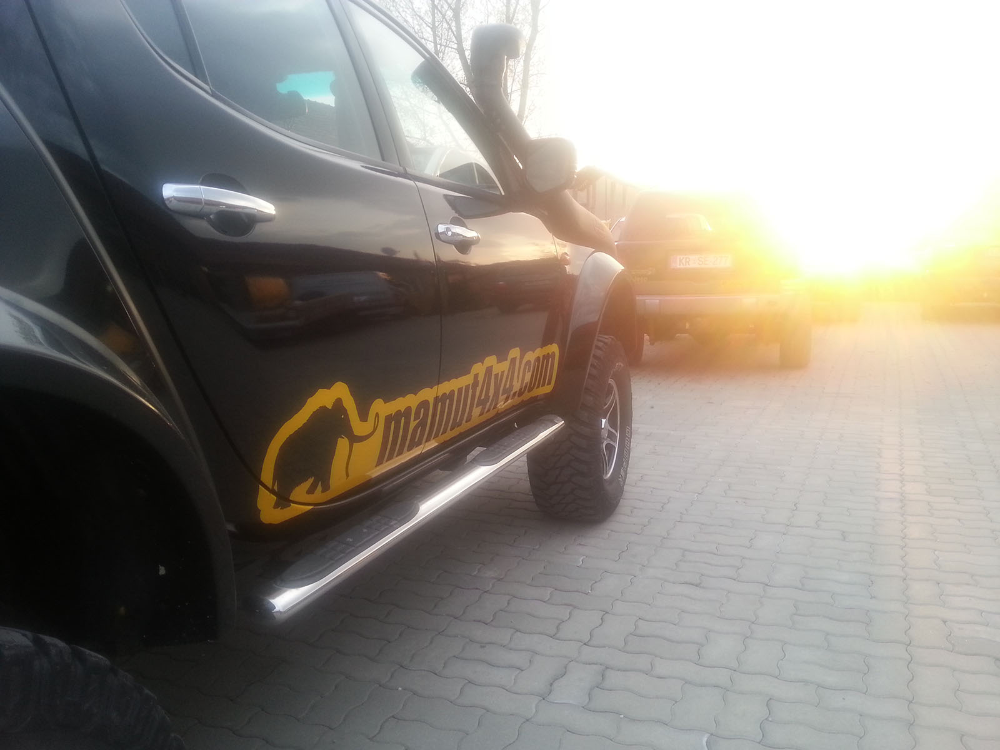

Prejšnji teden sva obiskala [Mamuta](http://www.mamut4x4.com/ "Mamut 4x4"). :)

Ja, tako je, Igor Ručman je starosta (kljub mladim letom) slovenskega rallyja, in podjetje [Mamut 4x4](http://www.mamut4x4.com/ "Mamut 4x4") se poleg prodaje specializirane opreme ukvarja še z dvigovanjem jeepov/pick-upov. Torej v času Need for speeda in 2fast2furious oni dvigajo avtomobile? :) Ha, pa da omenimo, da je bil že v Mongoliji, in da načrtuje nov podvig tja. Pa da so si za potovanja omislili monster-van? Da je potrebno s sabo vzeti 1x1mm mrežico za čez masko avtomobila, da se znebiš komarjev?

Dal nama je neverjetno veliko napotkov, kako se obnašati, kaj vzeti s sabo, na kaj paziti... In seveda k projektu pristopil zelo pozitivno.. s sponzorstvom, velikodušno. Slej ko prej se z njim srečaš, ko se podaš v vode slovenskega off-road avtomobilizma.

Najlepša hvala Igor in cela družina. Več o njihovem potovanju si lahko preberete [na tem naslovu,](http://www.mamut4x4.com/?vsebina=121&parent=10 "Mamut - zgodba - Mongolija") celotno zgodbo je spisala hčerka Špela. Zelo berljivo. Priporočam.

In Mamut 4x4, veliko sreče pri naslednji ekspediciji v Avstralijo.

