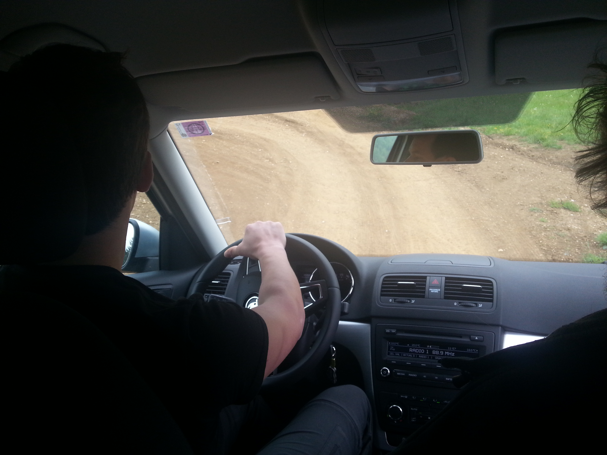
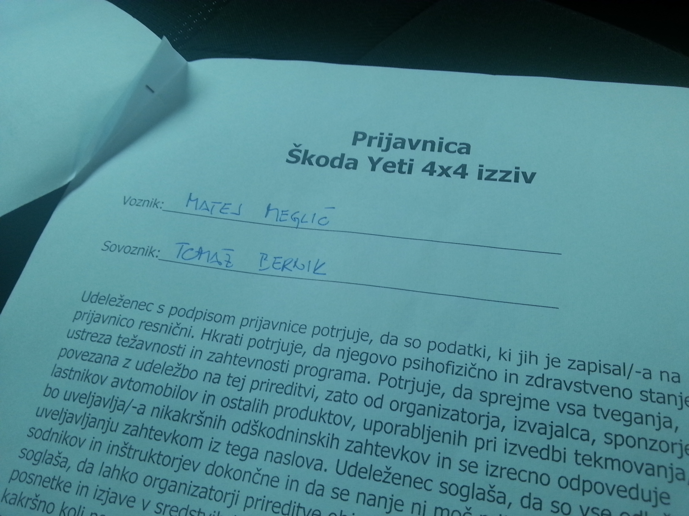
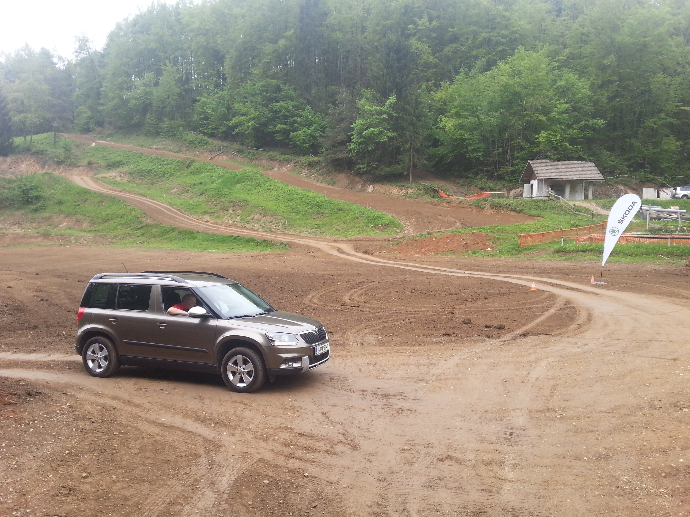

Katja je v Švici na tekmovanju s pevskim zborom [Carmen Manet](https://www.facebook.com/Carmen.manet?fref=ts "Carmen Manet"). Punce so zares dobre. Že nekaj tednov nazaj sva se prijavila na Avtomagazinov dogodek [Škoda Yeti 4x4 izziv](http://www.avto-magazin.si/novice/prijavite-se-na-skoda-4x4-izziv/?sent=True "Avtomagazin") v organizaciji našega partnerja [Mamut 4x4](mamut4x4.com/ "Mamut 4x4"). Za kopilota sem namesto Katje tako izbral kolega Tomaža Bernika in skupaj sva se odpravila v Ivančno gorico.

Izziv je potekal v štirih prvinah: 1) Vožnja po poligonu za motokros s Škodo Yeti 4x4, odlična izkušnja, ki je vključevala tudi kar nekaj strmih odsekov, pa vožnjo z zadnjim kolesom v zraku ipd. 2) Slepa vožnja: Avtomobil si moral prepeljati med stožci, ki sploh niso bili tako narazen, ter na koncu po slalomu vzvratno parkirati v boks, po brezpotju, **z zavezanimi očmi**. Ja, na glavo so mi poveznili neko masko, ki je bila povsem črna, in nimaš nobenega občutka, ali voziš ali stojiš. Zanašaš se le na povelja kopilota in Tomaž se je tu res izkazal. 3) Ocenjevanje: Sediš v avtu in na 5 metrov oceniš višino avtomobila, na 10 metrov pa širino. Postavijo ti letvico in stožce, nato pa merijo odbitek. 4) Menjava kolesa: Enostavno, vse šraufe ven, kolo se mora dotakniti tal, kolo nazaj gor in šraufe zategniti nazaj.

**Kako nama je šlo?** No, uradne rezultate še čakava, ampak s progo sva oddelala brezhibno, postavila najboljši čas med vsemi 70-timi ekipami v slepi vožnji, na ocenjevanju sva letvico postavila 1cm previsoko in stožce 8cm preveč narazen, kolo pa zamenjala v 57-tih sekundah (meniva, da sva dosegla drugi čas od vseh prijavljenih). Mogoče bo dovolj celo za veliki finale 31.5.2014 na Krvavcu, kamor se uvrsti samo 10 najboljših ekip.

Izkušnja nora, želela bi si pa še malo dežja. Igor in njegovi iz [Mamuta 4x4](mamut4x4.com/ "Mamut 4x4") so se zares izkazali.

