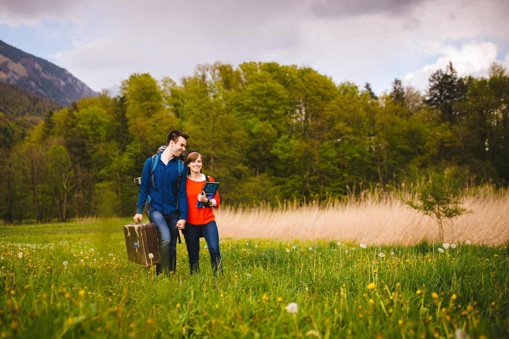
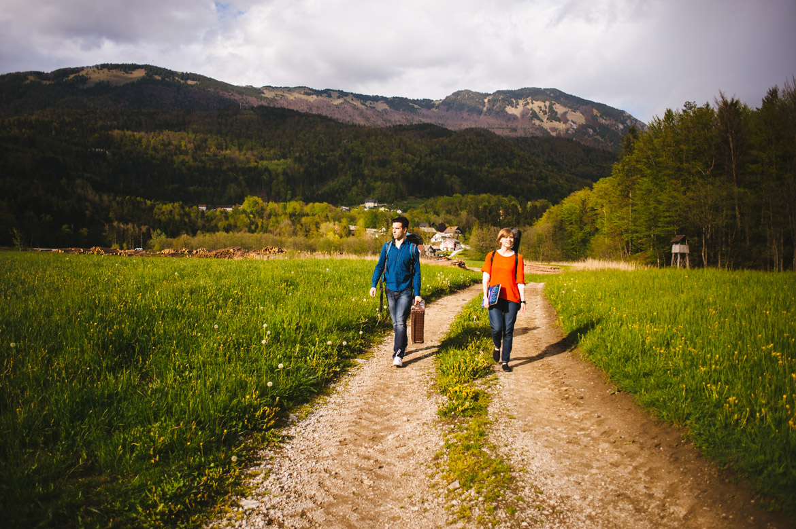
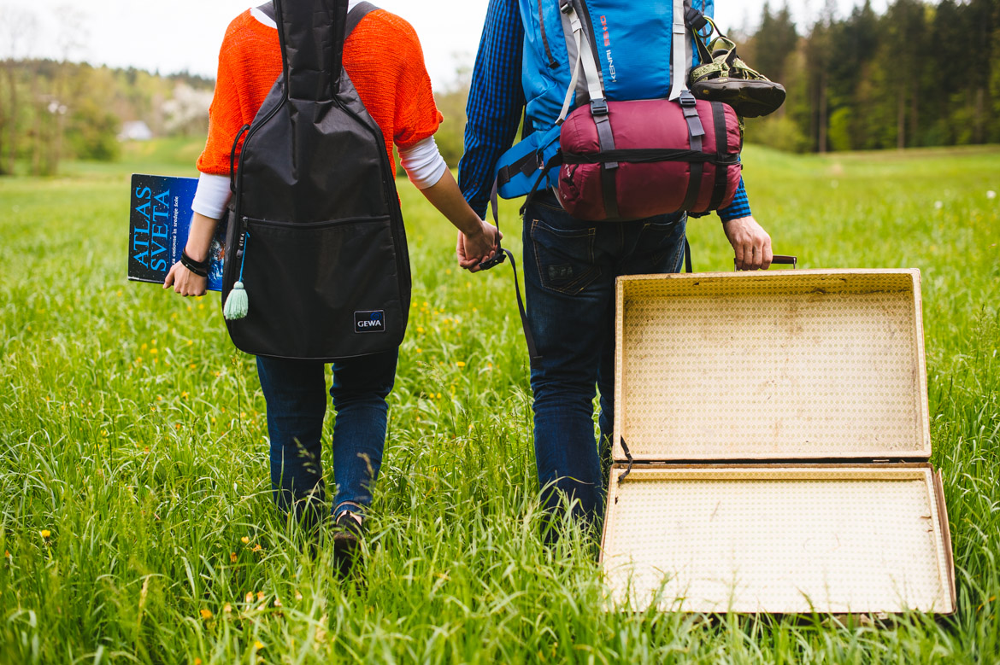

Že v začetku tedna (pred Katjinim odhodom v Švico, punce so btw zmagale na tekmovanju, v grand prix in v absolutni kategoriji - [GO CARMEN MANET](%20https://www.facebook.com/Carmen.manet?fref=ts "Carmen Manet")) sva uspela najti debelo urico in se odpraviti na fotkanje za promocijske fotografije. Hja, mediji so neizprosni, hočejo naju :P znova in znova :)). Tokrat sem namesto stojala za uslugo poprosil kolega [Jureta Pirca](http://ujeti-trenutek.com/ "Ujeti trenutek") iz podjetja [Ujeti trenutek](http://ujeti-trenutek.com/ "Ujeti trenutek"), ki se sicer specializira za fotografijo novorojenčkov in poročno fotografijo.

<iframe src="//player.vimeo.com/video/77241918" width="900" height="506" frameborder="0" allowfullscreen="allowfullscreen"></iframe>

Katja sicer ni imela niti najmanjšega pojma, da sem se z Juretom dogovoril še za fotografije, primerne za najin album in izpadle so zares dobro, [poglejte jih tu](http://poroka.ujeti-trenutek.com/katja-matej-fotografiranje-parov-golnik/ "Jure Pirc - Ujeti trenutek").

Jure ima zares čut za človeka, je topel in prijazen. Včasih je bil policist, pa je ob rojstvu hčerkice Nike zamenjal poklic, in ga izpilil do popolnosti. Lahko rečem, da gre za najboljšega fotografa novorojenčkov v Sloveniji, z dodelanim poslovnim modelom vodenja podjetja in s čutom za beleženje trenutkov na najbolj subtilen način.

Priporočam pregled njegove [spletne strani](http://ujeti-trenutek.com/ "Ujeti trenutek") in [facebooka](https://www.facebook.com/UjetiTrenutek?fref=ts "Jure Pirc - Ujeti trenutek").

