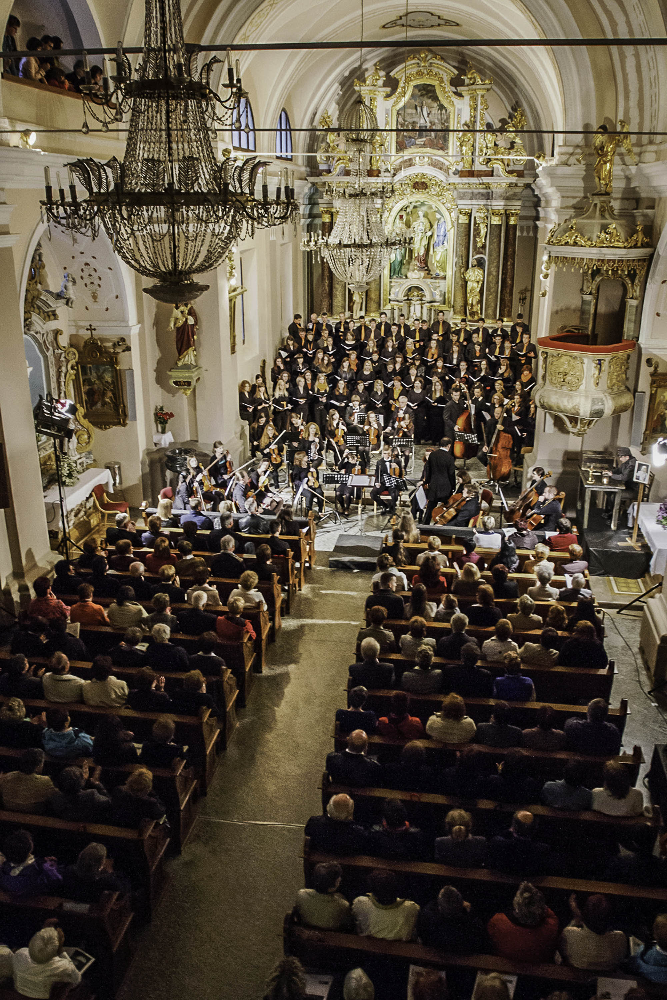

To je pa tako, ko vsi stopijo skupaj. Že decembra sva prišla na idejo, da bova organizirala dobrodelni koncert, pa so naju prepričali, da je to pa preveč dela za premalo izkupička. No, v aprilu se je v enem tistih dni, ko obračaš in klestiš stroške, ki niso "nujno potrebni" ideja potiho prikradla nazaj. Očitno ob pravem času. Rekla sva si, zakaj pa ne, in zavihala rokave, kot že toliko noči poprej.

Skorajda ne verjamem več, da je od vsega skupaj minilo zgolj 14 dni, tako dolgi so dnevi, ko spiš samo nekaj ur na dan. Kje je že registracija društva, pisanje poslovnega načrta, moja dieta, začetek vadbe in vse to. Zapostavljava spletno stran, vsaj malo. Imava kar nekaj novičk na zalogi, za vas, ker sva res veliko stavila na ta dogodek.

Vabiva vas na Koncert dobrih src, ki se bo zgodil to nedeljo, 25.5.2014 ob 19:30 v cerkvi v Adergasu (to je v občini Cerklje na Gorenjskem). Tam se bohoti prelep samostan v umirjeni vasici, obdani s prelepimi hribi in čistim zrakom, kjer vedno pojejo ptice in je trava še bolj zelena. Gospod Mirko, originalno Tržičan je že skoraj drugo desetletje preseljen v bližnjo vas. Enkrat, že nekaj let nazaj, še preden sem spoznal Katjo, mi je rekel, da je šel tja zato, ker mu je všeč kraj in tišina. Zdaj, nekaj let kasneje, ga razumem. Poleg Kašarije in Vipavskega križa je tole milina, skorajda raj. In prav tu bo zdaj koncert, na katerega tako z veseljem vabiva.

Donacije so pričakovane in lepo zaželene, saj vemo, da koncert organizirava zato, da bova zbrala dovolj sredstev za odpravo. Želiva si vsaj 5 bruseljskih enot, v zameno pa boste deležni za debelo uro in pol glasbe na najvišjem nivoju. Predlagava, da se toplo oblečete, ker je v cerkvah lahko hladno, sploh če človek sedi.

Združila sva vse, in pripravila nastop, ki se z vidika kvalitete ob bok postavlja performansom v Ljubljani in ostalih, bolj urbanih mestih. Za začetek bodo nastopile [Carmen manet](https://www.facebook.com/Carmen.manet?fref=ts "Carmen manet"), novopečene zmagovalke prestižnega 50. festivala v Montreauxu v Švici. No, zmagale so v obeh kategorijah, v katerih so nastopile. Tu poje tudi Katja, zelo sem ponosen. Nato sledi [Moški pevski zbor Davorina Jenka](www.kud-dj.si/ "MPZ Davorina Jenka"), domačini, ki ravno v teh dneh praznujejo 50-letnico obstoja, častitljivo. Pripravljajo poseben nastop, ki vključuje zvonove. Za konec pa moj predragi [godalni del Simfoničnega orkestra Cantabile](https://www.facebook.com/pages/KD-Simfoni%C4%8Dni-orkester-Cantabile/107724685976492?fref=ts "Cantabile"), ki se je za turnejo, ki se je ravnokar končala povezal z Mešanim pevskim zborom Adoramus. Ja, vadit hodim v Logatec, zato ker je sistem dela tam najboljši, orkester pa med najboljšimi amaterskimi sestavi v Sloveniji. Izvedli bomo ponosno Mašo za sončni vzhod, neverjetna igra harmonij, ki dlake postavlja pokonci in ki me navdaja s ponosom, da sem lahko kontrabasist v takem orkestru in še več. Navdaja me z občutkom, da živim.

[Povezava do facebook dogodka.](https://www.facebook.com/events/392190417590888/?ref_newsfeed_story_type=regular&source=1 "FB Event")

 vir: [http://www.kudcerkno.si/](http://www.kudcerkno.si/17-vsebina/novice/422-izjemen-uspeh-in-memoriam-v-sodelovanju-s-kud-cerkno.html)

Kaj pa to pomeni z vidika organizacije? Sledi nov prispevek. Na koncu vas vse lepo povabim v najinem imenu, NE BO VAM ŽAL.
