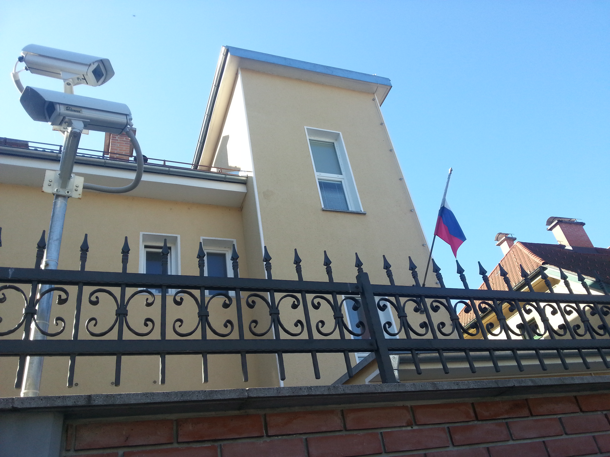
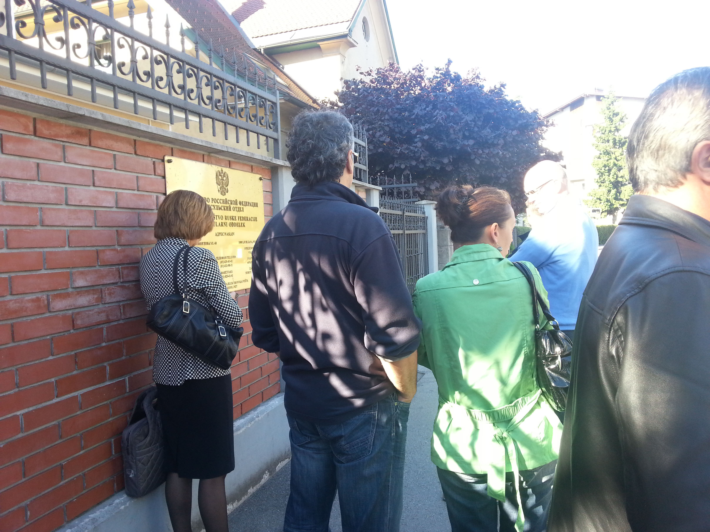
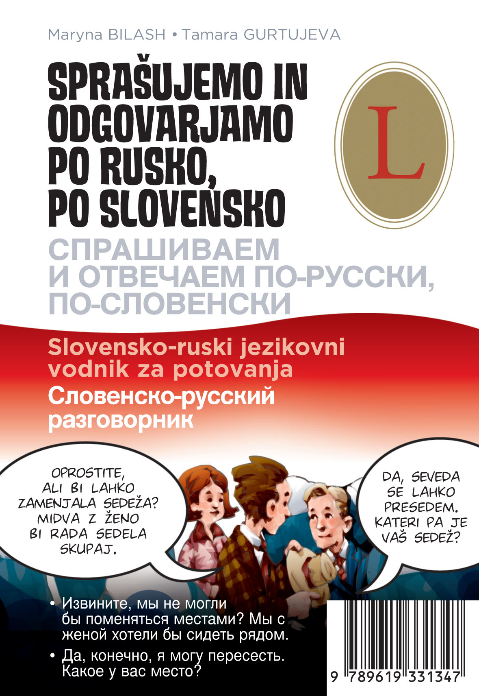
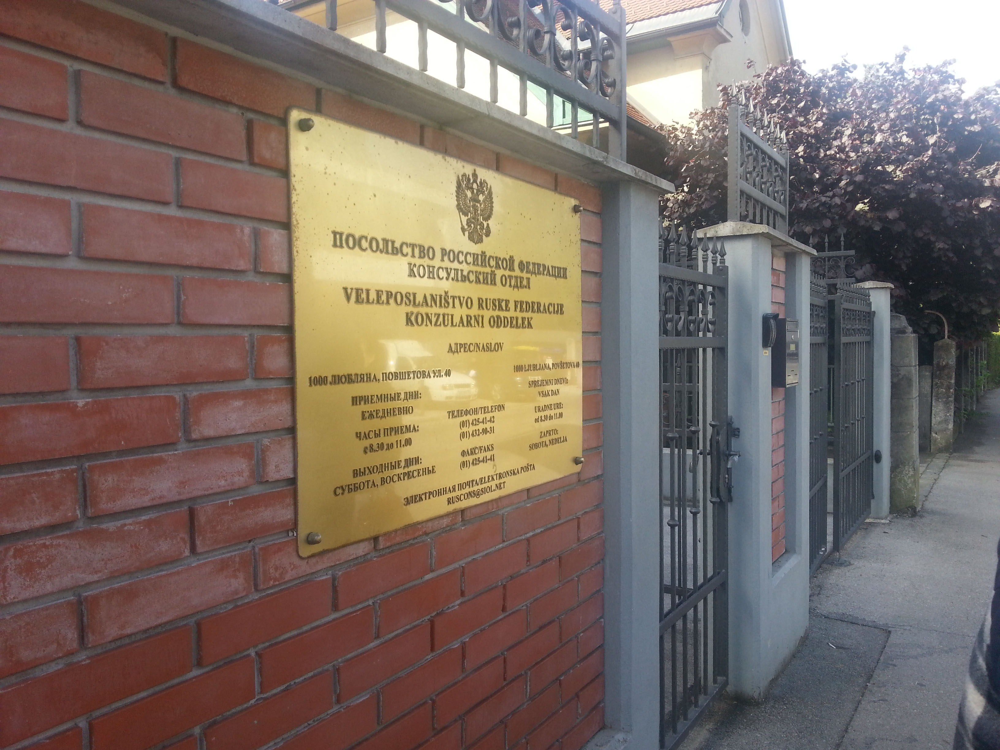

Kako pridobiti rusko vizo? No, bilo naj bi enostavno, ampak ni. Rusija ima organiziran sistem, ki je z našega vidika strog in velikokrat prestrog, preveč trd sistem. Potrebno je poznati zakonodajo in pravila, ki veljajo, in se jih strogo držati. Nama je danes uspelo oddati prošnjo za vize, tukaj pa je nekaj napotkov, ki vam utegnejo prihraniti čas:

1\. Imejte dovolj časa, ogromno bo čakanja. 2. [Na spletni strani Ruskega veleposlaništva](http://www.veleposlanistvorusije.mid.ru/) si preglejte tip vize, ki jo potrebujete in lahko dobite. Poslovno, turistično ali tranzitno vizo. Pri vsaki vizi potrebuješ: - fotografijo, - izpolnjen obrazec (napišite ga tam, ker morate za veljavnost ponastaviti robove v wordu), - pooblastilo, če vizo oddajate za nekoga drugega (lahko samo pisno) - kopijo zdravstvenega zavarovanja za čas potovanja, ki mora biti veljavno v Rusiji.

] Rusko veleposlaništvo na Povšetovi v Ljubljani.

Poslovna je namenjena ljudem, ki sklepajo posle in jo tu ne bom opisoval, je pa tako, da za izdajo potrebuješ povabilno pismo podjetja iz Rusije, za katerega delaš. Prvič lahko dobiš vizo, ki omogoča 1 vstop v treh mesecih, naslednjič 2 vstopa v 3 mesecih, nato sledi letna in po dveh letnih dvo-letna viza. Sam sem zaprosil za letno poslovno vizo. Za en ali dva vstopa mora potni list biti na ambasadi 5 delovnih dni, za letno pa 10. Cena izdelave je 35 EUR ali dvojna cena, če želiš proces pohitriti za nekaj dni.

Pri Katji pa zadeva žal ni šla tako gladko. Večni problem je, da prvič, ko potuješ v Rusijo, lahko dobiš samo vizo za enkratni vstop, midva pa potrebujeva dva vstopa. V potnem listu imaš lahko na enkrat samo eno veljavno vizo in samo vizo enega tipa, torej turistično ali tranzitno.

Turistična viza je namenjena turizmu in je načeloma enkratna ali dvokratna (dva vstopa na ozemlje Rusije), skupna veljavnost vize pa je največ 14 dni. Pri tej vizi potrebujete povabilno pismo iz TURISTIČNE agencije v Rusiji, ki vam organizira potovanje in jamči, da boste/imate plačana prenočišča v hotelih in "maršrut" ali vozni red ogledov, ki jih boste izvedli. Potni list leži vsaj 5 delovnih dni.

Tranzitna viza je omejena na 1 vhod v Rusijo in ima veljavnost do 5 dni, namenjena pa je prečkanju države. Da se jo pridobiti tudi na drugih veleposlaništvih, pri čemer so me opozorili, da v Ulaan-Baatarju je to možno, v Almaty (KAZ) pa ne, dobil direkten odgovor. Potrebujete povabilno pismo turistične agencije in/ali rezervacijo hotelov. V Ulaan-Baatarju jo lahko dobite naslednji dan, v Sloveniji pa so govorili o 5 dneh. V Almaty slovenci na turistično vizo za v Rusijo čakajo dva tedna - samo za ilustracijo.

Aha, še ena stvar. Če vam vizo zavrne iz kakršnega koli razloga, je ne morete več dobiti in ni možnosti pritožbe ali vstopa v Rusijo.

Tako oborožen s podatki sem šel 16.5. na ambasado, kjer se prošnje za vize sprejemajo med 08:30 in 11:00, pred mano pa je bila taka vrsta, da sem 3 ure stal na soncu in se smilil samemu sebi. PRIDITE VSAJ OB 08:00. Pravijo, da greš prvič vprašat, kako in kaj, in res je bilo tako. Če do 11:00 nisi v poslopju, se lahko obrneš in prideš spet naslednji dan. Za Katjo niso imeli nekega pametnega odgovora, kaj sploh storiti. Njihov odgovor je bil, da naj zamenjava pot in greva samo čez Rusijo. Glavni srž problema je namreč časovni okvir turistične vize z dvema vstopoma, saj nama v 14-tih dneh nikakor ne bo uspelo prevoziti vse Rusije in Kazakhstana.

 Gneča pred veleposlaništvom

Doma se je začelo dopisovanje z rusko turistično agencijo, ki je urejala povabilno pismo za Katjo. Seveda najprej ni bilo možno izdati takega povabilnega pisma, nato sem jim poslal natančen načrt poti, ki jo načrtujeva, na dan natančno. Po enem tednu pregovarjanja in telefonskih pogovorov sem prejel povabilno pismo za dva vstopa v treh tednih, ki sem ga danes odnesel na ambasado. Moram pohvaliti mojo zvezo Vesno za vedno veder odziv in tudi turistično agencijo Liga.

20.5.2014, k sreči spet sije sonce. Seveda spet čakanje pred poslopjem in nato še v njem, tokrat je bil pred mano en prijazen ukrajinec. Ker pa sem seveda naletel na drugega referenta, sem spet moral ponoviti vso zgodbo. Kdo sva, zakaj potujeva, zakaj v avtomobilu, kje bova, kdo nama je to odobril, da to se dogaja zares samo izjemoma ipd. Tukaj pa pride na vrsto točka 3. Pomaga, če res poznaš proces izdaje viz in če znaš vsaj malo rusko. Delam reklamo, ker jo moram - tukaj je obvezna. Pozdravite s "Zdravstvujte! Здравствуйте!" in nadaljujte z nekaj besedami polomljene ruščine, nato pa nadaljujte v slovenščini. Pomagate si lahko s slovarjem [Sprašujemo in odgovarjamo po rusko - po slovensko](http://linguarus.si/e_trgovina/knjige/48/sprasujemo_in_odgovarjamo_po_rusko_po_slovensko/) našega partnerja, podjetja [Linguarus](http://linguarus.si/e_trgovina/knjige/48/sprasujemo_in_odgovarjamo_po_rusko_po_slovensko/), ki je bil zasnovan nalašč za take situacije, prej si pogledamo fraze in zmagamo. Na zalogi v spletni trgovini ali pri naju, cena zares ugodnih 11 EUR, del od nakupa pa gre seveda v dobrodelne namene. Neprecenljivo, če se odpravljate na potovanje.

 Slovarček Sprašujemo in odgovarjamo po rusko, po slovensko.

Na koncu sem dodatno mogel povedati še registracijo vozila, model, leto izdelave in barvo, kar pa je tako ali tako standard pri vseh -Stanih. Poudarjam, tudi če greste z avtobusom, morate vedeti vse to.

 Tabla pred Rusim veleposlaništvom v Ljubljani

Zadnji nasvet, ob naslov zapišite svojo telefonsko številko, da se v primeru dodatnih vprašanj lahko obrnejo direktno na vas, takoj, brez potrebnih zamud. Cena vize je enaka poslovni, vsaj toliko sem plačal jaz. Vize dobiva v ponedeljek, nato pa v nov proces, ravno tak. Pridobitev Mongolske vize, v Berlinu. Držite pesti, dokumentacije bo še veliko.

Upam, da sva vam odstrla pogled v vse, o čemer se je potrebno podučiti za tak projekt.
