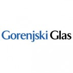
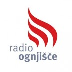
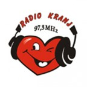
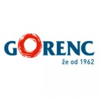

Ko se človek odloči, da bo izpeljal dobrodelni koncert (in je amater na tem področju), zagotovo ne pomisli povsem na vse stvari. Ker se sama profesionalno s tem ne ukvarjam, me je pričakalo kar nekaj presenečenj in če se kdaj sami podate v te organizacijske vode, upam, da vam bo ta objava olajšala delo in načrtovanje :) Še dobro, da imam ob strani šolanega organizatorja, ki ve kako se stvari streže in popravlja ter sem in tja misli še zame.

Ker gre za dobrodelni koncert je proračun na ničli. Zato toliko bolj ceniva in sva hvaležna vsem glasbenikom, ki so se nesebično odrekli prispevkom. Že sedaj vem, da je oziroma bo še tako velika hvala premajhna za njihova velika srca, ki jim niti oddaljenost (polovica nastopajočih je iz Logatca) ne predstavlja ovire. Na srečo, sva obkrožena z ljudmi, ki so vedno pripravljeni priskočiti na pomoč in tudi tokrat ni bilo nič drugače.

Prostor se je ponudil skoraj da sam. Ker je cerkev v Adergasu tako prostorna in akustična, je kar sama vabila, da se v njej odvije prijeten večer. Cerkev je odstopil gospod župnik Slavko Kalan in nama hkrati odvzel skrb glede parkirišč, ozvočenja in števila sedežev – čisto za vsakega se bo našel, da se bo udobno nameščen prepustil dobri glasbi.

 Cerkev v Adergasu / vir: http://www.slo-foto.net/modules/Galerija/data/media/10/512030490.jpg

Da se beseda širi kar se da daleč, smo se skupaj z najbližjimi podporniki , prelevili v poštarje in izkoristili sončne dni ter razdelili preko 2000 letakov. Tudi oglasne deske se niso izognile bližnjemu srečanju plakatov in »klamfača«. Po nekaj radijih sva se dogovorila za oglaševanje koncerta, pri dveh pa tudi za dodatno predstavitev projekta. Podporo je izkazal tudi župan občine Cerklje na Gorenjskem, gospod Franc Čebulj in uredil vse potrebno, da je vabilo na koncert dobilo svoje mesto nad prometno cesto.

Kulturni društvi (KUD Visoko in KUD Predoslje) sta razposlali elektronska vabila in poskrbeli, da za dobrodelnost izvejo tudi v okoliških krajih. Na [Facebooku smo v dogodku](https://www.facebook.com/events/392190417590888/?fref=ts "Dodogek na FB") povabili preko 2500 ljudi. V tako spodbudnem okolju je res prijetno delati.

Pomembno vlogo ima tudi vizualna podoba dobrodelnega koncerta, ki jo je zasnoval Matej in poskrbel, da so plakati dobro vidni, da se iz letakov razbere bistvo, da je koncertni list lično urejen in da se zahvalimo dosedanjim podpornikom projekta.

Delo, ki je potrebno pred velikim finalom spremlja še daljši spisek malih stvari a vseeno potrebnih za dobro izpeljan koncert. Postavitev stolov in brisanje morebitnega prahu, ureditev prostorov za nastopajoče in primerna označitev, ureditev papirologije (SAZAS), prijava dogodka na policijo, manjša pogostitev za nastopajoče, da se ne bodo domov vračali praznih želodcev, na koncu pa tudi lični škatlici, ki bosta hranili vaš dragocen prispevek.

Naredili smo vse kar je v naši moči, sedaj pa stiskamo pesti, da bo cerkev pokala po šivih in da bodo po koncu vsi, tako nastopajoči, kot poslušalci zadovoljni od narejenem dobrem delu.

V drugi objavi po koncertu, pa nekaj več o SAZAS-u, odločitvi med vstopnicami ali prostovoljnim prispevkom in morebitnimi izboljšavami . :)

Medijski sponzorji koncerta:  

