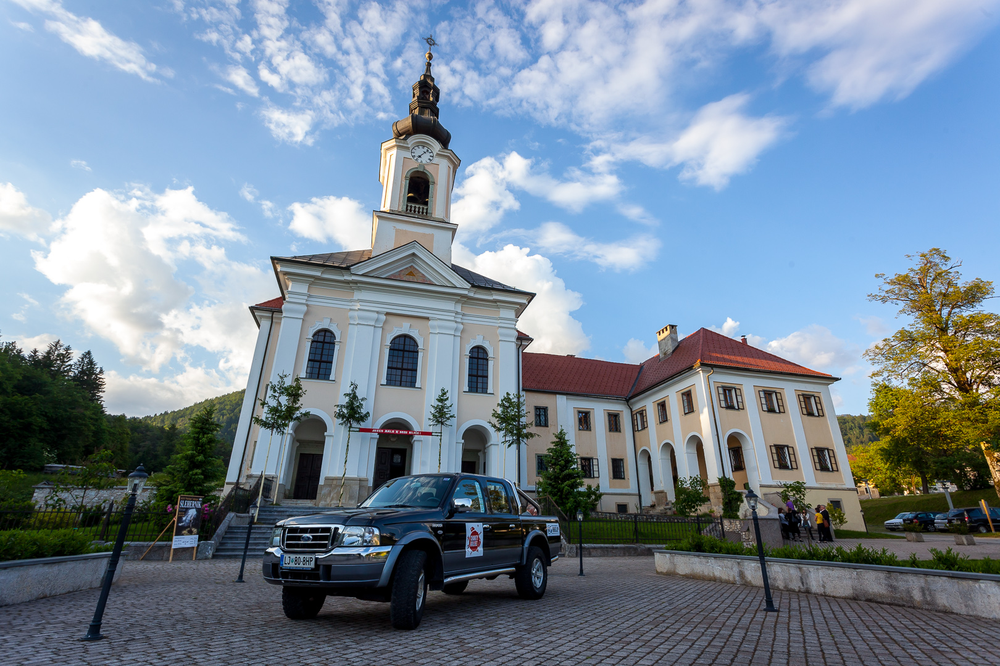

Avto se je v nedeljskem popoldnevu lesketal v soncu in se pripravljal na razkazovanje pred dobrodelnim koncertom. Dolgo poliranje se je izplačalo. :) Kmalu so prišli vsi nastopajoči in že na generalki se je čutilo super energijo, ki je napovedovala enkraten večer. Seveda so bile prisotne manjše tehnične težave in trema, vendar je to že na poti v pozabo. Koncert je bil super, okrog 200 poslušalcev je poslušalo 106 glasbenikov, kar je dobro razmerje. Prek 300 src se je za uro in pol združilo v eno bitje. Glasba je najčudovitejša umetnost, je moto dirigenta, Marjana Grdadolnika, in naj pri tem tudi ostane.

Dobrodelni koncert je uspel, cerkev v Adergasu je bila polna srčnih ljudi in dobre glasbe. Skupaj smo zbrali 1105,15 EUR!

In količina izrečenih zahval nikoli ne bo dovolj velika, da bi vedeli kako zelo ceniva ves vaš čas in trud. HVALA vsem za tako veliko podporo.

 

Posebna zahvalna lista:

[Simfonični orkester Cantabile](http://www.cantabile.si/ "Cantabile Symphony orchestra"), [Mešani pevski zbor Adoramus](http://www.adoramus.si/index.php/meani-zbor "MePZ Adoramus"), Moški pevski zbor Davorina Jenka, [Carmen manet](https://www.facebook.com/Carmen.manet "Carmen manet"), Župan občine Cerklje na Gorenjskem, g. Franc Čebulj za poslušanje najinih želja in posluh za najin projekt, Občina Cerklje na Gorenjskem in TIC Cerklje za možnost oglaševanja dogodka, Martina Lah iz Radia Sora za poseben angažma, Radio Gorenjc, Radio Kranj, Radio Ognjišče za intervjuje, Gorenjski Glas in g. Samo Lesjak za vse objave in napovedi v vašem časopisu, [Prevozi Oblak](http://www.prevozioblak.si/ "Prevozi Oblak") za varen prevoz naših gostov iz Logatca, [Gostilnica in pizzerija Pod Jenkovo Lipo](http://www.podjenkovolipo.si/ "Pod Jenkovo Lipo"), ki je poskrbela za pogostitev nastopajočih po koncu koncerta, KUD Visoko za brezžične mikrofone, Ksaver Šinkar in Vili Vogelnik za fotografiranje dogodka, Župnik Slavko Kalan in Dragica Radojevič za prostor, namestitev, pijače, še vroče rogljičke in kavo, Ciril in Vida Kern za moralno podporo, za vse priprave, za umivanje in poliranje avtomobila, za likanje srajc in še kaj... in vse to z nasmehom, Julija Kern, Tjaša Kern, Emil Buh, Luka Meglič in Neža Štumberger za poštne usluge razdeljevanja več kot 2000 povabil, za zvočni inženiring, podporo...  Ker ste bili tu. Ves čas. In NAJLEPŠA HVALA vsem vam, ki ste prišli in podprli najin projekt. Neverjetni ste.

] Žvau pred Cerkvijo Marijinega oznanjenja v Adergasu; Avtor fotografije: Ksaver Šinkar

S polno paro in voljo, novim podvigom naproti!

[Vas zanima kako je bilo? Fotografije Ksaverja Šinkarja pa najdete na tej povezavi.](https://www.facebook.com/media/set/?set=a.687379607963830.1073741831.645131025522022&type=3 "Fotografije: Xsaver Šinkar")
