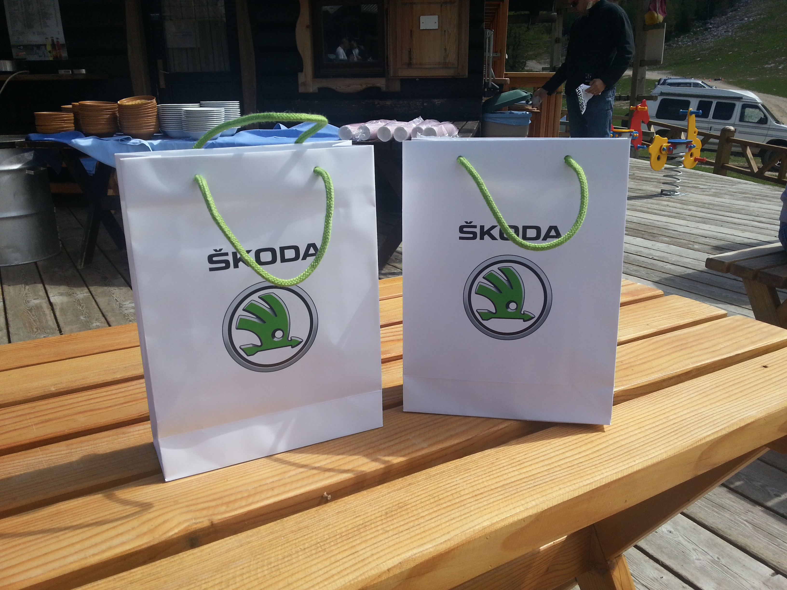
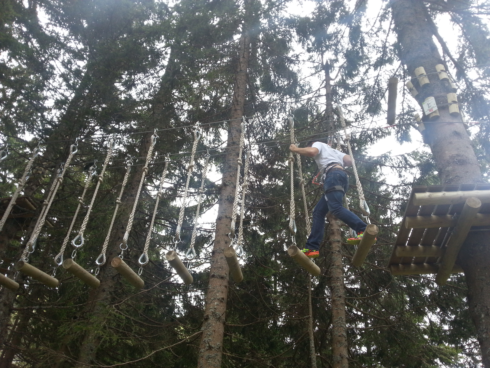
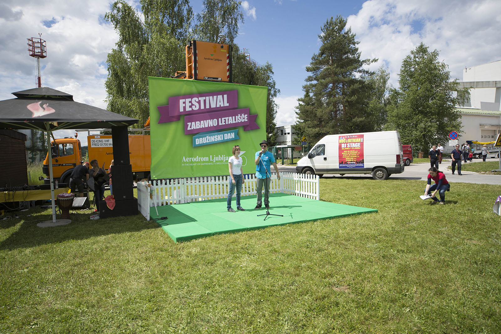
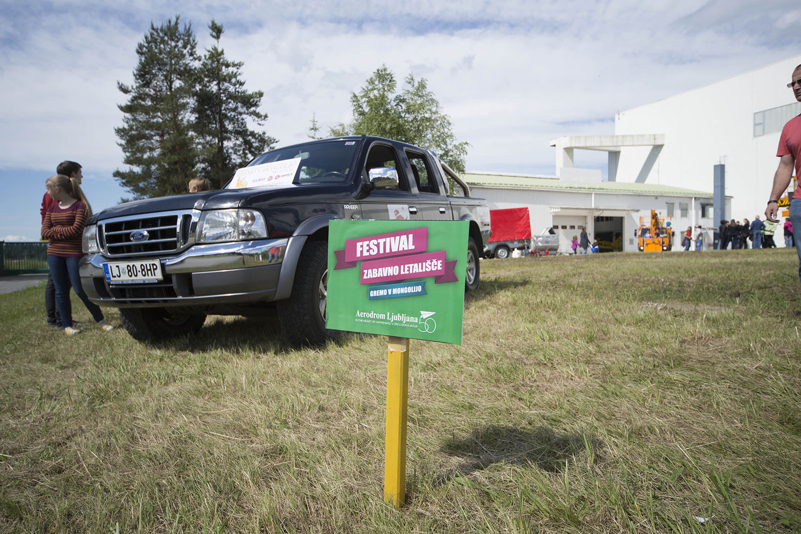
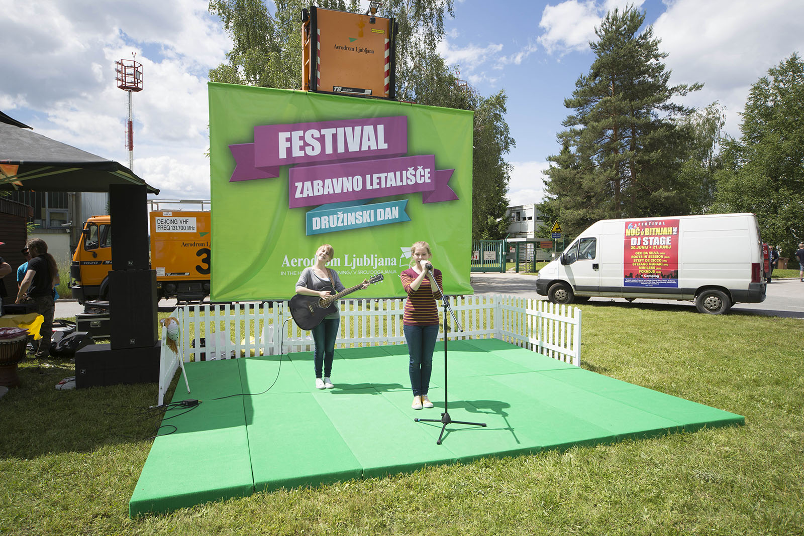
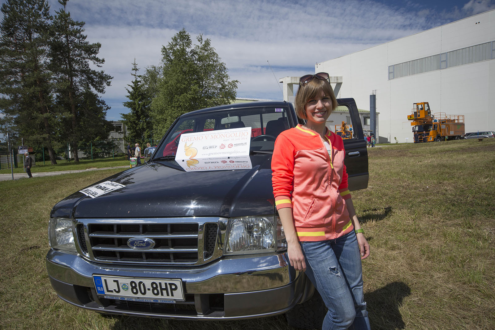

V soboto je bilo delavno...

Na vse zgodaj zjutraj sva se odpravila vsak po svoje, jaz na Krvavec, kjer sva se s kolegom Tomažem šla pomerit v finale Škoda Yeti 4x4 izziva, Katja pa na Letališče Jožeta Pučnika Ljubljana, kjer so prvič izvedli Festival Zabavno letališče; družinski dan.

Midva sva prišla do vznožja vzpona in se nato z žičnico odpeljala na vrh. Tam sva se z 10-imi najboljšimi ekipami pomerila v 6-tih panogah: Vožnja brez aparatur, pobiranje kamenja, vitel na račno, streljanje z lokom, pustolovski park in downhill gokart. Zasedla sva 6-to mesto, ker sva že v prvi nalogi močno "pušnila", in namesto v 9tih minutah prišla v 11:30. Opa, narobe sva računala sekunde. Sva pa odkrila, da imajo na Krvavcu super progo za downhill in sva se večkrat spustila po njej. Tomaž kot izkušen downhillaš mi je povedal kako in kaj, pa moram priznati, da mi je šlo kar dobro. Za prvič.

[Več o tekmovanju v organizaciji AvtoMagazina in Offroad Mamut 4x4 si lahko preberete TU.](http://www.avto-magazin.si/novice/skoda-yeti-4x4-izziv-kamni-in-zmagovalci/ "Skoda Yeti 4x4 izziv finale")

Katja je vzela Forda, in se odpeljala na njeno pozicijo, kjer je ponosno predstavljala najin projekt skupaj s še drugimi udeleženci festivala. Avtomobil je bil posebej zanimiv za otroke, ki so se z veseljem fotografirali v njem. Super dan za super promocijo.

Popoldan pa sva se ponovno odpravila k Mamutu... več o tem v naslednji objavi.

