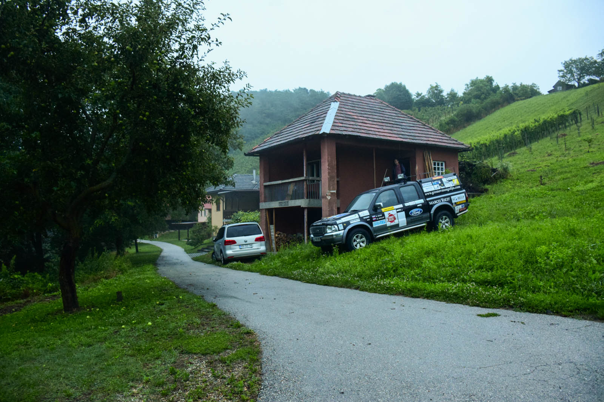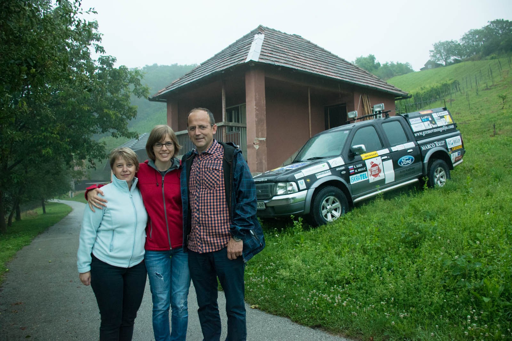

Pred nama je dolga siva cesta, ki ji ni videti konca. Pokrajina se počasi spreminja, ravna in gostuje vedno bolj preproste hiše ob cesti. Čudiva se, kako je mogoče, da oblakom ne zmanjka vode, ker naju dež spremlja povsod. Nekaj minut nama je namenil v Budimpešti, da sva lahko uredila vizo za Belorusijo, si privoščila pozen zajtrk in ne vedoč obenem tudi edin konkreten obrok dneva.

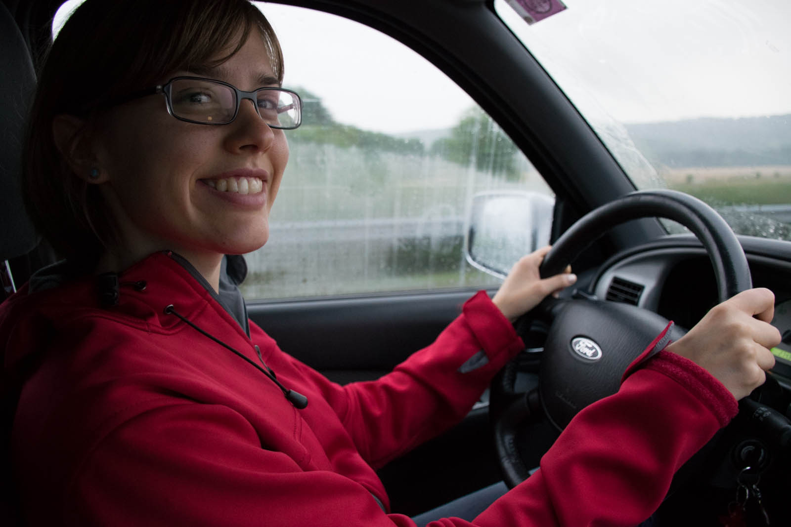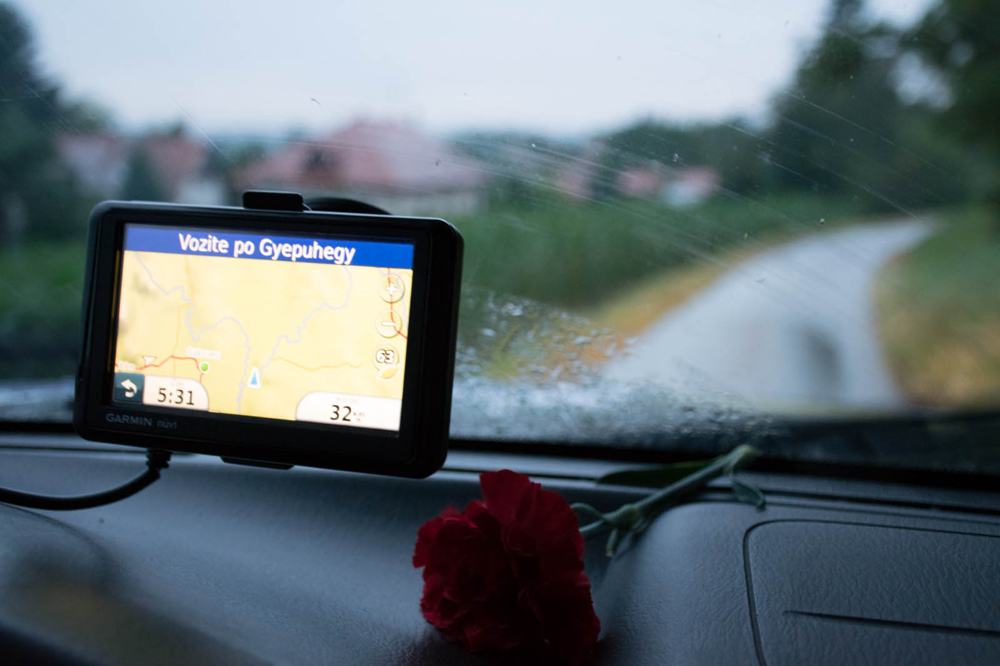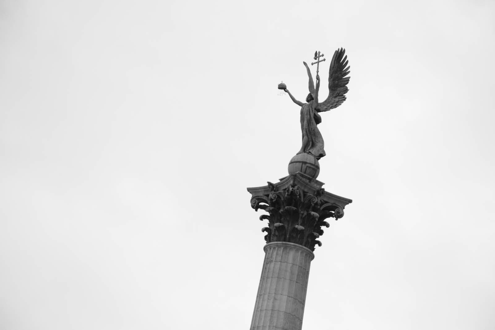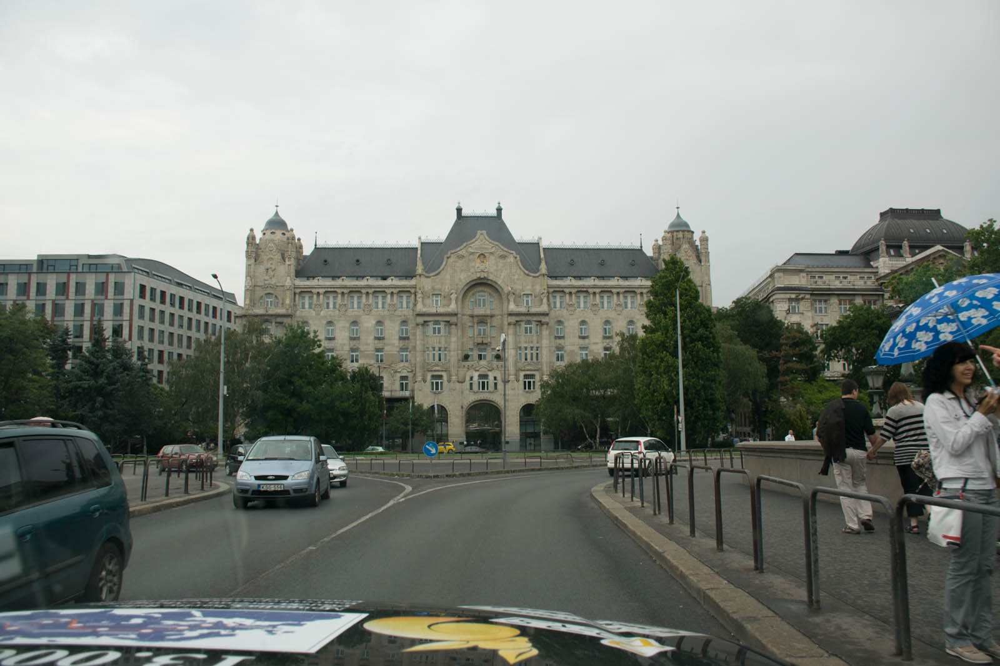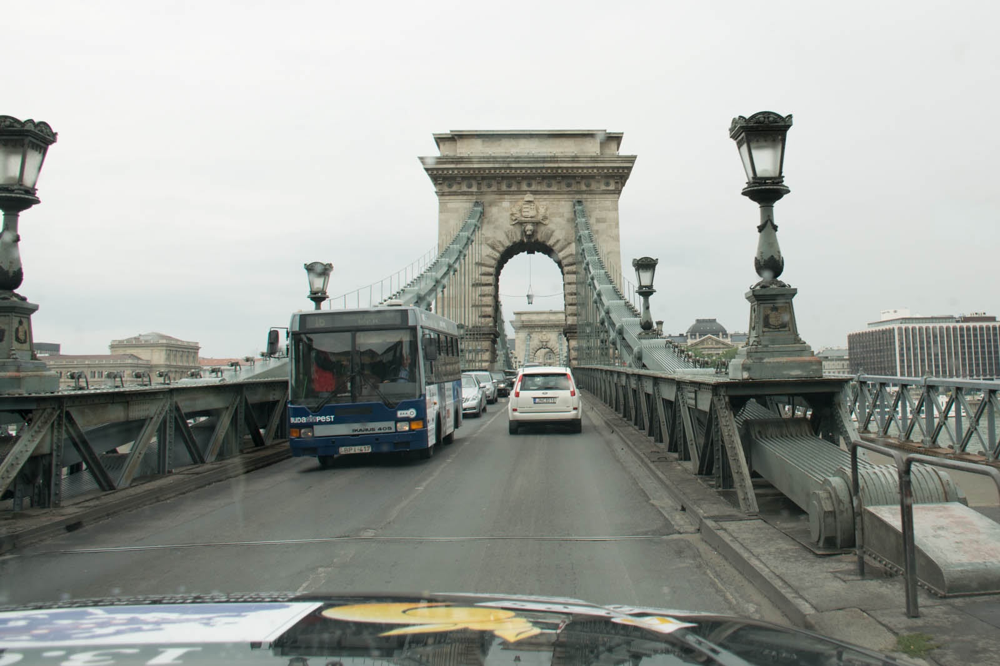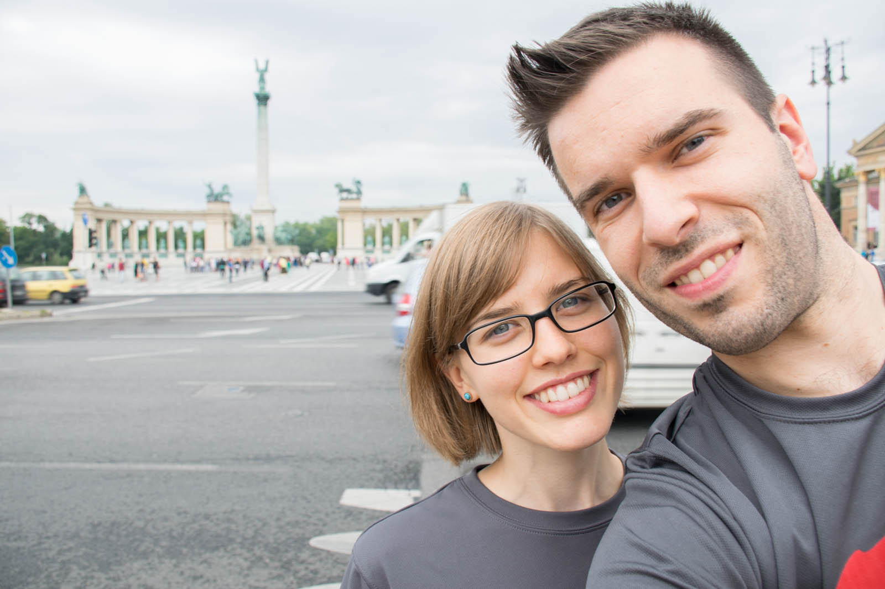

Verjetno je ravno sivo vreme pripomoglo k tako vztrajni  vožnji čez Evropo. V tem dnevu se zaveva, kaj pomeni dobra prometna povezanost in avtoceste, ker nama jih iz ure v uro zmanjkuje. Izmenjujoče voziva po cestah, ki kažejo dotrajanost. Cel dan nekoliko poskakujeva zaradi razpok, se učiva prehitevanja, sem in tja bočnega parkiranja (no koga slepimo… Katja se v določenih stvareh še verzira – kot opomba – Žvau je res žvau, ampak že kaže zametke odlične šoferke). Ker imava nekaj težav s sateliti, krožnika, razen plastičnega pa nimava, stalno uporabljava dve navigaciji – sem in tja se zgodi, da se razhajata v mnenjih, katera pot je boljša, vendar to pripisujeva naravnemu nasprotovanju med žensko govorko na eni strani in moškim usmerjevalcem poti na drugi.

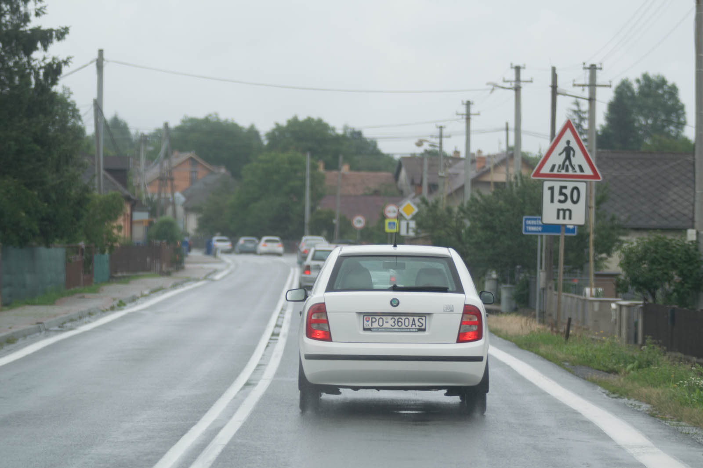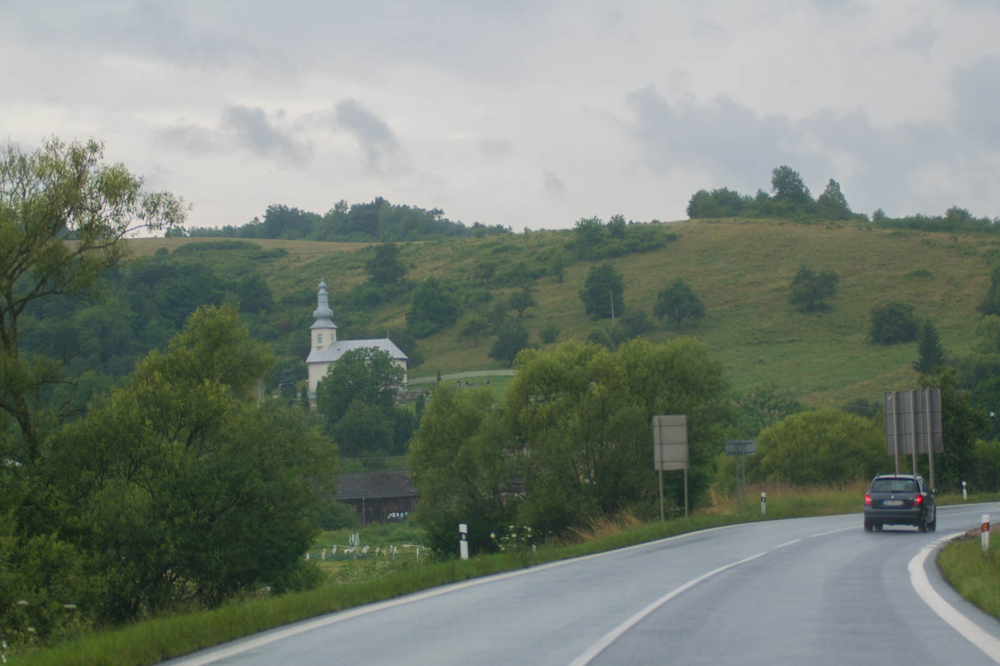

Občutek, da je avto res velik počasi bledi zaradi dveh razlogov. Prvi je ta, da sva tako natovorjena, da je treba kopati rove po zadnjih sedežih – malo naju je strah, kaj šele bo! Kot  drugo pa nama na poti delajo družbo črede kamionov, s katerimi v strumni koloni vozimo in tudi stojimo, ker od časa do časa pride do nezgod na cestah, prometnih konic in podobno. Občutek veličine se je vrnil, ko sva naredila manjši prometni zamašek, v poskusu parkiranja v garažno hišo, kamor se je avto za trenutek zagozdil pod merilec višine. Kljub temu, da sva ves čas, z izjemo hranjenja forda , v avtu, sva že srečala naše sonarodnjake, na meji  med Madžarsko in Slovaško, v odhajanju na daljši oddih.  Ko še tisto nekaj svetlobe, ki jo skrivajo oblaki izgine še vedno vztrajava vse do Parzewa, kjer parkirava pred stanovanjskimi bloki in se odločiva nabrati moči za nov dan.

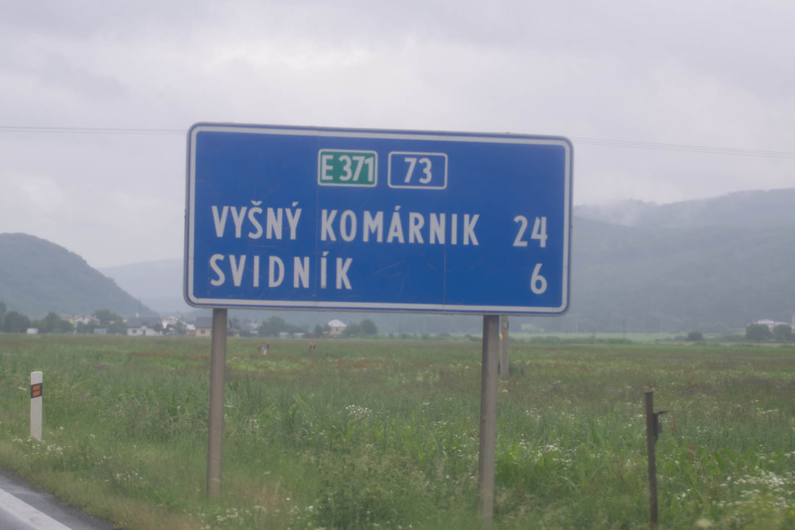 Utrinek dneva. Vožnja do Višnjega komarnika.
