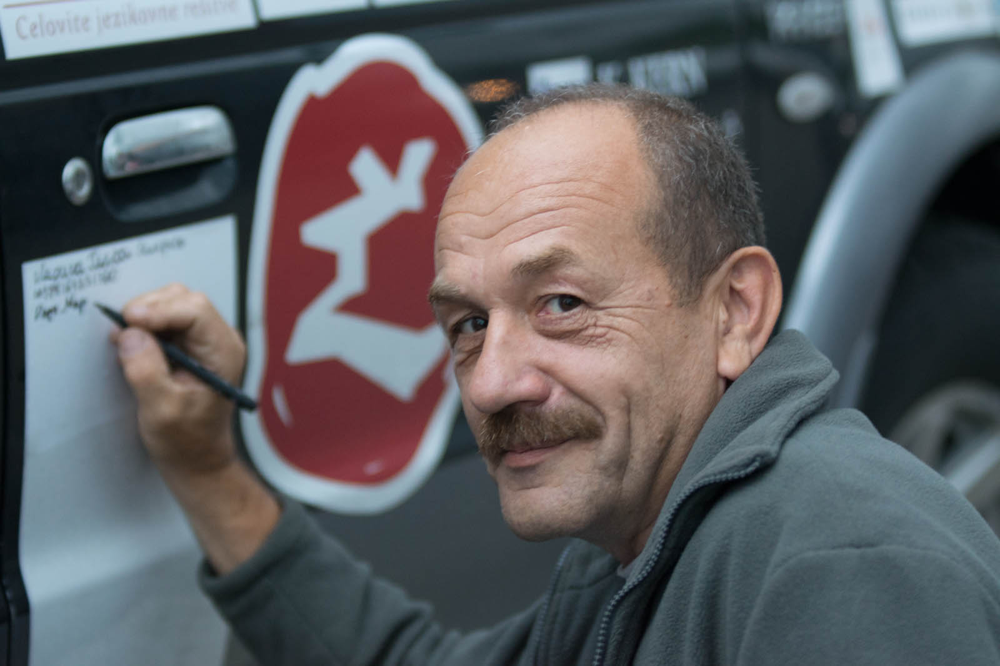

Očitno je spanec v avtu udoben, ker se to jutro zbudiva dokaj pozno. Na bližnji bencinski postaji si umijeva zobe in skleneva, da bova zajtrkovala v Brestu. Pred nama je le še dobrih 50 kilometrov in prečkanje meje. Navigacija naju pelje po obmejnih kotičkih Poljske.

Vrsta na mejnem prehodu se ne zdi dolga. Ob 10:10 se postaviva  v kolono, pripraviva dokumentacijo in vrževa nekaj  partij remija, da čas hitreje mine. Sprva se zdi čakanje povprečno – cariniki se ležerno premikajo od vozila do vozila, vmes pa poniknejo v svoje kočice za tako dolgo, kot da imajo vsakič malico … in nato še kavo po malici.

Vseeno nama uspe dočakati zeleno luč na semaforju in nekako prečkava prvi prehod, čeprav ravno za toliko, da se uspe rampa za nama zapreti, ker so pred nama že dolge kolone, ki čakajo na drugi  pregled. Tudi tu se zadeve ne odvijajo nič kaj hitreje. Ljudje si čas preganjajo s postopanjem okoli svojega avta (neverjetno ampak čisto vsi ga tudi polirajo), nekateri se zapletejo v pogovor, drugi se trudijo z branjem najinih podpornikov in zemljevida. Midva se potopiva v knjige. Drugo srečanje s carinikom je zanimivo – najprej začudeno pogleda avtomobil, ko izve kam greva gleda še bolj debelo, ko mu odpreva prtljažnik pa očesi skoraj padeta iz jamic. Doda še komentar, da je to kar nekaj prtljage  in naju spusti naprej. Priključiva se naslednjim čakajočim vozilom, za vstop v Belorusijo in ker nimava nič za prijaviti na carini, se postaviva v zeleno cono.

Čakava, čakava in ko naju spustijo v kontrolo, se oglasi carinica in  naju seznani, da je ta kolona samo za domačine in da morava nazaj v vrsto. Po vdihu in izdihu greva v vrsto za tujce, tako imenovano rdečo cono, kjer pa stvari začnejo postajati zeloooo dolge. Vse traja še desetkrat dlje – čakanje, razporeditev avtomobilov k okenčkom, kjer pregledajo dokumente, čakanje, da se kdo spomni nate in ti vzame potni list, še dlje, da ga dobiš nazaj, izpolnjevanje obrazcev, čakanje na inšpektorja, da ti pove, če je potrebno kaj od prtljage plačati. Ura je 14:00 in ob 16:30, ko imava urejeno vso dokumentacijo, pride do naju še inšpektorica. Vesela, da se bova končno odpeljala naprej na pot, ji odpreva prtljažnik in pokaževa zadnje sedeže. Ona pogleda in vpraša, če sva samo dva v avtu. Sledil je pritrdilen odgovor in nato naju razsvetli s pravilom, da je na enega človeka dovoljeno 50 kilogramov prtljage in da bova morala ostalo doplačati. KAJ?! Situacija je bila sledeča imela sva 189 kilogramov, po tem ko smo že izprosili, da nama je odštela gumo, 60 litrov vode, 60 l dizla in 3 konkretne lesene plohe. Skupaj je bilo v avtu za okoli 400 kilogramov blaga. Ni se je dalo pregovoriti niti za hrano. Pa de ne pozabimo,da je potrebno za vsak dodatni kilogram doplačati 4 €! Matej je pol ure jokal v pisarni, poskušal šarmirati na vse mogoče načine, a ni popustila pritiskom. Sitna baba! Ker nisva pristala niti na 50 kg zmanjšanja tovora, kar bi naju še vedno stalo 300 €, sva se bila primorana odločiti med prečkanje meje v Latviji ali pa se znebiti odvečnih kilogramov. Po sedmih urah čakanja sva se vrnila na Poljsko, podarila vsa oblačila, ki so bila namenjena za Mongolijo (30 kg) in našla Alexeya, ki je za naju čez mejo prepeljal za 60 kg hrane in opreme za vzdrževanje Forda.  In potem jovo na novo.

_(podpisovanje vseh, ki pomagajo na odpravi na avtomobil - zdaj veste, za kaj so beli pasovi na vratih)_

Vrsta je bila tokrat še malenkost daljša, na noč pa so prvič pritisnili tudi komarji – hvala bogu za komarnike. V drugem poskusu nama je uspelo, tokrat sva čakala samo 9  ur in Matej je ob 5:50 odpeljal avto in spečo Katjo v Belorusijo. V tem dnevu sva uspela prevoziti celih 53 kilometrov in pojesti vrečko indijskih oreščkov in stiropora.
