Spiva do 12-tih. Ja, pot je bila dolga in naporna, tudi nevarna. Vožnji v napol budnem stanju se bova v bodoče izogibala, sploh - ker se nama obetajo vse prej, kot lepe ceste.

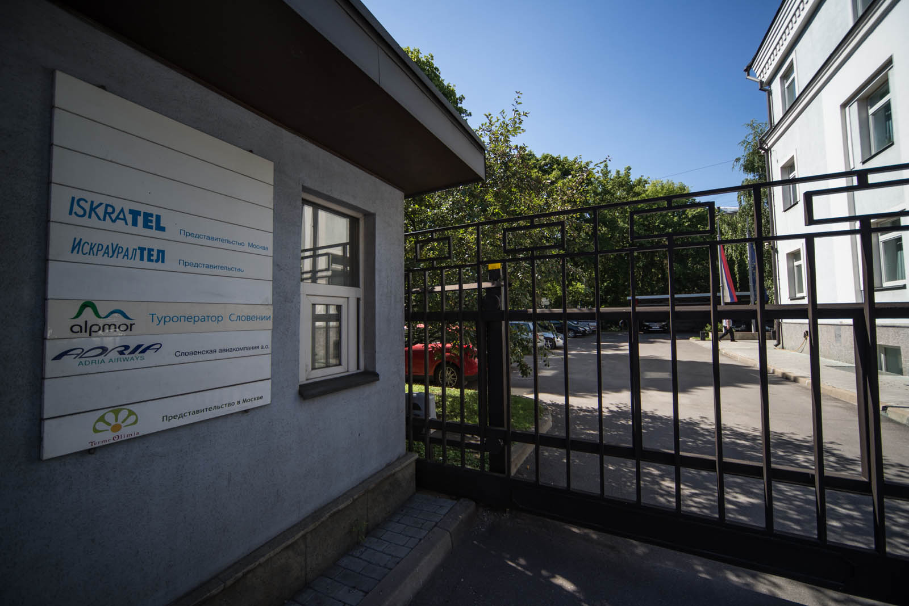 Postojanka za nekaj dni.

Nato naju pričaka Elya (Elina Amelchenkova), najbolj prijazna od vseh rusinj in tudi Matejeva zelo dobra prijateljica. Besno se začne pogovor v ruščini in Katja kmalu ugotovi, da ne bo drugega, kot pa, da se vrže v knjige in nauči rusko. Pregledamo plan, spoznamo se še s Tadejem Dragašem, pokaževa avto, nato pa se peš odpraviva v Moskvo. Takoj, ko prispeva na trg pred Bolšoj teatr, Matej ugotovi, da je za GoPro Hero3+ Silver pozabil baterije, in tako seveda ne gre. Vseeno se odločiva, da si nekatere stvari ogledava danes, pač brez GoPro-ja. Tako stopiva na Rdeči trg, pogledava Katedralo na njem, greva v GUM na sladoled (to je tista največja trgovina, bolj prestižna kot Harrods), nato pa na sprehod okrog Kremlja.

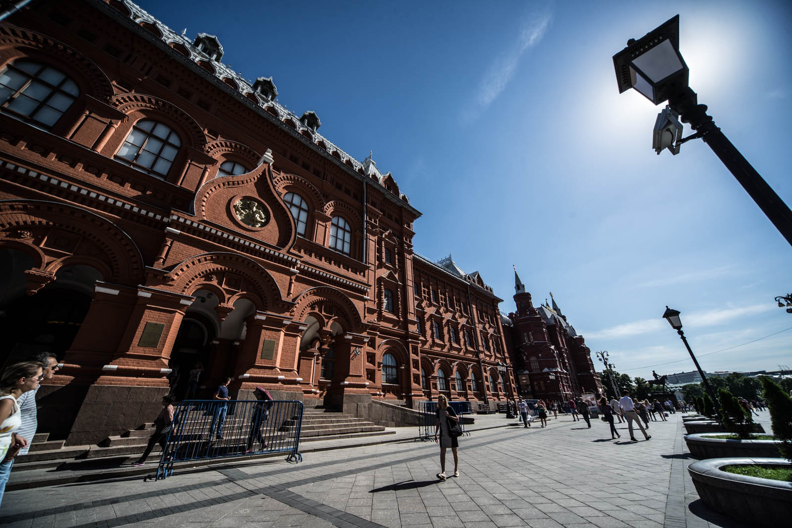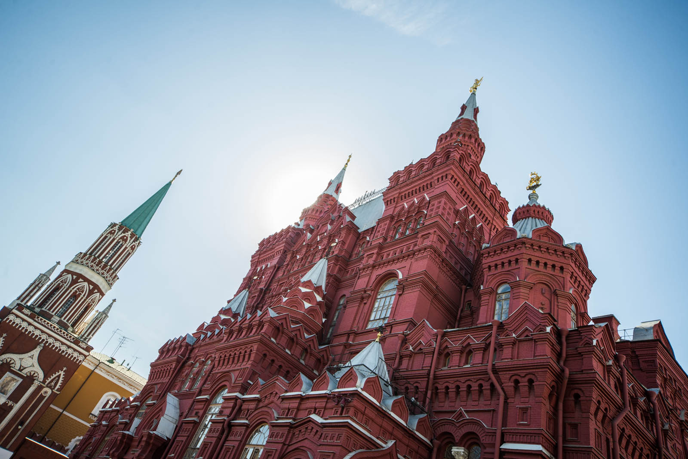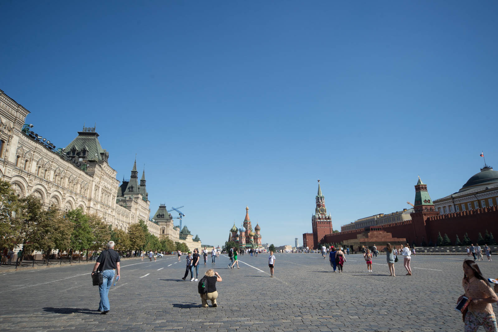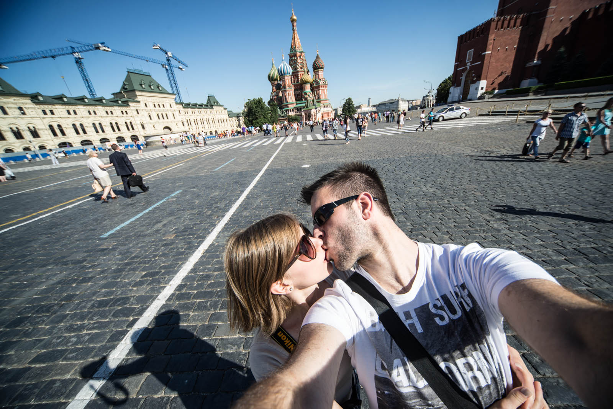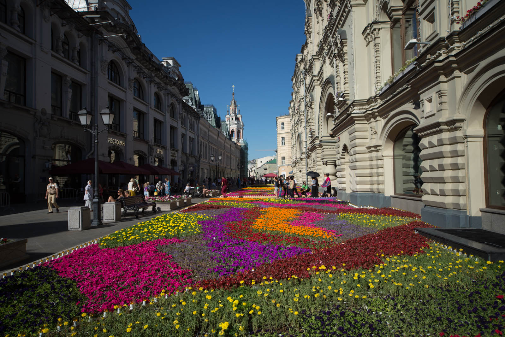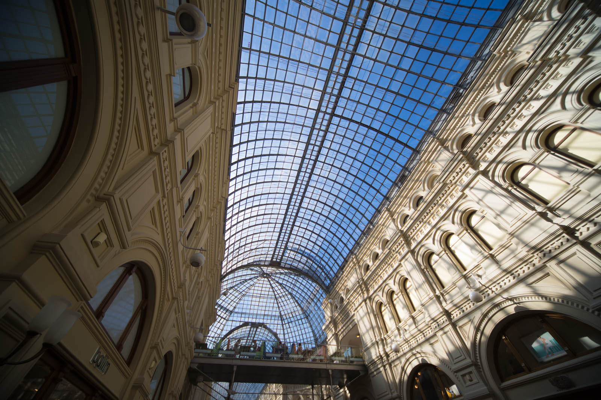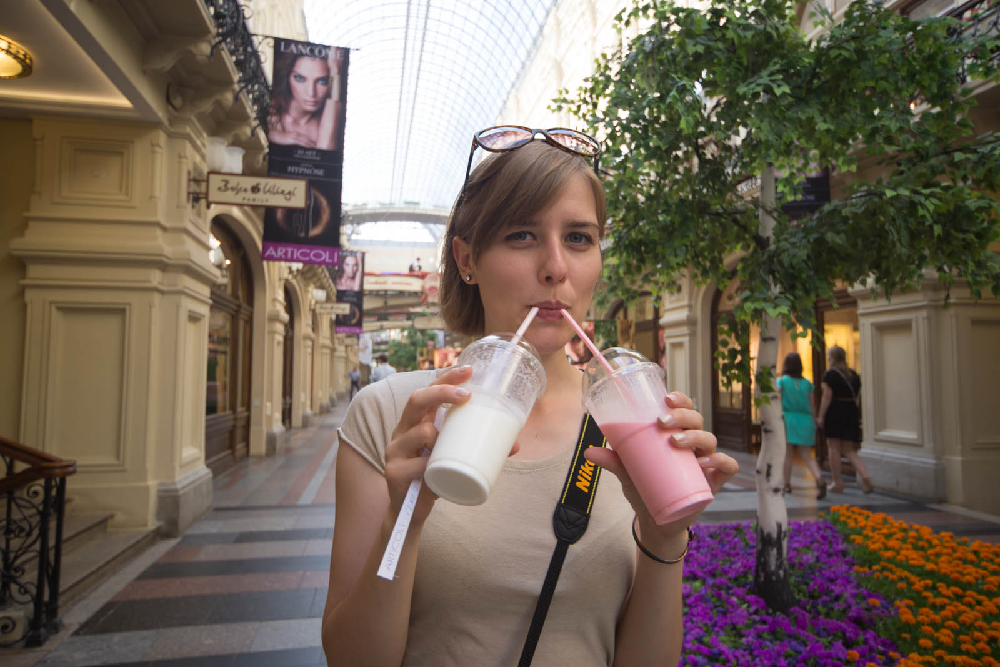

A sva povedala, da je 30 stopinj, da je noro vroče in da sva v dolgih hlačah, ker v Lonelyju piše, da v kratkih ne moreš v Kremelj (ni res, še celo s torbo so nas spustili, samo vprašali so, če mava bombo). No ja, prideva do vhoda in ugotoviva, da je že vse zaprto - samo do 18.00, rusi.

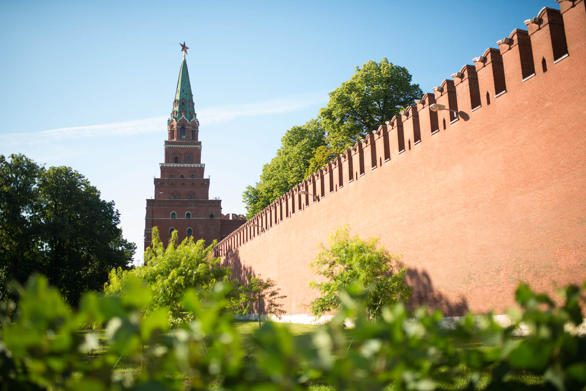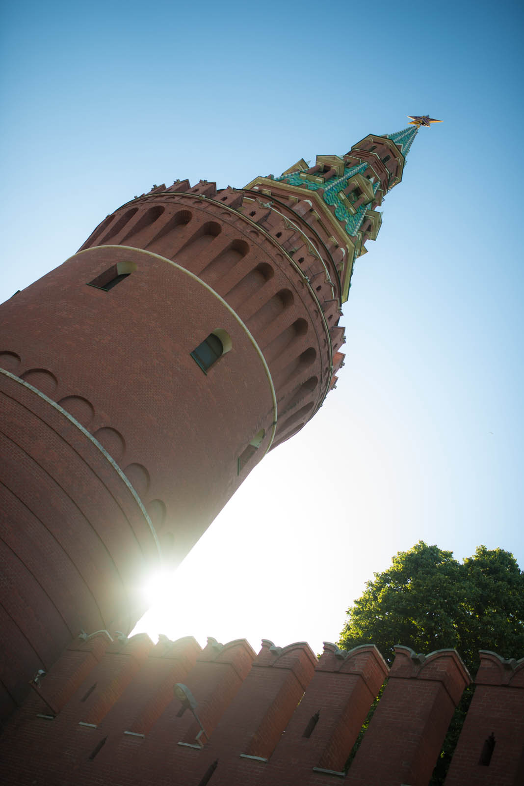 Tekmujeva v zajemanju istih motivov. Matej vodi, ampak je Katja že zelo zraven.

Pogledava si menjavo straže in se odpraviva na Arbat. Ja, to je tista šiš-miš ulica, ki jo ima vsako mesto. Usedeva se v Japonsko restavracijo in čakava 15minut na natakarja. Nato naročiva vsak svojo Lapšo (obični riževi rezanci) in čez nekaj minut dobiva skrpucalo na mizo. Matej je že malo pozabil, da je v Rusiji NUJNO potrebno gledati grame zraven porcij in tole je bilo očitno premalo, poleg vsega pa so bili Matejevi rezanci brezbarvni - kao novost. Saj je bilo okusno, ampak za petkrat za v usta, in to čisto nič prestižno. Pila sva pa eno zeleno stvar, z mehurčki. Bljak. Katja jo je tokrat gledano v celoti odnesla bolje.

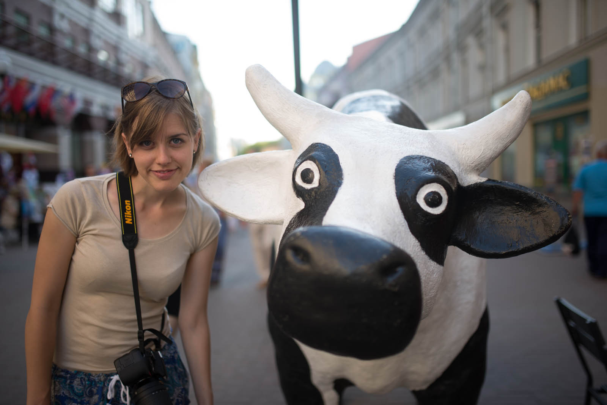

Žalostno se odpraviva naprej in si ogledava sončni zahod na stavbi Ministrstva za zunanje zadeve. To je ena tistih 9-ih stavb, izmed katerih je ena tudi Hotel Ukraina, ki jih je dal zgraditi Stalin (or so we know) za svoj glomazen državni aparat.

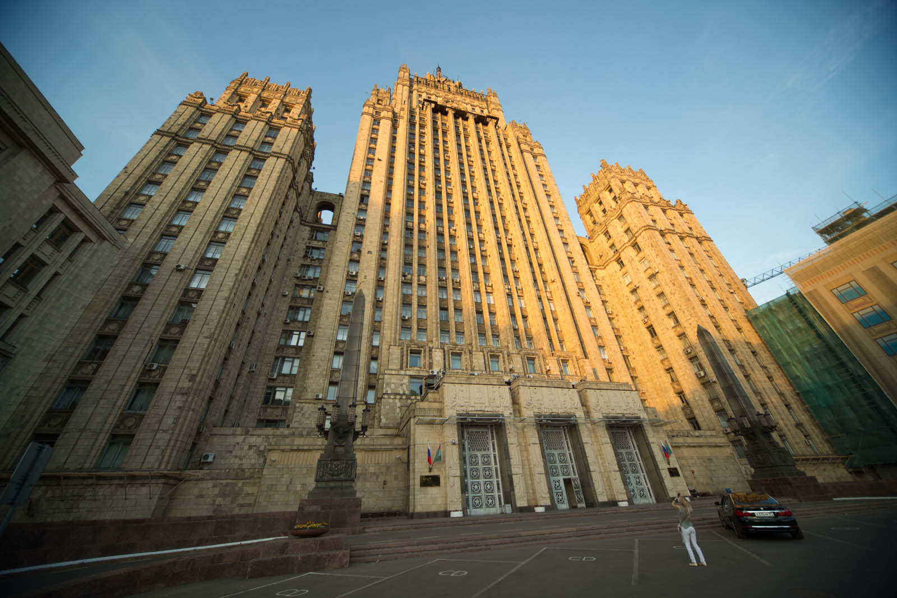

Aja, sončni zahod imamo tukaj ob 22:30, samo toliko, da veste. Svetlo pa je vsaj še eno uro kasneje. Odpraviva se v hipermarket in kupiva "pogrej in pojej" sirove zvitke. Doma narediva celo pojedino, zraven pa še kokosove piškote. Katja pravi, da so bili dobri.
