Spet spiva relativno dolgo. Vse naju boli, zdaj ne veva več, ali je to od avta, ali od spanja. Sladke skrbi torej. Z Elino organiziramo fotografiranje vozila pred podjetjem, ker pa je večina zaposlenih na dopustu, kosilu ali pri poslovnih partnerjih, se nas zbere le peščica. No ja, zberejo se tisti, ki štejejo. So Matejevi najtesnejši sodelavci iz pisarne v Moskvi – pravi fen team. Pade tudi nekaj koristnih in manj koristnih nasvetov za nadaljevanje poti. Super sproščujoč pogovor – tudi Katja pride na svoj račun. Vsi govorijo angleško.

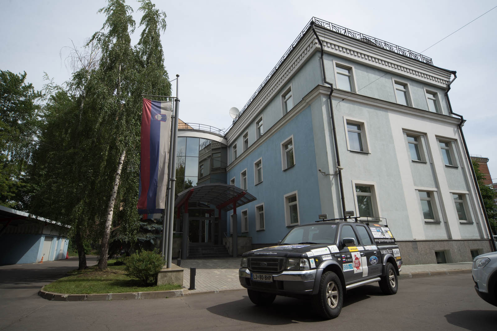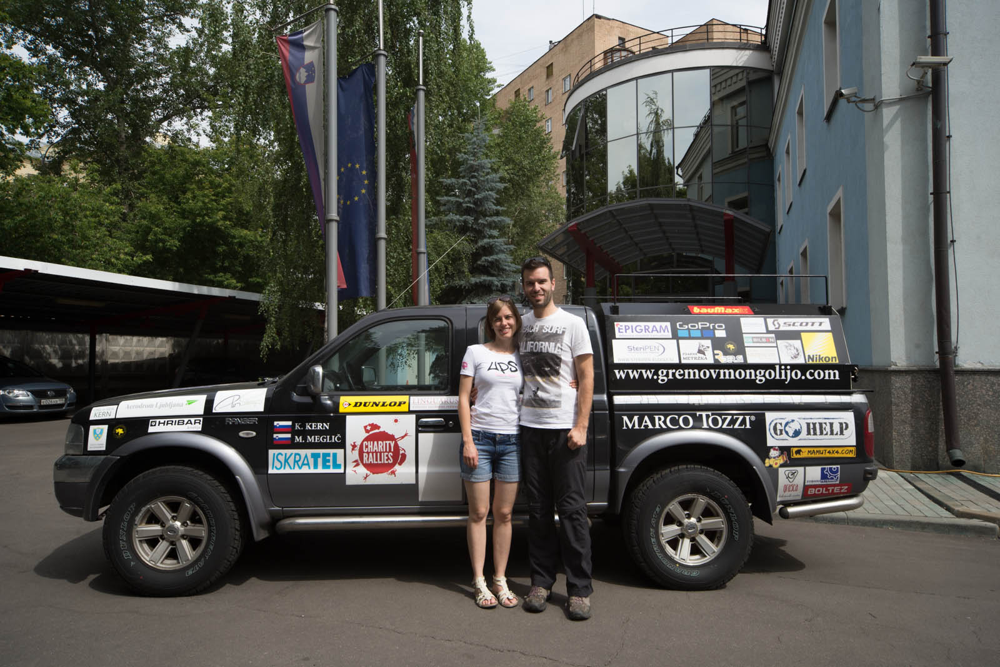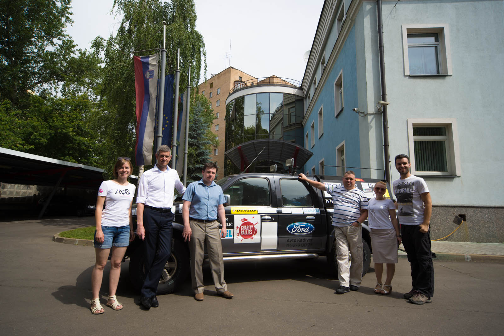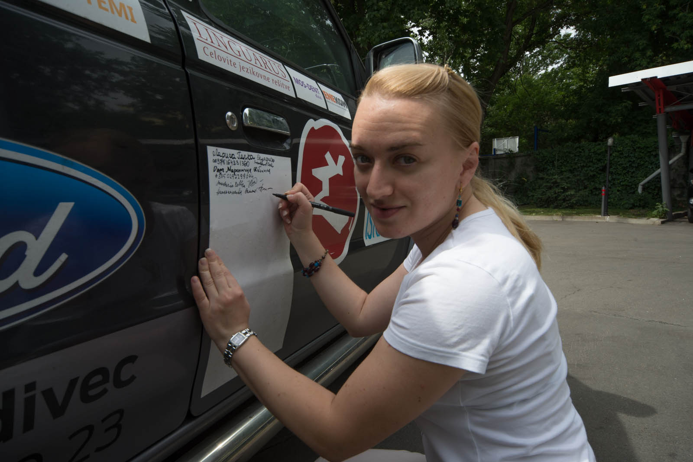

Takoj zatem se odpraviva v mesto. Ideja je, da na hitro obdelava vse punkte od včeraj z GoProjem, nato pa skočiva pogledat še ostalo. V pekarni v podhodu kupiva preverjene produkte za zajtrk, gospa v trafiki pa si mane prste ob najini porabi sicer relativno drage vode.

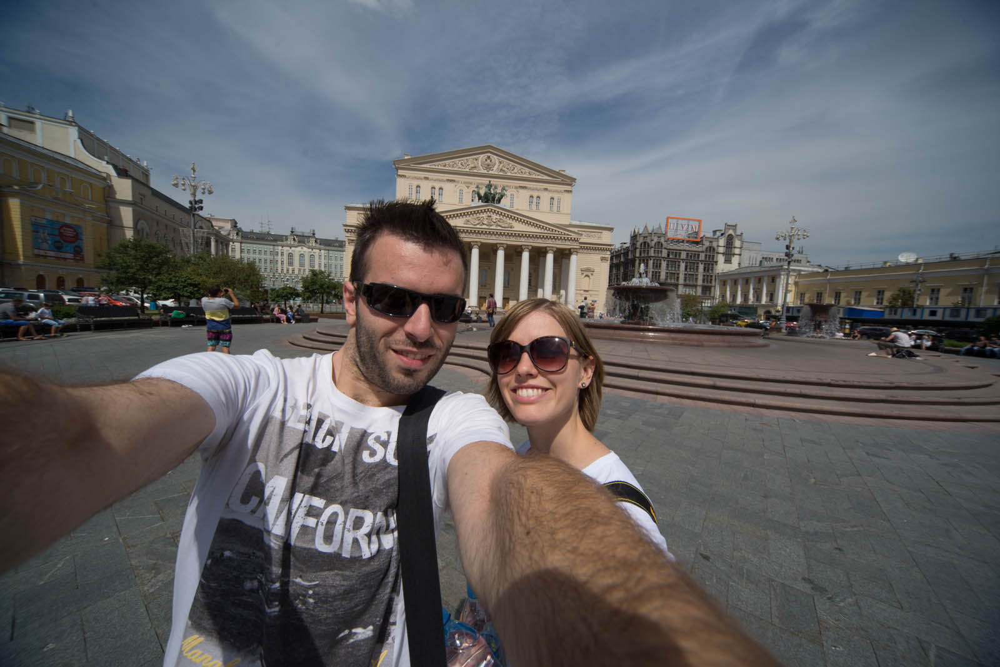

Še enkrat se sprehodiva mimo Bolšoja, nato skozi vrata na rdeči trg in nato v Kremelj. Katja je navdušena, vreme pa tokrat nekoliko bolj prijazno. Včeraj je bilo trideset, danes pa znosnih 27 stopinj celzija. Navdušena sva, ker Katji sprejmejo študentsko izkaznico, ki ni veljavna po ISIC standardu. Lepo je, da imajo posluh tudi za tiste, ki ne plačujejo 30 EUR letno za larpulartizem (nekaj, kar je samo sebi namen).

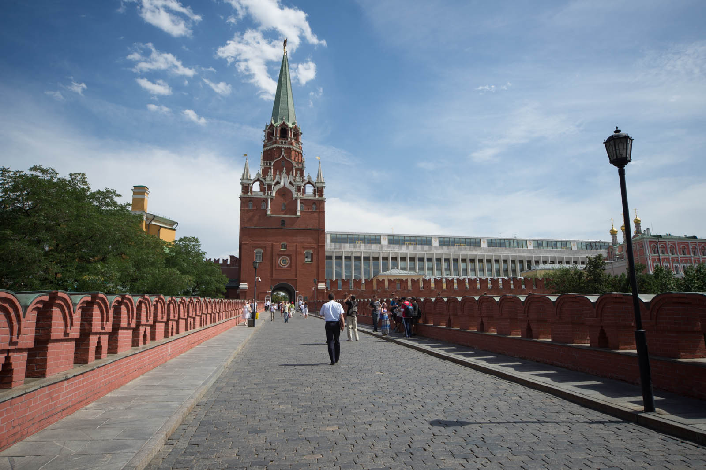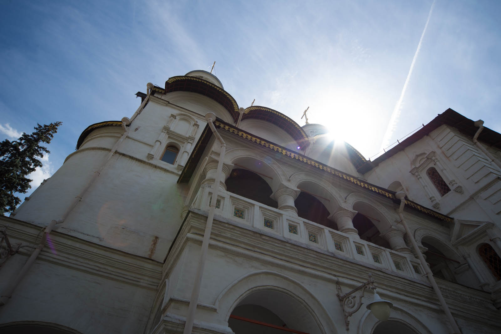

Greva še v St. Basil Katedralo – ja, to je tista simpatična cerkvica na rdečem trgu, kjer je 18-letni Mathias Rust v Cessni iz Finske preletel Rusijo pod radarji in uspešno pristal na Rdečem trgu. Seveda je bil zaprt in potem tudi pomiloščen. Katja sprašuje, zakaj imajo narisane črte čez kocke – zato, ker na tem trgu prirejajo vojaške parade. No, nazaj k cerkvici. Vedno sem si želel videti to cerkvico od znotraj – roko na srce, katedrala je pretiran izraz, sploh glede na to, da se po velikosti lahko primerja s katerokoli sakralno umetnino iz naših večjih mest. Tokrat nama je končno uspelo (Leninov mavzolej sva zgrešila za slabo uro – pa drugič). Nato se odpraviva v Park kulture, kjer Katjo celo pot čez most slepim, kako lep je vhod. Seveda so ga prenavljali, in to sredi sezone (ima pa nekaj Re\*fresh zraven, kakor je vidno iz parkirišča).

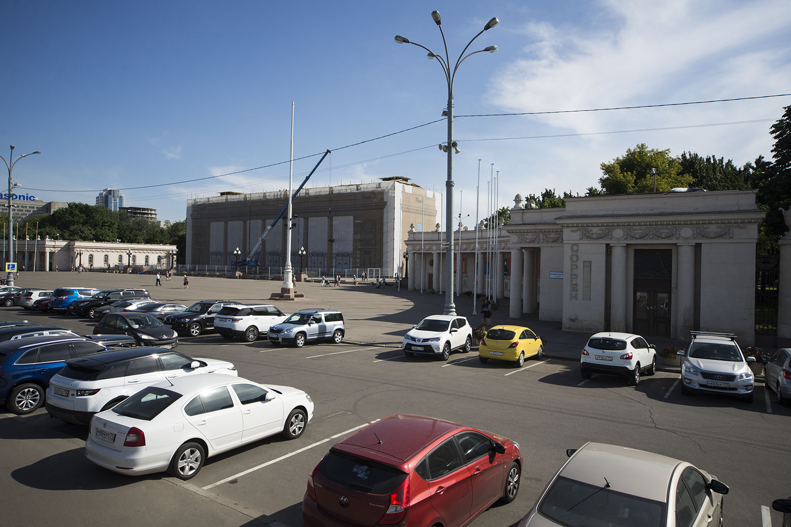 Fun fact: Eva Remškar je učitno soudeležena tudi pri mednarodnih projektih. Takole delat na Brandenburških vratih vzhoda, pa nič povedat... tc tc.

 
Iz principa kupiva sladoled in vodo, pojeva in popijeva in zaspiva za dobre pol ure. No, Katja je spala, Matej pa se je posvečal prvemu konkretnejšemu timelapse-u. Park kulture se po rusko reče tudi Park Gorkovo in je točno tisti Gorky park iz pesmice Winds of Changes, ki jo prepeva ansambel Škorpijončki (Scorpions). Jaka bo vedel, da je to »I followed the Moskva, and down to Gorky park, listening to the wind, of changes.« Ja, poleti je precej lepši, kot pri -20 v januarju.

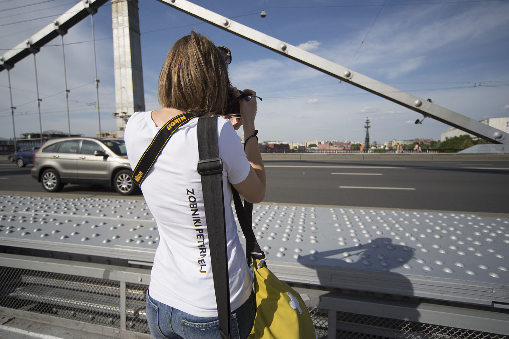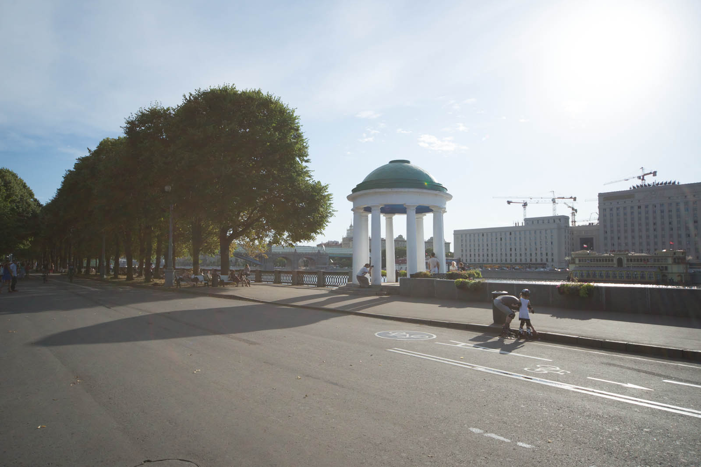

Okej, ko se sprehajava naprej ugotoviva, da imajo neke nobel blazine za poležavanje, ki so na voljo obiskovalcem parka. Nama je bila dovolj že trava in senca. Malo se izgubiva in nato najdeva metro. Lužnike (stadion iz zadnjih OI v Moskvi) prenavljajo za bližajoče se svetovno prvenstvo, ki bo čez štiri leta v Rusiji (A ste to vedeli a?), zato se tja ne odpraviva – razritih stvari bo na tem potovanju še dovolj.

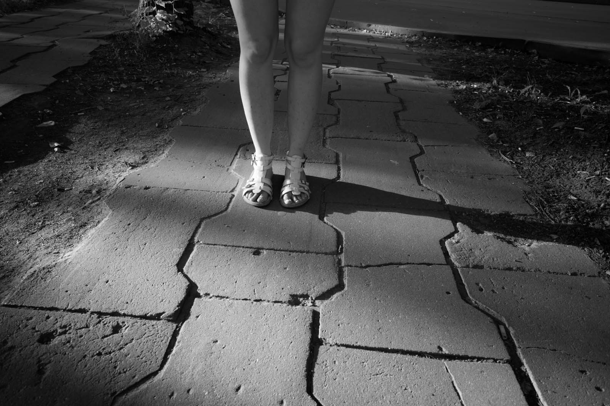 Fun fact dneva: v Rusiji so vse stvari pač večje. Normalno. Ampak, da so pa toliko večje, je pa absurd. Okrog hiše bi jih dal kakšnih deset. Obliko imajo pa isto.

Odpraviva se pogledat MGU. Ne, to ni GUM (Rusi so obsedeni s kraticami), ampak MGU – Moskovskij Gosudarstvenij Universitet ali bolj znan kot Lomonosov. Stavba je tako ogromna, da ne gre niti v 12mm na FullFrameu, ko si oddaljen ca 100 metrov. Ogromna je, več kot 40.000 študentov študira v njej (in kakor sva videla, tudi živi).

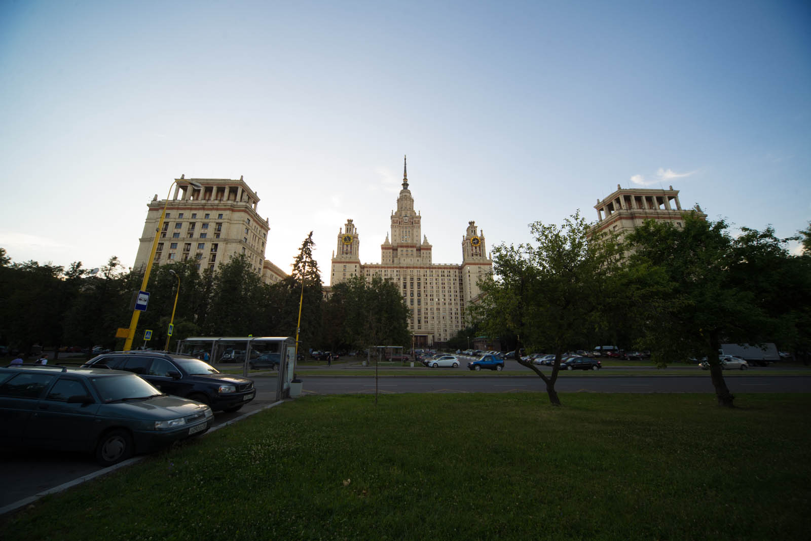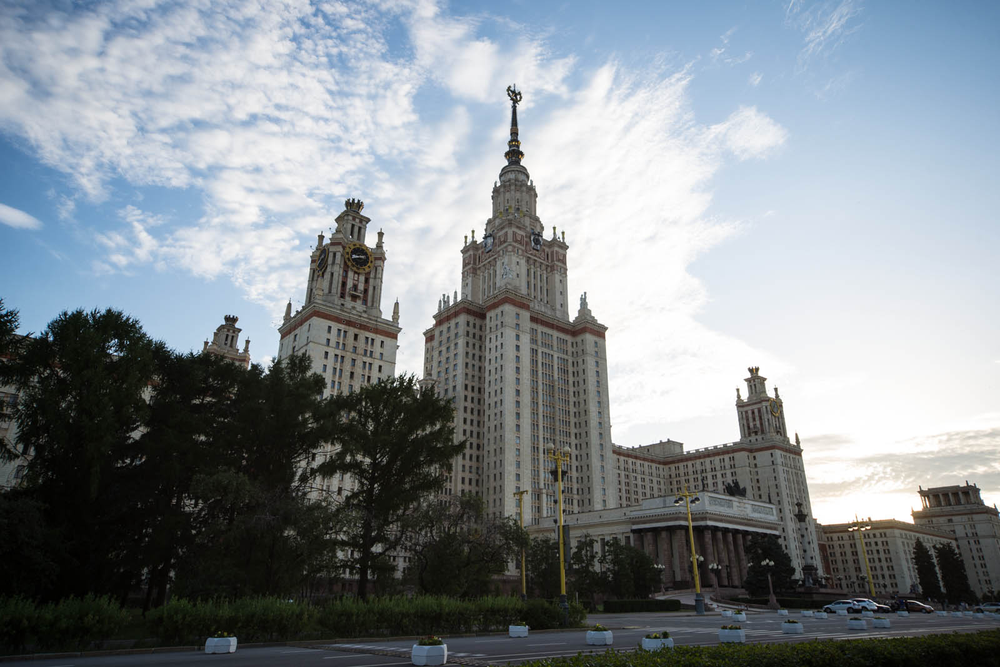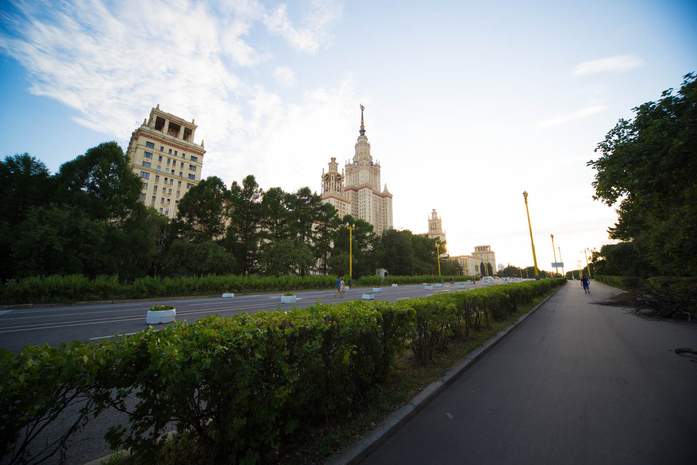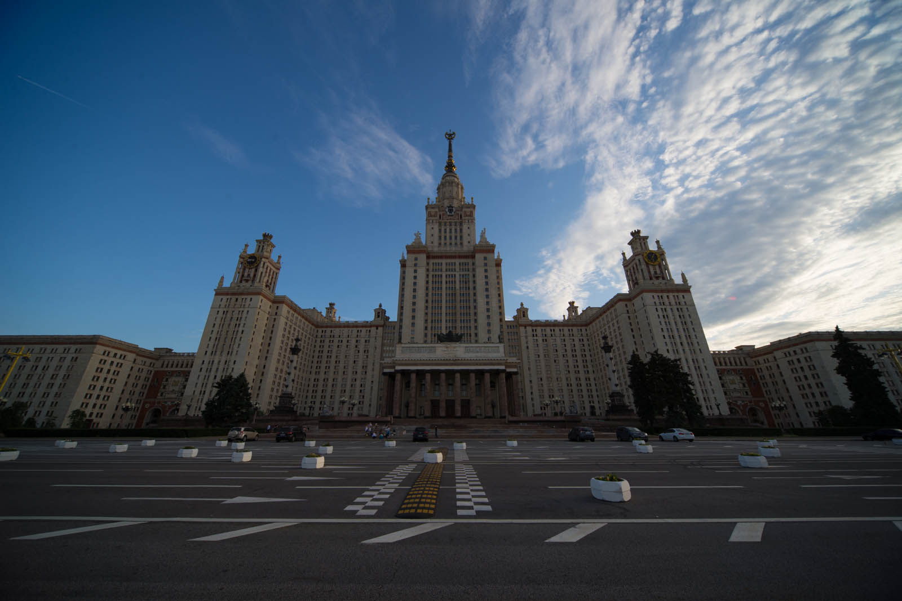

Večeri se že, Katja spet pravi, da je lačna. Iščeva market, da še enkrat zlorabiva mikrovalovno v firmi, ampak tokrat žal neuspešno. Po 10-ih neuspelih poskusih obupava. Pade KFC, najbolj milostna in najbližja rešitev – wraps. Doma na pol spakirava, spet pobereva vso toplo vodo in napiševa poročila.

PS: Res je pomembno, da tokrat pohvalim Katjo. Danes se je naučila skoraj vse zamenjave črk iz latinice v kirilico in teh ni malo. Zdaj jo je prav hecno opazovati, ko po zlogih bere enostavne napise in se muči z izgovorjavo. Težko je, ko je potrebno pozabiti vse, kar veš. In se naučiti nekaj novega. Steče le s prakso in te bo v teh dneh še veliko. Bralcem v vednost (zdaj že globoko sanja) pa samo en namig, da bo zelo zabavno, ko prideva v Mongolijo. Tam je namreč kirilica še enkrat obrnjena in niti jaz nimam pojma, kaj jim tam gor piše. Bomo videli..

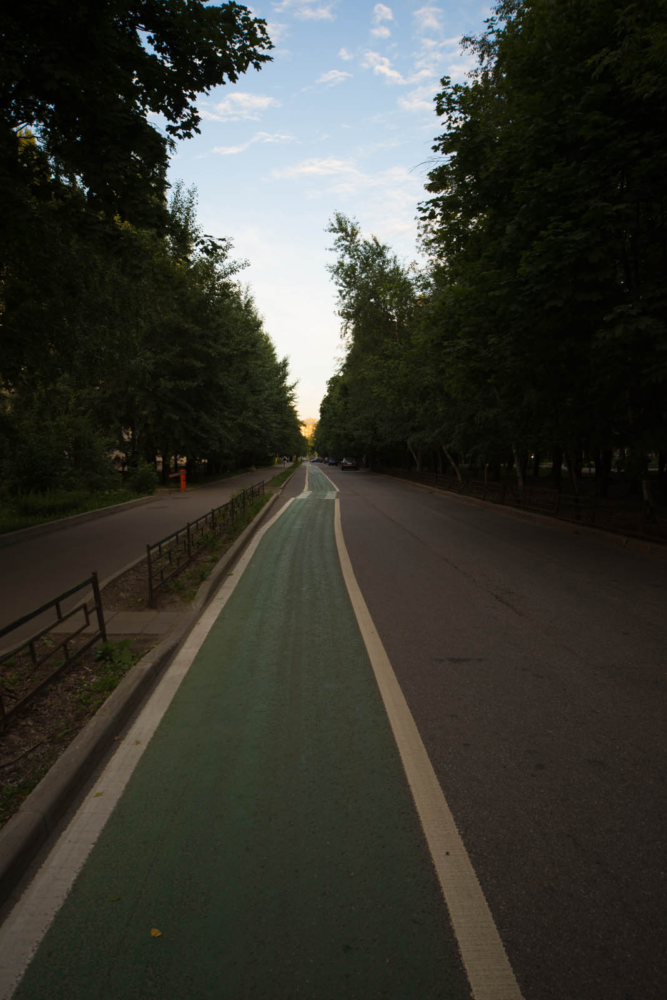 Fun fact: Videno pri Lomonosovu - ravne črte.
