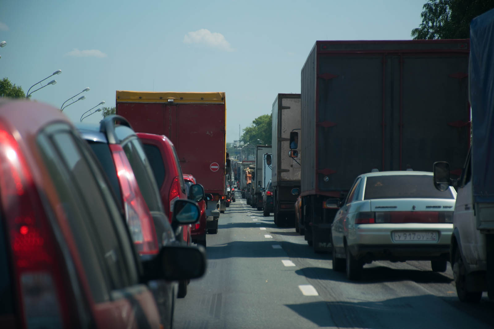
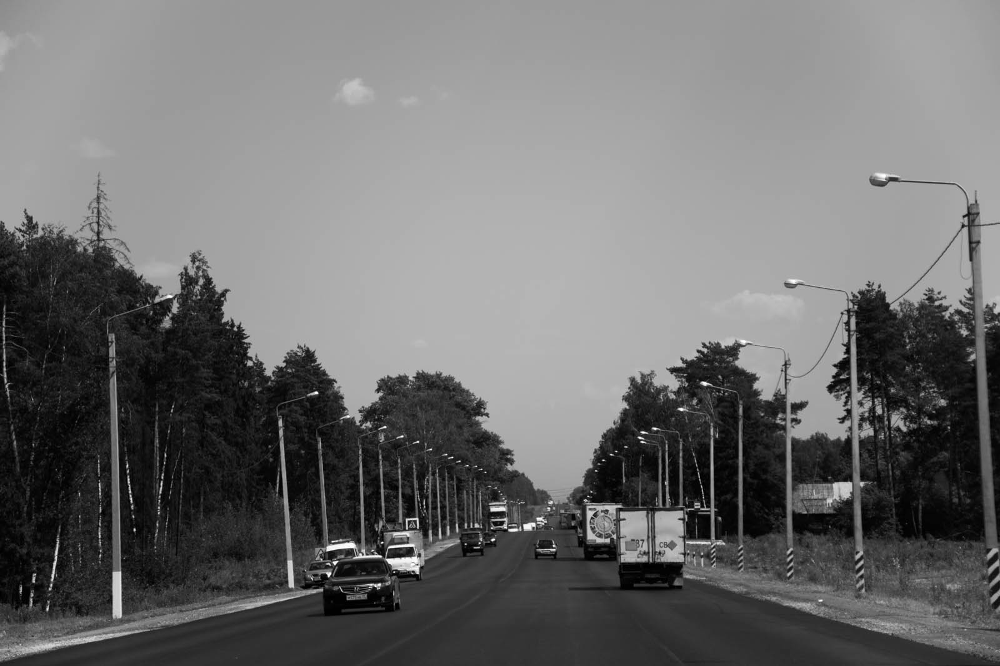
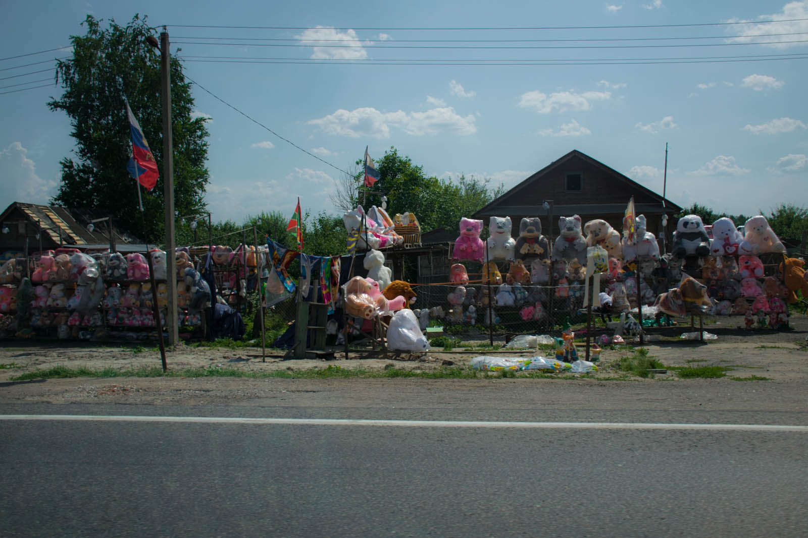
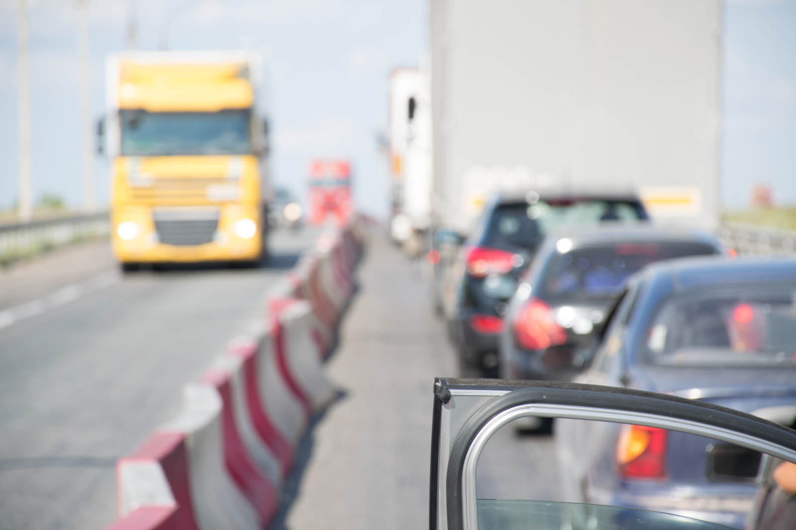
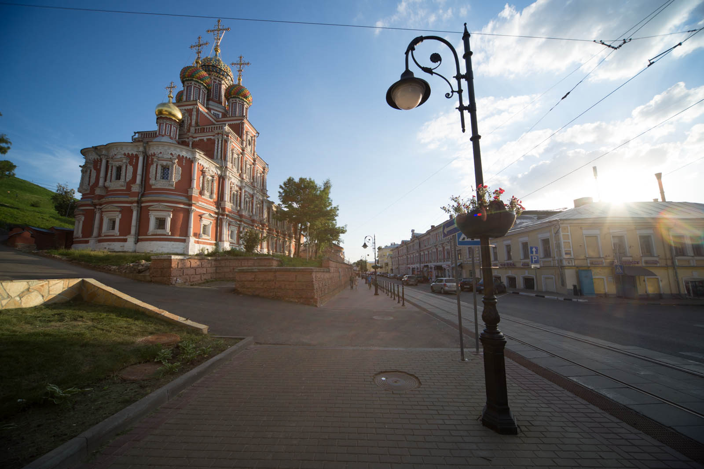
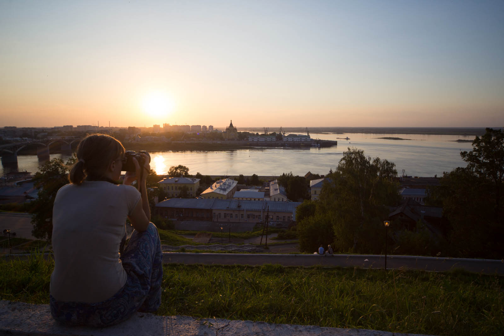

Načrt za današnji dan se je podrl, že ko sva spala oziroma, ker sva spala. Ker se tukaj tako pozno večeri, hitro izgubiš občutek za čas in sprehod po mestu se je zavlekel, kasneje delo na računalniku pa še bolj. Ker je pred nama dan vožnje, je pomembneje, da sva res naspana. V predstavništvu Iskratela v Moskvi se zahvaliva za gostoljubje, posloviva in podava na ceste.

Gužva je takšna, da si prepričan, da v predmestju delijo zastonj stvari. Le s težavo se  prebijeva v želeno smer, moraš iti s tokom, drugače ne gre. Na improviziranih križiščih (nastalih zaradi del na cesti) se izsiljuje, prehiteva na vse možne načine, po vseh možnih straneh. Matej se vživi v vožnjo in po dobri uri in pol se prebijeva ven iz Moskve. Mislila sva, da se bo gneča umirila… a sva se uštela. Po nekaj par sto kilometrih se naredi prometni zamašek in po polžje se premikamo naprej. Avtocesta je v delu in nič se ne pritožujeva, ker so luknje nujno potrebne krpanja (še dobro, da imava dobre gume!).

Katja je tokrat cel dan na sovoznikovem sedežu in skrbi, da je voznik nahranjen in napojen :) V fotoaparat se trudi ujeti vse zanimive detajle na poti a ji ti vztrajno bežijo (ker je amaterski fotograf vneto vrti vse možne koleščke okrog in okrog, zato se večino časa Matej samo drži za glavo).  Ustaviva se na nekaj bencinskih črpalkah, kjer imajo sicer poceni bencin a ga s težavo dobiš.

Enkrat sprejemajo samo gotovino, drugič moraš povedati točno količino bencina, da ti gorivo predhodno pripravijo. Zanimivo. Na  pol poti se ustaviva v Njižnjem Novgorodu. Po tem, ko sredi ceste pobereva poličko iz avta (Katja je tako vneto pospravljala avtomobil, da je pozabila, da jo je odložila na streho), se sprehodiva po starem mestnem jedru, ogledava barvito cerkev in se povzpneva na grič, kjer naju čaka celotno mesto v toplih barvah zahajajočega sonca.  O.S.U.P.L.J.I.V.O.  Filmski prizor :)

Čas in število kilometrov naju preganja, zato se še ustaviva v naključno izbrani trgovini (Spar), pojeva večerjo in podava proti Kazanu. Med današnjim pisanjem začne padati dež, vsaj v to sem močno prepričana, dokler mi Matej ne pove, da je to količina komarjev, ki usodno končajo na sprednjem oknu.

