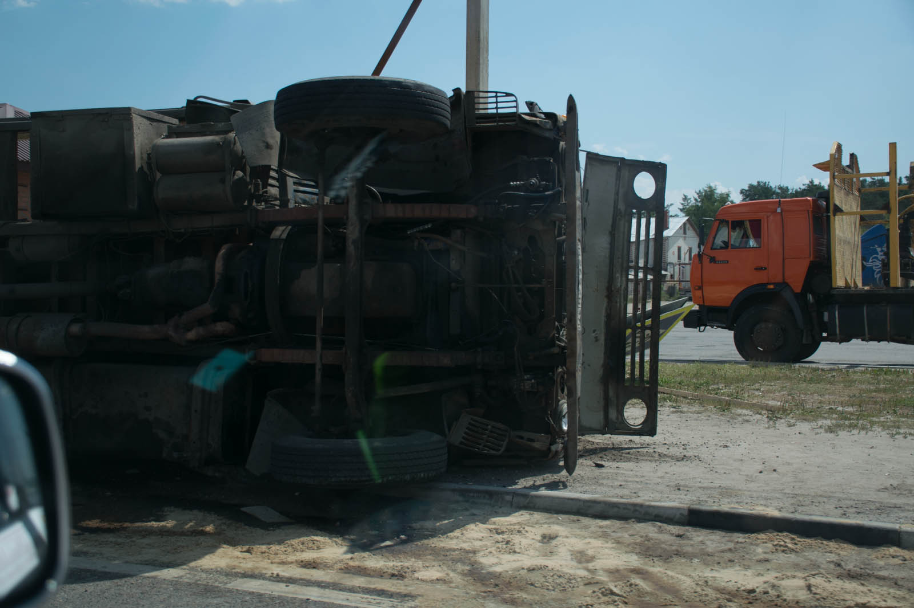
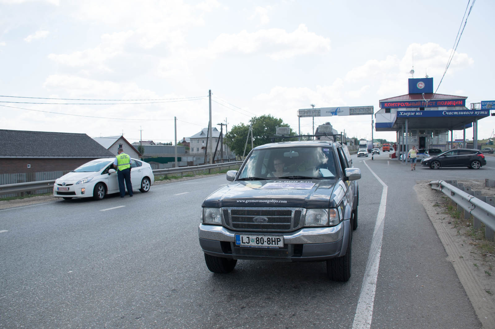
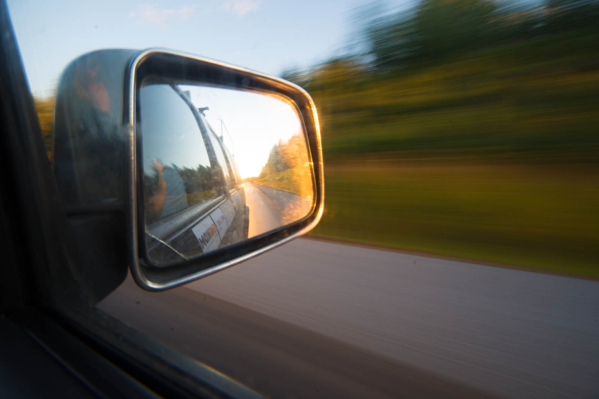

Ura je 8:30, ko se zbudiva na parkirišču na avtocesti, poleg bencinske črpalke. Ko se je včeraj Mateju začelo spati, je našel postajališče, kjer so ti za prispevek 100 RUB (cca. 40 RUB=1 €) zagotovili varnost. In kar presenečena sva bila nad številom vozil, ki so souporabila prostor. Tudi WC je bil na voljo, vendar je Katja s svetlobo hitrostjo opravila z njim, ker je v njem poleg smrdljive luknje, sobivalo tudi nešteto komarjev, ki so ob prisotnosti človeka postali nesramno lačni.

 Pogrom komarjev - ko vključiš zgornje luči, se zadeva preusmeri višje. Dober namig.

Najin današnji cilj je Perm, približno 1000 kilometrov oddaljeno mesto. Prva postaja je, sedaj že v navadi, bencinska črpalka. Stuširava avto, ker se čez okna komaj da še vidi in lučem povrneva prvotno podobo, ki se skriva pod nešteto žužki. Komarji smrdijo, in to po ribah! Na vrsto za osvežitev prideva tudi midva in ob odhodu kupiva še zajtrk, čokoladne in skutine rogljičke. Izkaže se, da še tistih nekaj rogljičkov, ki naj ne bi bili polna doza cukra, namesto skute vsebuje karamelo. Kalorična bomba! (midva pa samo sediva v avtu :) – tolaživa se, da nabirava zaloge za Mongolijo).

Podava se na pot in Matej rahlo »pojamra«  o utrujenosti. A še preden izreče stavek do konca, se začne ustavljati ob strani ceste. Katja samo debelo gleda, kaj se dogaja… Pred nama vozeči se gospod, je začel mahati, naj se ustaviva. In ker iste sorte ljudje vkup letijo, se izkaže, da gre za zgovornega gospoda tovariša polkovnika Mikhailova, ki je preprosto navdušen nad avtom in Matejevo vožnjo. Okupira ga z žganim zvarkom, s katerim nazdravita, se pomenita , medtem ko jaz trepetam v avtu in čakam, kaj se bo zgodilo, kdo bo iz kje pripeljal in kaj naredil. Ženska panika. Kmalu prideta družno še do mene, tovariš mi preda uho (ribjo juho) v Coca-colini plastenki (to bova zagotovo jedla za kosilo- NE!) in stekleničko žganja.V vednost naj povem še to – Matej je komaj zavrnil sveže ribe in zvarek česnove in paradižnikove brozge, lično zapakirane v kozarec  kislih kumaric iz katerega je lastnik pred tem že veselo srebal. BLJAK. Ker ne govorim rusko, sta si dala duška na moj račun (moški pač ne znajo opravljat). Če se nama ne bi mudilo naprej bi zagotovo padla še večerja in prenočišče. Mateju je ponudil svoje učiteljice (ker je zdaj ravnatelj šole), prej pa je bil policijski polkovnik, tako da nama je dal številko, če bova v tem ali naslednjem rajonu slučajno imela težave s policisti. »Samo pokličita,« je dejal.

Matej je po tem postal tako naspidiran, da se ga ni dalo ustaviti, prevozil je 800 kilometrov.  Res naju je kmalu po srečanju ustavil policaj, a že izven dosega pristojnosti Mihajlovega,  tako ali tako pa je šlo za rutinski pregled, ki je trajal dlje, ker sta policista želela izvedet še več o projektu. Celo načelnik je prišel stisnit roko.  Najina pot zavija proti severu. Avto sva, zaradi naliva, v tem dnevu pošteno posvinjala, zato zdaj že spretno vihtiva gobico in čistilo za steklo. Vasi ob cestah so začele postajati tipično ruske in sem in tja spominjati na barakarska naselja. Pokrajina je čudovita, prostrana, močvirje se izmenjuje z zelenimi travniki. Tu bi se dalo pridelati hrane za pol sveta. Drugače pa so oči uprte v cesto, ki preseneča z res grdimi luknjami in razpokami.

Celo pot naju spremljajo table, ki označujejo oddaljenost od Moskve oziroma glavne povezave.  Ob cesti se od časa do časa pojavi odsek, kjer imajo prave male razprodaje – seveda večinoma neuporabnih stvari, kot so plišasti medvedki in pisani cofki. Seveda je na tem odseku 30 stojnic, kot mali kitajski bolšjak. Poleg stojnic pa se globoko v Rusiji najdejo tudi prodajalke ljubezni, ki postopajo ob robu ceste, nosijo grdo, florestenčno perilo ali pa samo mrežasto majico, da se vidi, kaj se prodaja. Ne bi se čudila, če so to odseki z največ smrtnimi žrtvami :).  Ko potujeva mineva čas hitreje, kot bi si mislil. In to dobesedno.

Sedaj sva pred vami za štiri ure (danes sva prešla kar dva pasova) in večeri so svetli še ob 00:15, ko zavijeva v center Perma, ki naju sicer ne fascinira, si pa na njegov račun privoščiva nočno pojedino. Še dobro, da so nekatere trgovine odprte 24 ur. Odločiva se, da narediva še nekaj kilometrov, vsa vesela, ko zagledava oznake za avtocesto.

 Prvi znak Ekaterinburga.

Srečna sva bila cele 4 kilometre, nato pa je bilo potrebno zaviti nazaj v realnost s polno obvozi. Utrudiva se in kmalu zavijeva na bencinsko postajališče, kjer prenočiva. Čuva naju udomačen pes.

 Fun fact: Še vedno fotografirava vsako Lado Nivo.
