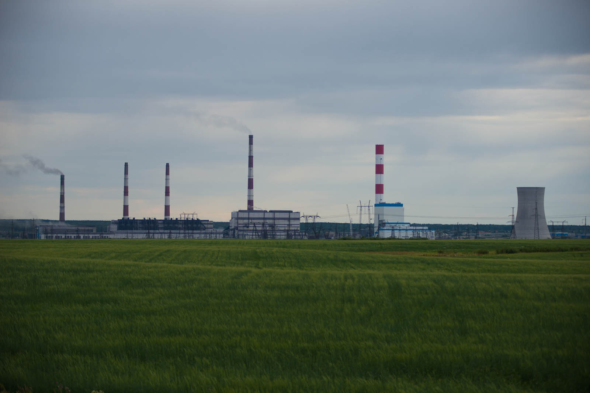

Zbudiva se v relativno mrzlo jutro in za telovadbo prehodiva razdaljo od centra do IUT. Čez park pri hotelu Oktyabrskaya Matej seveda odteče standardni kilometer tako, kot se spodobi tudi pri -26 stopinjah. V IUT naju pričakajo šefi s kavico in sladkorčki in se poslovijo od naju, kmalu pride Kiril. Ker je v Ekaterinburgu prav na ta dan največje srečanje motoristov in nastop super akrobatske grupe na motorjih, štirikolesnikih in snežnih saneh, naju Kiril pospremi sam.

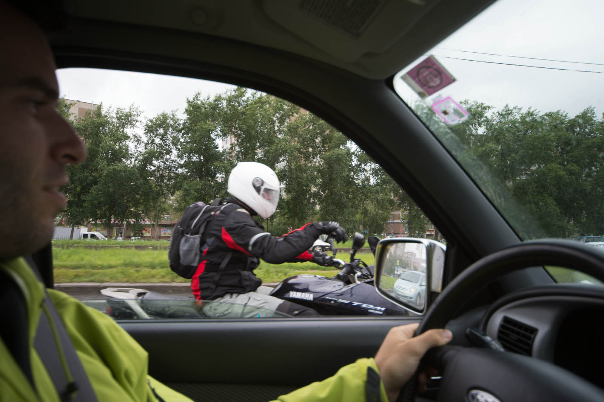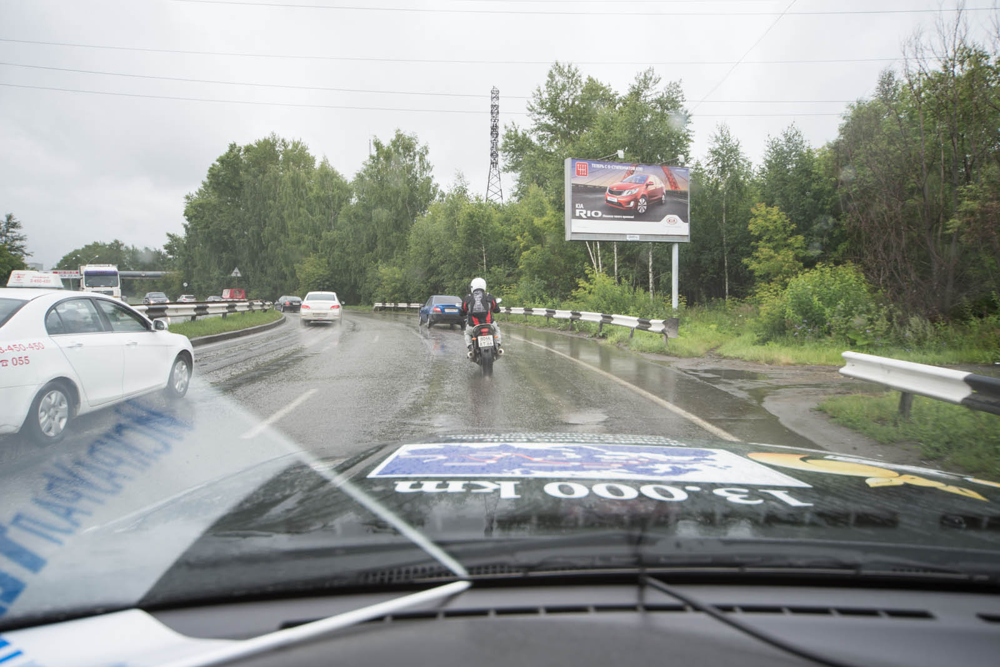

Odlično odpelje del poti v dežju po Čeljabinskemu traktu, vmes se snemamo in pogovarjamo (ob stanju v vrsti). Pelje se naprej in naju fotka, ko padeva mimo. Pravi, da je to navada v teh krajih, da se tako pomembne projekte pospremi iz mesta (posebej je prišel vprašat za dovoljenje in govori popolno angleščino). Poslovimo se ob robu avtoceste, ob tradicionalnem fotografiranju z njegovim motorjem Yamaha TDM 900 mine še pol ure. Super fant, zares. Ko znova prideš v Slovenijo, ti pripravimo sprejem, kot ga še ni bilo.

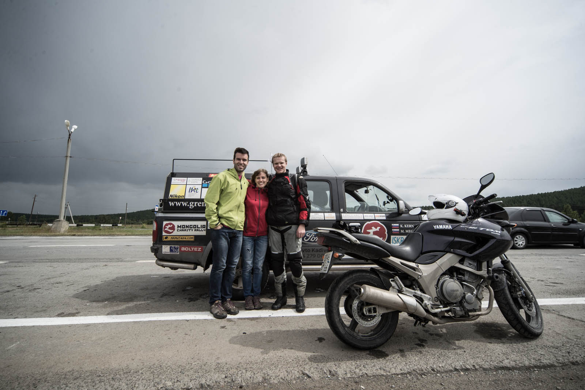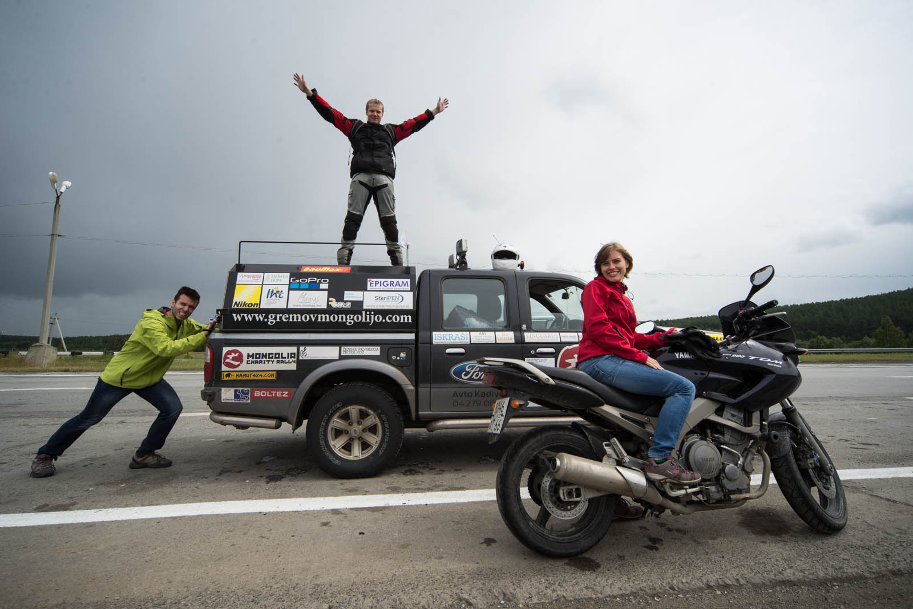

Midva nadaljujeva proti Chelyabinsku, proti mestu, kjer je lansko leto padel meteorit. To tokrat ni najina destinacija (ker sva enega zgrešila že lani v Estoniji), tokrat imava za bregom še nekaj hujšega. Matej si že dve leti želi priti v bližino Snežinska. Gre za majhno mestece, ki ga ne najde noben GPS sistem (poskusila sva s Sygicom, Be-on-road in z Garminom, pa ni šlo). Razlog je sila preprost – nobena od teh firm se še ni peljala po njegovih ulicah. Snežinsk je mesto, zgrajeno za podporo eni največji ruskih jedrskih elektrarn. Pripeljeva se nekje 15 kilometrov pred mesto, kjer naju preseneti tabla in zapornice.

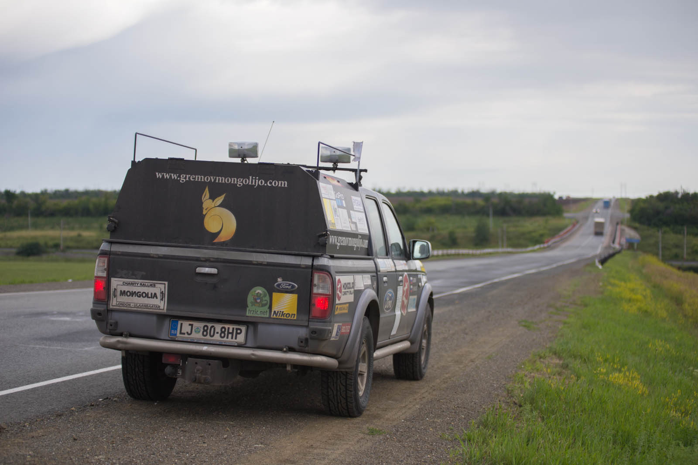 Pred Kazakhstansko mejo.

No, ne presenetijo naju, saj sva vedela, da bo tako. Tudi prebivalce (okrog  50.000 jih je) vsakič znova ob vstopu ostro pregledajo, preverijo avtomobile. Razen prebivalcev je vstop v mesto prepovedan, vojaki imajo pri sebi nabito orožje in dovoljenje za takojšnjo nevtralizacijo. Na obrobnih cestah so postavljene električne prepreke (najbrž nek EMP (elektromagnetični pulz) sistem. Nisva preverjala, fotografirala sva se s tablo in pogledala ogromen kompleks v daljavi, nato pa je krmilo prevzela Katja. Matej srečen, bližje za časa tega življenja ne bo šlo.

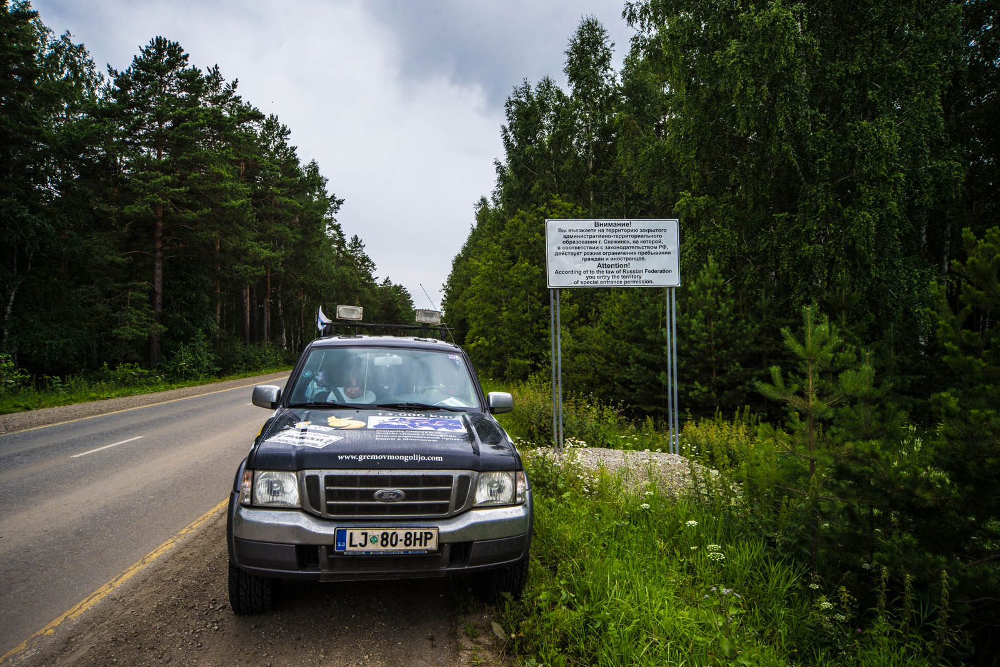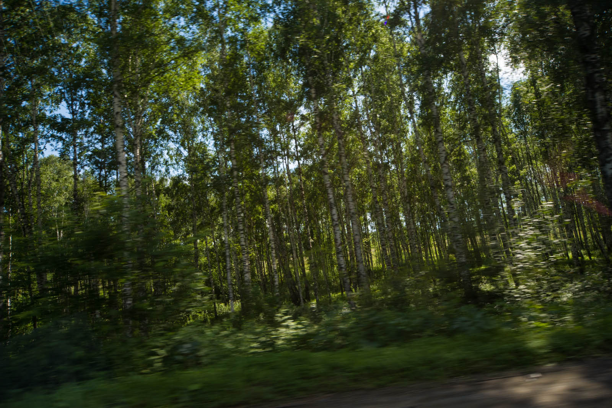

Spektakularno hitro obvozi Chelyabinsk in prepelje do Troitska, Matej vmes fotografira, snema in dela vse mogoče vragolije (pri 100kmh+ skozi odprto okno fotoaparat ipd.). Zelo se potrudijo ob vhodu v mesto, prav tako jim je zelo pomemben grb mesta. V Naklem imajo pa hlod v rondoju. No, v Tržiču ga pa še čakamo. rondo namreč. :)

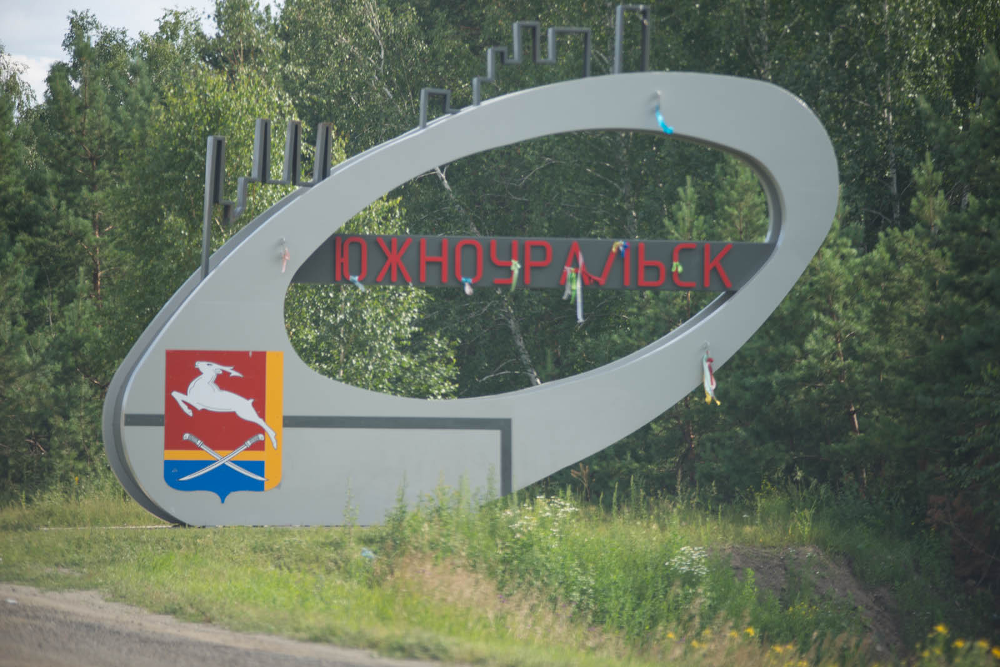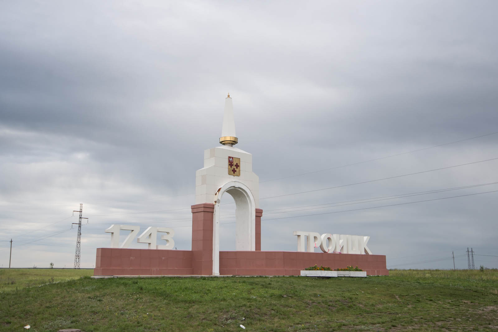

Ukazi sledijo kot za šalo. Seveda, izkušen fotograf namreč. Poglej tako, poglej sem, poglej tja, ne takole, nižje in desno. Ob enem pa držati gas, prehitevati vsepovprek in še biti lepa. Ja, Katja ima na tem potovanju težko nalogo in ji odlično uspeva. Imava nekaj promocijskih fotografij, takih bolj spektakularnih. Ford se drži super, zjutraj malo sopiha ob prvem vstajanju tako, kot midva. Verjetno bo kriv dizel (cena padla na 0,68 EUR), arktičnega pa nimajo, da bi poskusila, kako gre s tistim.

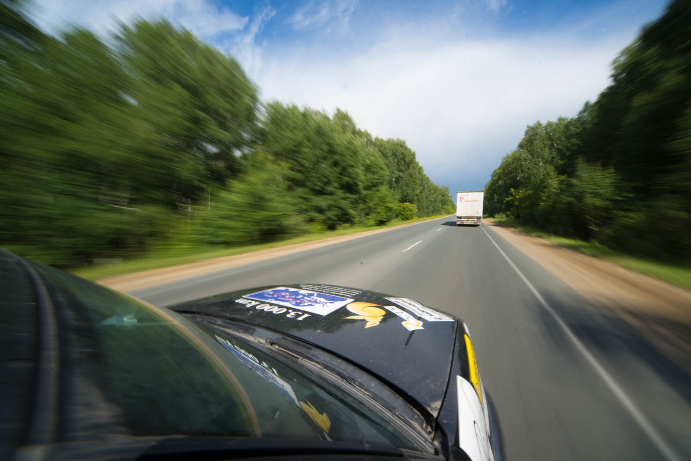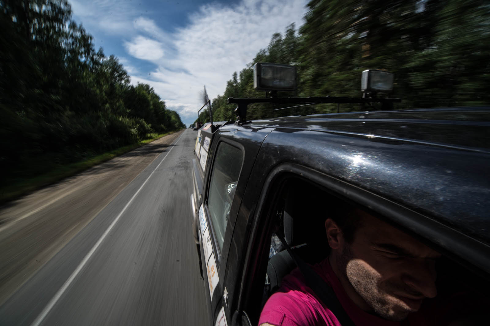

Olja malo je, tako da bo kakšen literček treba priliti, ampak šele čez kakšnih 3tisočake. Aja, to bo konec tedna. Poleg tega se nekaj kuha pod pokrovom in topel zrak uhaja ven pri pokrovu motorja na voznikovi stran - če te zebe, se tam pogreješ. Drugače se pa ne pregreva. Pa Matej je malo nakrivil voznikova vrata, ko mu jih je vzelo iz rok, ko je šel ven in srečal piš izza tovornjaka, zdaj včasih slišiš majhen piš ob vožnji nad 100kmh. Tale najina Žvau se super drži, le tako naprej. To so vse malenkosti, dokler zdrži tisočaka na dan, je res odličen in v formi.

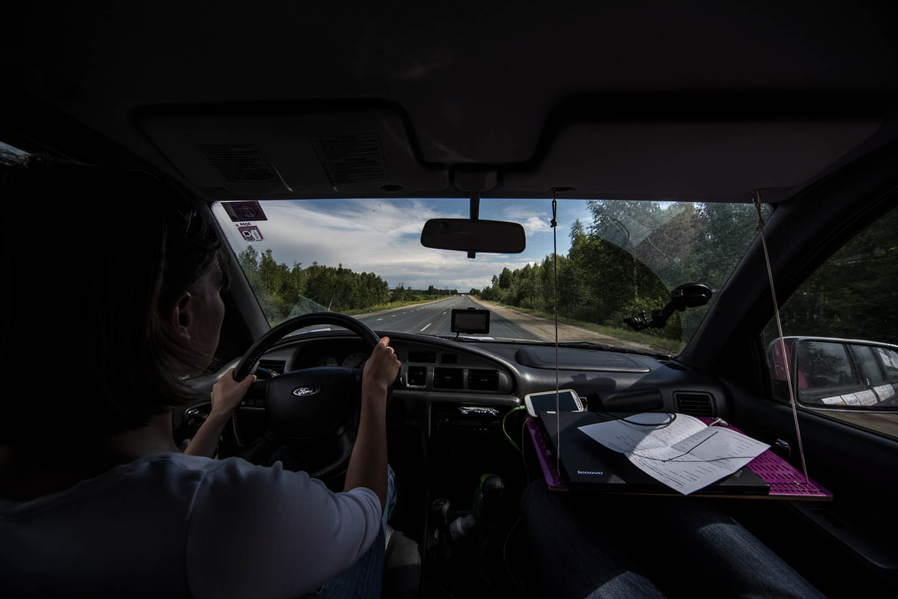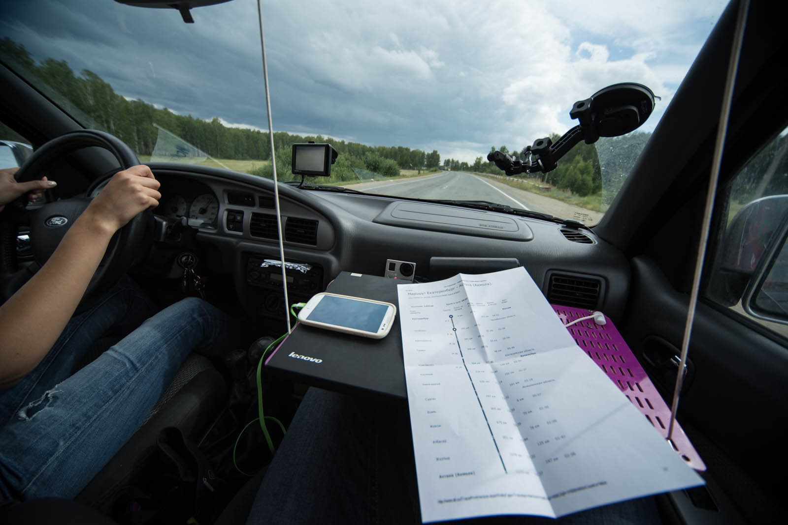

Seveda je vsak dan zjutraj pregled olja, drugih tekočin, pod avtomobilom, preverjanje tlaka v vseh štirih gumah, preverjanje tovora zadaj, luči, čiščenje stekel ipd. Nato se tak pregled ponovi vsakih 300 kilometrov, da bi čimprej odkrivala morebitne napake in jih popravila, preden bi bilo prepozno. Zaenkrat razen pomanjkanja čistila za stekla ne čutiva nobenih težav (imava pa 2l vitreksa, samo ustaviti se je potrebno).

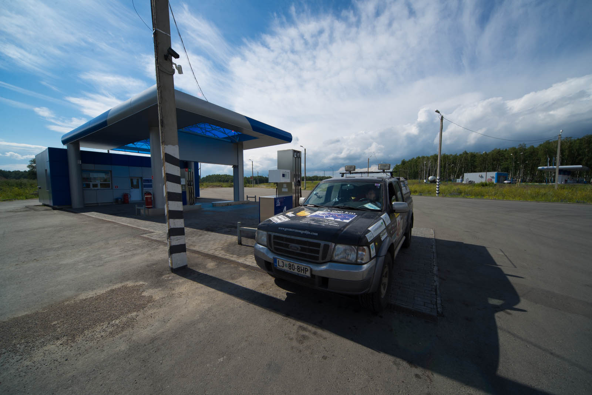 Po pregledu na eni izmed črpalk.

No, nazaj na pot. Sledi meja, na kateri spet čakamo. Preverijo avtomobil, sprašujejo, če imava orožje . So zelo arogantni, ko poveva, zakaj se gre, pa čestitajo, pozdravljajo in se zelo potrudijo. Vmes igrava remi na narobe obrnjeni mizici od Janota, ki se BTW obnese super. Vse gre lepo mimo, skozi sva v točno treh urah. Zmerno. Peljeva se po Kazakhstanu, voziva 110 (toliko je omejitev izven naselja, v naselju 60). Še ena pomembnost je: VSI se držijo omejitev. Če je naselje, je 60. In niti kilometra več. Očitno so kazni dovolj stroge.

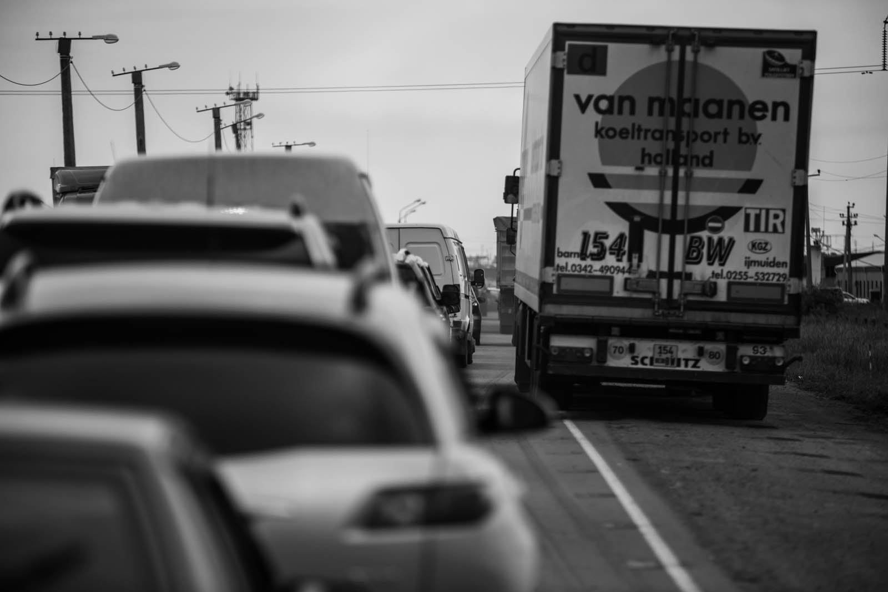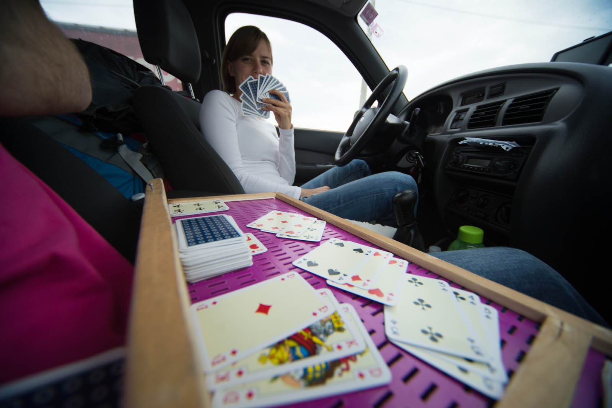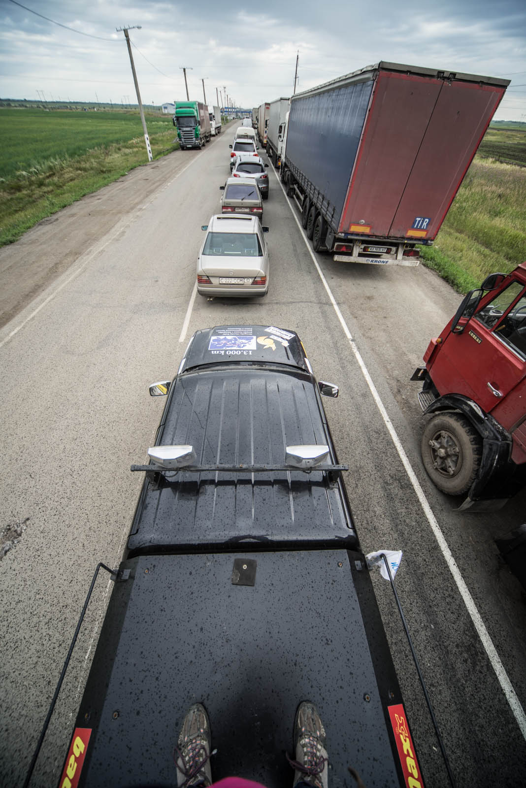 Iskanje novih kadrov te vodi v čisto nove razsežnosti.

Prideva do prve kontrole čez 30 kilometrov, kjer naju prijazno opomnijo, da nisva kupila zavarovanja za Kazakhstan – aka zelene karte. Jaz grem v pisarno, kjer sem zaslišan od gospoda komandirja. Vse, od tega kam greva, kdo sva, kaj sva po poklicu ipd. Seveda je kazen ogromna, kljub temu, da sem takoj povedal, da naj mi pove, kje naj zavarovanje uredim in ga grem takoj urediti, hočejo 200 dolarjev. Težava je tudi v deklaracijah, ker je avto registriran name in ga je vozila Katja (v Belorusiji so pač predpostavili, da vozi samo moški). Potem se zatopiva v najino pot, pa zakaj čez Belorusijo, zakaj voziva oba ipd., povem da sva dobrodelni projekt in da tako hitro en človek ne zmore prepeljati avtomobila (Razen profesionalcev op.a.), in komandir hoče videti avto. Ko vidi, da je ves polepljen, mi stisne dokumente v roko in reče, naj greva nazaj kupit zavarovanje in srečno pot. Presrečen ga kar objamem. Greva nazaj, kupiva zavarovanje (stalo je 3 eur za deset dni, halo), zamenjava denar in nadaljujeva pot, spet ponoči. Luči, ki so nama jih podarili pri Mamutu, instalirali pa pri Avtoelektriki Šlibar Zvirče, se da peljati veliko hitreje, saj vidiš vse okrog sebe (HALO), pa še komarji se usmerijo višje in na prednje steklo dobiš samo 1/10 vseh trupel. Nočne poti so nevarna predvsem zaradi tega, ker hitro zakinkaš med vožnjo. Ali voziš prepočasi. Midva imava zaenkrat kar srečo, se bova pa nočnim vožnjam v bodoče izogibala. Voziva pa tudi nočno relativno na polno, na ca 85% dnevne vožnje - zelo po pameti, ker je vsak nepravilen korak lahko slaba volja za noč in dan potem.

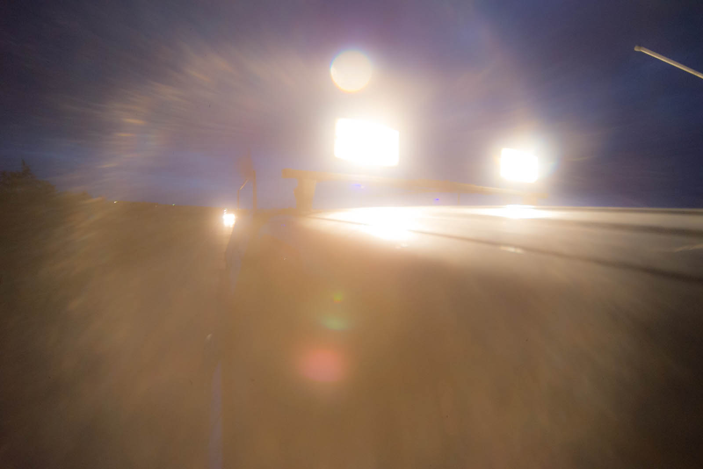

Prideva še 100 kilometrov naprej, pot niti ni tako slaba. Sva presenečena. Prespiva na varovani postaji za tovornjake skupaj še s petimi vozniki. V avtu. Plačati je potrebno zjutraj, ko pride lastnik. Procedura za spanje je zdaj že dobro znana, spiva v avtu. Zadnje šipe dol za 5cm, pred vsak prednji sedež po en ruzak, vso fotoopremo v svoj ruzak, blazino na sedež za izravnavo, sedež do konca dol, spalko čez, čevlje zatlačit v predel med ruzakom in steno avtomobila, zategnit ročno, vzet pendrek, zapreti vrata, zakleneš, solzilec na svojem mestu, ključ iz ključavnice na svoje mesto, telefon z alarmom na števce, preverit elektriko in vse izklopit, ugasnit luč, pregledat okolico, se uležeš, brisačo pod glavo (Katja pa Piksla) in spiš.
