Zbudiva se v hladno jutro, kot tiste prve pomladne dni, ko še ne veš točno, ali bi oblekel jakno, ali ne. Zapustiva industrijski Permski okraj in nadaljujeva nazaj na jug. Po nekaj dvajset kilometrih se ustaviva na gričku pred tablo Svedrlovskaya oblast. Nikjer nikogar, tišina. Katja spi v avtu, jaz fotografiram. Očitno je niti jame in poskoki ne ovirajo več – no, nikogar ne ovirajo več. Oba dva zelo lepo izkoristiva tisti vmesni čas, ko ne voziva.

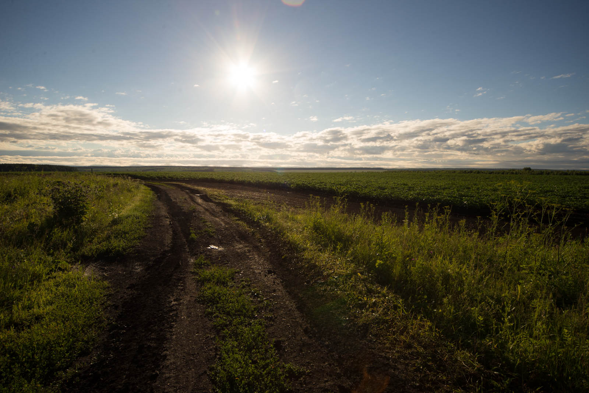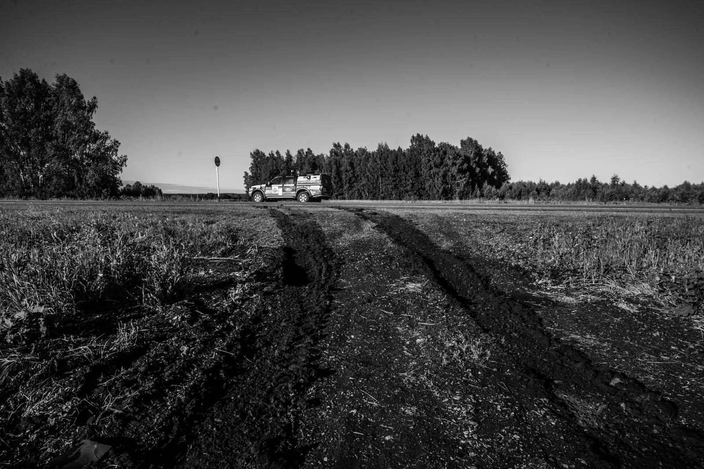

Sprehodim se po potki in zares uživam v samoti. Svedrlovsk je drugačen od ostalih okrožij, vsaj zame - kamorkoli pogledaš,  do koder seže pogled, je čudovita hribovita pokrajina s travniki in gozdovi – in niti ene hiše. Niti ene. Izkoristim svojih deset minut in samo uživam. Mimo se pripeljeta dva avtomobila, tudi Permski trakt je še jutranje zasanjan. Tovornjaki svojo pot začnejo šele po osmi uri. Že drviva naprej in kar padeva v Yekaterinburg. Pravzaprav prehitro. Prehiteval sem rešilca (star Ural, res smešen. Spominjal je na prvo izvedenko VW kombija) in me na stran pokliče radar. 87kmh kjer je bilo 50kmh . Kazen 500 RUB – 11,5 eur. Bom preživel.

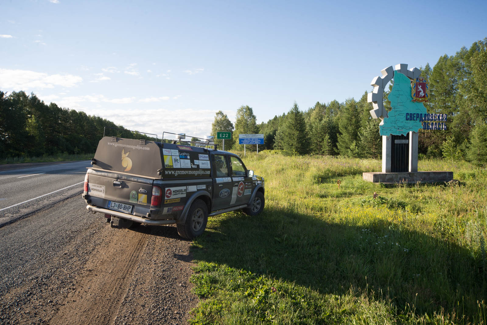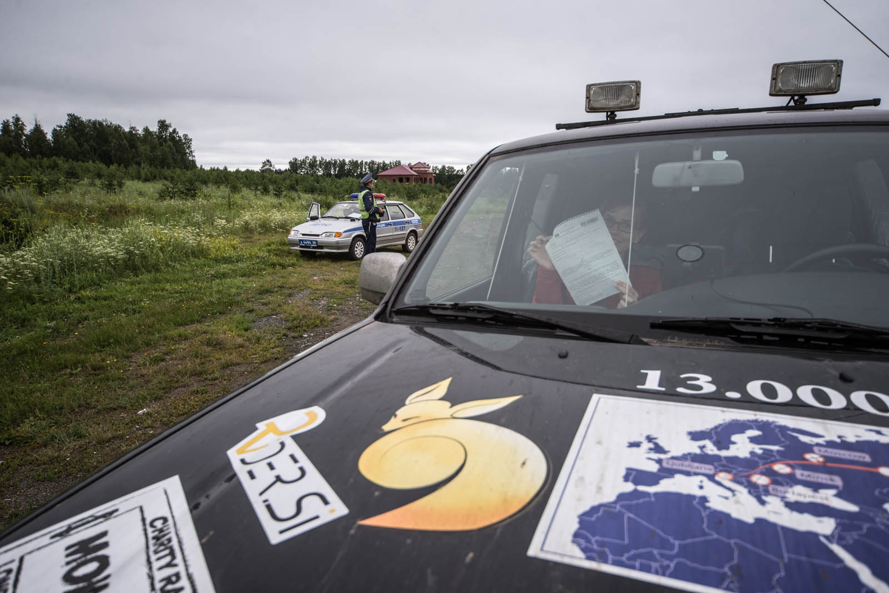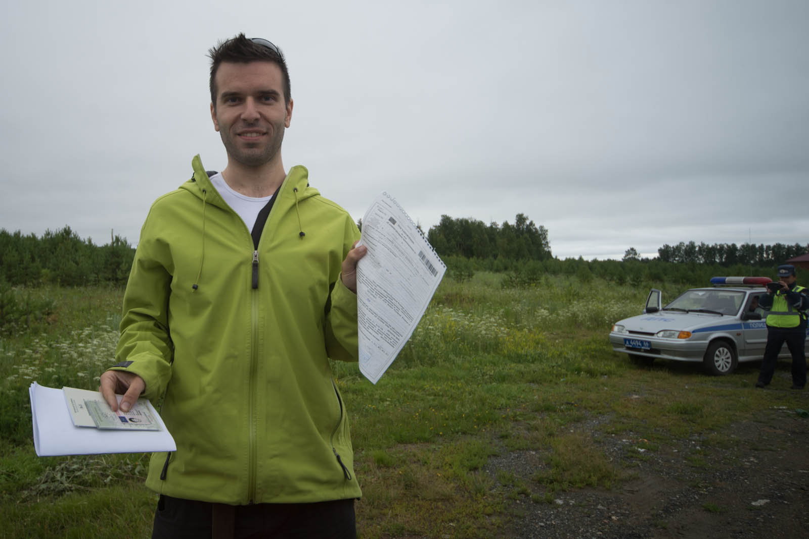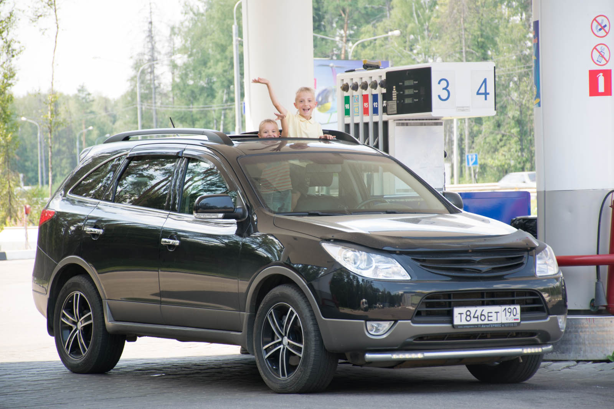

Na bencinski pomahava še mulcema v avtu, ki uživata v trenutku čakanja na atija, da mu pokažeta, da znata odpret šibedah. Ziher bosta čez 20 let vozila Mongolia Charity Rally, carja. V Ekatu je gneča, kot ponavadi. Prebijeva se skozi center in se na uvozu v firmo preoblečeva in si umijeva zobe kar z gazirano vodo. Smrdiva. Tri dni divjine in 2000 prevoženih kilometrov pač terja svoj davek. Da bo bera polna, se ravno takrat pripelje direktor podjetja. Pomahava in se odpeljeva za njim. Sprejmejo naju kot kralja, počutim se, kot da bi prišel domov.

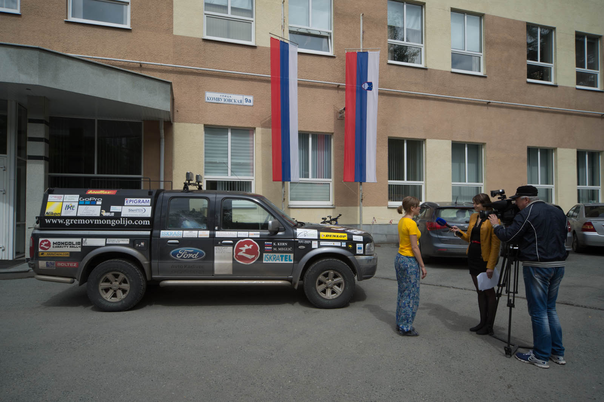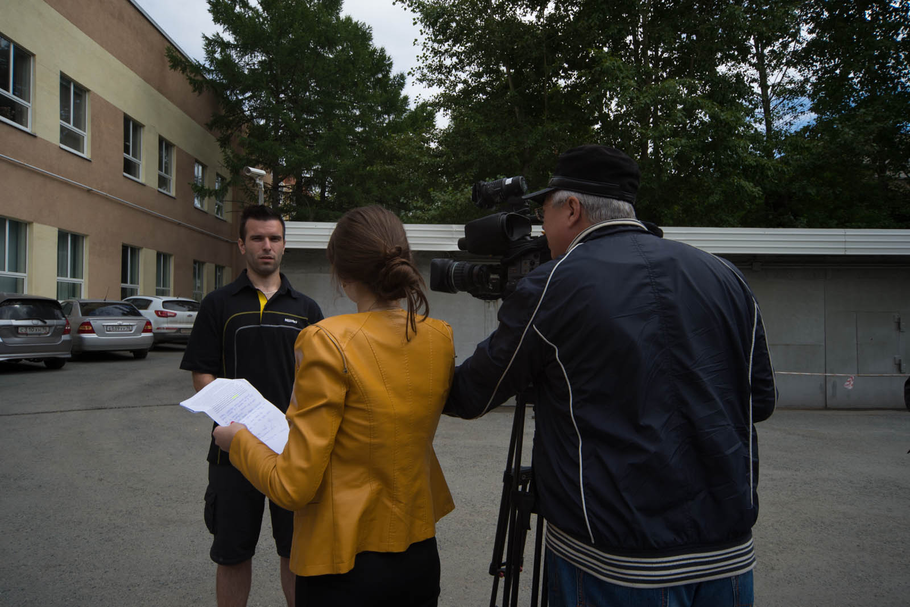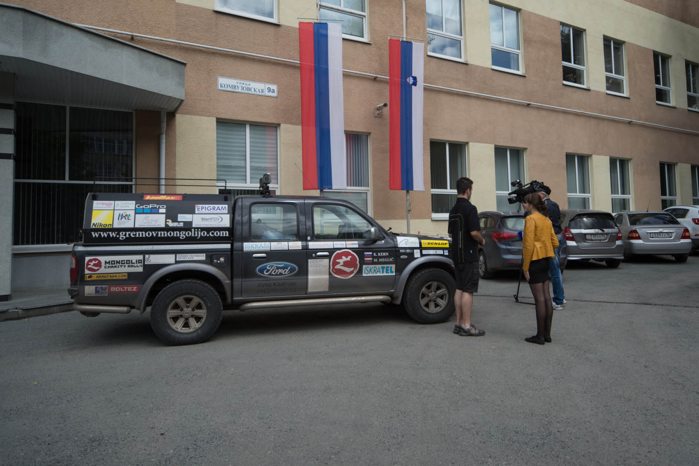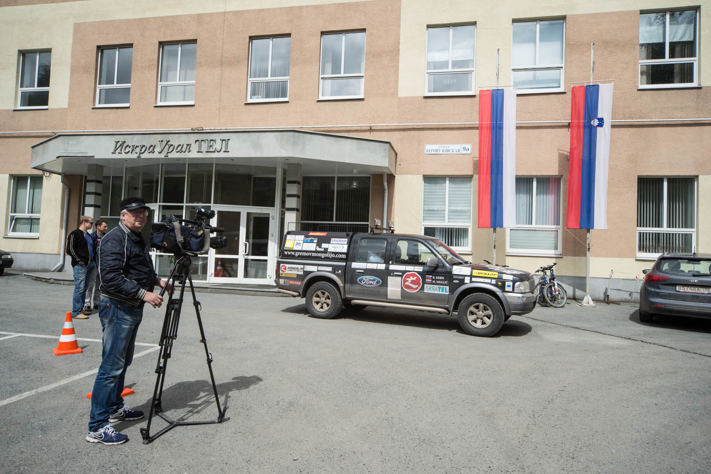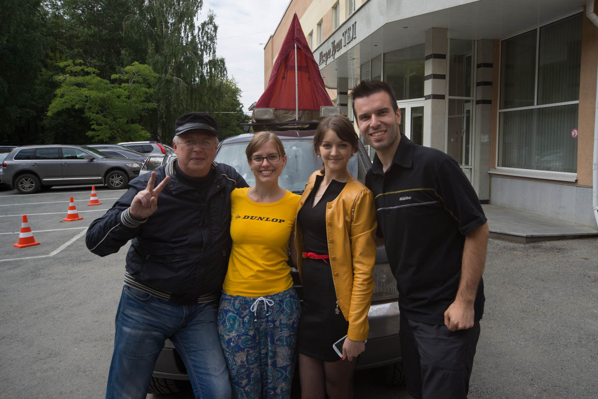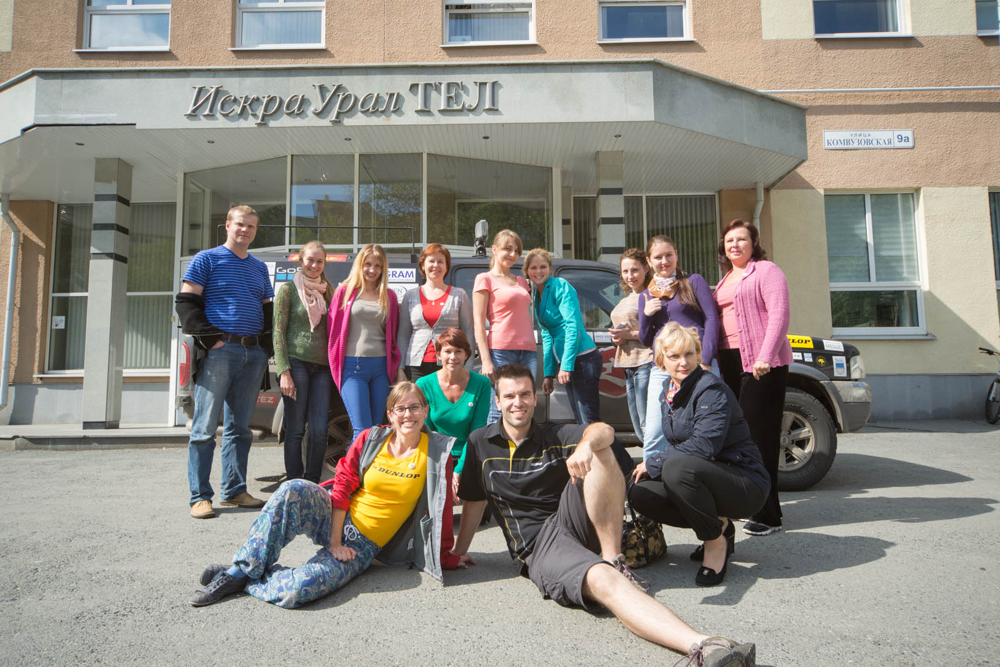

Katjo okupirajo prav tako, kot mene in ne najdejo nobenih komunikacijskih ovir. Uporabljajo Google Translate. Kako znano. Kar naprej kličejo novinarji za objave v lokalnih časopisih (Yekaterinburg ima 1,4 milijona prebivalcev, da bo jasno, kaj je to lokalno), nato pride še televizija in posnamemo cel prispevek. Jaz ruska vprašanja prevajam v slovenščino, Katja odgovarja v angleščini in jaz prevedem odgovor nazaj. Kako uporabno. Novinarka je super sladka in prijazna, nasploh se nama zdi, da v bivšem SND  humanitarnost jemljejo precej bolj k srcu. Vsi nama kar naprej čestitajo  in naju pozdravljajo. Uredijo nama poceni stanovanje v strogem centru, ker pa sva zelo pozna (uporabljava še internet za objavo prejšnjih objav), zamudiva šoferja in se do centra odpraviva z maršrutko (mali avtobus za 20 ljudi). Seveda Yekaterinburg poznam kot lasten žep, resno. In tokrat bravurozno zgrešim avtobus, kar naenkrat se znajdeva 11 kilometrov stran v nakupovalnem centru, voznik pa zavpije: »Zadnja postaja«. Katja začne umirat od smeha, čez nekaj minutk pa najdeva prevoz nazaj.

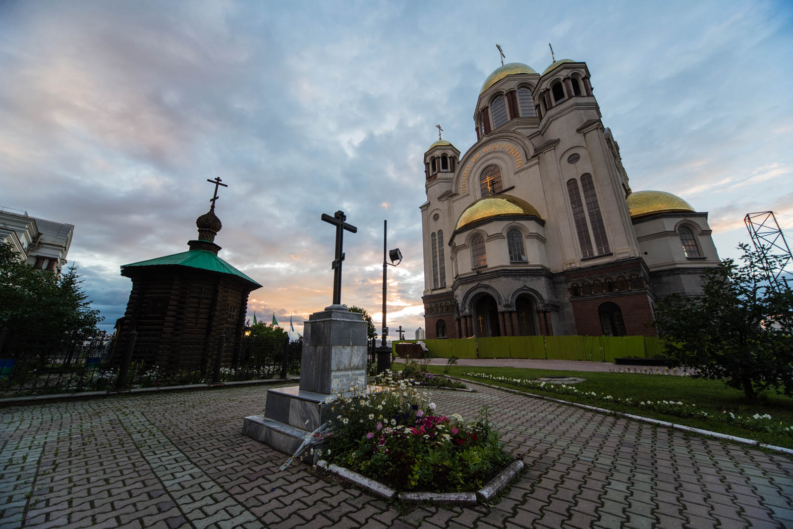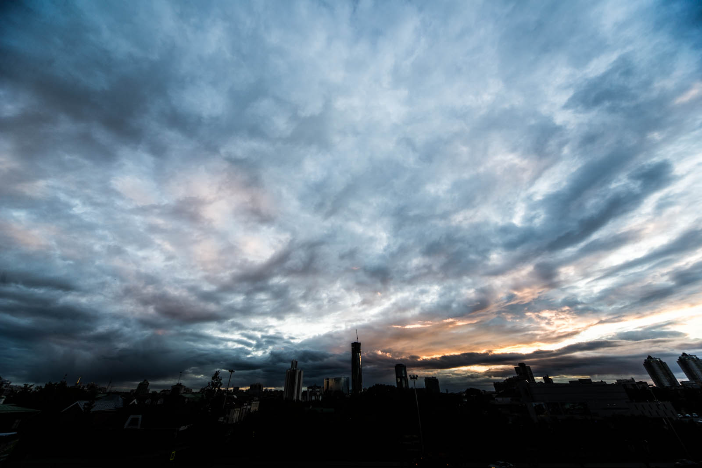

V stanovanju pade pre-potrebni tuš (opravičujem se vsem sodelavcem, samo prej res ni bilo časa, vi ste bili bolj pomembni), nato pa raziskovat mesto. Ogledava si glavni ulici, Cerkev na krvi (sezidana na mestu, kjer so pobili carsko družino Romanov), nato pa doživiva fenomenalen sončni zahod nad mestnim bregom. Sledi McDonalds in internet. Katja srečna, Matej srečen. Doma še enkrat tuš. In spat.
