V jutru, ob prvih sončnih žarkih, ko se avto spremeni v pravo konzervo, odpreva okna in vdihneva kazahstanski zrak. Temperature so osvežujoče in spominjajo na zgodnjo pomlad. Posteljo spremeniva nazaj v sedeža in počakava na lastnika posestva, da se mu zahvaliva in plačava za parkirišče/prenočišče. A ostalo je samo pri tistem prvem,  zahvaljevanju. Ko je radovedni  gospod izvedel kdo sva, iz kje in kam sva namenjena, je  zavrnil plačilo in nama zaželel srečno pot.

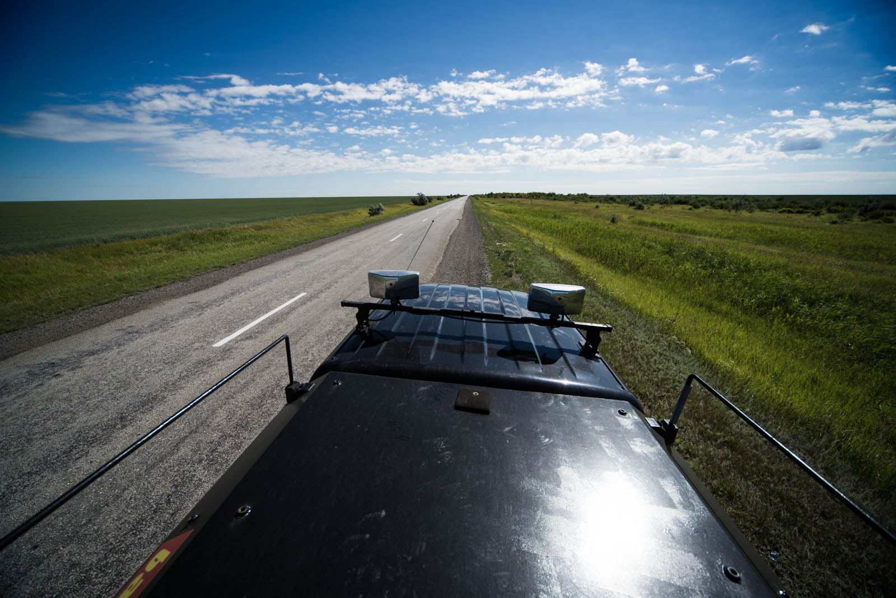 Postanek ob cesti.

Dan se je začel s prijetnim presenečenjem , le kaj bo še sledilo. Pokrajina se je popolnoma spremenila. Ob cestah naju še vedno  pozdravi kakšna značilna ruska breza, vendar vedno redkeje. Prevladuje trava, v različnih odtenkih zelene,  ki se meša z nizko rastlimi grmički, sem in tja raste šop barvnih cvetlic. Okoli naju pa sama ravnina. Občutek je isti, kot poleti, ko zreš v obzorje morja, ki ti daje občutek neskončnosti.  Na poti sva videla mogoče  dve vzpetini, ki sta komaj vredni tega naziva (s tem bi se strinjala še moja sestra, ki ima zalo stroge kriterije kar se tiče naklonov). Ob cesti na vsake toliko časa sameva  avtobusna postaja, ki stoji  za vaščane, ki so od nje oddaljeni najmanj 3 kilometre (verjetno morajo imeti res tehten razlog, da gredo na avtobus :)). Vseeno je nekaj obcestnih vasi s preprostimi hišami. Pred njimi srečava pastirje in pastirice čredam krav, koz in tudi gosk.

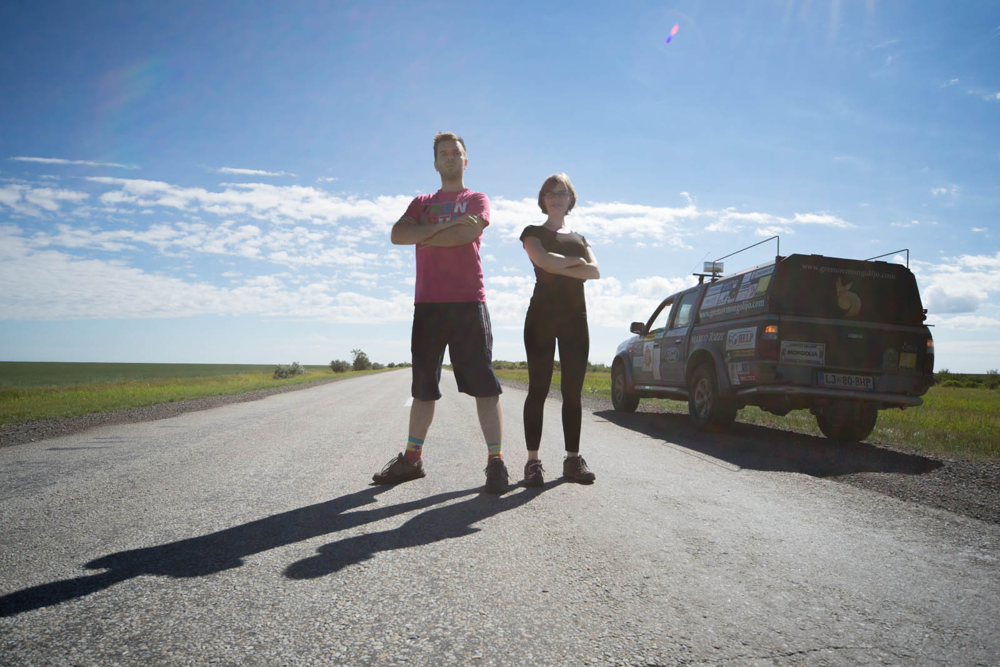 Promocijsko fotografiranje.

Najina pot vodi do Astane, glavnega mesta Kazahstana.  Na cesti sva skorajda sama, verjetno zato, ker je nedelja. Želiva si ogledati pristno kazahstansko podeželje, zato se odločiva izbrati cesto, ki ni najboljša. Že prej sva slišala, da znajo biti ceste v Kazahstanu slabe, a sva prepričana, da ne bo tako hudo. Katja se usede za volan in vožnja se prične. Sprva se smejiva, luknja tu, luknja tam, pa hribček … malo naju »zruka«, malo skačeva, eh nič hudega. Luknje se stopnjujejo in počasi stvari niso več smešne. Po cestah ubirava pravi slalom, luknje so tako široke in globoke, da bi lahko imele tiste goske svoje jezero, in tako hinavske, da me ob vožnji par krat skoraj zadane kap, ker se nenapovedano za visoko razpoko pojavi še luknja, kaj luknja, krater. Trikrat prav grdo zapeljem vanje in z Matejem ostaneva brez besed, samo še globoki vzdih, srebanje in glavobol.

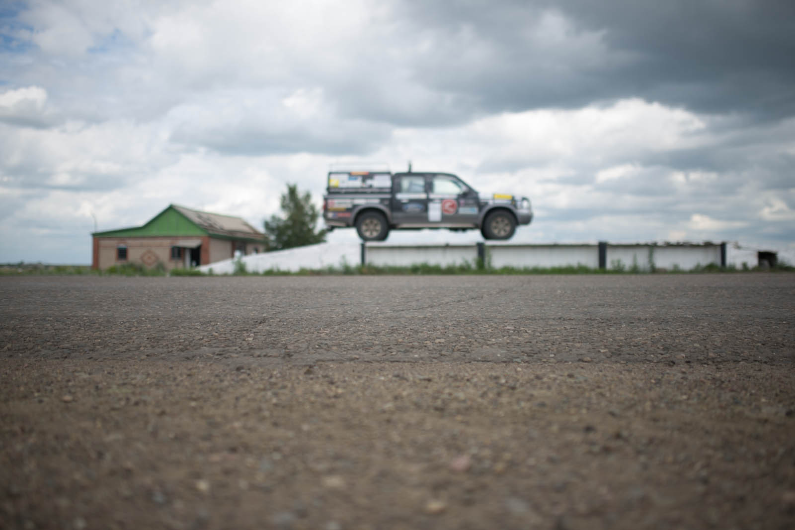 Kanale imajo tukaj na voljo za vse. Najbrž jih tudi vsi potrebujejo.

Nimam pojma, kako je to sploh mogoče! Še nove ceste, ki jih delajo,  so v nevoznem stanju že od samega začetka, tiste, ki so jih skušali zakrpati pa imajo na sebi toliko različnih krp betona, da se prvotnega ne vidi več.  Ali to počnejo namerno?! Pridejo malo »poštemat« in tako prihranijo denar za ležeče policaje?!  Ali se dogajajo taki tektonski premiki, da je sredi ceste celo gorovje? Betonske ceste celo zmanjka in ker je vožnja po preluknjanem makedamu nevzdržna, zavijeva na improvizirano pot na travniku. Pravi off-road.  V šestih urah prevoziva celih tristo kilometrov in iz ure v uro sem bolj obupana. Za češnjo na smetani se skregava še z Matejem in sledi nekaj neizbežnih solz. Ne grem se več.

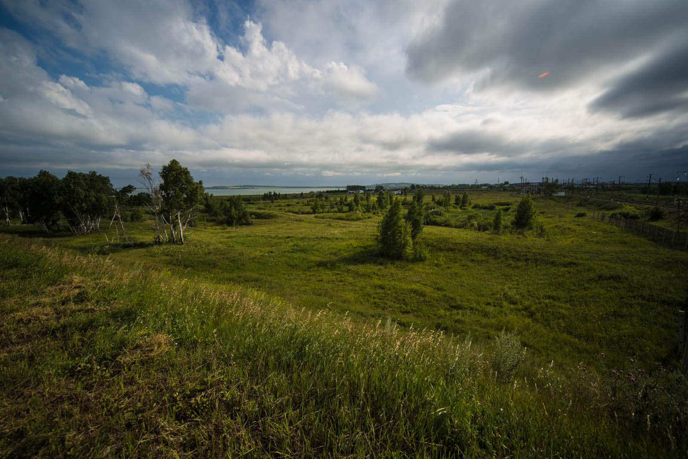 

No to ni čisto res, vozim še naprej, vendar kot po jajcih, zraven pa upam na nadnaravne moči – kakšen rentgenski vid, bi mi prišel zelo prav. Občudujem domačine, ki prehitevajo in se peljejo, kot da ni nič. Z Matejem jih samo gledava. In to avtomobili, ki bi nasedli desetkrat hitreje kot najina žvau. Nekaterim se nekajkrat prilepim na rit. Izgleda, da poznavalci domačega terena pritisnejo gas in kar preletijo vse luknje.

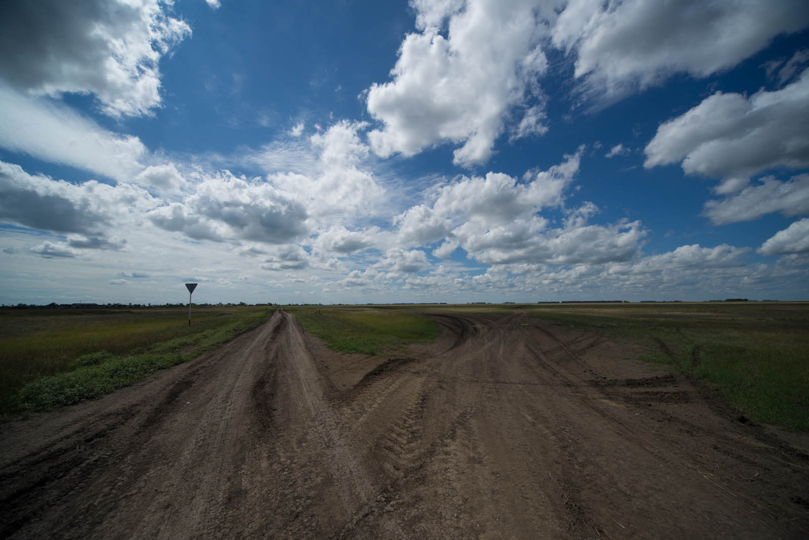 Kaj pa vi delate letos poleti? Po kateri poti naprej?

Ustaviva se v mestu Kokšetau in z lupo iščeva odprt market. Uspe nama in dobra volja ob smešno nizkih cenah pride nazaj. Privoščiva si sladoled za 50 centov  v marketu, ki  je identičen našim trgovinam izpred let, ko še ni bilo toliko izbire , bili pa so žvečilni v obliki cigaret in tisti s polnilom v sredi, pa male čokoladice in sladoled za nekaj tolarjev.

 Trans-Kazans-Sibir 
Od tu naprej krmilo prevzame  Matej in kot nalašč luknje izginejo, potovalna hitrost se vrne na 110, kmalu pa zavijeva tudi na avtocesto, štiripasovnico, ki pelje do Astane. Vrhunsko, še posebej po tem, kar sva prevozila. Mateju se kar smeji.

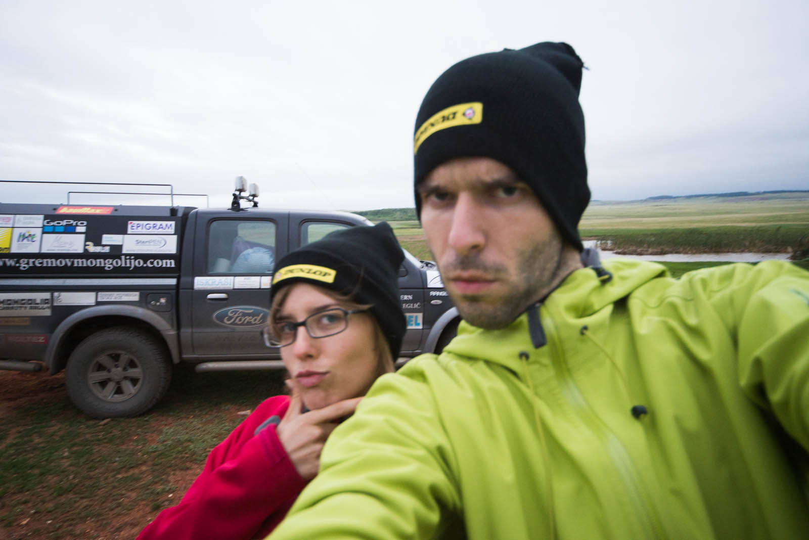 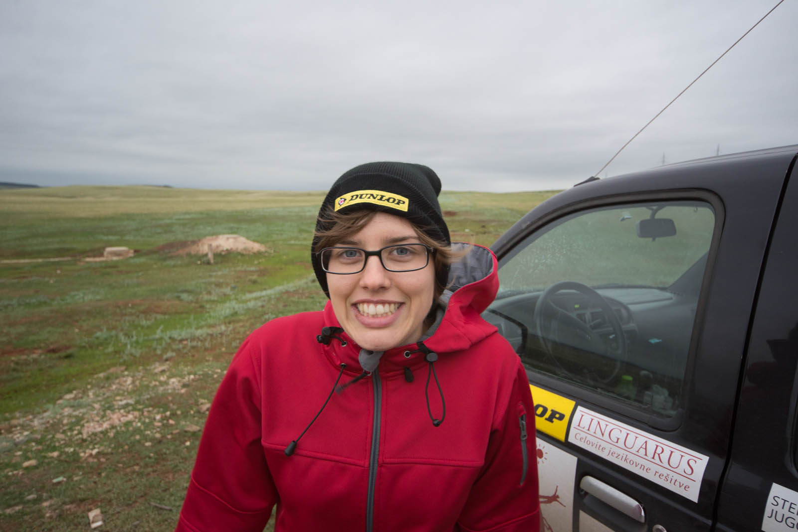 Lokalna pomivalka šip. Je bila kar ob cesti. Obcestnica. 

Malo pred Astano nama zmanjka goriva in ko se zapeljeva na bencinsko, nama tam povejo, da dizla nimajo. Malo naju zaskrbi a oceniva, da ga bo dovolj do naslednje črpalke čez 60 km. Še na zadnje hlape pripeljeva do tja, vendar naju razveselijo z novico, da tudi ni nimajo dizla. Ojoj, očitno bo treba naliti rezervo. Vseeno uspeva prepeljati še tista dva kilometra, kjer Ford dobi želeno (odkrijeva da ima 65 l rezervoar).  Astano doseževa v nočnih urah in ob 1:30, po tem ko Matej s silvertapeom zimprovizira strehico na oknu, da bo to ponoči lahko odprto (začel je padati dež),  vozilo zopet postane spalnica.

Ja, saj veva... vseskozi govoriva o slabih cestah, pa luknjah in vsem... Tukaj je nekaj fotografij, da nama boste sploh verjeli: 

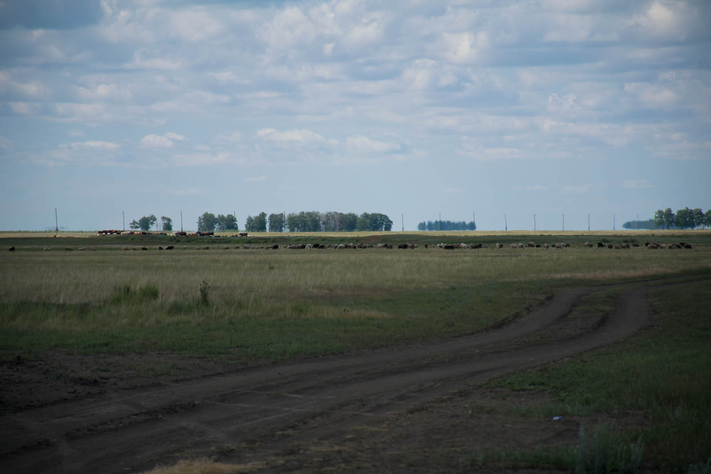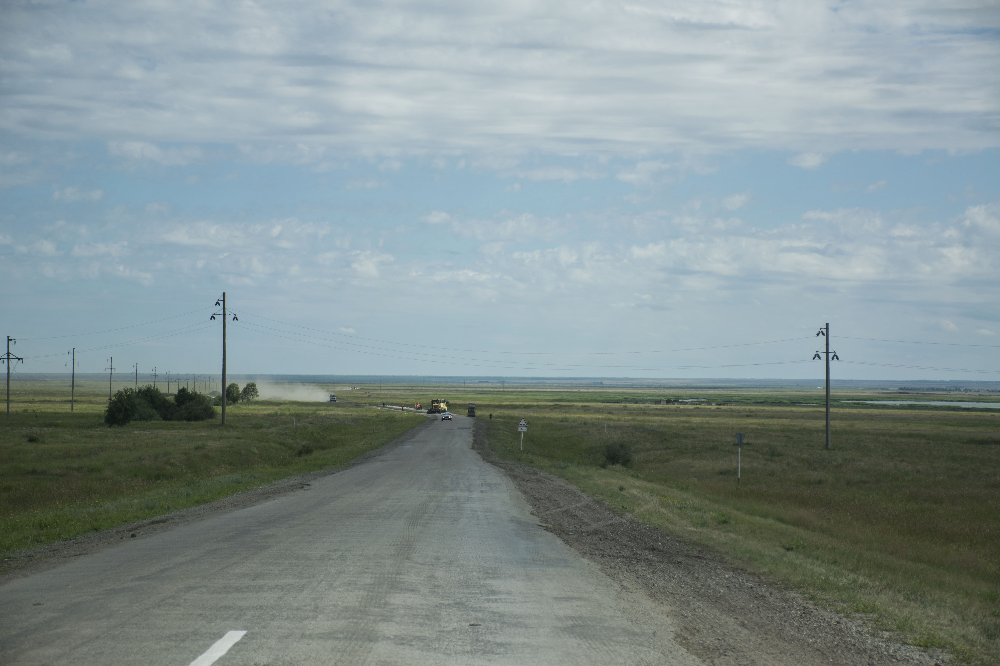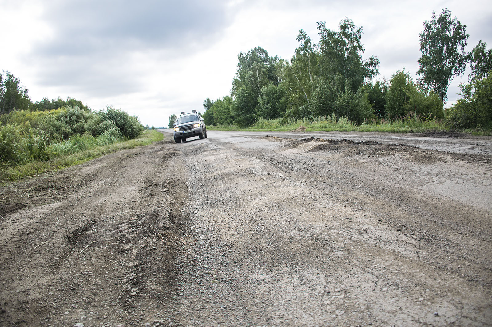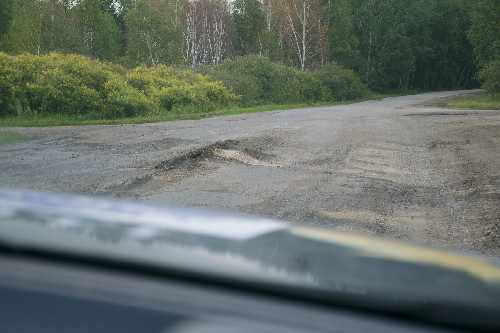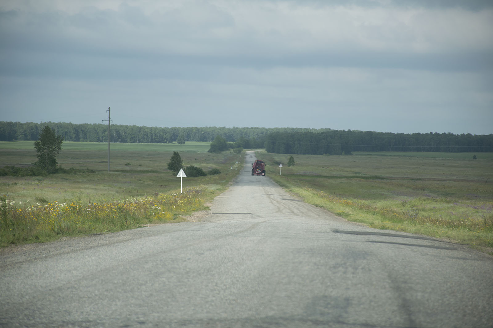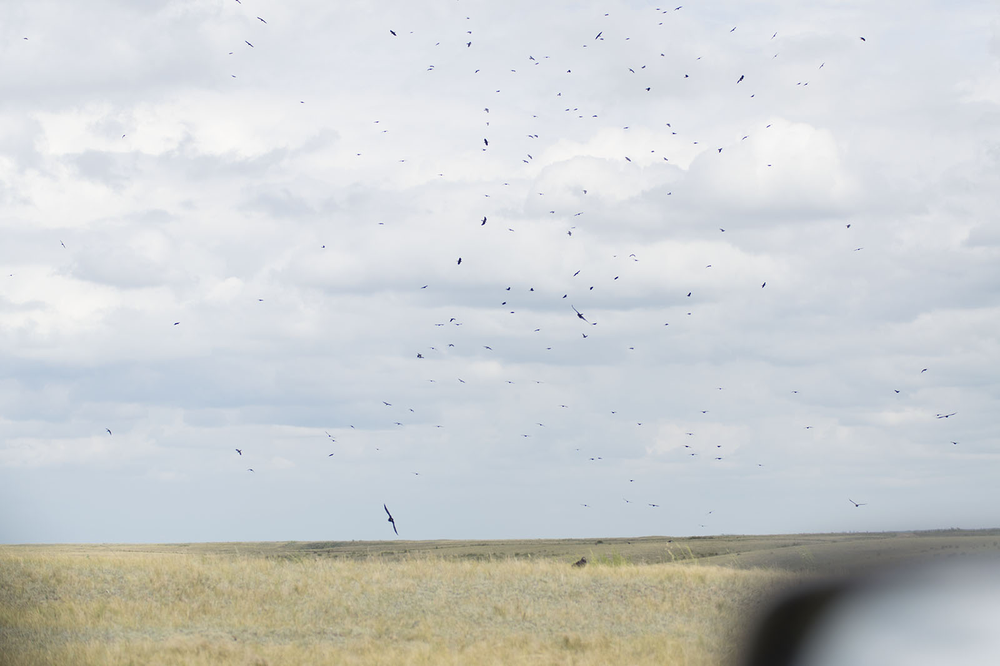
