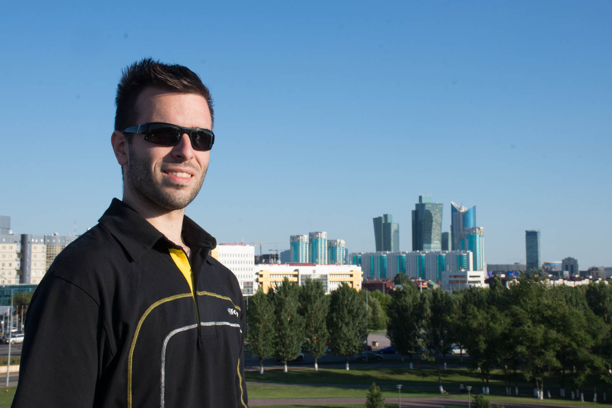
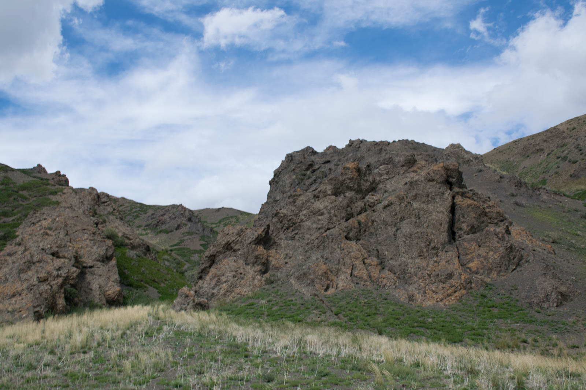
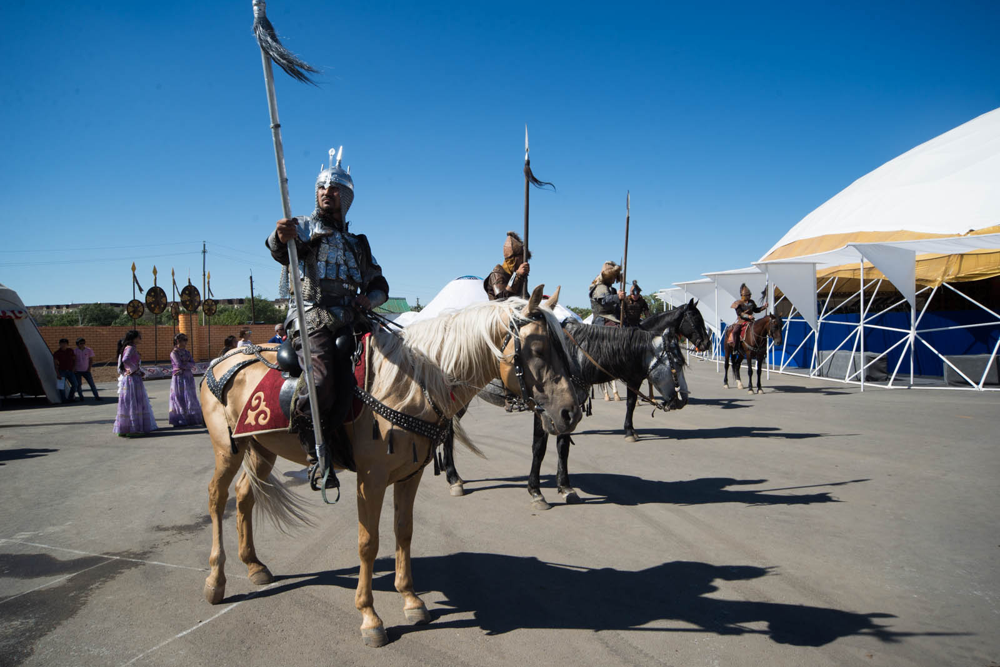
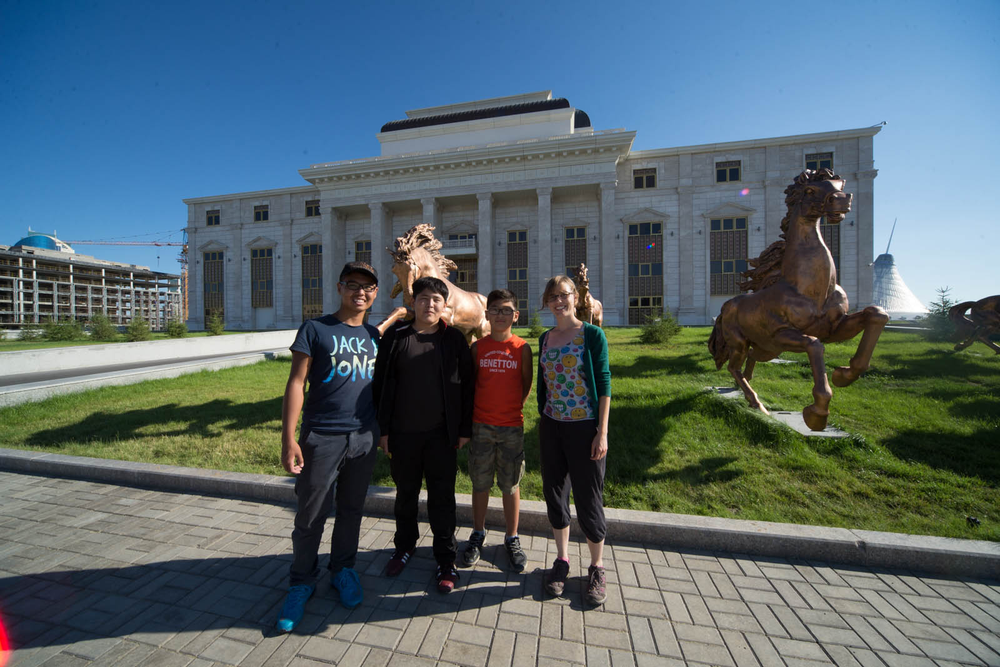

Danes prevoziva samo 23 kilometrov, a jih je  dovolj, da padeva  v  jutranjo prometno konico v Astani. Narisanih črt, ki bi označevale pasove sploh ni, tako da se na eno stran ceste zgužva toliko avtomobilov, kot pač gre – organiziran kaos.

K temu pride seveda še zvočna kulisa stalnega trobljenja, ni važno za kakšen namen  - predvidevam, da iskanje pozornosti. Navigacija nama je odpovedala že odkar sva zapustila Rusijo in ker ni zvezd, po katerih bi se orientirala, za smer centra mesta, vprašava mimoidočega. Z njegovimi napotki le najdeva želeno staro mesto jedro in se parkirava, ter podava na raziskovanje mesta.  Astana je prevzela vlogo glavnega mesta v letu 1997.  Kazahstanci so se odločili, da bodo imeli novo glavno mesto in začeli graditi mogočno prestolnico.  Mesto v katerem je prej prebivalo 300 000 prebivalcev, je do danes zraslo na skoraj milijon in pol populacije in preseglo pričakovanja. Vse do leta 2007 so se gradile veličastne stavbe in nebotičniki. Še danes iz mesta kukajo žerjavi in gradijo prestolnico (vendar v manjšem obsegu zaradi krize). V znak neodvisnosti in razkošja so mesto zasnovali arhitekti iz samega vrha.  In res je, sprva navaden sprehod se spremeni, ko naju na pešpoti začnejo spremljati mogočne zgradbe, centri, na vsake toliko časa pa si oči napaseva na kateri izmed nenavadno oblikovanih, velikih, mogočnih zgradb.

Okrepčava se v trgovskem centru in nadaljujeva z ogledom, dokler ne prideva do ograjenega prostora, v katerem so postavljeni beli šotori, ki naju zelo spominjajo na mongolske gere. Ko prideva bližje zagledava še konje in može, napravljene v nekakšno bojno premo. Tedaj se spomniva. Danes je Nadaam! To je največji praznik v Mongoliji in ko sva prebirala literaturo in se pripravljala na potovanje, sva brala o tem posebnem prazniku. Žal nama je bilo, da mu ne bova priča, ker je to baje  pravi spektakel. Dirke in predstave s konji pa tradicionalni plesi … Sreča nama je naklonjena in znajdeva  se ob pravem času na pravem kraju. Ni videti, da sva v napoto, zato si ogledala generalko slavja, ki se bo pričelo zvečer. Tradicionalni ples mongolskih deklet in fantov  je očarljiv. Kratki koraki in prefinjeno gibanje rok, vrtenje, ploskanje, ples v krogu, skoki. Za dobro uro in pol sva pečena.

Glasba sicer ni v izboru za mojo play-listo, vendar je prav pristajala trenutku. Sva v Kazahstanu, a vendar že čutiva Mongolijo. Ogledava si še jahanje konjev (pravijo, da Mongolci znajo najprej jahati, šele nato hoditi :)) in povezanost med njimi in konji je vidna že od daleč.  Prikaz bitke in najin Nadaam se je zaključil popolno. Po drugi poti se začneva vračati proti avtu in si iz malega griča, ki je nudil razgledno teraso še enkrat ogledava mesto.

Nekaj svari  pa si zaradi (pre)velike razdalje pustiva  za naslednji obisk mesta. Zagrabi naju lakota in obiščeva supermarket in do vrha napolniva plastični vrečki, za kateri na koncu odštejeva 7 € (in kupila sva reeees veliko – preventiva :)).  V marketu je zaposlenih najmanj 30 ljudi, ki stojijo na vsakem vogalu. Če si želiš kruh, ti ga oni stehtajo, če si želiš oreščke, te postreže nekdo drug, pa ob siru dve prodajalki, skoraj za vsako vrsto svoja, sadje, zelenjava – vsak oddelek ima  prodajalca, ki te nadzoruje in streže. Kupljeno večerjo romantično pojeva ob sončnem zahodu na nabrežju reke, kjer pade  še nekaj posnetkov, nato sledi iskanje parkiranega avtomobila.

Danes si privoščiva spanje na povsem drugačni ravni. Poklical naju je Slovenec, velik fen projekta in nama povedal za posebno vrsto nočitve, ki jo je pripravil za naju v okviru podpore projekta. Najlepša vam hvala, ostala sva brez besed.  Ford je varno parkiran, nama pa se smeji do ušes.

 Spanje na višini. :)
