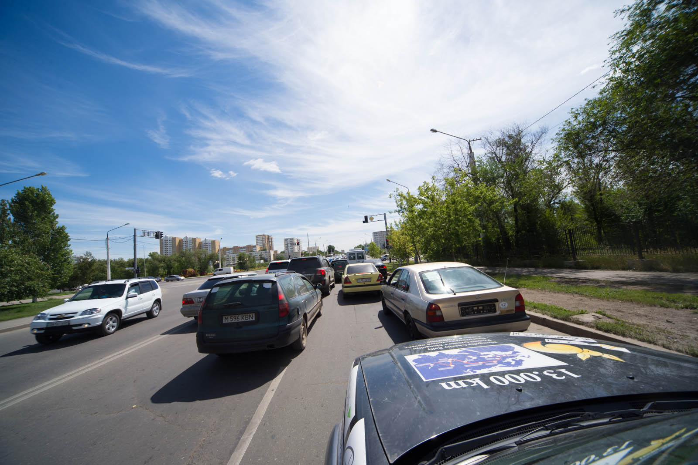
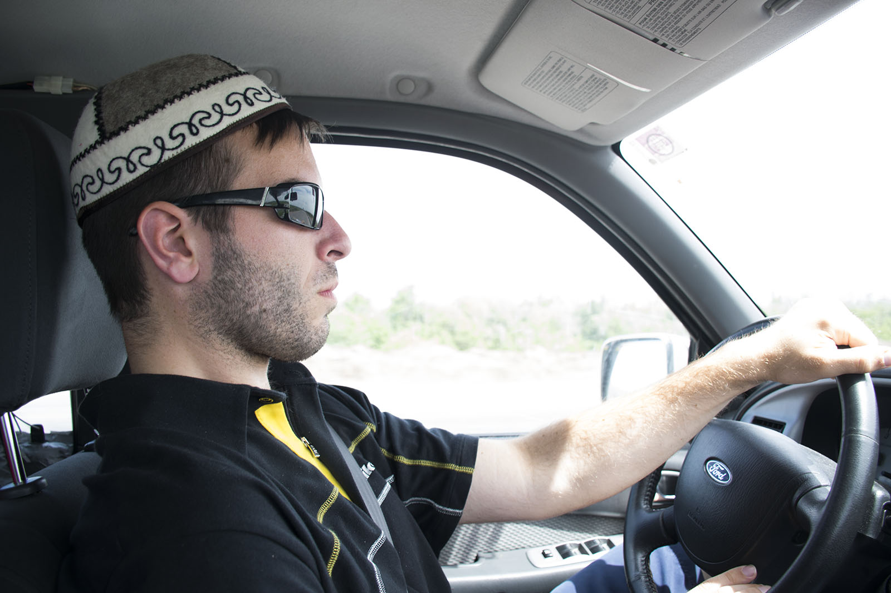
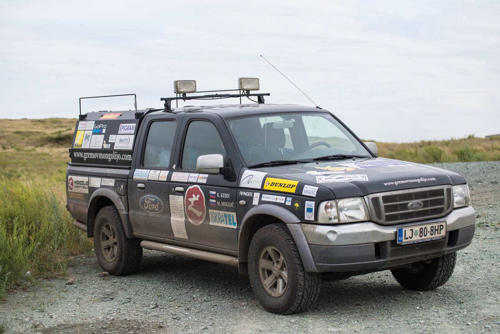
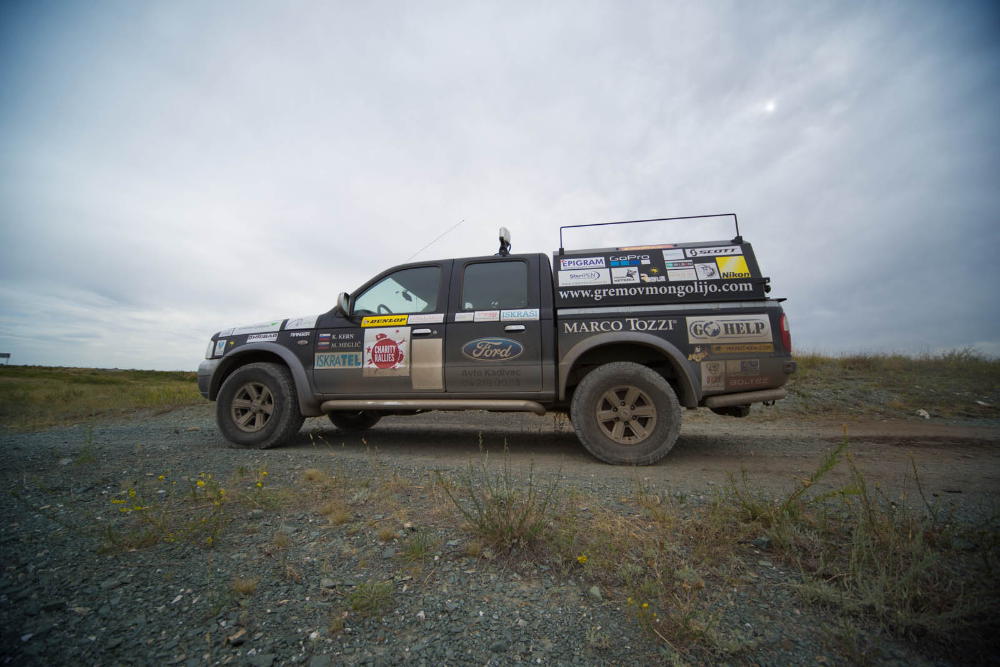
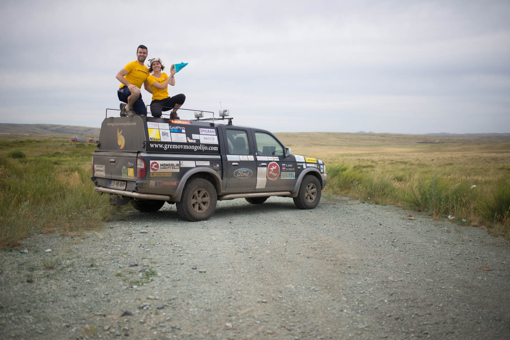
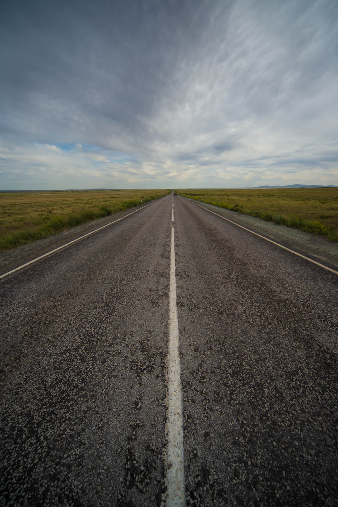
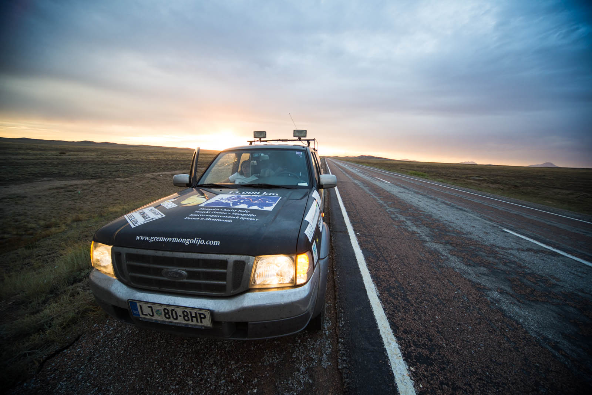
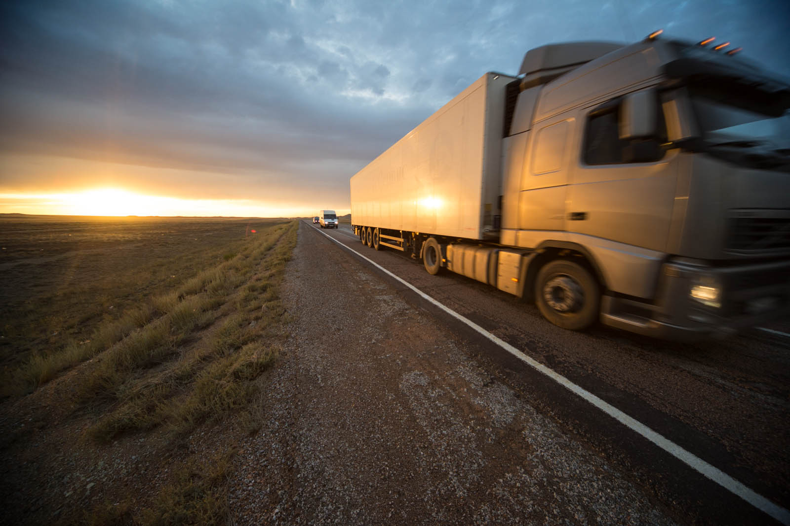

 

Zjutraj se registrirava. Ja, vsak tujec, ki v Kazakhstanu biva več kot 5 dni, se mora registrirati na neki upravni enoti. Nato si privoščiva obilen krepčilen zajtrk in se odpraviva na pot. Pred nama je cesarska preizkušnja odprave, podobno kot nek Tour de France za vsakega kolesarja.

Ideja je, da v enem dnevu prevoziva 1280 km od Astane do Almate. Pa se začne, delo na cesti tu, delo na cesti tam. Matej že zavija z očmi, nato pa se začnejo še izvozi na polja in spet sva tam, kjer sva bila dva dni nazaj. Na zelo slabem makadamu. No ja, v nekaj urah se prebijeva do Karagande, kjer na naju čaka prva večja kulisa, ta stepa-puščava je reeees ogromna. Ampak, to pomeni to, da vidiš po 20 km naprej in ni ničesar. Niti ene hiše, nič. Kakšna krava zdolgočaseno pride mimo, to je pa to. Ideja je, da posnameva nekaj promocijskih fotk in filmčkov, zato se zadeva zavleče. Na sceni ostaneva debelo uro.

Nato Matej nadaljuje z vožnjo, tako – vratolomno. Kupil si je Kazakhstansko tradicionalno kapico in zdaj misli, da je eden izmed njih. Vozi 120-130 kar čez vse luknje in mu gre zelo zelo dobro. Še vedno sva najpočasnejša, pa kaj se vsem tako mudi. Lukenj se navadiš, simpl. Ob sončnem zahodu se večkrat ustaviva, Matej fotografira, Katja pa s hupo opozarja na bližajoča se vozila na cesti. Kazaška stepa nudi neverjetne prizore.

Matej je fasciniran in kar skače vsakič, ko se po 20km odpre nova dolga ravna cesta čez hribčke in doline. Nekajkrat srečava policiste, a imava tokrat srečo, ravno v tistih delih se voziva bolj po jajcih. Prehitro pade noč in ustavljava se le za tankanje nafte.

Cena pade na neverjetnih 0,46 EUR, kvaliteta pa tudi. Na srečo imava staro verzijo motorja TDI, ki samo v jutrih malo nerga, preden se dodobra zbudi. Plačujeva samo z gotovino, tankava pa vsakih 300 kilometrov, ker vsake toliko bencinskih kar zmanjka. Malo po enajsti uro krmilo prevzame Katja in kot začuda se cesta spremeni v luknjo, v eno samo luknjo. Tipično. Ni bila kriva Katja, ta odsek je resnično eden od najslabših v države. Matej odspi klasično urico in pol in nato zamenja krmilo. Ob 4:44 se odpre prvi pogled na Almaty. A to je le prvi pogled, do mesta je še celih 70km.  Očitno danes s spanjem ne bo nič, v mesto prispeva ob 06:12, utrujena in izmučena. Sončni žarki že božajo, včeraj je bilo 37 stopinj. Odideva v trgovinico, nato pa v park na zajtrk.
